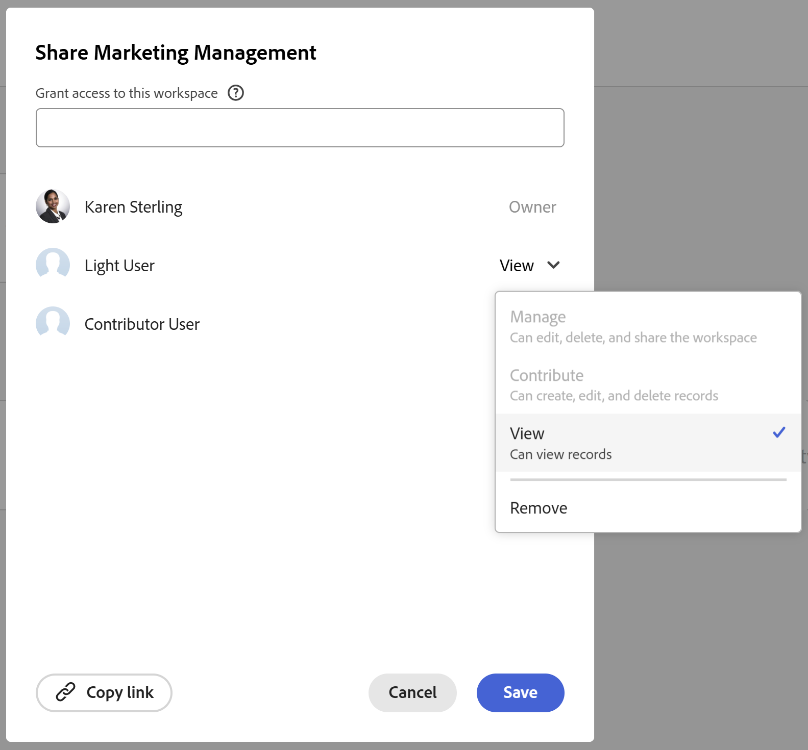
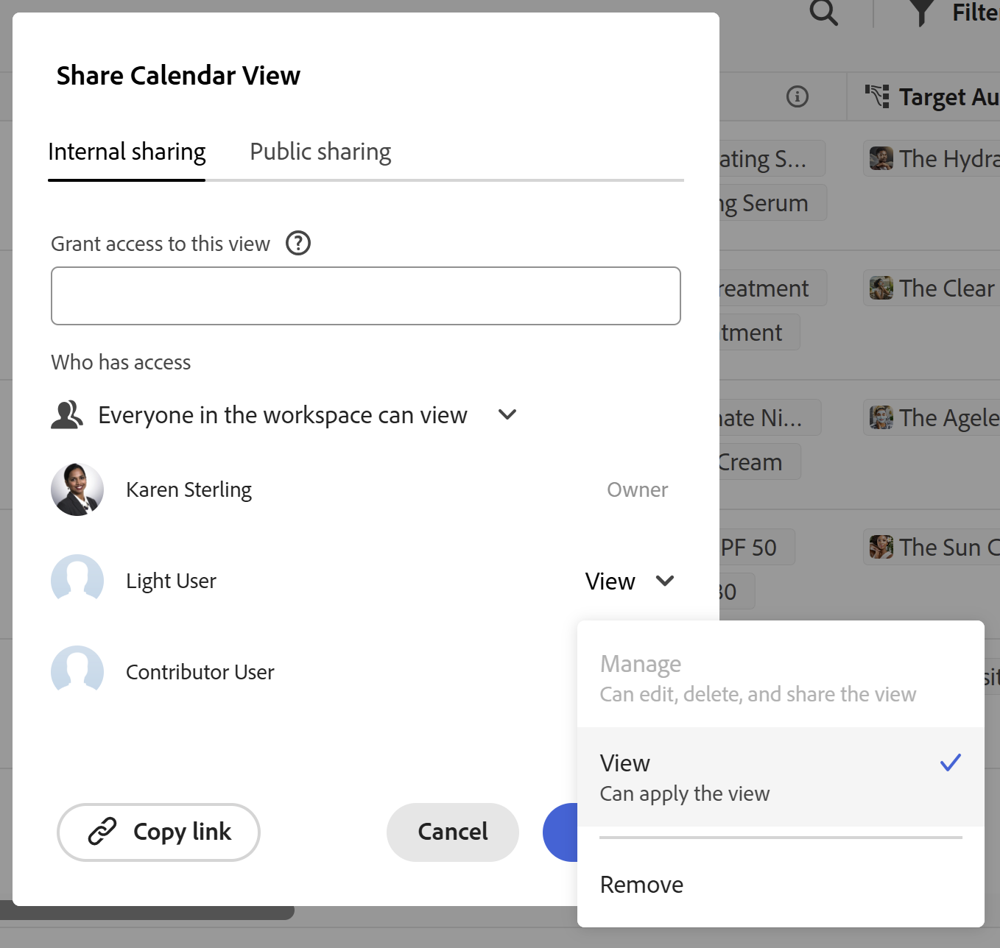

# Información general sobre el tipo de licencia al usar Adobe Workfront Planning

<!--
The highlighted information on this page refers to functionality not yet generally available. It is available only in the Preview environment for all customers. After the release to Preview, the same features are also available monthly in the Production environment for customers who enabled fast releases.    

For information about fast releases, see [Enable or disable fast releases for your organization](/help/quicksilver/administration-and-setup/set-up-workfront/configure-system-defaults/enable-fast-release-process.md). 
-->

<!--{{planning-important-intro}}-->

>[!IMPORTANT]
>
>La información de este artículo hace referencia a Adobe Workfront Planning. Workfront Planning es un producto independiente o una funcionalidad adquirida adicionalmente de Adobe Workfront.
>
>
>Este artículo contiene información general sobre Workfront Planning cuando los clientes también compran un paquete de Workfront o de flujo de trabajo.
>
>Para obtener la lista completa de artículos que contienen documentación de Workfront Planning, vea [Información general e índice de artículos de Adobe Workfront Planning](/help/quicksilver/planning/planning-information.md).
>
>Para obtener información sobre Workfront Planning como producto independiente, consulte [Introducción a Adobe Workfront Planning como producto independiente](/help/quicksilver/planning/planning-sta/planning-sta-overview.md).

El tipo de licencia de flujo de trabajo de Adobe Workfront funciona junto con el tipo de licencia de Adobe Workfront Planning y con permisos de Planning para proporcionar el siguiente acceso:

* Ver, contribuir o administrar espacios de trabajo, tipos de registros y registros.
* Ver o administrar vistas.

Para obtener información acerca de los permisos de los objetos en Workfront Planning, consulte [Información general sobre los permisos de uso compartido en Adobe Workfront Planning](/help/quicksilver/planning/access/sharing-permissions-overview.md).

Para obtener información sobre el acceso a Workfront Planning, consulte [Información general sobre el acceso a Adobe Planning](/help/quicksilver/planning/access/access-overview.md).

## La relación entre los tipos de licencia de flujo de trabajo y planificación

Los niveles de acceso de los usuarios se pueden asociar con los siguientes tipos de licencia:

* Tipo de licencia del flujo de trabajo
* Tipo de licencia de Planning

Para obtener más información, vea [Crear y modificar niveles de acceso personalizados](/help/quicksilver/administration-and-setup/add-users/configure-and-grant-access/create-modify-access-levels.md).

El tipo de licencias de Planning disponibles para asignar usuarios difiere según el paquete de Workfront que haya adquirido su organización.

<!--

This list also exists here: \help\quicksilver\planning\planning-sta\planning-sta-overview.md
-->

Su organización puede adquirir Workfront Planning de varias formas:

* Junto con un paquete de flujo de trabajo de Workfront, con el mismo número de licencias para Flujo de trabajo y Planificación. Los usuarios reciben acceso a todas las funciones, tanto para el flujo de trabajo de Adobe Workfront como para Planning.
* Junto con un paquete de flujo de trabajo de Workfront, con diferentes números de licencias para flujo de trabajo y planificación. Los usuarios reciben acceso a todas las funciones del flujo de trabajo de Adobe Workfront y acceso limitado a Workfront Planning.
* Workfront Planning en sí, como producto independiente. Los usuarios no reciben acceso a las funciones del flujo de trabajo de Workfront y tienen acceso completo a las funciones de Workfront Planning. Para obtener más información, consulte [Introducción a Adobe Workfront Planning como producto independiente](/help/quicksilver/planning/planning-sta/planning-sta-overview.md).

En la tabla siguiente se describe la relación entre los tipos de licencia de flujo de trabajo y Planning, así como las capacidades de los usuarios en función de estas licencias:

| Paquete Workfront | Tipos de licencia de planificación | Tipos de licencia de flujo de trabajo | Funcionalidades de licencias |
|---|---|---|---|
| Planificación y flujo de trabajo: igual número de licencias | Estándar, Colaborador, Sin acceso | Estándar, Claro, Colaborador | - Los tipos de licencia de Planning y de flujo de trabajo son configuraciones independientes en los niveles de acceso - El tipo de licencia de Planning permite las opciones Estándar, Colaborador y en blanco - El tipo de licencia de Planning se puede dejar en blanco en cualquier nivel de acceso - Los usuarios con este nivel de acceso no tienen acceso a Planning - El tipo de licencia de flujo de trabajo no se puede dejar en blanco - No se permite la combinación de licencia de Planning Standard con Workflow Contributor - Planning Standard solo se puede seleccionar con licencias Workflow Light y Standard |
| Planificación y flujo de trabajo: cantidad desigual de licencias | Estándar, sin acceso | Estándar, Claro, Colaborador | - Los tipos de licencia de Planning y de flujo de trabajo son configuraciones independientes en los niveles de acceso - El tipo de licencia de Planning solo permite las opciones Estándar o Sin acceso  - Planning Standard se puede seleccionar con cualquier tipo de licencia de flujo de trabajo  - El tipo de licencia de Planning puede ser Ninguno - Los usuarios con este nivel de acceso no tendrán acceso a los datos de Planning en absoluto - El tipo de licencia de flujo de trabajo no se puede dejar en blanco en ningún nivel de acceso - Los usuarios con licencia de colaborador de Planning pueden ver los objetos de flujo de trabajo conectados en Planning, pero no pueden conectarse ni desconectarse |

Para obtener más información sobre las licencias en Workfront Planning, consulte [Descripción general del acceso a Adobe Workfront Planning](/help/quicksilver/planning/access/access-overview.md).

<!--
not sure if we need this anymore, this is before STA launched:

| Adobe Workfront license type                                   | Highest permissions allowed in Adobe Workfront Planning                                                                                                                                             |
|------------------------------------------------|-------------------------------------------------------------------------------------------------------------------------------------------------------------------------------|
|Standard                     | 
Users can manage workspaces, record types, records, and views. They can create, edit, or delete workspaces, record types, records, fields, and views.
 
System administrators have Manage permissions to all workspaces, including the ones they did not create.
                                                                                                                     |
| Light or Contributor  | 
Users can view the workspaces shared with them, as well as the record types, records, and fields of those workspaces.
   
Users can view the views shared with them, but they cannot create their own. 
  
Users cannot create, edit, or delete workspaces, record types, records, or fields.
|
-->

<!--
Old: 
*Workfront Planning is not available for legacy Workfront licenses. 
For more information, see [Access requirements in Workfront documentation](/help/quicksilver/administration-and-setup/add-users/access-levels-and-object-permissions/access-level-requirements-in-documentation.md).
-->

## Tipos de licencias y permisos para espacios de trabajo y tipos de registros

Al conceder permisos de usuario a un espacio de trabajo, también se les conceden permisos para tipos de registros, registros y campos.

Debe conceder a los usuarios permisos independientes a las vistas, además de los que tienen para los espacios de trabajo, para poder acceder y administrar las vistas.

Tenga en cuenta lo siguiente al trabajar con permisos de tipo de registro:

* Los usuarios heredan automáticamente los permisos de tipo de registro de los espacios de trabajo.
* Cuando un usuario tiene permisos de administración en un espacio de trabajo, no puede tener un acceso menor a un tipo de registro.
* Los usuarios no pueden tener permisos para un tipo de registro superiores a los que tienen para el espacio de trabajo al que pertenece el tipo de registro.
* Al quitar los permisos de los usuarios a un tipo de registro, no se quita el acceso de Ver a todos los tipos de registros del espacio de trabajo, ya que no se quitan los permisos del espacio de trabajo.

Solo los usuarios con una licencia de Planning Standard pueden tener permisos de Contribute o Manage para espacios de trabajo y tipos de registros. Los permisos de Contribute y Manage para espacios de trabajo y tipos de registros también se transfieren a registros y campos de forma predeterminada.

Los administradores pueden ver todos los espacios de trabajo del sistema, incluidos los que no hayan creado.

<!--
Lilit asked for this to be removed as there is no Planning Admin license/ access for combos: 
>[!TIP]
>
>Planning Administrator access is automatically assigned to users that you create as Administrators in the Adobe Admin Console. 
>
>For information, see [Manage users in the Adobe Admin Console](/help/quicksilver/administration-and-setup/add-users/create-and-manage-users/admin-console.md).

Users with all other license types can have View permissions to workspaces and record types  shared with them, as well as to their records and fields. 
-->

>[!INFO]
>
>**Ejemplo:**
>
>Los usuarios de Planning Contributors o Workflow Light no pueden contribuir ni administrar espacios de trabajo y sus objetos.
>
>Hay una indicación en el cuadro de diálogo de uso compartido de que no se pueden conceder permisos a los usuarios para contribuir o administrar un espacio de trabajo cuando tienen una licencia de nivel inferior, ya que estos niveles de permisos están atenuados.
>
>

## Tipos de licencias y permisos para vistas

Solo los usuarios con una licencia de Planning Standard pueden tener permisos de administración en las vistas.

Los administradores no pueden acceder a las vistas que no hayan creado. Deben compartirse con ellos.

Los usuarios con todos los demás tipos de licencia pueden tener permisos de visualización para las vistas compartidas con ellos.

>[!INFO]
>
>**Ejemplo:**
>
>Los usuarios con licencia básica de Planning o Workflow no pueden administrar las vistas. Pueden aplicar filtros, ordenaciones o agrupaciones temporales a las vistas a las que pueden acceder.
>
>Hay una indicación en el cuadro de uso compartido de que no se pueden conceder permisos a los usuarios para administrar una vista cuando tienen una licencia de nivel inferior, ya que estos niveles de permisos están atenuados.
>
>
