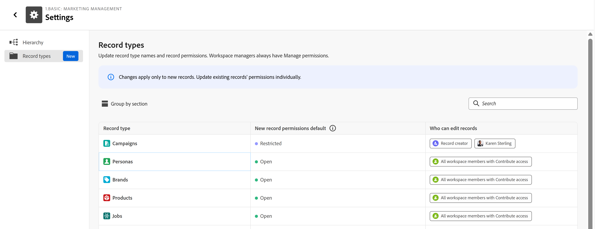
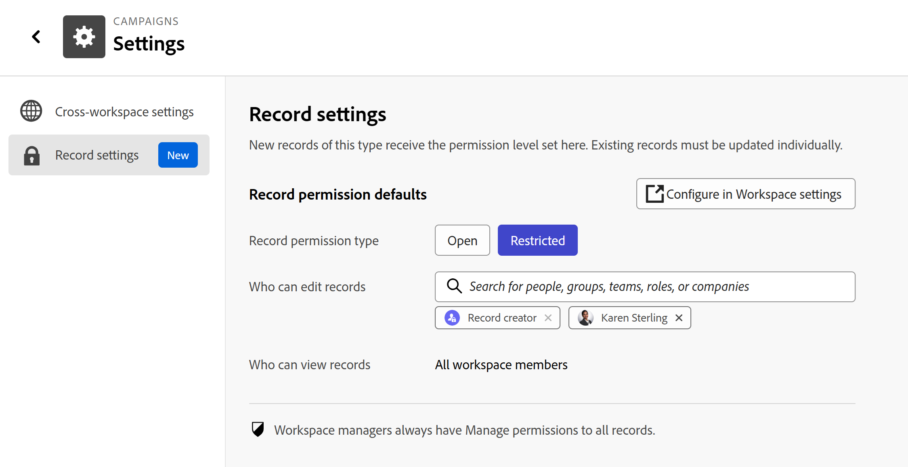

# Establecer permisos predeterminados para los registros

La información de esta página hace referencia a una funcionalidad que aún no está disponible de forma general. Solo está disponible en el entorno de vista previa para todos los clientes. Después del lanzamiento en Vista previa, las mismas funciones también están disponibles mensualmente en el entorno de producción para los clientes que habilitaron lanzamientos rápidos. \
Para obtener información sobre las versiones rápidas, consulte [Habilitar o deshabilitar las versiones rápidas para su organización](/help/quicksilver/administration-and-setup/set-up-workfront/configure-system-defaults/enable-fast-release-process.md). 

{{planning-important-intro}}

Puede establecer permisos predeterminados para los registros al modificar el tipo de registro o la configuración del espacio de trabajo.

Puede conceder permisos de Apertura o Restringido a todos los registros que se agregarán para un tipo de registro.

## Requisitos de acceso

+++ Expanda para ver los requisitos de acceso para la funcionalidad en este artículo. 

<!--
at GA, check that the Workfront plans article linked below has Planning info
-->

<table style="table-layout:auto"> 
<col> 
</col> 
<col> 
</col> 
<tbody> 
    <tr> 
<tr> 
   <td role="rowheader">
Paquete de Adobe Workfront
</td> 
   <td> 

Cualquier Workfront o flujo de trabajo con un paquete de Planning
 
O

Cualquier Workfront Planning como paquete de producto independiente

</tr>

<tr> 
   <td role="rowheader">
Licencia de Adobe Workfront
</td> 
   <td>
Cualquiera
 
   
<b>NOTA</b>

   
Solo se pueden conceder permisos de administración a los registros a las personas con una licencia Standard. Todas las demás licencias solo pueden tener permisos de visualización y la opción Administrar aparece atenuada para ellas.

  </td> 
  </tr> 
  <tr> 
   <td role="rowheader">
Permisos de objeto
</td> 
   <td>  
Administración de permisos de un espacio de trabajo y un tipo de registro
  
   
<b>IMPORTANTE</b>

   
Solo los usuarios con permisos de Administración de un espacio de trabajo pueden compartir un registro
</td> 
  </tr>
</tbody> 
</table>

Para obtener más información, consulte [Requisitos de acceso en la documentación de Workfront](/help/quicksilver/administration-and-setup/add-users/access-levels-and-object-permissions/access-level-requirements-in-documentation.md).

+++

## Consideraciones para establecer permisos de registro predeterminados

Tenga en cuenta lo siguiente al configurar los permisos de registro predeterminados:

* Solo puede haber una regla de permiso predeterminada activa por tipo de registro a la vez.
* Cambiar la regla solo afecta a los registros creados después del cambio. Los registros existentes conservan sus permisos actuales.
* Los administradores del sistema y los administradores del espacio de trabajo siempre conservan el acceso de Administración a cada registro, independientemente de la regla.
* Una vez creado un registro, sus permisos se pueden cambiar de forma independiente en el cuadro de diálogo de uso compartido sin afectar a la regla predeterminada.
* Para los tipos de registro globales, cada espacio de trabajo (principal y secundario) puede configurar su propia regla predeterminada, y los registros nuevos asumen la regla del espacio de trabajo en el que se crean.

## Configuración de permisos de registro predeterminados para un espacio de trabajo

1. Vaya a un área de trabajo > **Más** menú  > **Configuración** > **Tipos de registro**.

   

1. (Opcional) Haga clic dentro de la celda de un **Tipo de registro** para editar los nombres de tipo de registro.

1. En la columna **Nuevo permiso de registro predeterminado**, haga clic en la celda del tipo de registro cuyos permisos desee actualizar.

1. Elija entre las siguientes opciones:

   * **Abrir**: todos los colaboradores del área de trabajo pueden administrar el registro recién creado. Este es el comportamiento predeterminado actual para todos los tipos de registro nuevos y existentes.
   * **Restringido**: solo el creador de registros y cualquier persona que agregue explícitamente pueden editar los registros recién creados. Todos los demás obtienen acceso de solo vista.

1. (Condicional) Si está cambiando los permisos predeterminados de **Restringido** a **Abrir**, haga clic en **Cambiar** en el cuadro **Cambiar a Abrir** para confirmar su elección.
1. (Condicional) Si seleccionó **Restringido**, agregue editores adicionales en la columna **Quién puede editar registros**. Puede agregar usuarios, grupos, equipos, funciones o empresas.

   >[!NOTE]
   >
   >* El creador de registros siempre se incluye y no se puede quitar.
   >* Sólo se pueden seleccionar entidades que ya tengan permisos de contribución o gestión para el tipo de registro.

   Los cambios se guardan automáticamente. Una vez guardada, la regla se aplica inmediatamente y se aplica automáticamente a todos los registros creados para ese tipo de registro a partir de ahora.

## Configurar permisos de registro predeterminados para un tipo de registro

1. Vaya a un tipo de registro > **Más** menú  > **Configuración** > **Configuración de registro**.

   

1. En el campo **Tipo de permiso de registro**, haga clic en una de las siguientes opciones:

   * **Abrir**: todos los colaboradores del área de trabajo pueden administrar el registro recién creado. Este es el comportamiento predeterminado actual para todos los tipos de registro nuevos y existentes.
   * **Restringido**: solo el creador de registros y cualquier persona que agregue explícitamente pueden editar los registros recién creados. Todos los demás obtienen acceso de solo vista.
1. (Condicional) Si está cambiando los permisos predeterminados de **Restringido** a **Abrir**, haga clic en **Cambiar** en el cuadro **Cambiar a Abrir** para confirmar su elección.
1. (Condicional) Si seleccionó **Restringido**, agregue editores adicionales en el campo **Quién puede editar registros**. Puede agregar usuarios, grupos, equipos, funciones o empresas.

   >[!NOTE]
   >
   >* El creador de registros siempre se incluye y no se puede quitar.
   >* Sólo se pueden seleccionar entidades que ya tengan permisos de contribución o gestión para el tipo de registro.

   Los cambios se guardan automáticamente. Una vez guardada, la regla se aplica inmediatamente y se aplica automáticamente a todos los registros creados para ese tipo de registro a partir de ahora.