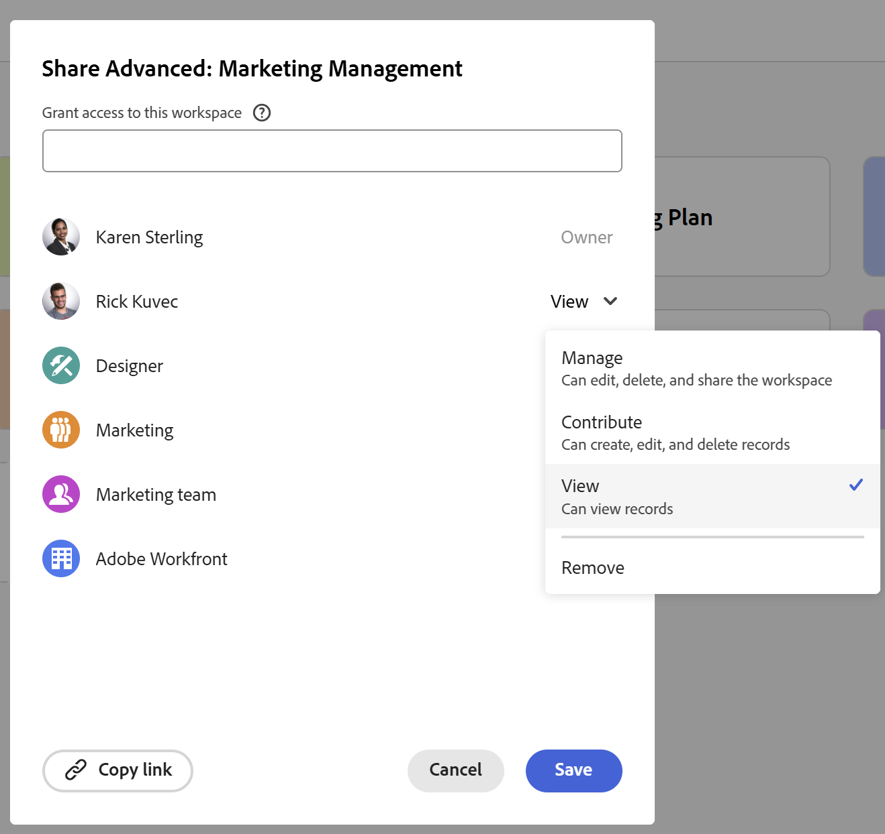

# Compartir espacios de trabajo

La información resaltada en esta página hace referencia a una funcionalidad que aún no está disponible de forma general. Solo está disponible en el entorno de vista previa para todos los clientes. Después de las versiones mensuales en Production, las mismas funciones también están disponibles en el entorno Production para los clientes que habilitaron versiones rápidas. 

Para obtener información sobre las versiones rápidas, consulte [Habilitar o deshabilitar las versiones rápidas para su organización](/help/quicksilver/administration-and-setup/set-up-workfront/configure-system-defaults/enable-fast-release-process.md). 

{{planning-important-intro}}

Puede compartir un espacio de trabajo con otros usuarios para garantizar la colaboración al trabajar en Adobe Workfront Planning.

<!--
This article describes how you can share a view with others. For information about requesting, granting, or denying permissions to a view, see [Request permissions to a view or a workspace](/help/quicksilver/planning/access/request-permissions.md). -->

>[!NOTE]
>
>La concesión de permisos a un espacio de trabajo no significa que se conceden permisos a otros usuarios para ver las páginas de tipo de registro. Debe conceder permisos a vistas individuales de una página de tipo de registro para compartirlas con otros usuarios. Para obtener más información, vea [Compartir una vista](/help/quicksilver/planning/access/share-views.md).

## Requisitos de acceso

+++ Amplíe para ver los requisitos de acceso.

Debe tener el siguiente acceso para realizar los pasos de este artículo:

<table style="table-layout:auto"> 
<col> 
</col> 
<col> 
</col> 
<tbody> 
    <tr> 
<tr> 
<td> 
   
 Productos
 </td> 
   <td> 
   <ul><li>
 Adobe Workfront
</li> 
   <li>
 Planificación de Adobe Workfront
</li></ul></td> 
  </tr>   
<tr> 
   <td role="rowheader">
Plan de Adobe Workfront*
</td> 
   <td> 

Cualquiera de los siguientes planes de Workfront:
 
<ul><li>Seleccionar</li> 
<li>Prime</li> 
<li>Ultimate</li></ul> 

Workfront Planning no está disponible para planes Workfront heredados
 
   </td> 
<tr> 
   <td role="rowheader">
Paquete de planificación de Adobe Workfront*
</td> 
   <td> 

Cualquiera 
 

Para obtener más información sobre qué se incluye en cada plan de Workfront Planning, póngase en contacto con su administrador de cuentas de Workfront. 
 
   </td> 
 <tr> 
   <td role="rowheader">
plataforma de Adobe Workfront
</td> 
   <td> 

La instancia de Workfront de su organización debe incorporarse a Adobe Unified Experience para poder acceder a Workfront Planning.

Su organización debe incorporarse a la experiencia unificada de Adobe para que los usuarios puedan solicitar y conceder permisos a un espacio de trabajo desde una solicitud de permiso. 
 

Los usuarios deben agregarse a Adobe Admin Console para obtener permisos en los espacios de trabajo de Workfront Planning.

Para obtener más información, consulte <a href="/help/quicksilver/workfront-basics/navigate-workfront/workfront-navigation/adobe-unified-experience.md">Adobe Unified Experience para Workfront</a>. 
 
   </td> 
   </tr> 
  </tr> 
  <tr> 
   <td role="rowheader">
Licencia de Adobe Workfront*
</td> 
   <td>
 Estándar 

   
Workfront Planning no está disponible para licencias de Workfront heredadas
 
  </td> 
  </tr> 
  <tr> 
   <td role="rowheader">
Configuración de nivel de acceso
</td> 
   <td> 
No hay controles de nivel de acceso para Adobe Workfront Planning
   
</td> 
  </tr> 
<tr> 
   <td role="rowheader">
Permisos de objeto
</td> 
   <td>  
Administración de permisos en un espacio de trabajo
  </td> 
  </tr> 
<tr> 
   <td role="rowheader">
Plantilla de diseño
</td> 
   <td> 
En el entorno de producción, todos los usuarios, incluidos los administradores del sistema, deben estar asignados a una plantilla de diseño que incluya las áreas de planificación.

En el entorno de vista previa, los usuarios estándar y los administradores del sistema tienen activada de forma predeterminada el área de Planning.
</td> 
  </tr> 
</tbody> 
</table>

*Para obtener más información sobre los requisitos de acceso de Workfront, consulte [Requisitos de acceso en la documentación de Workfront](/help/quicksilver/administration-and-setup/add-users/access-levels-and-object-permissions/access-level-requirements-in-documentation.md).

+++

## Consideraciones sobre compartir espacios de trabajo

* Para obtener información general sobre cómo compartir objetos en Workfront Planning, consulte también [Información general sobre los permisos de uso compartido en Adobe Workfront Planning](/help/quicksilver/planning/access/sharing-permissions-overview.md).
* Puede compartir espacios de trabajo con usuarios, equipos, funciones, grupos o empresas de su organización.
* Además de los equipos, grupos, empresas y funciones del puesto, solo puede compartir con los usuarios que se han añadido a Adobe Admin Console.
* No puede compartir espacios de trabajo con usuarios que no pertenezcan a su organización.
* Al compartir un espacio de trabajo, también se comparten todos los tipos de registros, registros y campos asociados a los espacios de trabajo.
* Al compartir un espacio de trabajo, las vistas no se comparten. Debe compartir vistas por separado.

* Los permisos de Workspace se muestran como Permisos heredados en los tipos de registro.

## Compartir permisos en un espacio de trabajo

Los siguientes usuarios pueden compartir un espacio de trabajo con otros usuarios:

* Los administradores del sistema pueden compartir todos los espacios de trabajo, incluidos los que no hayan creado.
* Todos los demás usuarios solo pueden compartir espacios de trabajo para los que tengan permisos de administración.

Para compartir un espacio de trabajo con otros usuarios:

{{step1-to-planning}}

1. Abra el área de trabajo que desea compartir y haga clic en **Compartir** en la esquina superior derecha de la pantalla.

   

1. En el campo **Conceder acceso a este área de trabajo**, empiece a escribir el nombre de un usuario, grupo, equipo, empresa o rol y, a continuación, haga clic en él cuando se muestre en la lista.

   

1. Seleccione uno de los siguientes niveles de permisos en el menú desplegable:
   * Ver
   * Aportar
   * Administrar

     Para obtener información acerca de los niveles de permisos y las acciones que los usuarios pueden realizar en cada nivel, consulte [Información general sobre los permisos de uso compartido en Adobe Workfront Planning](/help/quicksilver/planning/access/sharing-permissions-overview.md).
1. Haga clic en **Copiar vínculo** para copiar un vínculo al área de trabajo en el portapapeles.
1. Comparta el vínculo copiado con otros usuarios. Los usuarios que reciban el vínculo deben ser usuarios activos e iniciar sesión en Workfront para poder acceder al espacio de trabajo.
1. Haga clic en **Guardar**.

## Conceder permisos a un espacio de trabajo desde una solicitud de permiso

Los usuarios que accedan a un vínculo a un espacio de trabajo para el que no tengan permisos pueden solicitar permisos. Todos los usuarios con permisos de Administrar en el espacio de trabajo reciben la solicitud de permiso y pueden concederlos o denegarlos.

1. (Condicional) Si usted es el administrador de un espacio de trabajo, es posible que otro usuario le solicite el acceso a la vista en las áreas siguientes:

   * Una notificación en la aplicación

     
   * Una notificación por correo electrónico

     
1. (Condicional) En el área de notificación de Workfront, haga clic en la notificación dentro de la aplicación
O
En la notificación por correo electrónico, haga clic en **Ver todas las notificaciones** y, a continuación, haga clic en la notificación en la lista.

   Se muestra el cuadro **Solicitudes de acceso pendientes**.

   

1. (Opcional) Para el usuario cuyos permisos desea aprobar, seleccione una de las siguientes opciones en el menú desplegable situado a la derecha del nombre del usuario:
   * **Vista**
   * **Aportar**
   * **Administrar**
1. Seleccione el usuario para el que desea aprobar o denegar el permiso y, a continuación, haga clic en **Aprobar todo** o **Denegar todo**.
1. Haga clic en la flecha que señala a la izquierda de **Solicitudes de acceso pendientes** y, a continuación, haga clic en **Guardar**.

   Si ha aprobado la solicitud, los usuarios se agregan al cuadro para compartir del área de trabajo. El usuario que solicita el permiso recibe un correo electrónico de confirmación de que su solicitud se ha aprobado. <!--will they also get an in-app notification??-->

## Eliminación de permisos de un espacio de trabajo

{{step1-to-planning}}

1. Abra el área de trabajo en la que desea quitar permisos y, a continuación, haga clic en **Compartir** en la esquina superior derecha de la pantalla.
1. Haga clic en el menú desplegable situado a la derecha del nombre de la entidad con la que comparte el área de trabajo y, a continuación, haga clic en **Quitar**.
1. Haga clic en **Guardar**.

   Los usuarios eliminados ya no tendrán acceso al espacio de trabajo ni a sus objetos.
