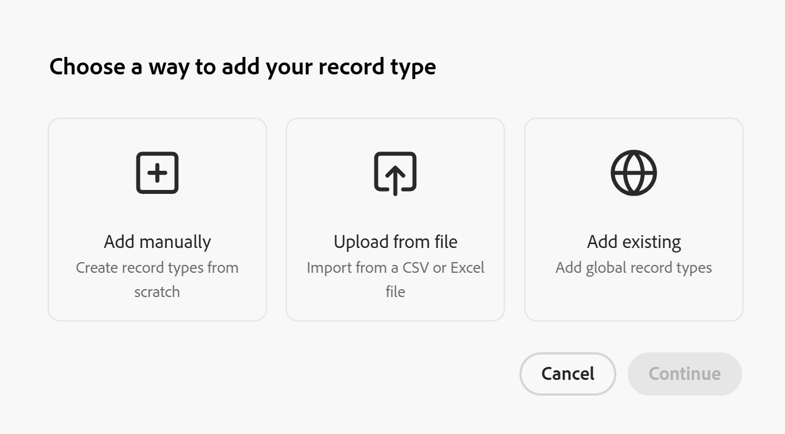

# Agregar tipos de registros existentes desde otro espacio de trabajo

{{planning-important-intro}}

La información de esta página hace referencia a una funcionalidad que aún no está disponible de forma general. Solo está disponible en el entorno de vista previa para todos los clientes. Después del lanzamiento en Vista previa, las mismas funciones también están disponibles mensualmente en el entorno de producción para los clientes que habilitaron lanzamientos rápidos. 

Para obtener información sobre las versiones rápidas, consulte [Habilitar o deshabilitar las versiones rápidas para su organización](/help/quicksilver/administration-and-setup/set-up-workfront/configure-system-defaults/enable-fast-release-process.md). 

Como administrador de espacio de trabajo, puede agregar un tipo de registro que exista en otro espacio de trabajo a un espacio de trabajo que administre en Adobe Workfront Planning.

Un administrador de espacio de trabajo debe designar primero un tipo de registro como tipo de registro global antes de poder agregarlo a los espacios de trabajo que administre como tipo de registro existente. Los administradores de Workspace pueden designar un tipo de registro como global cuando lo crean o editan, definiendo la configuración de área de trabajo cruzada del tipo de registro.

Para obtener más información, vea [Configurar las capacidades entre espacios de trabajo para los tipos de registro](/help/quicksilver/planning/architecture/configure-record-type-cross-workspace-capabilities.md).

Este artículo describe cómo agregar un tipo de registro de uno existente.

Antes de agregar registros a un área de trabajo desde un tipo de registro global, vea también el artículo [Información general sobre los tipos de registros entre áreas de trabajo](/help/quicksilver/planning/architecture/cross-workspace-record-types-overview.md).

## Requisitos de acceso

+++ Expanda para ver los requisitos de acceso para la funcionalidad en este artículo.

<table style="table-layout:auto"> 
<col> 
</col> 
<col> 
</col> 
<tbody> 
    <tr> 
<tr> 
</tr>   
<tr> 
   <td role="rowheader">
Paquete de Adobe Workfront
</td> 
   <td> 
<ul><li>
Cualquier paquete Workfront y un paquete Planning Plus
</li>
O
<li>
Cualquier flujo de trabajo y un paquete de Planning Prime o Ultimate

</li></ul>

Para obtener más información sobre lo que se incluye en cada paquete de Workfront Planning, póngase en contacto con su representante de cuentas de Workfront. 
 
   </td> 
  <tr> 
   <td role="rowheader">
Licencia de Adobe Workfront
</td> 
   <td>
Estándar

   </td> 
  </tr> 
  <tr> 
   <td role="rowheader">
Permisos de objeto
</td> 
   <td>   
Administración de permisos en un espacio de trabajo
  
   
Los administradores del sistema tienen permisos para todos los espacios de trabajo, incluidos los que no crearon
  </td> 
  </tr>  
</tbody> 
</table>

Para obtener más información acerca de los requisitos de acceso de Workfront, consulte [Requisitos de acceso en la documentación de Workfront](/help/quicksilver/administration-and-setup/add-users/access-levels-and-object-permissions/access-level-requirements-in-documentation.md).

+++   

<!--

Old:
<table style="table-layout:auto"> 
<col> 
</col> 
<col> 
</col> 
<tbody> 
    <tr> 
<tr> 

  </tr>   
<tr> 
   <td role="rowheader">
Adobe Workfront package
</td> 
   <td> 
<ul><li>
Any Workfront package
</li>

And

<li>
Any Planning package to create connectable record types
</li>
<li>
A Planning Plus package to create global record types
</li>
</ul>
Or:
<ul><li>
A Prime or Ultimate Workflow package
 </li>
And
<li>
A Planning Prime or Ultimate package
</li></ul>

For more information about what is included in each Workfront Planning package, contact your Workfront account manager. 
 
   </td> 

  <tr> 
   <td role="rowheader">
Adobe Workfront license
</td> 
   <td>
Standard

   </td> 
  </tr> 
  <tr> 
   <td role="rowheader">
Object permissions
</td> 
   <td>   
Manage permissions to a workspace and to the record type</a> 
  
   
System Administrators have permissions to all workspaces, including the ones they did not create
  </td> 
  </tr>  
</tbody> 
</table>

-->

## Crear un tipo de registro agregando uno existente de otro espacio de trabajo

>[!NOTE]
>
>Asegúrese de que haya al menos un tipo de registro designado para ser global en al menos otro espacio de trabajo principal.
>
>Para obtener más información, vea [Configurar las capacidades entre espacios de trabajo para los tipos de registro](/help/quicksilver/planning/architecture/configure-record-type-cross-workspace-capabilities.md).

1. Vaya a un espacio de trabajo en el que desee crear un tipo de registro (espacio de trabajo secundario).
1. Comience a crear un tipo de registro, tal como se describe en el artículo [Crear tipos de registros](/help/quicksilver/planning/architecture/create-record-types.md), luego haga clic en **Agregar tipos de registros existentes**. <!--check this - the option might have been renamed in the UI-->

   

   >[!TIP]
   >
   >Cuando no hay tipos de registros configurados para agregarse a otros espacios de trabajo en el sistema, no se muestra la opción **Agregar existentes**.

1. Haga clic en **Continuar**.
1. (Condicional) En el cuadro **Elija el tipo de registro**, haga clic en la tarjeta del tipo de registro que desee agregar desde un área de trabajo existente y, a continuación, haga clic en **Agregar**.

   Si está usando el entorno de vista previa, puede hacer clic para seleccionar varios tipos de registros y, a continuación, hacer clic en **Agregar**. Se muestran en la lista todos los tipos de registros globales de todos los espacios de trabajo donde están disponibles.

   El tipo de registro se agrega al espacio de trabajo secundario que seleccionó y el icono **tipo de registro global**  se muestra en la tarjeta del tipo de registro.
El icono de tipo de registro global incluye una flecha cuando se muestra en un tipo de registro del espacio de trabajo secundario para indicar que el tipo de registro se agregó desde un tipo de registro existente.

   Ocurren lo siguiente:

   * También se agrega la siguiente información desde el tipo de registro global existente:

      * Todos los campos originales
      * Todas las conexiones de registros
   * No se pueden ver los registros agregados desde el espacio de trabajo original del tipo de registro desde el espacio de trabajo secundario.
   * Puede ver los registros agregados desde el espacio de trabajo original del tipo de registro en ese espacio de trabajo, sólo en el espacio de trabajo original, si tiene al menos permisos de Vista en ese espacio de trabajo.
   * El campo **Workspace** de solo lectura se agrega a la nueva vista de tabla de tipo de registro. El campo muestra el espacio de trabajo donde se creó cada registro.

     >[!NOTE]
     >
     >No puede editar el aspecto, la configuración adicional ni los campos originales del nuevo tipo de registro. Sólo se puede editar el tipo de registro y todos sus campos y configuraciones originales desde el espacio de trabajo original.
     >

1. (Opcional) Pase el ratón sobre el icono de tipo de registro global  para ver el nombre del espacio de trabajo original desde el que se agregó el tipo de registro.
1. (Opcional) Haga clic en y, a continuación, arrastre y suelte el tipo de registro recién añadido en cualquier sección del espacio de trabajo.
1. (Opcional) Haga clic en el menú **Más** de la tarjeta del nuevo tipo de registro o a la derecha del nombre del tipo de registro en su página y, a continuación, haga clic en una de las siguientes opciones:

   * **Compartir** para compartir el tipo de registro desde el espacio de trabajo secundario.
   * **Eliminar** para eliminar el tipo de registro del espacio de trabajo secundario. Al eliminar los tipos de registro del espacio de trabajo secundario también se eliminan los registros agregados desde el espacio de trabajo secundario.

     Las vistas añadidas desde el espacio de trabajo secundario no se eliminan. <!--checking with Lilit - not sure if this is by design??-->

   Para obtener más información, vea la sección &quot;Eliminar tipos de registros globales&quot; en el artículo [Eliminar tipos de registros](/help/quicksilver/planning/architecture/delete-record-types.md).

<!--
This will be released later with another epic: 
1. In the table view, click the **+** icon in the upper-right corner to add new fields. For information, see [Create fields](/help/quicksilver/planning/fields/create-fields.md).
1. (Optional) Click the **More** menu  in the new record type's card, or to the right of the record type's name on its page, then click **Share** to share it with other users in the same workspace, or adjust their permissions to the record type.
-->

&lt;!—consultando con Lilit si podemos añadir automatizaciones o formularios de solicitud a RT globales secundarios??—añadir paso con enlaces a esos artículos si/ cuando sí—>

