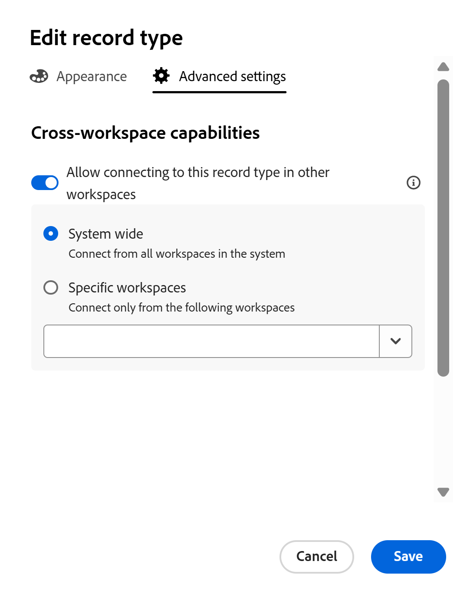
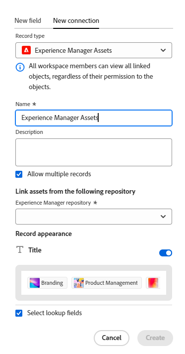

<!--keep the 30 fields limit in yellow till Jan 2026; also the global record type cross-workspace capability information-->

# Conectar tipos de registro

La información resaltada en esta página hace referencia a una funcionalidad que aún no está disponible de forma general. Solo está disponible en el entorno de vista previa para todos los clientes. Después de las versiones mensuales en Production, las mismas funciones también están disponibles en el entorno Production para los clientes que habilitaron versiones rápidas. 

Para obtener información sobre las versiones rápidas, consulte [Habilitar o deshabilitar las versiones rápidas para su organización](/help/quicksilver/administration-and-setup/set-up-workfront/configure-system-defaults/enable-fast-release-process.md). 

{{planning-important-intro}}

<!--
You can use Adobe Workfront Planning to design fully-customizable workspaces that contain record types needed in your organization. A way to indicate how individual record types relate to one another is to connect them. Also, you can connect Workfront Planning record types with object types from other applications to enhance your users' experience and keep their focus in one application. -->

Puede conectar tipos de registros entre sí o conectar tipos de registros con tipos de objetos de otras aplicaciones.

La conexión de tipos de registros es útil cuando hay varios tipos de objetos de trabajo que se afectan entre sí. Por ejemplo, puede trabajar con campañas, y cada campaña puede adaptarse a varias marcas. Para indicar esta relación, puede conectar campañas a marcas. Esto crea un campo de conexión para marcas en el registro de campaña.

Además, el trabajo de cada campaña puede planificarse en varios proyectos en Workfront. Para indicar esto, puede conectar las campañas a los proyectos relevantes. Esto crea un campo de conexión para los proyectos en el registro de campaña.

Una vez creados los campos de conexión, puede conectar registros individuales entre los dos tipos de registro u objeto.

>[!NOTE]
>
>Puede tener hasta 30 campos de conexión para un tipo de registro.

En este artículo se describe cómo conectar dos tipos de registros de Workfront Planning o un tipo de registro de Workfront Planning con un objeto de otra aplicación.

Después de establecer la conexión entre registros o tipos de objeto, se agrega un campo de conexión a un tipo de registro de Planning. En el campo de conexión, puede conectar registros individuales entre sí y mostrar campos del registro vinculado o tipos de objeto en un registro de Workfront Planning.

Para obtener información general acerca de los tipos de conexión, vea [Información general sobre los tipos de registros conectados](/help/quicksilver/planning/architecture/connect-record-types-overview.md).

Para obtener información acerca de cómo conectar registros o registros con objetos de otras aplicaciones, vea [Conectar registros](/help/quicksilver/planning/records/connect-records.md).

Para ver un ejemplo de conexión de tipos de registros y registros, consulte [Ejemplo de conexión de tipos de registros y registros](/help/quicksilver/planning/architecture/example-connect-record-types-and-records.md).

<!--ensure this last linked article is right; the title and the link should have changed-->

## Requisitos de acceso

+++ Expanda para ver los requisitos de acceso para la funcionalidad en este artículo.

<table style="table-layout:auto"> 
<col> 
</col> 
<col> 
</col> 
<tbody> 
    <tr> 
<tr> 
</tr> 
<tr> 
   <td role="rowheader">
paquete de Adobe Workfront
</td> 
   <td> 

Para conectar tipos de registros desde el mismo espacio de trabajo: 

<ul> 
<li>
Cualquier Workfront y cualquier paquete de Planning
</li>
<li>
Cualquier flujo de trabajo y cualquier paquete de Planning</li></ul>

Para conectar tipos de registros de diferentes espacios de trabajo:

<ul> 
<li>
Cualquier Workfront y cualquier paquete de Planning
</li>
<li>
Cualquier flujo de trabajo y un paquete de Planning Prime o Ultimate
</li></ul>

Para obtener más información sobre lo que se incluye en cada paquete de Workfront Planning, póngase en contacto con su representante de cuentas de Workfront. 
 
   </td> 
<tr> 
<td> 
   
 Productos adicionales
 </td> 
   <td> 
   
 Además de Adobe Workfront, debe tener una licencia de Adobe Experience Manager Assets y una integración entre AEM Assets y Workfront para conectar los recursos de AEM con los tipos de registro de Planning.

    Para obtener más información, consulte <a href="/help/quicksilver/documents/adobe-workfront-for-experience-manager-assets-essentials/workfront-for-aem-asset-essentials.md">Adobe Workfront para Experience Manager Assets y Assets Essentials: índice de artículo</a>. 

   </td> 
  </tr> 
  <tr> 
   <td role="rowheader">
Licencia de Adobe Workfront
</td> 
   <td>
Estándar

   </td> 
  </tr> 
  <tr> 
   <td role="rowheader">
Permisos de objeto
</td> 
   <td>   
Administración de permisos en un espacio de trabajo
  
   
Los administradores del sistema tienen permisos para todos los espacios de trabajo, incluidos los que no crearon
  </td> 
  </tr>  
</tbody> 
</table>

Para obtener más información acerca de los requisitos de acceso de Workfront, consulte [Requisitos de acceso en la documentación de Workfront](/help/quicksilver/administration-and-setup/add-users/access-levels-and-object-permissions/access-level-requirements-in-documentation.md).

+++

<!--Old:
<table style="table-layout:auto"> 
<col> 
</col> 
<col> 
</col> 
<tbody> 
    <tr> 
<tr> 
<td> 
   
 Products
 </td> 
   <td> 
   <ul><li>
 Adobe Workfront
</li> 
   <li>
 Adobe Workfront Planning
</li>
   <li>
 Adobe Experience Manager Assets, if you want to connect AEM assets with Planning record types

   
You must have an Adobe Experience Manager Assets license and an integration between AEM Assets and Workfront.
    For information, see <a href="/help/quicksilver/documents/adobe-workfront-for-experience-manager-assets-essentials/workfront-for-aem-asset-essentials.md">Adobe Workfront for Experience Manager Assets and Assets Essentials: article index</a>. 

   </li>
   </ul></td> 
  </tr>   
<tr> 
   <td role="rowheader">
Adobe Workfront plan*
</td> 
   <td> 

Any of the following Workfront plans:
 
<ul><li>Select</li> 
<li>Prime</li> 
<li>Ultimate</li></ul> 

Workfront Planning is not available for legacy Workfront plans
 
   </td> 
<tr> 
   <td role="rowheader">
Adobe Workfront Planning package*
</td> 
   <td> 

Any 
 

For more information about what is included in each Workfront Planning plan, contact your Workfront account manager. 
 
   </td> 
 <tr> 
   <td role="rowheader">
Adobe Workfront platform
</td> 
   <td> 

Your organization's instance of Workfront must be onboarded to the Adobe Unified Experience to be able to access Workfront Planning.
 

For more information, see <a href="/help/quicksilver/workfront-basics/navigate-workfront/workfront-navigation/adobe-unified-experience.md">Adobe Unified Experience for Workfront</a>. 
 
   </td> 
   </tr> 
  </tr> 
  <tr> 
   <td role="rowheader">
Adobe Workfront license*
</td> 
   <td> 
Standard
 
   
Workfront Planning is not available for legacy Workfront licenses
 
  </td> 
  </tr> 
  <tr> 
   <td role="rowheader">
Access level configuration
</td> 
   <td> 
There are no access level controls for Adobe Workfront Planning
   
</td> 
  </tr> 
<tr> 
   <td role="rowheader">
Object permissions
</td> 
   <td>   
Manage permissions to a workspace
  
   
System Administrators have permissions to all workspaces, including the ones they did not create.
</td> 
  </tr> 
 
</tbody> 
</table> -->

## Conectar tipos de registro

<!--when changes here, also update the article for "Connect records"-->

{{step1-to-planning}}

1. Haga clic en el espacio de trabajo cuyos tipos de registro desee conectar,

   O

   Desde un espacio de trabajo, expanda la flecha hacia abajo situada a la derecha del nombre de un espacio de trabajo existente, busque un espacio de trabajo y, a continuación, selecciónelo cuando se muestre en la lista.
1. Haga clic en la tarjeta de un tipo de registro para abrir la página del tipo de registro.
1. Haga clic en el icono **+** de la esquina superior derecha de la vista de tabla y, a continuación, en la pestaña **Nueva conexión**.

   

1. Busque un tipo de registro o seleccione una de las siguientes opciones:

   * Un tipo de registro del espacio de trabajo actual

     

     >[!TIP]
     >
     > 
     >Si no se tienen otros tipos de registro en el espacio de trabajo seleccionado, la sección del espacio de trabajo no se muestra.

   * Un tipo de registro de otro espacio de trabajo configurado para conectarse desde otros espacios de trabajo.

     >[!TIP]
     >
     >La opción **Permitir la conexión a este tipo de registro en otros espacios de trabajo** debe estar habilitada para un tipo de registro en la ficha **Configuración avanzada** o **Configuración entre espacios de trabajo** del cuadro **Editar tipo de registro**, para que se pueda obtener acceso a un tipo de registro desde otros espacios de trabajo. Si no hay ningún tipo de registro configurado para conectarse desde otros espacios de trabajo, la sección del espacio de trabajo no se muestra.
     >
     >Para obtener más información, vea [Configurar las capacidades entre espacios de trabajo para los tipos de registro](/help/quicksilver/planning/architecture/configure-record-type-cross-workspace-capabilities.md). <!--update screen shot at production-->
     >
     >

     <!--Old:
        [!TIP]
        The **Allow connecting to this record type in other workspaces** setting must be enabled for a record type in the **Advanced settings** tab of the **Edit record type** box, for a record type to be accessible from other workspaces. If there are no record types that are configured to connect from other workspaces, the workspace section does not display.
        
        -->

   Para obtener más información, consulte [Editar tipos de registros](/help/quicksilver/planning/architecture/edit-record-types.md).

   * Un **proyecto, portafolio, programa, compañía** o **grupo** de la sección **Tipos de objetos de Workfront**.

     

   * **Experience Manager Assets** de la sección **Aplicaciones de Adobe**.

     

     Se abrirá una ficha Nueva conexión para el tipo de objeto o registro seleccionado.

1. Actualice el campo **Name** con el nombre del nuevo campo conectado, tal como aparecerá en la vista de tabla o en la página de registro del tipo de registro original. Esto crea la columna (o campo) del registro conectado en la vista de tabla del tipo de registro original. De forma predeterminada, el nombre del campo es el nombre del registro u objeto al que se conecta.

   >[!TIP]
   >
   >Puede tener varias conexiones al mismo registro o tipo de objeto. Si no se edita el nombre del campo conectado, Workfront añade un número después del nombre del registro conectado para indicar el número de tipos de registros conectados con el mismo nombre.

1. Actualice el campo **Descripción** agregando información sobre el campo de registro conectado. La descripción de un campo se muestra cuando se pasa el puntero por encima de la columna de campo de una tabla.
1. (Condicional) Cuando conecte tipos de registros de dos espacios de trabajo diferentes o un registro y un objeto de recurso de Adobe Experience Manager, seleccione **Permitir varios registros**. Al seleccionarlo, indica que permite a los usuarios agregar varios registros cuando el campo de tipo de registro conectado aparece en los registros originales. Esta opción está seleccionada de forma predeterminada.

   

1. (Condicional) Cuando conecte tipos de registros del mismo espacio de trabajo o un tipo de registro de Planning con un tipo de objeto de Workfront, seleccione una de las siguientes opciones:

   * **Selección múltiple**: seleccione esta opción para permitir que un registro del tipo de registro actual se conecte con varios registros del tipo de registro de conexión.
   * **Selección única**: seleccione esta opción para permitir que un registro del tipo de registro actual se conecte con un registro del tipo de registro de conexión.

1. Seleccione **Crear campo correspondiente en el tipo de registro vinculado**. Al seleccionarlo, se crea un campo de conexión en el tipo de registro al que está conectado, además del campo de conexión agregado al tipo de registro actual. Esta opción está desactivada de forma predeterminada.

   >[!TIP]
   >
   >Además de el límite de 30 campos de conexión para un tipo de registro, hay un límite de 500 campos para un tipo de registro. Se recomienda mantener esta configuración desactivada, especialmente para los tipos de registros taxonómicos, para evitar alcanzar este límite.
   >

1. (Condicional) Si habilitó **Crear campo correspondiente en el tipo de registro vinculado**, elija entre las siguientes opciones para indicar cuántos registros se pueden conectar y desde los que se pueden conectar los usuarios:

   * Muchos a muchos
   * Uno a muchos
   * Muchos a uno
   * Uno a uno

   Para obtener más información acerca de los tipos de conexión, vea [Información general sobre los tipos de registros conectados](/help/quicksilver/planning/architecture/connect-record-types-overview.md).

   >[!NOTE]
   >
   >Si selecciona Uno a varios o Uno a uno para el tipo Conexión y posteriormente desea conectar un registro o un objeto que ya está conectado en otro lugar, recibirá una advertencia indicando que conectarlo de nuevo lo quitará de la conexión original. Puede permitir la eliminación o seleccionar otro registro.

1. (Condicional y opcional) Cuando seleccione conectar un objeto de Workfront, elija un **formulario personalizado** en la sección **Vincular solo objetos que coincidan con estos criterios**. Solo los objetos que tienen los formularios personalizados adjuntos seleccionados pueden vincularse al tipo de registro seleccionado. Pueden seleccionarse varios formularios.

   >[!NOTE]
   >
   > Debe crear formularios personalizados en Workfront para los objetos seleccionados antes de que se muestren en esta lista.

1. (Condicional) Cuando seleccione conectarse a Experience Manager Assets, elija un repositorio en el menú desplegable **Repositorio de Experience Manager** en la sección **Vincular recursos del siguiente repositorio**. Este campo es obligatorio. En este campo solo se muestran los repositorios a los que tiene acceso en Experience Manager Assets.

   >[!NOTE]
   >
   >El administrador de Workfront puede asignar campos de Workfront Planning a campos de Experience Manager Assets a través de la asignación de metadatos en Workfront. Para obtener más información, consulte [Configuración de la asignación de metadatos de recursos entre Adobe Workfront y Experience Manager Assets](https://experienceleague.adobe.com/en/docs/experience-manager-cloud-service/content/assets/integrations/configure-asset-metadata-mapping).

1. (Condicional) Cuando seleccione conectarse a Experience Manager Assets o a un tipo de registro de Workfront Planning, elija una de las siguientes opciones en el área **Apariencia del registro**:

   * **Nombre e imagen**: tanto el nombre como la miniatura o el icono de los registros conectados se mostrarán en el campo de registro conectado. Esta es la opción predeterminada.
   * **Nombre**: solo se mostrará el nombre de los registros conectados en el campo de registro conectado.
   * **Imagen**: solo se mostrará la miniatura o el icono de los registros conectados en el campo de registro conectado.

   Los registros sin imagen en miniatura muestran el icono de tipo de registro en su lugar. Se mostrará un ejemplo de cómo se mostrarán los registros conectados en el área **Grabar apariencia**.

   >[!NOTE]
   >
   >* Cuando permite vincular varios registros, la visualización de solo la miniatura puede ahorrar espacio en áreas más pequeñas, como las vistas de registros.
   >
   >* El nombre de un registro es el campo principal del registro. Para obtener más información, consulte [Información general sobre el campo principal](/help/quicksilver/planning/fields/primary-field-overview.md).
   >
   >* La selección de una apariencia de registro no está disponible al seleccionar tipos de objetos de Workfront.
   >
   >* Lo que seleccione en el área de Apariencia del registro determina cómo se muestran los registros en las conexiones de cualquier parte del sistema, incluidas todas las vistas y páginas de detalles.

1. Seleccione **Seleccionar campos de búsqueda** para agregar campos desde el tipo de registro al que se está conectando. Los campos de búsqueda son campos asociados al tipo de registro u objeto al que se está vinculando. Al vincularlos, se muestra información del registro u objeto con el que se está vinculando en el registro desde el que se está vinculando. Esta opción está seleccionada de forma predeterminada.

   >[!TIP]
   >
   >* No puede agregar campos de escritura anticipada de Workfront (incluidos campos como Propietario del proyecto o Patrocinador del proyecto) como campos de búsqueda.
   >
   >* La información del campo de fecha de los objetos de Workfront se muestra en formato de 24 horas en Workfront Planning, independientemente de cómo se muestre en Workfront.
   >
   >   Por ejemplo, si la fecha planificada de inicio de un proyecto se muestra como las 3:00 p.m. en Workfront, se mostrará como 15:00 en Workfront Planning en un campo de búsqueda importado.

1. Haga clic en **Crear**.

1. (Condicional) Si seleccionó la opción **Seleccionar campo de búsqueda**, se abrirá el cuadro **Añadir campos de búsqueda**.

   Haga clic en el icono **+** para añadir campos desde el área **Campos no seleccionados**.

   O

   Haga clic en el icono **-** para quitar campos del área **Campos seleccionados**

   

   Los valores de los campos conectados se rellenan automáticamente después de vincular registros u objetos.

   >[!IMPORTANT]
   >
   >    Todas las personas con permisos de visualización o superiores del espacio de trabajo pueden ver la información en los campos vinculados, independientemente de sus permisos o nivel de acceso en la aplicación de los tipos de objetos vinculados.

1. (Opcional) Haga clic en **Omitir** para omitir la adición de campos desde el registro o el tipo de objeto vinculados. El nombre o el campo Principal del registro vinculado es el único campo visible en la vista de tabla del tipo de registro desde el que se conecta.

1. Elija un agregador para los campos de búsqueda que agregue.

   >[!NOTE]
   >
   >No se pueden agregar agregadores para los siguientes tipos de campo:
   >
   >    * Párrafo
   >    * Casilla de verificación

   Los valores de los campos vinculados se muestran separados por comas o como un valor resumido según el agregador que elija, cuando los usuarios seleccionen más de un registro vinculado en el campo de registros vinculados.

   Si el campo de búsqueda contiene varios valores que no están resumidos, tenga en cuenta lo siguiente al utilizar el campo en la ordenación o la agrupación de una vista:

   * La ordenación se realiza según el primer valor

   * Los registros se agrupan según cada combinación única de valores de campo

   * La vista de cronología se crea en función del primer valor de fecha del tipo de registro conectado, cuando se muestra en la vista

   >[!IMPORTANT]
   >
   > Debe seleccionar un valor del agregador al añadir campos de fecha de búsqueda si desea que los campos estén disponibles para añadirlos como fechas de inicio y finalización en las vistas del calendario y la cronología. Por ejemplo, puede seleccionar el agregador MAX o MIN para un campo de fecha de búsqueda.

   

   >[!NOTE]
   >
   > Los agregadores no están disponibles al conectar los tipos de registros a Experience Manager Assets.

   Seleccione entre las siguientes opciones:

   * **None**: muestra los valores que provienen de varios registros separados por comas. Esta es la selección predeterminada.
   * **MAX**: muestra el valor más alto de todos los valores procedentes de varios registros seleccionados en el campo del registro vinculado.
   * **MIN**: muestra el valor más bajo de todos los valores que provienen de varios registros seleccionados en el campo del registro vinculado.
   * **SUM**: muestra el total de todos los valores que provienen de varios registros seleccionados en el campo del registro vinculado.
   * **AVG**: muestra el promedio de todos los valores que provienen de varios registros seleccionados en el campo del registro vinculado.
   * **UNIQUE**: quita los duplicados de los valores de los campos de búsqueda y solo muestra los valores únicos. Esta opción no está disponible para los siguientes tipos de campo:
      * Párrafo
      * Casilla de verificación
      * Personas

   >[!NOTE]
   >
   >Por ejemplo, puede vincular el registro de producto (registro vinculado) desde el registro de campaña (registro original) y asignarle el nombre &quot;campo de producto&quot;. También puede vincular el campo Presupuesto del registro de producto del registro de campaña y llamarlo &quot;Presupuesto de producto&quot;. Si se le permite seleccionar varios registros en el &quot;Campo de producto&quot;, puede seleccionar el Producto 1 con un Presupuesto de 100 000 $ y el Producto 2 con un Presupuesto de 110 000 $, y el Producto 3 con un Presupuesto de 100 000 $. Puede ver la siguiente información de presupuesto en el campo vinculado desde el registro original, en función del agregador que elija:
   >
   >* **Ninguno**: $100,000, $110,000, $100,000
   >* **MAX**: $110,000
   >* **MIN**: $100,000
   >* **SUMA**: $310,000
   >* **PROMEDIO**: $103,000.33
   >* **ÚNICO**: $100,000
   >

1. (Opcional) Use el icono **search**  para buscar un campo.

1. Haga clic en **Añadir campos** para guardar los cambios.

   Se añaden los elementos siguientes:

   * Un campo de registro vinculado en el tipo de registro desde el que está vinculando. El campo de registro vinculado mostrará registros individuales del tipo de registro vinculado, después de añadirlos manualmente. Para obtener información sobre cómo añadir registros, consulte [Conectar registros](/help/quicksilver/planning/records/connect-records.md). El nombre del campo de registro vinculado es el nombre seleccionado en el paso 6. <!--accurate-->

   * Campo (o campos) vinculado (o de búsqueda) que muestra información sobre el registro vinculado o los tipos de objeto después de añadir manualmente los registros u objetos en el campo de registro vinculado. Los campos de búsqueda solo se crean cuando la opción **Seleccionar campos de búsqueda** está seleccionada al crear la conexión. Los campos de búsqueda se nombran automáticamente según este patrón:

     `<Name of the original field on the linked record> (from <Name of your linked field>)`

     Por ejemplo, si ha vinculado un tipo de registro de campaña con un tipo de registro de programa y ha asignado al campo de registro vinculado de programa el nombre &quot;Información del programa&quot;, seleccionado a continuación para mostrar también el campo Presupuesto del programa en la vista de tabla de la campaña, el campo vinculado se denomina automáticamente `Budget (from Program information)` en la vista de tabla de la campaña.

   * Cuando se vinculan tipos de registros entre sí, también se agrega un campo de registro vinculado en el tipo de registro al que se está vinculando, sólo cuando se habilita la configuración **Crear campo correspondiente en el tipo de registro vinculado**. El nombre del campo de registro vinculado en el tipo de registro vinculado es el nombre del tipo de registro desde el que se establece el vínculo.

     Por ejemplo, si vincula el tipo de registro &quot;Producto&quot; desde el tipo de registro &quot;Campaña&quot; y asigna al campo conectado de la campaña el nombre &quot;Producto vinculado&quot;, se crea un campo de registro vinculado &quot;Campaña&quot; para el tipo de registro Producto.

     >[!TIP]
     >
     > No se crea un campo de registro vinculado para los objetos de otra aplicación en sus respectivas aplicaciones.
     >Se recomienda no crear vínculos a tipos de registros taxonómicos, ya que hay un límite de 500 campos,  además del límite de 30 campos conectados para cada tipo de registro.

   <!--see the span preview text in the TIP above; it might not show up in green-->

1. (Opcional y condicional) Desde el tipo de registro original o la vista de tabla del tipo de registro vinculado, haga clic en la flecha hacia abajo en el encabezado de los campos de registro vinculados y, a continuación, haga clic en una de las siguientes opciones:

   * **Editar campo**: Actualice la información de **Nombre** y **Descripción** del campo.
   * **Editar campos de búsqueda**: se pueden añadir o quitar los campos del registro vinculado.

   

   Para agregar o quitar campos de búsqueda, siga las instrucciones de los pasos 16-17 anteriores. <!--ensure these step numbers stay accurate-->

   >[!NOTE]
   >
   > No se pueden añadir campos de búsqueda que pertenezcan a tipos de registro que esté vinculando a tipos de objeto de otra aplicación.
   >
   > Por ejemplo, no puede añadir el campo de búsqueda “Estado de campaña” a un proyecto de Workfront al que esté vinculando desde las campañas.

1. (Opcional) Haga clic en la flecha hacia abajo en el encabezado de un campo de registro vinculado o en el encabezado de un campo de búsqueda desde el tipo de registro desde el que está vinculando y, a continuación, haga clic en **Eliminar**.

   Se eliminan el campo de registro o el campo de búsqueda. Si elimina un campo de registro, también se eliminarán todos los campos de búsqueda asociados al registro vinculado.
