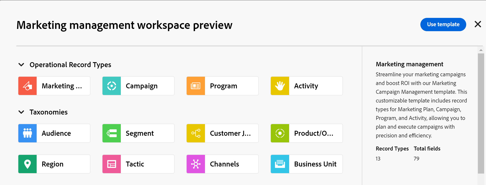

<!--udpate the metadata with real information when making this avilable in TOC and in the left nav-->

# Crear espacios de trabajo

<!--The information on this page refers to functionality not yet generally available. It is available only in the Preview environment for all customers. After the monthly releases to Production, the same features are also available in the Production environment for customers who enabled fast releases.    

For information about fast releases, see [Enable or disable fast releases for your organization](/help/quicksilver/administration-and-setup/set-up-workfront/configure-system-defaults/enable-fast-release-process.md). -->

{{planning-important-intro}}

En Adobe Workfront Planning, los espacios de trabajo son ubicaciones centralizadas para que los equipos planifiquen el trabajo.

Un espacio de trabajo es un conjunto de tipos de registros que utiliza un equipo y que representa el ciclo de vida del trabajo del equipo. Puede personalizar por completo los espacios de trabajo en Adobe Workfront Planning.

Para obtener información general acerca de los espacios de trabajo, consulte [Información general sobre los espacios de trabajo](/help/quicksilver/planning/architecture/workspaces-overview.md).

## Requisitos de acceso

+++ Expanda para ver los requisitos de acceso para la funcionalidad en este artículo. 

<table style="table-layout:auto"> 
<col> 
</col> 
<col> 
</col> 
<tbody> 
    <tr> 
<tr> 
</tr>   
<tr> 
   <td role="rowheader">
paquete de Adobe Workfront
</td> 
   <td> 
<ul> 
<li>
Cualquier Workfront y cualquier paquete de Planning
</li>
O
<li>
Cualquier flujo de trabajo y cualquier paquete de Planning
</li></ul>

Para obtener más información sobre lo que se incluye en cada paquete de Workfront Planning, póngase en contacto con su representante de cuentas de Workfront. 
 
   </td> 
  <tr> 
   <td role="rowheader">
Licencia de Adobe Workfront
</td> 
   <td>
Estándar

   </td> 
  </tr> 
  <tr> 
   <td role="rowheader">
Permisos de objeto
</td> 
   <td>   
Administración de permisos en un espacio de trabajo
  
   
Los administradores del sistema tienen permisos para todos los espacios de trabajo, incluidos los que no crearon
  </td> 
  </tr>  
</tbody> 
</table>

Para obtener más información acerca de los requisitos de acceso de Workfront, consulte [Requisitos de acceso en la documentación de Workfront](/help/quicksilver/administration-and-setup/add-users/access-levels-and-object-permissions/access-level-requirements-in-documentation.md).

+++   

<!--Old:

<table style="table-layout:auto"> 
<col> 
</col> 
<col> 
</col> 
<tbody> 
    <tr> 
<tr> 
<td> 
   
 Products
 </td> 
   <td> 
   <ul><li>
 Adobe Workfront
</li> 
   <li>
 Adobe Workfront Planning
</li></ul></td> 
  </tr>   
<tr> 
   <td role="rowheader">
Adobe Workfront plan*
</td> 
   <td> 

Any of the following Workfront plans:
 
<ul><li>Select</li> 
<li>Prime</li> 
<li>Ultimate</li></ul> 

Workfront Planning is not available for legacy Workfront plans
 
   </td> 
<tr> 
   <td role="rowheader">
Adobe Workfront Planning package*
</td> 
   <td> 

Any 
 

For more information about what is included in each Workfront Planning plan, contact your Workfront account manager. 
 
   </td> 
 <tr> 
   <td role="rowheader">
Adobe Workfront platform
</td> 
   <td> 

Your organization's instance of Workfront must be onboarded to the Adobe Unified Experience to be able to access Workfront Planning.
 

For more information, see <a href="/help/quicksilver/workfront-basics/navigate-workfront/workfront-navigation/adobe-unified-experience.md">Adobe Unified Experience for Workfront</a>. 
 
   </td> 
   </tr> 
  </tr> 
  <tr> 
   <td role="rowheader">
Adobe Workfront license*
</td> 
   <td>
 Standard 

   
Workfront Planning is not available for legacy Workfront licenses
 
  </td> 
  </tr> 
  <tr> 
   <td role="rowheader">
Access level configuration
</td> 
   <td> 
There are no access level controls for Adobe Workfront Planning
   
</td> 
  </tr> 
<tr> 
   <td role="rowheader">
Object permissions
</td> 
   <td>   
You receive Manage permissions to the workspaces you create. 
 </td> 
  </tr> 
</tbody> 
</table> -->

## Crear un espacio de trabajo

Puede crear un espacio de trabajo y añadirle tipos de registro para organizar los objetos en Workfront Planning. Para obtener más información acerca de cómo editar un espacio de trabajo, consulte [Editar áreas de trabajo](/help/quicksilver/planning/architecture/edit-workspaces.md).

{{step1-to-planning}}

1. Haga clic en **Crear espacio de trabajo**

   Se muestra el cuadro Crear espacio de trabajo. Puede crear un espacio de trabajo desde cero o crearlo con una de las plantillas disponibles.

1. (Opcional y condicional) Haga clic en **Vista previa** dentro de cualquiera de las siguientes plantillas de área de trabajo predefinidas:

   * Básico: administración de marketing
   * Administración avanzada de marketing
   * Empresa: administración de marketing
   * Administración de ventas
   * Administración de productos

   Se abrirá el cuadro de vista previa de plantilla.

   Existe una indicación de qué tipos de registros operativos, taxonomías y cuántos campos están asociados a cada plantilla.

   

   Para obtener información acerca de las plantillas de espacio de trabajo de Workfront Planning, consulte [Lista de plantillas de espacio de trabajo](/help/quicksilver/planning/architecture/workspace-templates.md).

1. En el cuadro de vista previa de la plantilla, haga clic en **Usar plantilla** para comenzar a crear el espacio de trabajo a partir de la plantilla seleccionada

   O

   Haga clic en **Atrás** y, a continuación, haga clic en **Nuevo espacio de trabajo** para crear un espacio de trabajo desde cero.

   Se crea uno para los siguientes tipos de espacios de trabajo:

   * Un espacio de trabajo vacío denominado **Espacio de trabajo sin título** donde puede empezar a añadir tipos de registros manualmente al crear un espacio de trabajo desde cero.
   * Espacio de trabajo con el nombre de la plantilla seleccionada que se rellena con tipos de registros de ejemplo. Puede personalizar aún más los tipos de registro y el espacio de trabajo.

   Para los administradores de Workfront, el nuevo espacio de trabajo se muestra en la ficha **Espacios de trabajo en los que participo**.

   Para todos los demás usuarios que pueden crear espacios de trabajo, el nuevo espacio de trabajo se muestra en el área **Espacios de trabajo**.

1. Haga clic dentro del nombre del espacio de trabajo en el encabezado del nuevo espacio de trabajo para cambiarle el nombre y, a continuación, pulse Entrar.

1. (Opcional y condicional) Si creó el área de trabajo a partir de una plantilla, haga clic dentro del nombre de las secciones **Tipos de registros operativos** o **Taxonomías**

   O

   Pase el ratón sobre el nombre de una sección, luego haga clic en el menú **Más** , luego haga clic en **Cambiar nombre** para cambiar el nombre de la sección.

   >[!TIP]
   >
   >Puede cambiar el nombre de cualquier sección desde cualquier espacio de trabajo, incluso si no ha creado la sección.

   Para obtener más información sobre la edición de espacios de trabajo, incluida la edición de espacios de trabajo, consulte [Editar espacios de trabajo](/help/quicksilver/planning/architecture/edit-workspaces.md).

1. (Opcional) Haga clic en **Añadir tipo de registro** para añadir tipos de registro al área de trabajo en cualquier sección.

   Para obtener más información, consulte [Crear tipos de registros](/help/quicksilver/planning/architecture/create-record-types.md).

   Para obtener más información sobre la edición y eliminación de tipos de registros en un área de trabajo, consulte [Editar áreas de trabajo](/help/quicksilver/planning/architecture/edit-workspaces.md).

1. (Opcional) Haga clic en la flecha hacia atrás situada a la izquierda del nuevo espacio de trabajo para abrir la página principal de Planning. Se crea una tarjeta de área de trabajo nueva para el área de trabajo nueva en la ficha **Espacios de trabajo en los que estoy**.

   El nombre del usuario que creó el espacio de trabajo se guarda en la tarjeta del espacio de trabajo como Propietario.

   >[!NOTE]
   >
   >Para los usuarios que están realizando la transición al sistema Identity Management de Adobe (IMS), los espacios de trabajo creados por usuarios solo de Workfront que no son usuarios de IMS se muestran según lo creado por **System**.
   >
   >Para obtener información sobre IMS, consulte [Experiencia unificada de Adobe para Workfront](/help/quicksilver/workfront-basics/navigate-workfront/workfront-navigation/adobe-unified-experience.md).

