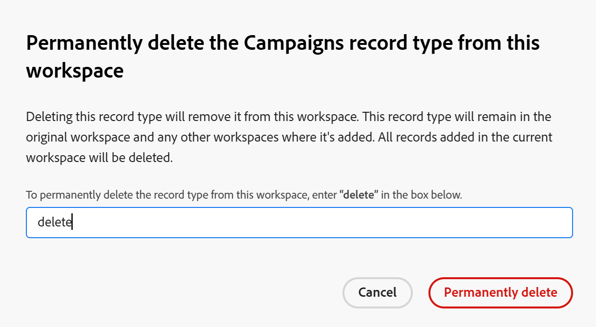

<!--keep the global record type reference in yellow till January 2026-->

# Eliminar tipos de registro

<!--The highlighted information on this page refers to functionality not yet generally available. It is available only in the Preview environment for all customers. After the monthly releases to Production, the same features are also available in the Production environment for customers who enabled fast releases.    

For information about fast releases, see [Enable or disable fast releases for your organization](/help/quicksilver/administration-and-setup/set-up-workfront/configure-system-defaults/enable-fast-release-process.md). -->

{{planning-important-intro}}

Puede eliminar los tipos de registro cuando ya no sean relevantes.

Sin embargo, al eliminar los tipos de registro, también se elimina toda la información asociada a los tipos de registro. Para obtener más información, consulte la sección [Consideraciones al eliminar tipos de registros](#considerations-when-deleting-record-types) en este artículo.

Para obtener más información sobre los tipos de registros, consulte [Información general sobre los tipos de registros](/help/quicksilver/planning/architecture/overview-of-record-types.md).

<!-- last sentence might need to be deleted when we can recover or replace deleted record types-->

## Requisitos de acceso

+++ Expanda para ver los requisitos de acceso para la funcionalidad en este artículo. 

<table style="table-layout:auto"> 
<col> 
</col> 
<col> 
</col> 
<tbody> 
    <tr> 
<tr> 
</tr>   
<tr> 
   <td role="rowheader">
Paquete de Adobe Workfront
</td> 
   <td> 
<ul> 
<li>
Cualquier Workfront y cualquier paquete de Planning
</li>
O
<li>
Cualquier flujo de trabajo y cualquier paquete de Planning
</li></ul>

Para eliminar tipos de registros globales:

<ul><li>
Cualquier paquete Workfront y un paquete Planning Plus
</li>
O
<li>
Cualquier flujo de trabajo y un paquete de Planning Prime o Ultimate
</li></ul>

Para obtener más información sobre lo que se incluye en cada paquete de Workfront Planning, póngase en contacto con su representante de cuentas de Workfront. 
 
   </td> 
  <tr> 
   <td role="rowheader">
Licencia de Adobe Workfront
</td> 
   <td>
Estándar

   </td> 
  </tr> 
  <tr> 
   <td role="rowheader">
Permisos de objeto
</td> 
   <td>   
Administración de permisos en un espacio de trabajo
  
   
Los administradores del sistema tienen permisos para todos los espacios de trabajo, incluidos los que no crearon
  </td> 
  </tr>  
</tbody> 
</table>

Para obtener más información acerca de los requisitos de acceso de Workfront, consulte [Requisitos de acceso en la documentación de Workfront](/help/quicksilver/administration-and-setup/add-users/access-levels-and-object-permissions/access-level-requirements-in-documentation.md).

+++   

<!--Old:
<table style="table-layout:auto"> 
<col> 
</col> 
<col> 
</col> 
<tbody> 
    <tr> 
<tr> 
<td> 
   
 Products
 </td> 
   <td> 
   <ul><li>
 Adobe Workfront
</li> 
   <li>
 Adobe Workfront Planning
</li></ul></td> 
  </tr>   
<tr> 
   <td role="rowheader">
Adobe Workfront plan*
</td> 
   <td> 

Any of the following Workfront plans:
 
<ul><li>Select</li> 
<li>Prime</li> 
<li>Ultimate</li></ul> 

Workfront Planning is not available for legacy Workfront plans
 
   </td> 
<tr> 
   <td role="rowheader">
Adobe Workfront Planning package*
</td> 
   <td> 

Any 
 

For more information about what is included in each Workfront Planning plan, contact your Workfront account manager. 
 
   </td> 
 <tr> 
   <td role="rowheader">
Adobe Workfront platform
</td> 
   <td> 

Your organization's instance of Workfront must be onboarded to the Adobe Unified Experience to be able to access Workfront Planning.
 

For more information, see <a href="/help/quicksilver/workfront-basics/navigate-workfront/workfront-navigation/adobe-unified-experience.md">Adobe Unified Experience for Workfront</a>. 
 
   </td> 
   </tr> 
  </tr> 
  <tr> 
   <td role="rowheader">
Adobe Workfront license*
</td> 
   <td>
 Standard

   
Workfront Planning is not available for legacy Workfront licenses
 
  </td> 
  </tr> 
  <tr> 
   <td role="rowheader">
Access level configuration
</td> 
   <td> 
There are no access level controls for Adobe Workfront Planning
   
</td> 
  </tr> 
<tr> 
   <td role="rowheader">
Object permissions
</td> 
   <td>   
Manage permissions to a workspace and record type
  
   
System Administrators have permissions to all workspaces, including the ones they did not create
</td> 
  </tr> 
</tbody> 
</table> 
-->

## Consideraciones al eliminar tipos de registros

<!--check this and ensure these are still true - some things might change with / after closed beta-->

* Únicamente se pueden eliminar los tipos de registro de espacios de trabajo para los que tenga permisos de administración.
* Al eliminar los tipos de registro, se elimina la información siguiente asociada a ellos:

   * Todos los registros de ese tipo.
   * Todos los campos asociados al tipo de registro.
   * Todas las vistas (incluidos filtros, agrupaciones y criterios de ordenación) del tipo de registro.
* El tipo de registro se elimina de todos los usuarios que acceden al espacio de trabajo.
* No se pueden recuperar los tipos de registros eliminados ni su información.
* Se recomienda volver a crear los campos y los registros asociados al tipo de registro que desea eliminar en otro tipo de registro antes de eliminarlos.

* No se puede eliminar un tipo de registro global que se haya agregado a otros espacios de trabajo.

  Para obtener más información, vea la sección [Eliminar tipos de registros globales](#delete-global-record-types) en este artículo.

## Eliminar tipos de registro

{{step1-to-planning}}

1. Haga clic en el espacio de trabajo cuyos tipos de registros desea eliminar,

   O

   Desde un espacio de trabajo, expanda la flecha hacia abajo situada a la derecha del nombre de un espacio de trabajo existente, busque un espacio de trabajo y, a continuación, selecciónelo cuando se muestre en la lista.

   Se abre el espacio de trabajo y se muestran los tipos de registro.
1. Realice una de las siguientes acciones:

   * Pase el puntero por encima de la tarjeta del tipo de registro, haga clic en el menú **Más** y luego en **Eliminar**.
   * Haga clic en la tarjeta del tipo de registro que desee eliminar y, en la página de tipo de registro, haga clic en el menú **Más**  a la derecha del nombre del tipo de registro y, a continuación, haga clic en **Eliminar**.

     >[!TIP]
     >
     >No se puede eliminar un tipo de registro global del espacio de trabajo secundario donde se agregó desde la página de tipo de registro. Solo puede eliminarla de la tarjeta de tipo de registro del espacio de trabajo.

     

1. Escriba **Eliminar** en el cuadro de confirmación y haga clic en **Eliminar permanentemente**. Esto no distingue entre mayúsculas y minúsculas.

   El tipo de registro seleccionado, junto con sus campos, registros asociados y vistas, se eliminará y no se podrá recuperar.

## Eliminar tipos de registros globales

Existen los siguientes escenarios al eliminar tipos de registros globales:

* Si un tipo de registro configurado como global aún no se ha añadido a otro espacio de trabajo, puede eliminarlo de su espacio de trabajo original.

* Si un tipo de registro configurado como tipo de registro global se ha agregado al menos a otro espacio de trabajo, no podrá eliminarlo de su espacio de trabajo original. Primero debe quitar (eliminando) el tipo de registro global de los espacios de trabajo secundarios en los que se agregaron y, a continuación, puede eliminar permanentemente el tipo de registro global de su espacio de trabajo original.

### Eliminar un tipo de registro global del espacio de trabajo original

Puede eliminar un tipo de registro de su espacio de trabajo original si ya no es relevante.

Todos los registros y campos también se eliminan y no se pueden recuperar.

1. Vaya al tipo de registro global en su espacio de trabajo original.

1. (Condicional) Realice una de las siguientes acciones, en función de si el tipo de registro global se ha agregado a espacios de trabajo secundarios:

   * Si el tipo de registro no se agregó a un espacio de trabajo secundario, haga clic en el menú **Más**  de la tarjeta del tipo de registro o a la derecha del nombre del tipo de registro en su página y, a continuación, haga clic en **Eliminar**.
   * Si el tipo de registro se agregó al menos a otro espacio de trabajo secundario, primero, vaya al espacio de trabajo secundario y elimine el registro global de ese espacio.

     Para obtener más información, vea la sección [Eliminar un tipo de registro global de un área de trabajo secundaria](#delete-a-global-record-type-from-a-secondary-workspace) en este artículo.

1. (Condicional) Continúe eliminando el tipo de registro, tal como se describe en la sección [Eliminar tipos de registro](#delete-record-types-1) de este artículo.

   Ocurren lo siguiente:

   * El tipo de registro global se elimina del espacio de trabajo original y el tipo de registro, sus registros y campos no se pueden recuperar.
   * Todos los registros globales de los espacios de trabajo secundarios y sus registros también se quitan de este espacio de trabajo.

### Eliminar un tipo de registro global de un espacio de trabajo secundario

Puede eliminar un tipo de registro que haya añadido desde otro espacio de trabajo si ya no es necesario.

Tenga en cuenta lo siguiente:

* Cuando se elimina un tipo de registro global de un espacio de trabajo secundario, el tipo de registro permanece en el espacio de trabajo original.

* Al eliminar un tipo de registro global de un espacio de trabajo secundario, también se eliminan los siguientes elementos:

   * Los registros añadidos desde el espacio de trabajo secundario se eliminan del espacio de trabajo secundario y no se pueden recuperar.

     Los registros agregados en el espacio de trabajo secundario permanecen en el espacio de trabajo principal del tipo de registro global. El campo **Workspace** está vacío para estos registros en el espacio de trabajo principal del tipo de registro global. <!--checking on this with Lilit-->

  <!--Coming later: * The fields added from the secondary workspace.-->

* Los tipos de registros globales eliminados de sus espacios de trabajo secundarios no se pueden recuperar.

* El tipo de registro original permanece en su espacio de trabajo original, así como en otros espacios de trabajo en los que se ha agregado.

Para suprimir un tipo de registro global de un espacio de trabajo secundario:

1. Vaya al tipo de registro global en su espacio de trabajo secundario.

1. (Opcional) Haga clic en el menú **Más**  de la tarjeta del tipo de registro y, a continuación, haga clic en **Eliminar**.
1. (Condicional) Escriba **delete** en el campo proporcionado y luego haga clic en **Eliminar permanentemente**.

   

   Ocurren lo siguiente:

   * El tipo de registro creado a partir de un tipo de registro global se elimina del espacio de trabajo secundario seleccionado.
   * El tipo de registro original con sus campos permanece en su espacio de trabajo original.
   * El tipo de registro permanece en todos los demás espacios de trabajo en los que se ha añadido.
   * Se eliminan los registros <!--and fields--> agregados al tipo de registro del área de trabajo secundaria. Todos los demás registros añadidos desde espacios de trabajo adicionales en los que se añadió el tipo de registro global se conservan en sus respectivos espacios de trabajo y en el espacio de trabajo original. &lt;!: los campos se conservan en los espacios de trabajo en los que se añadieron.

