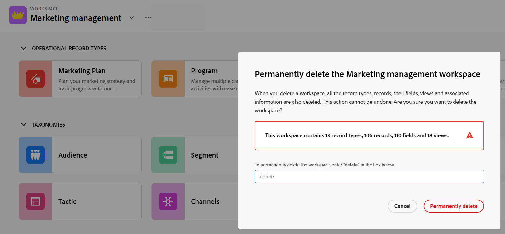

# Eliminar espacios de trabajo

<!--
The highlighted information on this page refers to functionality not yet generally available. It is available only in the Preview environment for all customers. After the release to Preview, the same features are also available monthly in the Production environment for customers who enabled fast releases.    

For information about fast releases, see [Enable or disable fast releases for your organization](/help/quicksilver/administration-and-setup/set-up-workfront/configure-system-defaults/enable-fast-release-process.md). 
-->

{{planning-important-intro}}

En Adobe Workfront Planning, los espacios de trabajo son ubicaciones centralizadas para que los equipos planifiquen el trabajo. Para obtener más información, consulte [Crear espacios de trabajo](/help/quicksilver/planning/architecture/create-workspaces.md).

Puede eliminar los espacios de trabajo que ya no sean relevantes.

Se recomienda volver a crear algunos o todos los tipos de registros, registros, campos y vistas asociados con el espacio de trabajo que desee eliminar en otro espacio de trabajo antes de eliminarlo.

## Requisitos de acceso

+++ Expanda para ver los requisitos de acceso para la funcionalidad en este artículo. 

<table style="table-layout:auto"> 
<col> 
</col> 
<col> 
</col> 
<tbody> 
    <tr> 
<tr> 
</tr>   
<tr> 
   <td role="rowheader">
Paquete de Adobe Workfront
</td> 
   <td> 

Cualquier Workfront o flujo de trabajo con un paquete de Planning
 
O

Cualquier planificación de Workfront cuando se compra como producto independiente
 
 </tr> 
  <tr> 
   <td role="rowheader">
Licencia de Adobe Workfront
</td> 
   <td>
Cualquiera
 
  </td> 
  </tr> 
  <tr> 
   <td role="rowheader">
Licencia de planificación de Adobe
</td> 
   <td>
Cualquiera
 
  </td> 
  </tr> 
  <tr> 
   <td role="rowheader">
Configuración de nivel de acceso
</td> 
   <td> 
Debe agregar un tipo de licencia de flujo de trabajo y de Planning al nivel de acceso cuando tenga un flujo de trabajo y un paquete de Planning a la vez
   
</td> 
  </tr>

<tr> 
   <td role="rowheader">
Permisos de objeto
</td> 
   <td>   
Administración de permisos en un espacio de trabajo
  
   
Los administradores del sistema tienen permisos para todos los espacios de trabajo, incluidos los que no crearon
  </td> 
  </tr>  
</tbody> 
</table>

Para obtener más información acerca de los requisitos de acceso de Workfront, consulte [Requisitos de acceso en la documentación de Workfront](/help/quicksilver/administration-and-setup/add-users/access-levels-and-object-permissions/access-level-requirements-in-documentation.md).

+++   

<!--
Old:

<table style="table-layout:auto"> 
<col> 
</col> 
<col> 
</col> 
<tbody> 
    <tr> 
<tr> 
<td> 
   
 Products
 </td> 
   <td> 
   <ul><li>
 Adobe Workfront
</li> 
   <li>
 Adobe Workfront Planning
</li></ul></td> 
  </tr>   
<tr> 
   <td role="rowheader">
Adobe Workfront plan*
</td> 
   <td> 

Any of the following Workfront plans:
 
<ul><li>Select</li> 
<li>Prime</li> 
<li>Ultimate</li></ul> 

Workfront Planning is not available for legacy Workfront plans
 
   </td> 
<tr> 
   <td role="rowheader">
Adobe Workfront Planning package*
</td> 
   <td> 

Any 
 

For more information about what is included in each Workfront Planning plan, contact your Workfront account manager. 
 
   </td> 
 <tr> 
   <td role="rowheader">
Adobe Workfront platform
</td> 
   <td> 

Your organization's instance of Workfront must be onboarded to the Adobe Unified Experience to be able to access Workfront Planning.
 

For more information, see <a href="/help/quicksilver/workfront-basics/navigate-workfront/workfront-navigation/adobe-unified-experience.md">Adobe Unified Experience for Workfront</a>. 
 
   </td> 
   </tr> 
  </tr> 
  <tr> 
   <td role="rowheader">
Adobe Workfront license*
</td> 
   <td>
 Standard 

   
Workfront Planning is not available for legacy Workfront licenses
 
  </td> 
  </tr> 
  <tr> 
   <td role="rowheader">
Access level configuration
</td> 
   <td> 
You must add both a Workflow and a Planning license type to the access level when you have both a Workflow and a Planning package
   
</td> 
  </tr> 
<tr> 
   <td role="rowheader">
Object permissions
</td> 
   <td>   
Manage permissions to a workspace
  
   
System Administrators have permissions to all workspaces, including the ones they did not create
 </td> 
  </tr> 
</tbody> 
</table>
-->

## Consideraciones sobre la eliminación de espacios de trabajo

* Al eliminar espacios de trabajo, también se eliminan todos los tipos de registros, registros, sus campos y vistas.
* Los espacios de trabajo eliminados y la información que contienen no se pueden recuperar.

## Eliminación de un espacio de trabajo

{{step1-to-planning}}

1. (Condicional) Si es administrador de Workfront, haga clic en una de las siguientes opciones:

   * **Espacios de trabajo en los que participo** para acceder a los espacios de trabajo que ha creado
   * **Todos los espacios de trabajo** para tener acceso a los espacios de trabajo compartidos con usted o creados

   >[!NOTE]
   >
   >No puede eliminar los espacios de trabajo en la ficha **Espacios de trabajo de ejemplo**. Se recomienda utilizar el paquete de plantillas de varios espacios de trabajo para crear espacios de trabajo similares a los de la pestaña Espacio de trabajo de muestra. Para obtener más información, consulte [Creación de espacios de trabajo](/help/quicksilver/planning/architecture/create-workspaces.md).

1. (Opcional) Haga clic en **Mostrar todo** para mostrar espacios de trabajo adicionales. El vínculo **Mostrar todo** solo se muestra cuando tiene más de dos filas de tarjetas de área de trabajo.
1. (Opcional) Haga clic en **Mostrar menos** para limitar el número de espacios de trabajo que se muestran en la pantalla.
1. Para eliminar un espacio de trabajo, realice una de las siguientes acciones:

   * Pase el ratón sobre la tarjeta del área de trabajo y luego haga clic en el menú **Más**  en la esquina superior derecha de la tarjeta
     O
   * Haga clic en el icono **search**  en la esquina superior derecha de la página de Workspaces para buscar un área de trabajo por nombre y haga clic en una tarjeta de área de trabajo para abrir el área de trabajo; a continuación, haga clic en el menú **Más**  situado a la derecha del nombre del área de trabajo.

   >[!TIP]
   >
   >Puede utilizar la siguiente combinación de teclas para abrir el cuadro de búsqueda global desde cualquier página de Workfront Planning y buscar espacios de trabajo:
   >
   >* CTRL+K para Windows
   >* ⌘+K para Mac

1. Haga clic **eliminar**.

   

1. Escriba “**Eliminar**” en el espacio proporcionado y haga clic en **Eliminar permanentemente**. Esto no distingue entre mayúsculas y minúsculas.

   El espacio de trabajo se elimina y no se puede recuperar. También se elimina cualquier tipo de registro, registro, campo y vista asociada con ellos. <!--ensure this is right at or before GA-->

