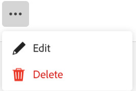

<!--update the metadata with real information when making this available in TOC and in the left nav
---
title: Edit record types
description: You can edit record types after they have been saved. Record types are the object types of Adobe Workfront Planning.
author: Alina
role: User
feature: Work Management 
topic: Architecture
hidefromtoc: yes
hide: yes
---

-->

# Editar tipos de registros

{{planning-important-intro}}

Los tipos de registro son los tipos de objetos de Adobe Workfront Planning. Puede editar el aspecto de los tipos de registro que usted o cualquier otra persona hayan creado. Para obtener información acerca de cómo crear tipos de registros de Workfront Planning, vea [Crear tipos de registros](/help/quicksilver/planning/architecture/create-record-types.md).

## Requisitos de acceso

+++ Amplíe para ver los requisitos de acceso para Workfront Planning.

<!--update the table to say that: Only system administrators can enable record types to connect from other workspaces.-->

<table style="table-layout:auto">
 <col>
 </col>
 <col>
 </col>
 <tbody>
    <tr>
<tr>
<td>
   
 Product
 </td>
   <td>
   
 Adobe Workfront
 
Para conectar los tipos de registros de Adobe Workfront Planning con Experience Manager Assets, debe tener una licencia de Adobe Experience Manager Assets y la instancia de Workfront de su organización debe estar integrada en Adobe Business Platform o Adobe Admin Console.
 </td>
  </tr>  
 <td role="rowheader">
acuerdo con Adobe Workfront
</td>
   <td>

Su organización debe estar inscrita en la fase de acceso anticipado para Workfront Planning 

   </td>
  </tr>
  <tr>
   <td role="rowheader">
plan de Adobe Workfront
</td>
   <td>

Cualquiera

   </td>
  </tr>
  <tr>
   <td role="rowheader">
Licencia de Adobe Workfront*
</td>
   <td>
   
Nuevo: estándar

   
Actual: plan
 
  </td>
  </tr>

<tr>
   <td role="rowheader">
Configuraciones de nivel de acceso
</td>
   <td> 
No hay controles de nivel de acceso para Workfront Planning
  
</td>
  </tr>

<tr>
   <td role="rowheader">
Permisos
</td>
   <td> 
Administrar permisos en un espacio de trabajo</a> 
  
   
Los administradores del sistema tienen permisos para todos los espacios de trabajo, incluidos los que no crearon
</td>
  </tr>
<tr>
   <td role="rowheader">
Plantilla de diseño
</td>
   <td> 
El administrador del grupo o de Workfront debe agregar el área de Planning a la plantilla de diseño. Para obtener más información, consulte <a href="/help/quicksilver/planning/access/access-overview.md">Resumen de acceso</a>. 
  
</td>
  </tr>

</tbody>
</table>

*Para obtener más información, consulte [Requisitos de acceso en la documentación de Workfront](/help/quicksilver/administration-and-setup/add-users/access-levels-and-object-permissions/access-level-requirements-in-documentation.md).

+++

<!--Maybe enable this at GA - but Planning is not supposed to have Access controls in the Workfront Access Level: 
>[!NOTE]
>
>If you don't have access, ask your Workfront administrator if they set additional restrictions in your access level. For information on how a Workfront administrator can change your access level, see [Create or modify custom access levels](/help/quicksilver/administration-and-setup/add-users/configure-and-grant-access/create-modify-access-levels.md). -->

## Editar tipos de registros

{{step1-to-planning}}

1. Haga clic en el espacio de trabajo cuyos tipos de registros desee editar.

   Se abre la página del espacio de trabajo y se muestran los tipos de registro.
1. Realice una de las siguientes acciones:

   * Pase el ratón sobre la tarjeta de un tipo de registro y haga clic en el menú **Más**  en la esquina superior derecha de la tarjeta del tipo de registro; a continuación, haga clic en **Editar**
O
   * Haga clic en una tarjeta de tipo de registro para abrir la página de tipo de registro, haga clic en el menú **Más**  a la derecha del nombre del tipo de registro y, a continuación, haga clic en **Editar**.

   

   <!--replace everything below with the commented out text below-->

1. En el cuadro **Editar tipo de registro**, actualice la siguiente información:

   * Edite el nombre del tipo de registro si es necesario. <!--did they add a field label for this? -->
   * **Descripción**: edite o agregue una descripción para el tipo de registro con más información al respecto.
   * Edite el color y la forma del icono asociado al tipo de registro. Haga lo siguiente:
      * Seleccione un color para identificar el tipo de registro. Es el color del icono de tipo de registro. Gris está seleccionado de forma predeterminada.
      * Seleccione un icono de la lista o empiece a escribir el nombre de un icono para describir lo que representa y, a continuación, selecciónelo cuando se muestre. Este es el icono del tipo de registro. De forma predeterminada, se selecciona un icono de archivo.

     

1. Haga clic en **Guardar**.
1. (Opcional) Haga clic en la tarjeta de tipo de registro del área de trabajo para abrir la página del tipo de registro.
1. Haga clic en el menú **Más** a la derecha del nombre del tipo de registro y, a continuación, haga clic en **Editar** para actualizar la información sobre el tipo de registro.

   >[!TIP]
   >
   >   Puede cambiar el nombre del tipo de registro en el encabezado.

   

   <!--check this screen shot - not sure this is valid ???-->

1. (Opcional) Para editar otro tipo de registro, expanda la flecha hacia abajo a la derecha del nombre de un tipo de registro, busque un tipo de registro y selecciónelo cuando se muestre en la lista.

<!--*******************For GA - replace the above with this:

1. In the **Edit record type** box, click the **Appearance** tab and update the following information: (*******copy the screen shot above here and update it with the Appearance tab**********)

    * Edit the record type name, if needed. (*****did they add a field label for this?******)
    * **Description**: Edit or add a description for the record type with more information about it. 
    * Edit the color and shape of the icon associated with the record type. Do the following: 
        * Select a color to identify the record type. This is the color of the record type icon. Gray is selected by default.
        * Select an icon from the list, or start typing the name of an icon to describe what it represents, then select it when it displays. This is the icon of the record type. A file icon is selected by default.

        

1. (Conditional) If you are a system administrator, click the **Advanced settings** tab in the **Edit record type** box and update the following information: 

   * **Connect from other workspaces**: Select this toggle to allow users to connect to this record type from other workspaces. This is deselected by default.
   * **System wide**: Select this option to allow users to connect to this record from all workspaces in the system.
   * **Specific workspaces**: Select this option to restrict the workspaces from which users can connect to this record type, then expand the drop down menu and select the workspaces you want users to connect to this record type from. You can start typing the name of a workspace, and select it when it displays in the list. 

   

   The record type card displays a connectivity icon  in the upper-right corner to indicate that the record is now accessible from other workspaces. 

1. Click **Save**.
1. (Optional) Click the record type card from the workspace area to open the record type's page, then rename the record type in the header.  

1. (Optional) To edit another record type, from the record type page, expand the downward-pointing arrow to the right of a record type name, search for a record type, then select it when it displays in the list.

   

   -->