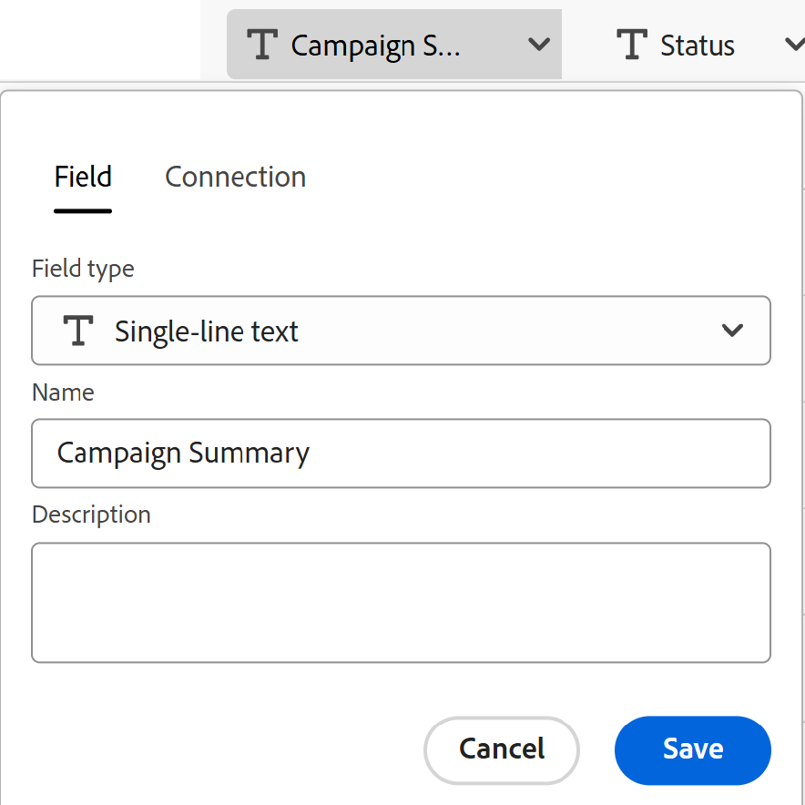

# Crear tipos de registros importando información desde un archivo CSV o de Excel

<!--The information on this page refers to functionality not yet generally available. It is available only in the Preview environment for all customers. After the monthly releases to Production, the same features are also available in the Production environment for customers who enabled fast releases.    

For information about fast releases, see [Enable or disable fast releases for your organization](/help/quicksilver/administration-and-setup/set-up-workfront/configure-system-defaults/enable-fast-release-process.md). -->

{{planning-important-intro}}

Los tipos de registro son los tipos de objetos de Adobe Workfront Planning. En Workfront Planning, puede crear tipos de registros personalizados que ilustren los elementos de trabajo necesarios en el ciclo vital de su organización mediante la importación de información desde un archivo CSV o de Excel.

## Requisitos de acceso

+++ Expanda para ver los requisitos de acceso para la funcionalidad en este artículo. 

<table style="table-layout:auto"> 
<col> 
</col> 
<col> 
</col> 
<tbody> 
    <tr> 
<tr> 
</tr>   
<tr> 
   <td role="rowheader">
paquete de Adobe Workfront
</td> 
   <td> 

Cualquier Workfront y cualquier paquete de Planning

O

Cualquier flujo de trabajo y cualquier paquete de Planning

Para obtener más información sobre lo que se incluye en cada paquete de Workfront Planning, póngase en contacto con su representante de cuentas de Workfront. 
 
   </td> 
  <tr> 
   <td role="rowheader">
Licencia de Adobe Workfront
</td> 
   <td>
Estándar

   </td> 
  </tr> 
  <tr> 
   <td role="rowheader">
Permisos de objeto
</td> 
   <td>   
Administración de permisos en un espacio de trabajo
  
   
Los administradores del sistema tienen permisos para todos los espacios de trabajo, incluidos los que no crearon
  </td> 
  </tr>  
</tbody> 
</table>

Para obtener más información acerca de los requisitos de acceso de Workfront, consulte [Requisitos de acceso en la documentación de Workfront](/help/quicksilver/administration-and-setup/add-users/access-levels-and-object-permissions/access-level-requirements-in-documentation.md).

+++   

<!--Old:
<table style="table-layout:auto"> 
<col> 
</col> 
<col> 
</col> 
<tbody> 
    <tr> 
<tr> 
<td> 
   
 Products
 </td> 
   <td> 
   <ul><li>
 Adobe Workfront
</li> 
   <li>
 Adobe Workfront Planning
</li></ul></td> 
  </tr>   
<tr> 
   <td role="rowheader">
Adobe Workfront plan*
</td> 
   <td> 

Any of the following Workfront plans:
 
<ul><li>Select</li> 
<li>Prime</li> 
<li>Ultimate</li></ul> 

Workfront Planning is not available for legacy Workfront plans
 
   </td> 
<tr> 
   <td role="rowheader">
Adobe Workfront Planning package*
</td> 
   <td> 

Any 
 

For more information about what is included in each Workfront Planning plan, contact your Workfront account manager. 
 
   </td> 
 <tr> 
   <td role="rowheader">
Adobe Workfront platform
</td> 
   <td> 

Your organization's instance of Workfront must be onboarded to the Adobe Unified Experience to be able to access Workfront Planning.
 

For more information, see <a href="/help/quicksilver/workfront-basics/navigate-workfront/workfront-navigation/adobe-unified-experience.md">Adobe Unified Experience for Workfront</a>. 
 
   </td> 
   </tr> 
  </tr> 
  <tr> 
   <td role="rowheader">
Adobe Workfront license*
</td> 
   <td>
 Standard

   
Workfront Planning is not available for legacy Workfront licenses
 
  </td> 
  </tr> 
  <tr> 
   <td role="rowheader">
Access level configuration
</td> 
   <td> 
There are no access level controls for Adobe Workfront Planning
   
</td> 
  </tr> 
<tr> 
   <td role="rowheader">
Object permissions
</td> 
   <td>   
Manage permissions to a workspace
  
   
System Administrators have permissions to all workspaces, including the ones they did not create
  </td> 
  </tr> 
 
</tbody> 
</table>-->

## Consideraciones acerca de la importación de tipos de registros mediante un archivo CSV o de Excel

* Cada hoja del archivo de Excel se convierte en un tipo de registro. El nombre de la hoja se convierte en el nombre del tipo de registro.
* Si sólo hay una hoja o si importa un archivo CSV, el nombre del archivo se convierte en el nombre del tipo de registro.
* Los encabezados de las columnas de cada hoja se convierten en los campos asociados a cada tipo de registro.
* Los campos son únicos para sus respectivos tipos de registros.
* Cada fila de cada hoja se convierte en un registro único asociado a su tipo de registro respectivo.
* Cada hoja del archivo de Excel no debe superar lo siguiente:
   * 25 000 filas
   * 500 columnas
* El archivo no debe superar los 5 MB.
* No se admiten hojas vacías.
* No se admiten los campos de los siguientes tipos y no se pueden asignar a campos de la hoja de importación:

   * Campos de conexión a Workfront, tipos de objetos de AEM Assets o GenStudio Brands.
   * Campos de búsqueda de registros de Planning conectados, Workfront, objetos de AEM Assets o marcas de GenStudio.
   * Campos de fórmula
   * Fecha de creación, Creado por
   * Fecha de la última modificación, Última modificación por
   * Fecha de aprobación, Aprobado por
   * Personas

Para importar tipos de registros mediante un archivo CSV o de Excel:

{{step1-to-planning}}

1. Haga clic en el espacio de trabajo donde desee crear los tipos de registro,

   O

   Desde un espacio de trabajo, expanda la flecha hacia abajo situada a la derecha del nombre de un espacio de trabajo existente, busque un espacio de trabajo y, a continuación, selecciónelo cuando se muestre en la lista.
1. Haga clic en **Agregar tipo de registro**.
1. Haga clic en **Cargar desde el archivo**.
1. Arrastre y suelte un archivo de Excel o CSV guardado anteriormente en el equipo, o haga clic en **Seleccione un archivo CSV o de Excel** para buscar uno y, a continuación, selecciónelo.
1. Haz clic en **Vista previa y edita**.

   Se muestra el cuadro **Previsualizar y editar** con la siguiente información:

   * Los nombres de las hojas o de los futuros tipos de registros se muestran en el panel izquierdo. De forma predeterminada, Workfront Planning selecciona un icono y un color para cada nuevo tipo de registro.
   * Se selecciona el primer tipo de hoja o registro y los nombres de los campos asociados a él se muestran como encabezados de columna. El tipo de cada campo está seleccionado de forma predeterminada.
   * Cada fila representa un nuevo registro. Solo se muestran los 10 primeros registros en el cuadro Vista previa y edición.

   

1. (Opcional) Haga clic en el nombre de cada hoja en el panel izquierdo para revisar la información que contiene.

   >[!NOTE]
   >
   >Las hojas vacías no son compatibles y aparecen atenuadas.

1. (Opcional) Anule la selección de las hojas que no quiera importar del panel izquierdo.

   

   Las hojas que no haya seleccionado se muestran con un fondo gris.

1. (Opcional) Haga clic en la flecha hacia abajo situada a la derecha del encabezado de una columna para realizar una de las siguientes acciones, en la ficha **Campo**:

   

   * Cambie el nombre de uno de los campos
   * Cambiar **tipo de campo**
   * Actualizar el campo **Descripción**

1. (Opcional) Haga clic en la ficha **Conexión** para asignar la información de la columna a un campo conectado desde otros tipos de registros.

   

   >[!TIP]
   >
   >Solo puede asignar a campos desde registros conectados de Workfront Planning. No se puede asignar a campos desde conexiones de Workfront, AEM Assets o GenStudio Brands. Para obtener más información, vea la sección [Consideraciones acerca de la importación de tipos de registros mediante un archivo CSV o de Excel](#considerations-about-importing-record-types-using-an-excel-or-csv-file) en este artículo.

1. (Condicional) Después de actualizar la información del campo, haga clic en **Guardar**.

1. Haga clic en **Importar** cuando esté listo para importar el archivo.

   La siguiente información se importa en Workfront Planning:

   * Nuevos tipos de registros
   * Nuevos campos asociados a cada tipo de registro
   * Nuevos registros asociados a cada tipo de registro

   Puede empezar a administrar campos y registros en las páginas de tipos de registros.

   Todas las personas con acceso a Workfront Planning y al espacio de trabajo ahora pueden ver y editar los tipos de registro importados y su información.
