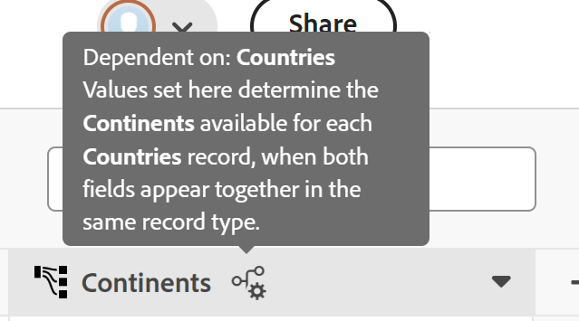
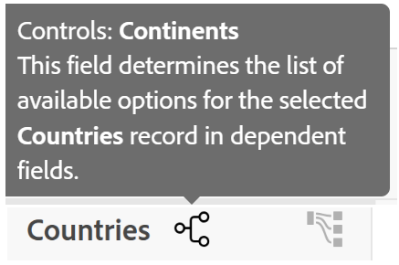

# Administrar conexiones dependientes

La información de esta página hace referencia a una funcionalidad que aún no está disponible de forma general. Solo está disponible en el entorno de vista previa para todos los clientes. Después del lanzamiento en Vista previa, las mismas funciones también están disponibles mensualmente en el entorno de producción para los clientes que habilitaron lanzamientos rápidos. 

Para obtener información sobre las versiones rápidas, consulte [Habilitar o deshabilitar las versiones rápidas para su organización](/help/quicksilver/administration-and-setup/set-up-workfront/configure-system-defaults/enable-fast-release-process.md). 

Como administrador del espacio de trabajo, puede definir conexiones dependientes al crear campos de conexión entre tipos de registros en Adobe Workfront Planning.

Al agregar campos conectados, puede activar una configuración que indique que los valores del tipo de registro conectado dependen de los valores del tipo de registro de origen (el tipo donde está agregando la conexión), siempre que ambos campos aparezcan juntos en un tercer tipo de registro.

Por ejemplo, es posible que desee asegurarse de que un campo Región solo muestre los valores vinculados a la Información geográfica seleccionada. Esto se configura directamente en la configuración del campo de conexión: al agregar una conexión desde un tipo de registro geográfico a un tipo de registro dependiente (como Región), una nueva configuración permite a los administradores de espacio de trabajo marcarlo como dependiente del tipo de registro geográfico, utilizando las relaciones ya establecidas entre esos tipos de registro.

Una vez configurado, cualquier tipo de registro que haga referencia a ambos campos (como una campaña) verá el efecto inmediatamente: al seleccionar un valor geográfico, el selector de regiones se reduce a solo las regiones realmente vinculadas a esa región geográfica. Esto aplica la estructura de registros automáticamente, eliminando las combinaciones que no coinciden y reduciendo la limpieza manual.

## Requisitos de acceso

+++ Expanda para ver los requisitos de acceso para la funcionalidad en este artículo.

<table style="table-layout:auto"> 
<col> 
</col> 
<col> 
</col> 
<tbody> 
    <tr> 
<tr> 
</tr> 
<tr> 
   <td role="rowheader">
Paquete de Adobe Workfront
</td> 
   <td> 

Para conectar tipos de registros desde el mismo espacio de trabajo: 

<ul> 
<li>
Cualquier paquete de flujo de trabajo o Workfront con cualquier paquete de Planning
</li>

O

<li>
Cualquier paquete de Planning cuando se adquiere como producto independiente
</li>
</ul>

Para conectar tipos de registros de diferentes espacios de trabajo:

<ul>

<li>
Cualquier flujo de trabajo y un paquete de Planning Prime o Ultimate
</li>

O

<li>
Cualquier paquete de Planning Prime o Ultimate que se adquiera como producto independiente
</li>
</ul>

Para obtener más información sobre lo que se incluye en cada paquete de Workfront Planning, póngase en contacto con su representante de cuentas de Workfront. 
 
   </td> 
<tr> 
<td> 
   
 Productos adicionales
 </td> 
   <td> 
   
 Además de Adobe Workfront, debe tener lo siguiente si desea conectar tipos de registros con objetos de las siguientes aplicaciones:

   <ul><li>
Licencia de Adobe Experience Manager Assets e integración entre AEM Assets y Workfront para conectar recursos de AEM con tipos de registros de Planning.

   
Para obtener más información, consulte <a href="/help/quicksilver/documents/adobe-workfront-for-experience-manager-assets-essentials/workfront-for-aem-asset-essentials.md">Adobe Workfront para Experience Manager Assets y Assets Essentials: índice de artículo</a>. 
</li>
   <li>
 Licencia de Adobe GenStudio for Performance Marketing para conectar tipos de registros con objetos y marcas de GenStudio

   
Para obtener más información, consulte <a href="https://experienceleague.adobe.com/en/docs/genstudio-for-performance-marketing/user-guide/get-started">Introducción a Adobe GenStudio for Performance Marketing</a>.
</li></ul>
   </td> 
  </tr> 
  <tr> 
   <td role="rowheader">
Licencia de Adobe Workfront
</td> 
   <td>
Estándar

   </td> 
  </tr> 
  <tr> 
   <td role="rowheader">
Permisos de objeto
</td> 
   <td>   
Administración de permisos en un espacio de trabajo
  
   
Los administradores del sistema tienen permisos para todos los espacios de trabajo, incluidos los que no crearon
  </td> 
  </tr>  
</tbody> 
</table>

Para obtener más información acerca de los requisitos de acceso de Workfront, consulte [Requisitos de acceso en la documentación de Workfront](/help/quicksilver/administration-and-setup/add-users/access-levels-and-object-permissions/access-level-requirements-in-documentation.md).

+++

<!--
Sent a slack message to Norayr, Predator, Snowstorm, Armine for info for this section: 
-->

## Consideraciones para campos conectados dependientes

* Los campos conectados dependientes sólo se pueden configurar entre tipos de registro que tengan una relación de campo de conexión establecida. No se puede definir la lógica de dependencia entre tipos de registros no relacionados.

* Puede tener un campo conectado dependiente entre tipos de registro en espacios de trabajo independientes.

* No puede tener un campo conectado dependiente entre los tipos de registro de Planning y los tipos de objeto de Workfront o AEM.

* La configuración de dependencia se configura de una conexión a la vez, dentro de la propia configuración del campo de conexión, en lugar de como una regla global.

* El comportamiento de filtrado entre los dos registros conectados solo se activa cuando los campos de origen y dependientes están presentes juntos en un tercer tipo de registro. La dependencia no tiene ningún efecto si sólo uno de los dos campos se muestra en un tipo de registro.

* El selector del campo dependiente está limitado a valores ya vinculados al valor de origen seleccionado en el nivel de registro; no puede mostrar ni sugerir valores no vinculados.

* Si el valor del campo de origen cambia, el campo dependiente se borra automáticamente en lugar de dejarse en un estado no válido, lo que evita que persistan las combinaciones no coincidentes.

  Recibirá un mensaje en línea o de mensaje que explica por qué se borró el campo dependiente.

## Crear una conexión dependiente

1. Como administrador de espacio de trabajo, vaya a un tipo de registro en Workfront Planning y ábralo en la vista de tabla.
1. Haga clic en el icono **+** en la esquina superior derecha de la vista de tabla para agregar un nuevo campo.
1. Haga clic en **Nueva conexión** y, a continuación, empiece a agregar una nueva conexión para un segundo tipo de registro.

   >[!TIP]
   >
   >Sólo puede crear una conexión dependiente entre dos tipos de registros de Planning. No se pueden crear conexiones dependientes entre tipos de registro y objetos desde Workfront o AEM.
1. En la sección **Configuración de conexión**, active **Hacer dependiente esta conexión**.

   >[!TIP]
   >
   >Activar la configuración **Hacer que esta conexión sea dependiente** activa automáticamente **Crear un campo correspondiente en el tipo de registro vinculado**. Hay un límite de 500 campos por tipo de registro.

   

1. Continúe configurando la conexión, tal como se describe en el artículo [Conectar tipos de registros](/help/quicksilver/planning/architecture/connect-record-types.md).
1. Haga clic en **Guardar**.

   Ocurren lo siguiente:

   * Se crea la conexión entre los dos tipos de registro y sus valores dependerán unos de otros cuando se muestren juntos en el mismo tipo de registro.
   * Se crea un campo correspondiente que muestra el primer tipo de registro para el segundo tipo de registro.
   * Cuando ambos tipos de registro están conectados a un tercer tipo de registro, los valores mostrados como opciones para el segundo campo de registro conectado son los que están conectados al primer registro. Los valores mostrados como opciones para el primer tipo de registro son los conectados al segundo tipo de registro.

     Para obtener más información, vea la sección [Ejemplo de tipos de registros conectados dependientes](#example-of-dependent-connected-record-types) en este artículo.
   * Hay una indicación en el encabezado de columna de los campos de registro conectados que explica que el campo está en una relación de conexión dependiente.

     

1. (Opcional y recomendada) Vaya a un tercer tipo de registro y agregue el primer y el segundo tipo de registro como campos de registro conectados.

   

## Ejemplo de tipos de registros conectados dependientes

Esta sección proporciona un ejemplo sencillo de cómo se pueden configurar tipos de registros dependientes y cómo funcionan para un tercer tipo de registro.

1. En un espacio de trabajo que pueda administrar, cree los siguientes tipos de registros:

   * Campaign
   * Países
   * Continentes

1. En el tipo de registro **Países**, agregue los siguientes registros:

   * Francia
   * Estados Unidos
   * Japón
1. En el tipo de registro **Continents**, agregue los siguientes registros:

   * Europa
   * América
   * Asia

1. Del tipo de registro **Países**, cree un campo dependiente conectado para **Continentes**.

   Esto agrega los siguientes campos de registro conectados:

   * El campo de registro **Países** conectado para el tipo de registro **Continentes**.
   * El campo de registro **Continentes** se conectó para el tipo de registro **Países**.

1. Realice una de las siguientes acciones:

   * En la vista de tabla de tipo de registro **Países**, agregue los siguientes valores para el campo de registro Continentes conectados:

     * Europa para Francia
     * América para Estados Unidos
     * Asia para Japón
   * En la vista de tabla de tipo de registro **Continents**, agregue los siguientes valores para el campo de registro conectado **Países**:

     * Francia para Europa
     * Estados Unidos para América
     * Japón para Asia
1. Agregue los campos conectados **Países** y **Continentes** a la vista de tabla de tipo de registro **Campaign**.
1. Seleccione **Japón** para el campo **Países** en el tipo de registro **Campaña**. Observe que el único valor disponible para el campo conectado de **Continentes** en la campaña es **Asia**.

   O

   Seleccione **Europe** para el campo **Continents** en el tipo de registro de campaña.

   Observe que el único valor disponible para el campo conectado de **Países** en la campaña es **Francia**.

