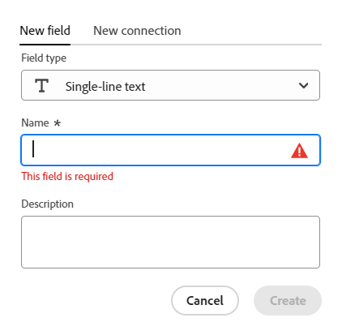

<!--Should the structure of this article be like this other one: https://experienceleague.adobe.com/docs/workfront/using/administration-and-setup/customize/custom-forms/custom-form-builder/use-the-custom-form-builder/add-a-custom-field-to-a-custom-form.html?lang=en ??-->

<!--will they add a way to create fields elsewhere than in a table?! - how will that change the structure of this article? -->

<!--Do we need this for FORMULAS: when we release permissions to RECORDS and we release referring lookup fields in a formula field, update considerations to say that lookup fields from linked records depends on the permissions to the record; if they have no permissions to view a linked record, they won't be able to use that records's lookup fields in a formula - not sure is needed??-->

# Crear campos

<!--The highlighted information on this page refers to functionality not yet generally available. It is available only in the Preview environment for all customers. After the monthly releases to Production, the same features are also available in the Production environment for customers who enabled fast releases.    

For information about fast releases, see [Enable or disable fast releases for your organization](/help/quicksilver/administration-and-setup/set-up-workfront/configure-system-defaults/enable-fast-release-process.md).    -->

{{planning-important-intro}}

En Adobe Workfront Planning, puede crear campos personalizados para los tipos de registro. A continuación, puede asociar los campos con los registros de Workfront Planning para mejorar la información de los registros.

Debe crear tipos de registro antes de poder crear campos que se asocien a ellos. Para obtener más información, consulte [Crear tipos de registro](/help/quicksilver/planning/architecture/create-record-types.md).

Puede crear campos de las siguientes maneras en Workfront Planning:

* Desde cero
* Conectando tipos de registro
* Creando un tipo de registro
* Creando un espacio de trabajo a partir de una plantilla
* Mediante la importación de tipos de registro mediante un archivo CSV o de Excel
* Mediante la importación de copias de campos de Workfront existentes

Para obtener más información acerca de los campos de Workfront Planning, consulte [Información general sobre los campos](/help/quicksilver/planning/fields/fields-overview.md).

## Requisitos de acceso

+++ Amplíe para ver los requisitos de acceso para Workfront Planning.

Debe tener el siguiente acceso para realizar los pasos de este artículo:

<table style="table-layout:auto"> 
<col> 
</col> 
<col> 
</col> 
<tbody> 
    <tr> 
<tr> 
<td> 
   
 Productos
 </td> 
   <td> 
   <ul><li>
 Adobe Workfront
</li> 
   <li>
 Planificación de Adobe Workfront
</li></ul></td> 
  </tr>   
<tr> 
   <td role="rowheader">
Plan de Adobe Workfront*
</td> 
   <td> 

Cualquiera de los siguientes planes de Workfront:
 
<ul><li>Seleccionar</li> 
<li>Prime</li> 
<li>Ultimate</li></ul> 

Workfront Planning no está disponible para planes Workfront heredados
 
   </td> 
<tr> 
   <td role="rowheader">
Paquete de planificación de Adobe Workfront*
</td> 
   <td> 

Cualquiera 
 

Para obtener más información sobre qué se incluye en cada plan de Workfront Planning, póngase en contacto con su administrador de cuentas de Workfront. 
 
   </td> 
 <tr> 
   <td role="rowheader">
plataforma de Adobe Workfront
</td> 
   <td> 

La instancia de Workfront de su organización debe incorporarse a Adobe Unified Experience para poder acceder a todas las funcionalidades de Workfront Planning.
 

Para obtener más información, consulte <a href="/help/quicksilver/workfront-basics/navigate-workfront/workfront-navigation/adobe-unified-experience.md">Adobe Unified Experience para Workfront</a>. 
 
   </td> 
   </tr> 
  </tr> 
  <tr> 
   <td role="rowheader">
Licencia de Adobe Workfront*
</td> 
   <td>
 Estándar 

   
Workfront Planning no está disponible para licencias de Workfront heredadas
 
  </td> 
  </tr> 
  <tr> 
   <td role="rowheader">
Configuración de nivel de acceso
</td> 
   <td> 
No hay controles de nivel de acceso para Adobe Workfront Planning
   
</td> 
  </tr> 
<tr> 
   <td role="rowheader">
Permisos de objeto
</td> 
   <td>   
Administrar permisos en un espacio de trabajo</a> 
  
   
Los administradores del sistema tienen permisos para todos los espacios de trabajo, incluidos los que no crearon.
 </td> 
  </tr> 
<tr> 
   <td role="rowheader">
Plantilla de diseño
</td> 
   <td> 
A todos los usuarios, incluidos los administradores de Workfront, se les debe asignar una plantilla de diseño que incluya el área de Planning en el menú principal. 
 </td> 
  </tr> 
</tbody> 
</table>

*Para obtener más información sobre los requisitos de acceso de Workfront, consulte [Requisitos de acceso en la documentación de Workfront](/help/quicksilver/administration-and-setup/add-users/access-levels-and-object-permissions/access-level-requirements-in-documentation.md).

+++

<!--
OLD:

<table style="table-layout:auto">
 <col>
 </col>
 <col>
 </col>
 <tbody>
    <tr>
<tr>
<td>
   
 Product
 </td>
   <td>
   
 Adobe Workfront
 </td>
  </tr>  
 <td role="rowheader">
Adobe Workfront agreement
</td>
   <td>

Your organization must be enrolled in the early access stage for Workfront Planning 

   </td>
  </tr>
  <tr>
   <td role="rowheader">
Adobe Workfront plan
</td>
   <td>

Any

   </td>
  </tr>
  <tr>
   <td role="rowheader">
Adobe Workfront license*
</td>
   <td>
   
New: Standard
 
   
Current: Plan

  </td>
  </tr>
  
  <tr>
   <td role="rowheader">
Access level configurations
</td>
   <td> 
There are no access level control for Workfront Planning
  
</td>
  </tr>

  <tr>
   <td role="rowheader">
Permissions
</td>
   <td> 
Manage permissions to a workspace</a> 
  
   
System Administrators have permissions to all workspaces, including the ones they did not create.

</td>
  </tr>
<tr>
   <td role="rowheader">
Layout template
</td>
   <td> 
Your Workfront or group administrator must add the Planning area in your layout template. For information, see <a href="/help/quicksilver/planning/access/access-overview.md">Access overview</a>. 
  
</td>
  </tr>

 </tbody>
</table>

*For information, see [Access requirements in Workfront documentation](/help/quicksilver/administration-and-setup/add-users/access-levels-and-object-permissions/access-level-requirements-in-documentation.md). 

-->

## Crear campos desde cero {#create-fields-from-scratch}

<!--in a table (not sure if this can be done elsewhere?!-->

<!--the first 3 steps are the same as in Import fields from Workfron-->

{{step1-to-planning}}

1. Haga clic en el espacio de trabajo para cuyos registros desee crear campos.

   Se abre el espacio de trabajo y se muestran los tipos de registro.

1. Haga clic en la tarjeta de un tipo de registro.

   Todos los registros existentes asociados al tipo de registro se muestran en las filas de la vista de tabla.

   >[!TIP]
   >
   >    Si no se muestra ningún registro, es posible que aún no tenga ningún registro, o que tenga aplicado un filtro que limite lo que ve en la pantalla.

   Todos los campos existentes asociados al tipo de registro se muestran en las columnas de la vista de tabla.

   >[!TIP]
   >
   >    Algunos campos pueden estar ocultos. Haga clic en Campos y active el conmutador de los campos que desee ver como columnas en la vista de tabla.

1. Haga clic en el icono **+** en la esquina superior derecha de la vista de tabla

   O

   Pase el puntero por encima del encabezado de cualquier columna, haga clic en la flecha hacia abajo después del nombre del campo y, a continuación, haga clic en **Insertar a la izquierda** o **Insertar a la derecha** para añadir el nuevo campo.
1. En la pestaña **Nuevo campo**, busque un tipo de campo en el cuadro **Tipo de campo** o seleccione uno de los siguientes tipos de campo:

   En la ficha **Nuevo campo**, busque un tipo de campo en el cuadro **Tipo de campo** con cualquier palabra clave relacionada, o seleccione uno de los tipos de campo que se enumeran a continuación.

   >[!TIP]
   >
   >    Puede escribir &quot;Presupuesto&quot; y los tipos de campo de Número y Moneda se muestran en una lista corta.

   * [Texto de línea única](#single-line-text)
   * [Párrafo](#paragraph)
   * [Selección múltiple](#multi-select)
   * [Selección única](#single-select)
   * [Fecha](#date)
   * [Número](#number)
   * [Porcentaje](#percentage)
   * [Divisa](#currency)
   * [Casilla de verificación](#checkbox)
   * [Fórmula](#formula)
   * [Personas](#people)
   * [Creado por](#created-by)
   * [Fecha de creación](#created-date)
   * [Última modificación realizada por](#last-modified-by)
   * [Fecha de la última modificación](#last-modified-date)

   >[!IMPORTANT]
   >
   >    No se puede cambiar el tipo de campo después de guardarlo.

   <!--Add this to the IMPORTANT above and make it a NOTE - should do directly to Prod:
    * You can use any keyword that might be related to any of the field type names. For example, a search for "Budget" will display the Number or Currency field type.-->

1. Siga añadiendo cada campo, tal como se describe en las secciones siguientes.

### Texto de línea única {#single-line-text}

Los campos de texto de una sola línea capturan información alfanumérica limitada. Por ejemplo, puede capturar la información del propietario, del responsable de departamento, del equipo o la unidad organizativa en un campo de texto de una sola línea. El contenido de un campo de texto de una sola línea puede tener hasta 1.000 caracteres. <!-- used to be 250 but just tested with 1000 and it allowed this as a maximum. -->

1. Comience a crear un campo como se describe en la sección [Crear campos desde cero](#create-fields-from-scratch) de este artículo y, a continuación, seleccione el tipo de campo **Texto de una sola línea**.

   

1. Añada la siguiente información en la pestaña **Nuevo campo**:
   * **Nombre**: el nombre del tipo de campo, tal como aparecerá en una tabla o en la página Detalles del registro. <!--ensure they updated this; and update the screen shot: it used to be "Label"-->
   * **Descripción**: información adicional sobre el campo. La descripción de un campo se muestra cuando pasa el ratón sobre el encabezado de columna del campo en una tabla o cuando hace clic en el icono de información situado junto al nombre del campo en la página de detalles del registro.
1. Haga clic en **Crear**.

   El nuevo campo de una sola línea se añade como una columna al tipo de registro y sus valores se pueden asociar con registros.

### Párrafo {#paragraph}

Los campos de párrafo capturan información alfanumérica adicional sobre un registro, similar al campo Descripción.

>[!TIP]
>
>* Puede tener un máximo de 20 campos de párrafo para un tipo de registro.
>
>* El contenido de un campo de párrafo puede tener hasta 10.000 caracteres.
>* Puede utilizar el formato de texto enriquecido para mejorar el contenido de los campos de párrafo cuando se muestran en la vista de tabla o en la página Detalles de un registro. Para obtener más información, consulte [Editar registros](/help/quicksilver/planning/records/edit-records.md).
>

1. Comience a crear un campo como se describe en la sección [Crear campos desde cero](#create-fields-from-scratch) de este artículo y, a continuación, seleccione el tipo de campo **Párrafo**.

   

1. Añada la siguiente información en la ficha **Nuevo campo**:
   * **Nombre**: el nombre del tipo de campo, tal como aparecerá en una tabla o en la página Detalles del registro. <!--ensure they updated this; and update the screen shot: it used to be "Label"-->
   * **Descripción**: información adicional sobre el campo. La descripción de un campo se muestra al pasar el ratón por encima de la columna del campo en una tabla o al hacer clic en el icono de información situado junto al nombre del campo en la página de detalles del registro.
1. Haga clic en **Crear**.

   El nuevo campo de párrafo se añade como una columna al tipo de registro y sus valores se pueden asociar con registros.

### Selección múltiple {#multi-select}

Puede utilizar un campo de selección múltiple para capturar información adicional en cualquier formato, seleccionando más de una opción en un menú desplegable.

1. Comience a crear un campo como se describe en la sección [Crear campos desde cero](#create-fields-from-scratch) de este artículo y, a continuación, seleccione el tipo de campo **Selección múltiple**.

   

1. Añada la siguiente información en la pestaña **Nuevo campo**:
   * **Nombre**: el nombre del tipo de campo, tal como aparecerá en una tabla o en la página Detalles del registro. <!--ensure they updated this; and update the screen shot: it used to be "Label"-->
   * **Descripción**: información adicional sobre el campo. La descripción de un campo se muestra al pasar el ratón por encima de la columna del campo en una tabla o al hacer clic en el icono de información situado junto al nombre del campo en la página de detalles del registro.
   * **Opciones**: las opciones que los usuarios pueden seleccionar al actualizar este campo. Puede utilizar números y letras para el nombre de cada opción.
1. Haga clic en **Agregar opción** para agregar más opciones. No hay límite en la cantidad de opciones que se pueden añadir a un campo de selección múltiple.
1. (Opcional) Arrastre y suelte manualmente cada opción en el orden deseado o seleccione la
   Seleccione la opción **Ordenar opciones A-Z** si desea que las opciones se enumeren automáticamente en orden alfabético. <!--Add this if they added this functionality: You cannot edit this option after you save the field.-->
1. (Opcional) Para quitar una opción, haga clic en el icono **x** a su derecha.
1. Haga clic en la muestra de color que hay a la izquierda de la opción para expandir el selector de color y personalizar el color de cada opción.

1. Haga clic en **Muestras** para seleccionar un color predefinido

   O

   Haga clic en **Personalizado** para seleccionar un color personalizado mediante un selector de color o un código hexadecimal.
1. Haga clic fuera del cuadro de color para cerrarlo.
1. Haga clic en **Crear**.

   El nuevo campo de selección múltiple se añadirá en forma de columna al tipo de registro y sus valores se podrán asociar a registros.

### Selección única {#single-select}

Los campos de selección única capturan información adicional en cualquier formato mediante la selección de una opción en un menú desplegable.

1. Comience a crear un campo como se describe en la sección [Crear campos desde cero](#create-fields-from-scratch) de este artículo y, a continuación, seleccione el tipo de campo **Selección única**.

   

1. Añada la siguiente información en la pestaña **Nuevo campo**:
   * **Nombre**: el nombre del tipo de campo, tal como aparecerá en una tabla o en la página Detalles del registro. <!--ensure they updated this; and update the screen shot: it used to be "Label"-->
   * **Descripción**: información adicional sobre el campo. La descripción de un campo se muestra al pasar el ratón por encima de la columna del campo en una tabla o al hacer clic en el icono de información situado junto al nombre del campo en la página de detalles del registro.
   * **Opciones**: opciones disponibles para seleccionar en el menú desplegable después de guardar el campo. El nombre de cada opción puede tener tanto números como letras.

1. Haga clic en **Agregar opción** para agregar más opciones. No hay límite en la cantidad de opciones que se pueden añadir a un campo de selección única.
1. (Opcional) Arrastre y suelte manualmente cada opción en el orden deseado o seleccione la opción **Ordenar opciones A-Z** si desea que las opciones se enumeren automáticamente en orden alfabético. <!--Add this if they added this functionality: You cannot edit this option after you save the field.-->
1. (Opcional) Para quitar una opción, haga clic en el icono **x** a su derecha.
1. Haga clic en la muestra de color que hay a la izquierda de la opción para expandir el selector de color y personalizar el color de cada opción.
1. Haga clic en **Muestras** para seleccionar un color predefinido

   O

   Haga clic en **Personalizado** para seleccionar un color personalizado mediante un selector de color o un código hexadecimal.

1. Haga clic fuera del cuadro de color para cerrarlo.
1. Haga clic en **Crear**.

   El nuevo campo de selección única se añadirá en forma de columna al tipo de registro y sus valores se podrán asociar a registros.

### Fecha {#date}

Puede utilizar un campo de fecha para capturar información adicional en formato de fecha y hora.

1. Comience a crear un campo como se describe en la sección [Crear campos desde cero](#create-fields-from-scratch) de este artículo y, a continuación, seleccione el tipo de campo **Fecha**.

   

1. Añada la siguiente información en la pestaña **Nuevo campo**:
   * **Nombre**: el nombre del tipo de campo, tal como aparecerá en una tabla o en la página de registro. <!--ensure they updated this; and update the screen shot: it used to be "Label"-->
   * **Descripción**: información adicional sobre el campo. La descripción de un campo se muestra al pasar el ratón por encima de la columna del campo en una tabla o al hacer clic en el icono de información situado junto al nombre del campo en la página de detalles del registro.
   * **Formato de fecha**: el tipo de formato de fecha que desea mostrar en este campo. <!--update this casing - submitted bug for it-->

     Seleccione entre los siguientes formatos:
      * **Configuración regional**: coincide con la configuración regional del explorador.
      * **Estándar**: 16/5/2023
      * **Largo**: 16 de mayo de 2023
      * **Europeo**: 16/5/2023
      * **ISO**: 16-5-2023
      * **Incluir hora**: seleccione esta opción si desea incluir una marca de tiempo. De forma predeterminada, esta opción no está seleccionada. No se puede incluir un tiempo después de proteger el campo.

     Seleccione entre las siguientes opciones:

      * **24 h**: por ejemplo: 18:00
      * **12 h**: por ejemplo: 6:00 P. M.

1. Haga clic en **Crear**.

   El nuevo campo de fecha se añadirá en forma de columna al tipo de registro y sus valores se podrán asociar a registros.

### Número {#number}

Los tipos de campo numéricos capturan información en formato numérico.

1. Comience a crear un campo como se describe en la sección [Crear campos desde cero](#create-fields-from-scratch) de este artículo y, a continuación, seleccione el tipo de campo **Número**.

   
1. Añada la siguiente información en la pestaña **Nuevo campo**:

   * **Nombre**: el nombre del tipo de campo, tal como aparecerá en una tabla o en la página de registro.
   * **Descripción**: información adicional sobre el campo. La descripción de un campo se muestra al pasar el ratón por encima de la columna del campo en una tabla o al hacer clic en el icono de información situado junto al nombre del campo en la página de detalles del registro.
   * **Precisión**: el número de decimales que desee registrar para el campo. Se pueden mostrar hasta 6 decimales.
   * **Permitir números negativos**: seleccione esta opción si desea permitir números negativos en este campo. Esta opción está desactivada de forma predeterminada.

   >[!NOTE]
   >
   >    Si selecciona Permitir números negativos y los valores negativos se almacenan en los registros a los que está adjunto el campo, ya no podrá anular la selección de la configuración en el futuro.

1. Haga clic en **Crear**.

   El nuevo campo de número se añade como una columna al tipo de registro y sus valores se pueden asociar con registros.

### Porcentaje {#percentage}

Los tipos de campo de porcentaje capturan información en un formato numérico seguido de un signo de porcentaje.

1. Comience a crear un campo como se describe en la sección [Crear campos desde cero](#create-fields-from-scratch) de este artículo y, a continuación, seleccione el tipo de campo **Porcentaje**.

   

1. Añada la siguiente información en la pestaña **Nuevo campo**:
   * **Nombre**: el nombre del tipo de campo, tal como aparecerá en una tabla o en la página de registro.
   * **Descripción**: información adicional sobre el campo. La descripción de un campo se muestra al pasar el ratón por encima de la columna del campo en una tabla o al hacer clic en el icono de información situado junto al nombre del campo en la página de detalles del registro.
   * **Precisión**: el número de decimales que desee registrar para el campo. Se pueden mostrar hasta 6 decimales.
   * **Permitir números negativos**: seleccione esta opción si desea permitir valores de porcentaje negativos en este campo. Esta opción está desactivada de forma predeterminada.

     >[!NOTE]
     >
     >Si selecciona Permitir números negativos y los valores negativos se almacenan en los registros a los que está adjunto el campo, ya no podrá anular la selección de la configuración en el futuro.

   * **Mostrar como**: en el menú desplegable, elija cómo desea que se muestren los valores de porcentaje en la vista de tabla. Seleccione entre las siguientes opciones:
      * **Número**: el valor porcentual se muestra como un número seguido del signo de porcentaje.
      * **Barra**: El valor porcentual se muestra como una barra junto al número de porcentaje. El color de relleno de la barra indica el valor porcentual. Esta es la selección predeterminada.
      * **Círculo**: el valor porcentual se muestra como el contorno de un círculo junto al número porcentual. El color de relleno del contorno del círculo indica el valor porcentual.

   >[!NOTE]
   >
   >* La selección que realice en el campo Mostrar como solo se aplica al valor porcentual visible en la vista de tabla. El valor porcentual del campo se muestra como un número seguido del signo de porcentaje en cualquier otra parte de Workfront Planning. Esto también se aplica al campo de tipo porcentual cuando se muestra como un campo de búsqueda en las vistas de tabla de otros registros.
   >* Puede cambiar la selección Mostrar como cuando edite el campo más adelante.

1. Haga clic en **Crear**.

   El nuevo campo de porcentaje se añade como una columna al tipo de registro y sus valores se pueden asociar con registros.

### Divisa {#currency}

Los tipos de campo Divisa capturan información en un formato de número precedido por un símbolo de moneda.

1. Comience a crear un campo como se describe en la sección [Crear campos desde cero](#create-fields-from-scratch) de este artículo y, a continuación, seleccione el tipo de campo **Divisa**.

   

1. Añada la siguiente información en la pestaña **Nuevo campo**:
   * **Nombre**: el nombre del tipo de campo, tal como aparecerá en una tabla o en la página de registro. <!--ensure they updated this; and update the screen shot: it used to be "Label"-->
   * **Descripción**: información adicional sobre el campo. La descripción de un campo se muestra al pasar el ratón por encima de la columna del campo en una tabla o al hacer clic en el icono de información situado junto al nombre del campo en la página de detalles del registro.
   * **Divisa**: el tipo de divisa que desea mostrar en este campo. Esta es una lista de divisas según la Organización Internacional de Normalización (ISO).
   * **Precisión**: el número de decimales que desea registrar para el campo. Se pueden mostrar hasta seis decimales.
   * **Permitir números negativos**: seleccione esta opción si desea permitir valores de divisa negativos en este campo. Esta opción está desactivada de forma predeterminada.

   >[!NOTE]
   >
   >    Si selecciona Permitir números negativos y los valores negativos se almacenan en los registros a los que está adjunto el campo, ya no podrá anular la selección de la configuración en el futuro.

1. Haga clic en **Crear**.

   El nuevo campo de divisa se añade como una columna al tipo de registro y sus valores se pueden asociar con registros.

### Casilla de verificación

Puede utilizar el tipo de campo Casilla de verificación para añadir una sola opción de casilla de verificación a un registro. Puede utilizar este campo para indicar un atributo o estado específico para ese registro en particular. Por ejemplo, puede utilizarlo como indicador para realizar un seguimiento de la finalización, la aprobación o cualquier otro atributo binario de cada registro.

1. Comience a crear un campo como se describe en la sección [Crear campos desde cero](#create-fields-from-scratch) de este artículo y, a continuación, seleccione el tipo de campo **Casilla de verificación**.

   

1. Añada la siguiente información en la pestaña **Nuevo campo**:
   * **Nombre**: el nombre del tipo de campo, tal como aparecerá en una tabla o en la página de registro. <!--ensure they updated this; and update the screen shot: it used to be "Label"-->
   * **Descripción**: información adicional sobre el campo. La descripción de un campo se muestra al pasar el ratón por encima de la columna del campo en una tabla o al hacer clic en el icono de información situado junto al nombre del campo en la página de detalles del registro.
1. Haga clic en **Crear**.

   El nuevo campo de casilla de verificación se añade como una columna al tipo de registro y sus valores se pueden asociar con registros.

### Fórmula

Los campos de fórmula generan un nuevo valor utilizando los valores existentes de otros campos en un tipo de registro y una función que indica cómo se deben calcular los valores existentes.

Para obtener más información, consulte [Información general sobre campos de fórmula](/help/quicksilver/planning/fields/formula-fields.md).

1. Comience a crear un campo como se describe en la sección [Crear campos desde cero](#create-fields-from-scratch) de este artículo y, a continuación, seleccione el tipo de campo **Fórmula**.

   

1. Añada la siguiente información en la pestaña **Nuevo campo**:

   * **Nombre**: escriba un nombre para el nuevo campo.
   * **Descripción**: agregue información sobre el nuevo campo. La descripción de un campo se muestra al pasar el ratón por encima de la columna del campo en una tabla o al hacer clic en el icono de información situado junto al nombre del campo en la página de detalles del registro.
   * **Fórmula**: empiece a escribir al menos un carácter para tener acceso a una expresión y selecciónela cuando se muestre en la lista.

1. Haga clic en la expresión seleccionada para mostrar la definición y ver su formato.

   

   Para obtener más información acerca de las expresiones admitidas, consulte [Información general sobre campos de fórmula](/help/quicksilver/planning/fields/formula-fields.md).

   >[!TIP]
   >
   >Recibirá un mensaje de advertencia al editar o crear un campo de fórmula que pueda causar una referencia circular a sí mismo o a campos compartidos. No se puede guardar un campo de fórmula que haga referencia a sí mismo o a elementos a los que se hace referencia en su cálculo.

1. Añada los nombres de campo tal y como se muestran en Workfront Planning para hacer referencia a ellos en una fórmula.

   >[!NOTE]
   >
   >* No se pueden añadir campos de tipo Selección múltiple en una fórmula.
   >
   >* Puede hacer referencia a un campo que esté hasta 4 campos (y objetos) fuera del tipo de registro actual. Por ejemplo, si está creando un campo de fórmula para un tipo de registro Actividad (1) y la actividad está conectada al tipo de registro Campaña (2) que está conectado a un proyecto Workfront (3), puede hacer referencia al campo Presupuesto del proyecto (4) en la fórmula que está creando para el tipo de registro Actividad.
   >
   >
   >

1. En el campo **Formato**, seleccione entre las siguientes opciones para identificar el formato del resultado mostrado en el campo de tipo de fórmula:

   * **Texto**: el resultado del campo de fórmula se muestra como texto sin formato.
   * **Número**: el resultado del campo de fórmula se muestra como un número.
   * **Porcentaje**: el resultado del campo de fórmula se muestra como un número seguido de un símbolo de porcentaje.
   * **Moneda**: el resultado del campo de fórmula se muestra como un número precedido o seguido por un símbolo de moneda.
   * **Etiquetas**: el resultado del campo de fórmula se muestra como una etiqueta con el nombre del objeto.

     >[!TIP]
     >
     >Recomendamos las etiquetas para los campos que muestran matrices. En este caso, cada miembro de la matriz se muestra como una etiqueta independiente.

     

   * **Fecha**: el resultado del campo de fórmula se muestra como una fecha.

     Se muestra una vista previa del aspecto que tendrá el resultado en el campo **Formato**.

     >[!WARNING]
     >
     >Si el resultado de la fórmula no coincide con el formato seleccionado, el campo mostrará un mensaje de error donde se muestra.

1. Haga clic en **Crear**.

   El nuevo campo de fórmula se añade como una columna al tipo de registro y sus valores se pueden asociar con registros.

### Personas

Puede usar el tipo de campo Personas para añadir un usuario de <!--, job role, or team--> a un registro. Este es un campo de escritura anticipada y solamente puede añadir usuarios de <!--, roles, or teams--> que ya existen en su instancia de Workfront.

>[!TIP]
>
>Cuando se agrega el nombre de un usuario en un campo Personas, en el campo se muestra el nombre del usuario y su función de trabajo principal.

1. Comience a crear un campo como se describe en la sección [Crear campos desde cero](#create-fields-from-scratch) de este artículo y, a continuación, seleccione el tipo de campo **Personas**.

   

1. Añada la siguiente información en la ficha **Nuevo campo**:
   * **Nombre**: el nombre del tipo de campo, tal como aparecerá en una tabla o en la página de registro.
   * **Descripción**: información adicional sobre el campo. La descripción de un campo se muestra al pasar el ratón por encima de la columna del campo en una tabla o al hacer clic en el icono de información situado junto al nombre del campo en la página de detalles del registro.
   * **Permitir varios valores**: seleccione esta opción si desea permitir que los usuarios añadan más de un usuario en este campo. Esta opción está desactivada de forma predeterminada.

   >[!NOTE]
   >
   >    Si selecciona Permitir varios valores y se almacenan varios usuarios en los registros a los que se adjunta el campo, ya no podrá anular la selección de la configuración en el futuro al editar este campo.

1. Haga clic en **Crear**.

   El nuevo campo de tipo Personas se añade como una columna al tipo de registro y sus valores se pueden asociar con registros.

### Creado por

Puede utilizar el tipo de campo Creado por para añadir el usuario que creó el registro a un registro. Este campo es de solo lectura y se rellena automáticamente con el nombre del usuario que había iniciado sesión cuando se creó el registro.

1. Comience a crear un campo como se describe en la sección [Crear campos desde cero](#create-fields-from-scratch) de este artículo y, a continuación, seleccione el tipo de campo **Creado por**.

   

1. Añada la siguiente información en la pestaña **Nuevo campo**:

   * **Nombre**: el nombre del tipo de campo, tal como aparecerá en una tabla o en la página de registro. <!--this might change and they might prepopulate it with "Created by"-->
   * **Descripción**: información adicional sobre el campo. La descripción de un campo se muestra al pasar el ratón por encima de la columna del campo en una tabla o al hacer clic en el icono de información situado junto al nombre del campo en la página de detalles del registro.

1. Haga clic en **Crear**.

   El nuevo campo Creado por tipo se añade como una columna al tipo de registro y sus valores se rellenan previamente con el nombre del usuario que creó cada registro.

### Fecha de creación

Puede utilizar el tipo de campo Fecha de creación para añadir la fecha en la que se creó el registro a un registro. Este es un campo de solo lectura y se rellena automáticamente con la fecha (y opcionalmente con la hora) en que se creó el registro.

1. Comience a crear un campo como se describe en la sección [Crear campos desde cero](#create-fields-from-scratch) de este artículo y, a continuación, seleccione el tipo de campo **Fecha de creación**.

   

   <!--check the image above - added bug fix for UI text changes-->

1. Añada la siguiente información en la pestaña **Nuevo campo**:

   * **Nombre**: el nombre del tipo de campo, tal como aparecerá en una tabla o en la página de registro. <!--this might change and they might prepopulate it with "Created date"-->
   * **Descripción**: información adicional sobre el campo. La descripción de un campo se muestra al pasar el ratón por encima de la columna del campo en una tabla o al hacer clic en el icono de información situado junto al nombre del campo en la página de detalles del registro.
   * **Formato de fecha**: seleccione entre los siguientes formatos:

      * **Configuración regional**: coincide con la configuración regional del explorador.
      * **Estándar**: 16/5/2023
      * **Largo**: 16 de mayo de 2023
      * **Europeo**: 16/5/2023
      * **ISO**: 16-5-2023
   * **Incluir un campo de hora**: seleccione esta opción si desea incluir una marca de hora. Esta opción no está seleccionada de forma predeterminada. <!--submitted a UI text change for this - check the UI-->

     Seleccione entre las siguientes opciones:

      * **24 h**: por ejemplo: 18:00
      * **12 h**: por ejemplo: 6:00 P. M.

1. Haga clic en **Crear**.

   El nuevo tipo de campo Fecha de creación se añade como una columna al tipo de registro y sus valores se rellenan previamente con la fecha (o fecha y hora) a la que se creó el registro.

### Última modificación realizada por

Puede utilizar el tipo de campo Última modificación realizada por para añadir a un registro el usuario que lo modificó por última vez. Este es un campo de solo lectura y se rellena automáticamente con el nombre del usuario que ha iniciado sesión cuando se actualizó el registro por última vez.

1. Empiece a crear un campo tal como se describe en la sección [Crear campos desde cero](#create-fields-from-scratch) de este artículo y, a continuación, seleccione el tipo de campo **Última modificación realizada por**.

   

1. Añada la siguiente información en la pestaña **Nuevo campo**:

   * **Nombre**: el nombre del tipo de campo, tal como aparecerá en una tabla o en la página de registro. <!--this might change and they might prepopulate it with "Created by"-->
   * **Descripción**: información adicional sobre el campo. La descripción de un campo se muestra al pasar el ratón por encima de la columna del campo en una tabla o al hacer clic en el icono de información situado junto al nombre del campo en la página de detalles del registro.

1. Haga clic en **Crear**.

   El nuevo tipo de campo Última modificación realizada por se añade como una columna al tipo de registro y sus valores se rellenan previamente con el nombre del usuario que modificó cada registro por última vez.

### Fecha de la última modificación

Puede utilizar el tipo de campo Fecha de la última modificación para añadir la fecha en la que se modificó por última vez un registro a un registro. Este es un campo de solo lectura y se rellena automáticamente con la fecha (y opcionalmente con la hora) en la que se modificó el registro por última vez.

1. Empiece a crear un campo tal como se describe en la sección [Crear campos desde cero](#create-fields-from-scratch) de este artículo y, a continuación, seleccione el tipo de campo **Fecha de creación**.

   

   <!--check the image above - added bug fix for UI text changes-->

1. Añada la siguiente información en la pestaña **Nuevo campo**:

   * **Nombre**: el nombre del tipo de campo, tal como aparecerá en una tabla o en la página de registro. <!--this might change and they might prepopulate it with "Created date"-->
   * **Descripción**: información adicional sobre el campo. La descripción de un campo se muestra al pasar el ratón por encima de la columna del campo en una tabla o al hacer clic en el icono de información situado junto al nombre del campo en la página de detalles del registro.
   * **Formato de fecha**: seleccione entre los siguientes formatos:

      * **Configuración regional**: coincide con la configuración regional del explorador.
      * **Estándar**: 16/5/2023
      * **Largo**: 16 de mayo de 2023
      * **Europeo**: 16/5/2023
      * **ISO**: 16-5-2023

   * **Incluir un campo de hora**: seleccione esta opción si desea incluir una marca de hora. Esta opción no está seleccionada de forma predeterminada. <!--submitted a UI text change for this - check the UI-->

     Seleccione entre las siguientes opciones:

      * **24 h**: por ejemplo: 18:00
      * **12 h**: por ejemplo: 6:00 P. M.

1. Haga clic en **Crear**.

   El nuevo tipo de campo Fecha de la última modificación se añade como una columna al tipo de registro y sus valores se rellenan previamente con la fecha (o fecha y hora) a la que se creó el registro.

## Creación de campos conectando tipos de registro

Puede crear campos de registro vinculados al añadir una nueva conexión entre dos tipos de registro o un tipo de registro y un tipo de objeto de otras aplicaciones.

Para obtener información acerca de cómo conectar tipos de registros de Workfront Planning, vea [Conectar tipos de registros](/help/quicksilver/planning/architecture/connect-record-types.md).

<!--## Create fields by importing record types using an Excel or CSV file

For more information, see [Create record types](/help/quicksilver/planning/architecture/create-record-types.md).-->

## Creación de campos creando un tipo de registro

Al crear un tipo de registro, también se crean de forma predeterminada varios campos asociados al nuevo tipo de registro. Para obtener más información, consulte [Crear tipos de registro](/help/quicksilver/planning/architecture/create-record-types.md).

## Creación de campos creando un espacio de trabajo a partir de una plantilla

Adobe Workfront Planning crea campos para los tipos de registro al crear un espacio de trabajo a partir de una plantilla.

Para obtener más información, consulte [Crear espacios de trabajo](/help/quicksilver/planning/architecture/create-workspaces.md).

## Crear campos al importar tipos de registros desde un archivo CSV o de Excel

Puede importar campos al importar tipos de registros mediante un archivo CSV o de Excel.

Para obtener más información, consulte [Crear tipos de registros](/help/quicksilver/planning/architecture/create-record-types.md).

## Cree campos importándolos desde Workfront

Puede importar copias de campos de Workfront existentes.

Al importar campos desde Workfront, se crea una copia de cada campo para un tipo de registro de Workfront Planning.

Después de copiar los campos, estos son independientes entre sí y no intercambian información.

Para obtener más información, consulte [Importar campos de Workfront](/help/quicksilver/planning/fields/import-fields-from-workfront.md).

