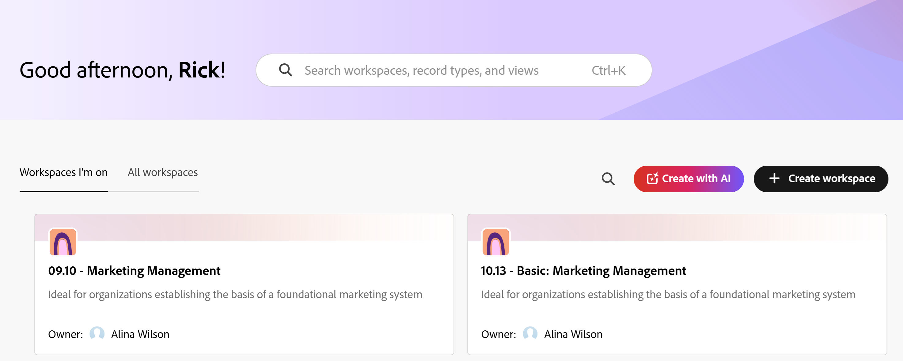
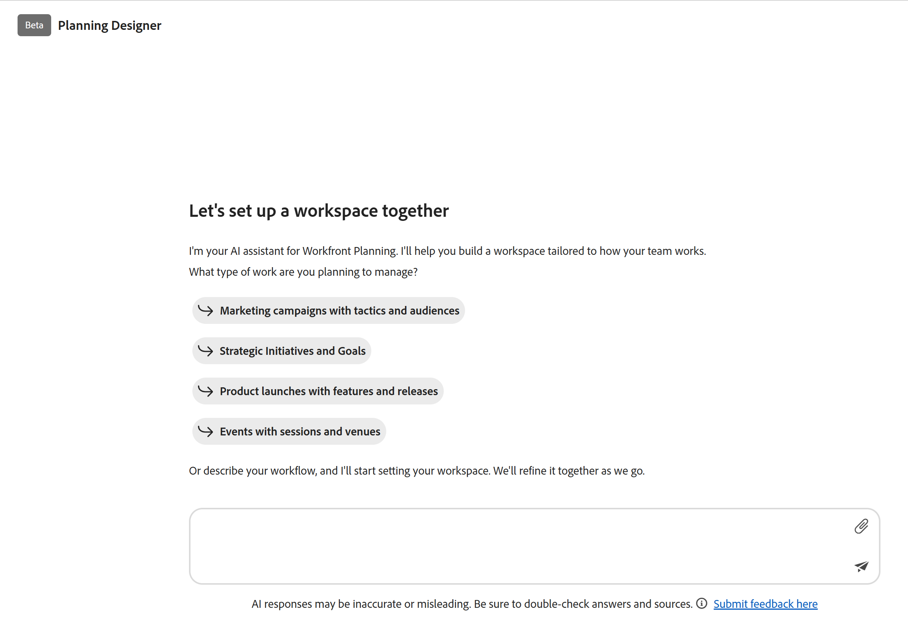

# Introducción a Adobe Workfront Planning Designer

<!--remove the Beta tags in the screen shots on this page when this is released to GA - maybe March 2, 2026-->

>[!IMPORTANT]
>
>Planning Designer está disponible actualmente para todos los clientes con un estado de Beta.
>
>La información de este artículo hace referencia a Adobe Workfront Planning, una funcionalidad adicional de Adobe Workfront.
>
>Para obtener una lista de los requisitos para acceder a Workfront Planning, consulte [Información general sobre el acceso a Adobe Workfront Planning](/help/quicksilver/planning/access/access-overview.md).
> 
>Para obtener información general sobre Workfront Planning, consulte [Introducción a Adobe Workfront Planning](/help/quicksilver/planning/general/planning-overview.md).

Puede utilizar Adobe Planning Designer con tecnología de IA para configurar sus espacios de trabajo y estructuras de datos con facilidad. Planning Designer admite desde la creación y configuración de espacios de trabajo hasta la definición de campos y fórmulas, la administración de registros, la revisión del historial de cambios y la creación de vistas personalizadas.

Ya sea que se utilice directamente o a través del Asistente de IA, Planning Designer proporciona un entorno flexible y potente para crear y mantener información estructurada y conectada.

Para obtener información sobre Workfront Planning, consulte los siguientes artículos:

* [Índice general de información y artículos para Adobe Workfront Planning](/help/quicksilver/planning/planning-information.md)
* [Introducción a Adobe Workfront Planning](/help/quicksilver/planning/general/planning-overview.md)
* [Información general de acceso a Adobe Workfront Planning](/help/quicksilver/planning/access/access-overview.md)

## Requisitos de acceso <!--edit theses??-->

+++ Expanda para ver los requisitos de acceso para la funcionalidad en este artículo. 

<table style="table-layout:auto"> 
<col> 
</col> 
<col> 
</col> 
<tbody> 
<tr> 
   <td role="rowheader">
Paquetes de Adobe Workfront
</td> 
   <td> 

Cualquier paquete de Workfront y Planning

Cualquier paquete de flujo de trabajo y planificación

   </td> </tr>

</tr> 
  <tr> 
   <td role="rowheader">
Licencia de Adobe Workfront
</td> 
   <td>
Estándar
 
   
Administrador del sistema para activar Planning Designer para su organización

  </td> 
  </tr> 
  <tr> 
   <td role="rowheader">
Permisos de objeto
</td> 
   <td>   
Permisos de administración en un espacio de trabajo</a> 
  
   
Los administradores del sistema tienen permisos para todos los espacios de trabajo, incluidos los que no crearon
  
   </td> 
  </tr>  
</tbody> 
</table>

Para obtener más información acerca de los requisitos de acceso de Workfront, consulte [Requisitos de acceso en la documentación de Workfront](/help/quicksilver/administration-and-setup/add-users/access-levels-and-object-permissions/access-level-requirements-in-documentation.md).

+++

## Habilite Planning Designer para su organización

Como administrador del sistema, puede activar Planning Beta para su organización. Después de activar esta configuración, todos los usuarios de la instancia de Workfront podrán ver las capacidades de Planning Designer en el área de Planning.

1. Inicie sesión como administrador de Workfront en Workfront.
1. Haga clic en el **icono del menú principal**  y, a continuación, haga clic en **Configurar**.
1. Vaya a **Sistema** > **Preferencias** > **Preferencias de IA**.
1. Active **Habilitar IA** y asegúrese de que ha firmado un Contrato de IA general con Adobe.
1. Active la configuración de **Planning Designer**.

   

1. Haga clic en **Guardar**.

   Las funcionalidades de Planning Designer para crear o editar espacios de trabajo ya están disponibles para todos los usuarios de su organización que pueden acceder a Planning.

<!--

## Turn off the Planing Designer for your organization

After your Workfront administrator accepts the AI Assistant agreement, the Planning Designer is turned on for everyone in your organization, by default. 

To turn it off: 

1. Log in to Workfront as a System Administrator. 
1. Click **Main Menu**  in the upper-left corner of the screen, then click **Setup**.
1. Click **System** >  in the left panel, then go to the **AI preferences** area.
1. Turn off the **Planning Onboarding** setting.
1. Click **Save**.

    This removes the Planning Designer for all users in the system.

-->

<!--

## Enroll in the Closed Beta program for the Planning Designer

Currently, you can request to participate in the Closed Beta program for the Planning Designer by sending us an email to sargism@adobe.com.

After we receive the email, our Engineering team will turn on the Planning Designer in your Workfront instance. 

>[!IMPORTANT]
>
>Your company must first accept the AI Assistant agreement before the Planning Designer is available in your system. 

-->

## Enviar comentarios sobre Planning Designer

Puede enviar comentarios sobre Planning Designer durante el programa beta.

1. Inicie sesión en Workfront, luego haga clic en el icono **Menú principal**  en la esquina superior izquierda y, a continuación, haga clic en **Planificación**.

   Se abre el área **Planificación**.

1. Haga clic en **Crear con IA**. <!--update this tag name when they change it-->

   Se abre la ventana **Planning Designer**.

1. Haga clic **Enviar comentarios aquí** en la parte inferior de la página.
1. Agregue sus comentarios en el espacio proporcionado y haga clic en **Enviar**.
Los comentarios se envían a los equipos de ingeniería y producto.

## Consideraciones sobre Planning Designer

* Para utilizar Planning Designer, primero debe habilitar la IA para su organización. Debe implementarse lo siguiente para que las funciones de IA estén disponibles para todos los miembros de su organización:

   * Workfront debe hacer que las funciones de IA estén disponibles para su organización.

     Para obtener más información, consulte [Requisitos previos para el asistente de IA](/help/quicksilver/workfront-basics/ai-assistant/ai-assistant-overview.md#prerequisites-to-ai-assistant).
   * Una vez que Workfront pone las funciones de IA a disposición de su organización, el administrador principal de Workfront puede acceder a ellas.

     Para obtener más información, consulte [Configurar información básica para el sistema](/help/quicksilver/administration-and-setup/get-started-wf-administration/configure-basic-info.md).
   * El administrador de Workfront debe aceptar el acuerdo de IA general y, a continuación, activar la IA y Planning Designer para su organización.

     Para obtener más información, consulte [Habilitar o deshabilitar el asistente de IA](/help/quicksilver/workfront-basics/ai-assistant/enable-or-disable-assistant.md).
* Después de que el administrador del sistema active la IA y Planning Designer para su organización, Planning Designer está disponible para todos los usuarios de forma predeterminada.
* Las acciones que realiza Planning Designer también las puede realizar el Asistente de IA cuando se utiliza en el área de Planning.
* Las acciones que realiza el Asistente de IA en el área de Planning o las que realiza Planning Designer se encuentran en el contexto de los permisos de Workfront Planning y del nivel de acceso de Workfront.

  Para obtener más información, consulte los siguientes artículos:

   * [Información general sobre los permisos de uso compartido en Adobe Workfront Planning](/help/quicksilver/planning/access/sharing-permissions-overview.md)
   * [Información general sobre el tipo de licencia al usar Adobe Workfront Planning](/help/quicksilver/planning/access/license-type-overview.md)

* Los cambios realizados por el asistente de IA o por Planning Designer en nombre del usuario se rastrean en el panel del historial del registro.

* Las acciones realizadas por el Designer de Planificación son permanentes y podrían ser irreversibles. Por ejemplo, no se puede deshacer la eliminación de un campo. Revise todas las acciones propuestas por Designer antes de aceptarlas.

  >[!IMPORTANT]
  >
  >Al crear, actualizar o eliminar un objeto a través de Planning Designer, el mensaje solicitará confirmación solo para las acciones que son irreversibles. Por ejemplo, la eliminación de un tipo de registro o de un espacio de trabajo es irreversible. No se puede eliminar un registro. Planning Designer solo solicitará confirmación cuando intente eliminar un tipo de registro o espacio de trabajo.

* Cuando se crean espacios de trabajo y tipos de registros utilizando Planning Designer, las vistas y los campos también se crean automáticamente.

## Funcionalidad disponible actualmente para Planning Designer

Puede utilizar Planning Designer o el asistente de IA para realizar cualquiera de las siguientes acciones:

* Creación y configuración de espacios de trabajo

<!--On March 2: * Edit workspaces-->

* Crear tipos de registros, incluida la definición y adición de tipos de registros globales a espacios de trabajo

* Campos de diseño o campos de fórmula

* Crear, eliminar, duplicar y restaurar registros

* Editar, actualizar y anexar un campo en un registro

* Vincular registros a otros registros

* Acceder a historial de cambios de registro

* Creación de vistas personalizadas

* Creación de registros importando un documento

  Por ejemplo, puede cargar una imagen de un organigrama en su empresa y Planning Designer puede crear un espacio de trabajo basado en ella.

  La creación de objetos a partir de un documento importado sólo está disponible en Planning Designer y no en el asistente de IA.

  >[!IMPORTANT]
  >
  >Aunque se admiten los tipos de archivo .XLSX, no se pueden utilizar para la importación de registros a gran escala mediante Planning Designer.
  >Si necesita importar un número considerable de registros en este momento, le recomendamos que lo haga mediante las funciones manuales disponibles en Planning.
  >
  >Para obtener más información, vea [Crear registros importando información desde un archivo CSV o de Excel](/help/quicksilver/planning/records/import-file-to-create-records.md).
  >Para ver las limitaciones de tipo de archivo, consulte la sección &quot;Obtener sugerencias basadas en un documento que haya cargado&quot; en [Usar el relleno de formulario con tecnología de IA para rellenar una solicitud mediante peticiones de datos o documentos](/help/quicksilver/manage-work/requests/create-requests/autofill-from-prompt-document.md).

  <!--* Generate thumbnail and over image for a record (not available yet, maybe Q2) -->

## Creación o actualización de objetos mediante Planning Designer

Puede crear o actualizar objetos en Workfront Planning mediante Planning Designer o el Asistente de IA, a menos que se especifique lo contrario.

1. Inicie sesión en Workfront, luego haga clic en el icono **Menú principal**  en la esquina superior izquierda y, a continuación, haga clic en **Planificación**.

   Se abre el área **Planificación**. <!--update screen shot when they change the name of the button-->

   

1. Haga clic en **Crear con IA** o haga clic en **Crear espacio de trabajo** y, a continuación, utilice la ventana de solicitud de la parte superior para indicar qué tipo de espacio de trabajo desea crear. <!--update this when they change it to Generate with AI-->

   Se abre la ventana **Planning Designer**. <!--remove the Beta tag here when this removes from Beta-->

   

1. En el espacio proporcionado, empiece a escribir las solicitudes del Ayudante de IA y, cuando termine, haga clic en Entrar.

   <!--add screen shot-->

   Por ejemplo, puede escribir mensajes similares a los siguientes:

   * Cree y configure un espacio de trabajo con cinco tipos de registros para administrar campañas

   * Cree campañas de marketing para cada mes del año actual

   * Agregue un campo de campaña para Estado para el área de trabajo Diseño de marketing

   * Eliminar todos los registros de un estado de obsoleto

   * Actualizar todas las campañas de Planning a un estado de Activo

   * Conectar campañas a personas en el espacio de trabajo de diseño de marketing

   * Mostrar el historial de cambios de la campaña &quot;San Valentín&quot;

   * Crear una vista de cronología para las campañas en el área de trabajo Diseño de marketing

   * Crear registros importando un documento. La creación de registros a partir de un documento importado sólo está disponible en Planning Designer y no en el asistente de IA.

   <!--* Generate thumbnail and over image for a record (not available yet, maybe Q2) -->

1. Después de recibir una respuesta correcta, siga los vínculos proporcionados en el área de solicitud para crear, actualizar o revisar el objeto de la solicitud.

   Cuando acepte crear los objetos, los cambios se mostrarán a la derecha del área de solicitud.

   Puede ver espacios de trabajo, tipos de registros, campos, vistas y registros en el área de vista previa a la derecha del mensaje.

   >[!TIP]
   >
   >Algunos objetos se crean inmediatamente, sin necesidad de confirmación.

1. (Opcional) Escriba peticiones de datos adicionales para editar más los objetos.
1. (Opcional) Haga clic en el icono **Mostrar u ocultar pantalla de vista previa**  para abrir o cerrar la pantalla de vista previa a la derecha.
1. Haga clic en el icono **Abrir espacio de trabajo en ficha nueva**  para abrir el espacio de trabajo que está actualizando en una ficha nueva.
1. Haga clic en el icono **Cerrar** **X** para cerrar Planning Designer y abrir el área de Workspaces.
1. (Opcional) Para editar un espacio de trabajo, siga uno de estos procedimientos:

   * Abra el espacio de trabajo y realice cambios manualmente en él. Para obtener más información, consulte [Edición de espacios de trabajo](/help/quicksilver/planning/architecture/edit-workspaces.md).
   * Haga clic en **Editar con IA**. Se abrirá Planning Designer. Repita los pasos anteriores para utilizar IA y realizar más cambios en el espacio de trabajo.

