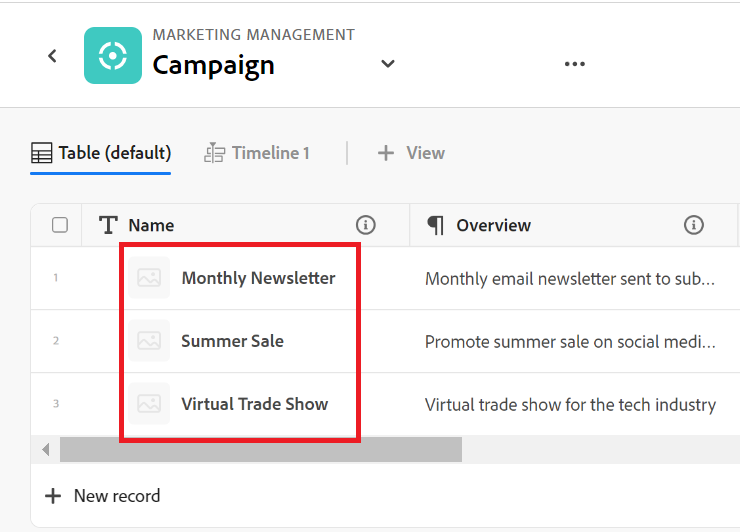

# Resumen de planificación de Adobe Workfront

<!--this article is linked to the WF Planning landing page - do not change URL or move it; send the team a new URL after we add the redirects for this page-->

<!--do not use the snippet for IMPORTANT as it links to this article-->

<!--The highlighted information on this page refers to functionality not yet generally available. It is available only in the Preview environment for all customers, or in the Production environment for customers who enabled fast releases.

For information about fast releases, see [Enable or disable fast releases for your organization](/help/quicksilver/administration-and-setup/set-up-workfront/configure-system-defaults/enable-fast-release-process.md).

For information about the current release, see [Fourth Quarter 2023 release overview](/help/quicksilver/product-announcements/product-releases/23-q4-release-activity/23-q4-release-overview.md).-->

>[!IMPORTANT]
>
>La información de este artículo hace referencia a Adobe Workfront Planning, una funcionalidad adicional de Adobe Workfront.
>
>Debe tener lo siguiente para acceder a Workfront Planning:
>
>* Un nuevo paquete y licencia de Workfront. Workfront Planning no está disponible para paquetes o licencias de Workfront heredados.
>* Un paquete de Workfront Planning.
>* La instancia de Workfront de su organización debe incorporarse a la experiencia unificada de Adobe.
>
> Para obtener una lista completa de los requisitos para acceder a Workfront Planning, consulte [Descripción general del acceso a Adobe Planning](/help/quicksilver/planning/access/access-overview.md).
> 

Este artículo contiene información general sobre Workfront Planning.

Para obtener la lista completa de artículos que contienen documentación para Workfront Planning, vea [Adobe Workfront Planning: article index](/help/quicksilver/planning/planning-information.md).

## Introducción a Adobe Workfront Planning

Adobe Workfront Planning es una funcionalidad adicional de Adobe Workfront. El propósito de Workfront Planning es desbloquear la visibilidad completa de los detalles operativos de una organización y responder preguntas comerciales críticas en cada fase del ciclo de vida de la administración del trabajo.

Workfront Planning puede responder preguntas como las siguientes:

* ¿Cuántas campañas se están ejecutando en EMEA en el cuarto trimestre?
* ¿Hay superposiciones de audiencia entre campañas simultáneas?
* ¿Qué tan bien están haciendo los programas de concientización en este momento?
* ¿Qué aspecto tienen los recursos en una campaña en particular? ¿Cuál de ellos aún debe ser aprobado?

Para responder a estas preguntas, el liderazgo necesita una solución que pueda proporcionar una visión integral de cada etapa del trabajo, desde la planificación hasta la ejecución, desde la entrega hasta la medición de los resultados. Actualmente, las organizaciones tienen herramientas que pueden cubrir algunas partes del proceso, pero muchas no tienen buenas conexiones con todas las fases del trabajo, ni pueden proporcionar resultados de manera confiable.

Estas son algunas de las funciones principales:

* Solucionar el problema de la gestión del trabajo en todas las etapas y para todas las partes interesadas que participan en el proceso de trabajo.
* Personalice completamente los flujos de trabajo, desde decidir qué tipos de objetos (o tipos de registros) utiliza su organización hasta configurar cómo se vinculan estos objetos entre sí.
* Enlace a tipos de objetos de otros sistemas, creando un marco coherente para todos sus procesos.

<!--
## Currently available Workfront Planning features
(*****for GA just make a list of what features ARE included in Planning and eliminate the last 2 columns; also update the title of this section*****)

(*****at GA: update the link below to the new place for release notes *****)

For information about new features and when they are released, see [Adobe Workfront Planning release activity for 2024](/help/quicksilver/planning/general/release-activity.md). 

The following features are currently available in Workfront Planning:

* Create workspaces             
* Create record types             
* Create record custom fields             
(************ * Import record types and fields using an Excel or CSV file*****)
          
* Display records in a table view            
* Display records in a timeline view            
* Display records in a calendar view            
* Filter, sort, and group records in a table view
* Filter, group, and color code records in the timeline view
* Filter records in the calendar view 
* Search for records in the table and timeline views             
* Connect records that belong to the same workspace  
* Connect records that belong to different workspaces   
* Connect Workfront Planning records to Workfront projects, programs, portfolios, companies, groups             
* Connect Workfront Planning records to Adobe Experience Manager assets          
    You must have an Adobe Experience Manager Assets license and an integration between AEM Assets and Workfront.
    For information, see [Adobe Workfront for Experience Manager Assets and Assets Essentials: article index](/help/quicksilver/documents/adobe-workfront-for-experience-manager-assets-essentials/workfront-for-aem-asset-essentials.md). 
* View record information in the Details tab
* View record connections in the Connections tab
* Customize the layout of a record's page             
* Share workspaces             
* Share views             
* Share views publicly with any external resource, even people who are not Workfront users         
* Duplicate views             
* Submit requests to create records            
* Export record details to Word and PDF.
* Add comments to records             
* Receive in-app notifications             
* Receive email notifications             
* Add thumbnails and cover pages to records             
* View the history of changes on a record             
* Rich Text formatting for Paragraph fields             
* Access Planning records from Workfront objects             
* Connect and disconnect Planning records from Workfront objects 
* Create Planning records by submitting a request form            
* Workfront Planning public API             
* Adobe Workfront Planning modules for Adobe Workfront Fusion             
* Workfront Planning AI Assistant
* Reporting on Workfront Planning information
    You can report on Planning information using the Canvas Dashboard. For information, see [Canvas Dashboards overview](/help/quicksilver/reports-and-dashboards/canvas-dashboards/canvas-dashboards-overview.md). 

-->

<!--OLD: 

|       Feature                                      |     Available now  |     Coming soon   |     In research  |
|----------------------------------------------------|:-----------------------------:|:--------------------------------:|:----------------:|
|     Create workspaces                              |   ✓                           |                                  |                  |
|     Create record types                |   ✓                           |                                  |                  |
|     Create record custom fields                    |   ✓                           |                                  |                  |
|     Import record types and fields using an Excel  or CSV file                              |                              |           ✓                       |                  |
|     Link records                                   |   ✓                           |                                  |                  |
|     View records in a table                        |   ✓                           |                                  |                  |
|     View records in a timeline                     |   ✓                           |                                  |                  |
|     View records in a calendar                     |   ✓                           |                                  |                  |
|     Filter records                                 |   ✓                           |                                  |                  |
|     Group records in the timeline view             |   ✓                           |                                  |                  |
|     Group records in the table view                | ✓                              |                                 |                  |
|     Sort records in the table view                                 |  ✓                             |                                 |                  |
|     Sort records in the timeline view                                 |                               |   ✓                              |                  |
|     Sort groupings in the table view                                 |                               |   ✓                              |                  |
|     Sort groupings in the timeline view                                 |                               |   ✓                              |                  |
|   Search for records in the table view    | ✓    |   |
|   Search for records in the timeline view    | ✓    |   |
|     Connect Workfront Planning records to Workfront projects, programs, portfolios, companies, groups  |   ✓                            |                                 |                  |
|     Connect Workfront Planning records to Adobe Experience Manager assets                                  |      ✓                         |                                  |                 |
|     Connect Planning records from different workspaces                                  |      ✓                         |                                  |                 | 
|     Record page with detailed information                            |   ✓                           |                                  |                  |
|     Update the layout of the record's page              |    ✓                           |                                 |                  |
|  Share workspaces | ✓| |  |
|  Share views |✓ | |  |
|  Share views publicly with external resources |✓ | |  |
|  Duplicate views |✓ | |  |
|     Submit requests                                |                               |          ✓                        |                 |
|     Export record details to Word                                 |    ✓                           |                                  |                 |
|     Export record details to PDF                                 |                               |                                  |       ✓          |
|     Customize the color and icon of a record                                 |      ✓                         |                                  |                 |
|     Add comments to records                                 | ✓                              |                                  |                 |
|     Receive in-app notifications                                 | ✓                              |                                  |                 |
|     Receive email notifications                                 | ✓                              |                                  |                 |
|     Add thumbnails to records                                 | ✓                              |                                  |                 |
|     View history of changes on a record                                 | ✓                              |                                  |                 |
|     Rich Text formatting for Paragraph fields                                 |      ✓                         |                                  |                 | 
|     Adobe Workfront Planning modules for Adobe Workfront Fusion                                 |      ✓                         |                                  |                 | 
|     Copy and paste information from one field to another                                  |      ✓                         |                                  |                 | 
|     Access Planning records from Workfront objects                                  |      ✓                         |                                  |                 |
|     Connect Planning records from Workfront objects                                  |      ✓                         |                                  |                 |
|     Workfront Planning public API                                 |      ✓                         |                                  |                 |
|     Workfront Planning AI Assistant*                                 |      ✓                         |                                  |                 |
|     Reporting on Workfront Planning information (Canvas Dashboard)                              |                               |       ✓                           |                 |
-->

## Habilite Workfront Planning para los usuarios de la instancia de Workfront

Una vez que su organización haya adquirido una licencia para Workfront Planning, como administrador de Workfront, debe asegurarse de que dispone de lo siguiente para que los usuarios puedan acceder a Workfront Planning:

* Asigne a los usuarios que necesiten acceder a Planning una plantilla de diseño que incluya Planning en el menú principal. Para obtener más información, consulte [Personalizar el menú principal con una plantilla de diseño](/help/quicksilver/administration-and-setup/customize-workfront/use-layout-templates/customize-main-menu.md) y [Asignar usuarios a una plantilla de diseño](/help/quicksilver/administration-and-setup/customize-workfront/use-layout-templates/assign-users-to-layout-template.md).

* Asigne a los usuarios una licencia de Workfront y permisos de Workfront Planning que le permitan 5554hview o crear objetos en Workfront Planning. Para obtener más información acerca de cómo conceder acceso a Workfront Planning y permitir que otros lo usen, vea [Información general sobre el acceso a Adobe Planning](/help/quicksilver/planning/access/access-overview.md).

## Terminología de Workfront Planning

Aunque Workfront Planning forma parte de Workfront, incluye conceptos propietarios y terminología. Familiarícese con los nuevos conceptos antes de comenzar a configurar Workfront Planning para su organización.

El marco de Workfront Planning es totalmente personalizable. Puede crear todos los tipos de registros, sus atributos y cualquier campo asociado a ellos para adaptarlos a las necesidades exactas de su organización.

Existen limitaciones en cuanto a la cantidad de objetos de Workfront Planning que se pueden crear. Para obtener más información, consulte [Resumen de las limitaciones de objetos de Adobe Workfront Planning](/help/quicksilver/planning/general/limitations-overview.md).

A continuación se muestran los objetos y conceptos principales de Workfront Planning:

* **Workspace**: una colección de tipos de registros que definen el ciclo de vida operativo de una determinada organización. Un espacio de trabajo es el marco de trabajo de una unidad organizativa.

  

  Para obtener más información, consulte [Crear espacios de trabajo](/help/quicksilver/planning/architecture/create-workspaces.md).

* **Tipo de registro**: Nombre de los tipos de objeto en Workfront Planning.

  A diferencia de Workfront, donde los tipos de objeto están predefinidos, en Workfront Planning puede crear sus propios tipos de objeto.

  Por ejemplo, en Workfront ya se han creado los tipos de objeto Programa, Portfolio, Proyecto, Tarea o Problema.

  En Workfront Planning, puede crear cualquier tipo de registro que cumpla los flujos de trabajo de su organización. Posteriormente, puede definir cómo se relacionan los tipos de registro entre sí o las dependencias del formulario.

  Para obtener más información, vea [Información general sobre los tipos de registro](/help/quicksilver/planning/architecture/overview-of-record-types.md).

* **Registro**: Una instancia de un tipo de registro.

  

  Después de agregar un tipo de registro a un espacio de trabajo, puede empezar a agregar registros de ese tipo en la página del tipo de registro.

  Por ejemplo, &quot;Campaña&quot; puede ser un tipo de registro y &quot;Campaña de verano para EMEA&quot; es un registro del tipo de registro Campaña.

  Para obtener más información, consulte [Crear registros](/help/quicksilver/planning/records/create-records.md).

* **Plantilla de Workspace**: puede crear un área de trabajo con plantillas predefinidas. Puede utilizar los tipos de registros predefinidos y los campos que se incluyen en una plantilla, o bien puede agregar los suyos propios.

  

  Adobe Workfront Planning contiene las siguientes plantillas:

   * Básico: gestión de marketing
   * Avanzado: Gestión de marketing
   * Empresa: gestión de marketing
   * Administración de ventas
   * Administración de productos

  Para obtener más información, vea [Lista de plantillas de área de trabajo](/help/quicksilver/planning/architecture/workspace-templates.md).

* **Campos**: Los campos son atributos que se pueden agregar a los tipos de registro. Los campos contienen información sobre el tipo de registro. <!--check the shot below, "Connection" needs to be in lowercase-->

  

  Consideraciones sobre los campos de registro:

   * Los campos que agregue para un tipo de registro se asocian automáticamente a todos los registros de ese tipo y se pueden utilizar para capturar datos sobre esos registros.

   * Los campos se muestran como columnas en la vista Tabla aplicada a una página de tipo de registro. También se muestran en la página del registro.

   * Los campos son exclusivos de un tipo de registro y no se transfieren de un tipo de registro a otro.

   * Los campos son totalmente personalizables y solo se puede acceder a ellos desde Workfront Planning. No puede acceder a los campos de Workfront Planning desde Workfront.

  Para obtener más información, consulte [Crear campos](/help/quicksilver/planning/fields/create-fields.md).

  De forma predeterminada, un nuevo tipo de registro está asociado a los siguientes campos predefinidos:

   * Nombre
   * Descripción
   * Fecha de inicio
   * Fecha de finalización
   * Estado

  Puede crear campos personalizados de los siguientes tipos:

   * Texto de línea única
   * Párrafo
   * Selección múltiple
   * Selección única
   * Fecha
   * Número
   * Porcentaje
   * Divisa
   * Casilla de verificación
   * Fórmula
   * Personas
   * Creado por
   * Fecha de creación
   * Última modificación realizada por
   * Fecha de la última modificación

* **Tipos de registros conectados**, **Registros conectados** y **Campos conectados**: Puede crear una conexión entre las siguientes entidades en Workfront Planning:

   * Dos tipos de registros de Workfront Planning.
   * Un tipo de registro y un tipo de objeto de proyecto, programa, portafolio, empresa o grupo de Workfront.
   * Un tipo de registro y una carpeta o recurso de Adobe Experience Manager.

     Debe tener una licencia de Adobe Experience Manager para vincular tipos de registros con objetos de Experience Manager.

     

  Después de establecer una conexión entre los tipos de registro, puede conectar registros individuales de esos tipos entre sí. La conexión entre los registros se muestra como un campo de registro vinculado.

* **Campos vinculados** (o campos de búsqueda): después de establecer la conexión entre dos tipos de registro y vincular registros individuales, puede hacer referencia a los campos de los registros vinculados en el registro desde el que se conecta.

  Por ejemplo, si conecta un tipo de registro de campaña con un tipo de objeto de proyecto de Workfront, puede mostrar el campo Presupuesto de los proyectos conectados en los registros de campaña.

  

  >[!TIP]
  >
  > No puede agregar los siguientes tipos de campo como campos de búsqueda desde el registro conectado o tipos de objeto:
  >
  >* Personas
  >* Creado por
  >* Última modificación realizada por
  >* Campos de escritura anticipada de Workfront (incluidos campos como Propietario del proyecto o Patrocinador del proyecto)

  Para obtener información sobre cómo vincular tipos de registros, registros y crear campos vinculados, vea los siguientes artículos:

   * [Conectar tipos de registros](/help/quicksilver/planning/architecture/connect-record-types.md)
   * [Conectar registros](/help/quicksilver/planning/records/connect-records.md)

<!--not yet:* Fields are reusable across Record Types.  -->

* **Vistas**: los registros se muestran en su página de tipo de registro respectiva en distintos tipos de vistas.

  

  Las vistas contienen configuraciones personalizadas de un tipo de vista específico, como la lista de campos (columnas), una lista de registros (filas), su orden (ordenación), un filtro aplicado o aplicable y una agrupación.

  Los siguientes son tipos de vista que puede aplicar a la página de tipo de registro:

   * **Vista de tabla**: muestra los registros y sus campos, incluidos los campos conectados y de búsqueda, en formato de tabla. Las filas de la tabla son los registros individuales y las columnas son los campos de registro. La vista de tabla es la vista predeterminada.

     

   * **Vista de escala de tiempo**: muestra registros que tienen al menos dos campos de tipo Fecha en una escala de tiempo cronológica. Puede mostrar hasta 5 tipos de registros conectados y sus registros en la vista de escala de tiempo.

     

   * **Vista de calendario**: muestra los registros que tienen al menos dos campos de tipo Fecha en formato de calendario.
     

Para obtener más información, consulte [Administrar vistas de registros](/help/quicksilver/planning/views/manage-record-views.md).

## Localizar Adobe Workfront Planning

Para localizar la planificación de Adobe, asegúrese de que su organización ha recibido acceso a Workfront Planning y de que el administrador del sistema o del grupo ha añadido el área de planificación al menú principal. Para obtener más información, consulte [Descripción general del acceso a Adobe Planning](/help/quicksilver/planning/access/access-overview.md).

Para localizar Workfront Planning:

1. Inicie sesión en Workfront.

{{step1-click-main-menu}}

1. Haga clic en **Planificación** .

   Se abre la página principal de Workfront Planning.

   

   >[!TIP]
   >
   >    El administrador de Workfront puede agregar el área de Planning a la opción Seleccionar página de aterrizaje de la plantilla de diseño para que pueda abrir Planning en cuanto inicie sesión en Workfront. Para obtener más información, consulte [Personalizar la página de aterrizaje mediante una plantilla de diseño](/help/quicksilver/administration-and-setup/customize-workfront/use-layout-templates/customize-landing-page.md).

1. (Condicional y opcional) Si es administrador de Workfront, haga clic en una de las siguientes pestañas:
   * **Espacios de trabajo en los que participo**: muestra los espacios de trabajo que ha creado o los que se han compartido con usted.
   * **Otros espacios de trabajo**: Muestra todos los demás espacios de trabajo del sistema.

   Para todos los demás usuarios, los espacios de trabajo que han creado o que se comparten con ellos se muestran en el área **Espacios de trabajo**.

1. (Opcional y recomendada) Continúe con algunas de las siguientes acciones para crear la estructura de trabajo:

   1. Cree un espacio de trabajo desde cero o con una plantilla. Para obtener más información, consulte [Crear espacios de trabajo](/help/quicksilver/planning/architecture/create-workspaces.md).

   1. Agregue secciones al nuevo espacio de trabajo. Para obtener más información, consulte [Editar espacios de trabajo](/help/quicksilver/planning/architecture/edit-workspaces.md).
   1. Cambie el nombre de las secciones existentes en el nuevo espacio de trabajo.
   1. Agregue tipos de registros al nuevo espacio de trabajo. Para obtener más información, consulte [Crear tipos de registros](/help/quicksilver/planning/architecture/create-record-types.md).

   1. Haga clic en el nombre de un tipo de registro para abrir su página. La página de tipo de registro se abre en la vista Tabla de forma predeterminada.

      También puede crear una vista Cronología o Calendario. Para obtener más información, consulte [Administrar vistas de registros](/help/quicksilver/planning/views/manage-record-views.md).

   1. En la vista de tabla, comience a agregar registros agregando filas

      O

      Comience a agregar campos de registro agregando columnas.

      Para obtener más información, consulte los siguientes artículos:

      * [Creación de registros](/help/quicksilver/planning/records/create-records.md)
      * [Crear campos](/help/quicksilver/planning/fields/create-fields.md).

## Actividad de versión de Workfront Planning

<!--update this with the new release activity page - the article index for all Planning releases-->

Estamos lanzando nuevas funciones a Workfront Planning regularmente.

Para obtener una lista actualizada de las características publicadas, consulte [Actividad de la versión de Adobe Workfront Planning: índice de artículo](/help/quicksilver/product-announcements/product-releases/planning-release-activity/planning-release-activity-article-index.md).

## Recursos adicionales para Workfront Planning

* [Adobe Workfront Planning: índice de artículos](/help/quicksilver/planning/planning-information.md): un índice de todos los artículos que contienen documentación sobre Workfront Planning, agrupados por área de interés.
* [Descripción general del Asistente de IA de Adobe Workfront Planning](/help/quicksilver/planning/general/planning-ai-assistant-overview.md): con el Asistente de IA de Workfront para Planning puede buscar registros o crear, actualizar y eliminar registros mediante comandos y dejar que el asistente haga el trabajo por usted.
  <!--
    >[!NOTE]
    >
    >    The Workfront AI Assistant has been temporarily removed and it will be available at a later date.-->

* [Módulos de Adobe Workfront Planning para Workfront Fusion](/help/quicksilver/workfront-fusion/apps-and-their-modules/workfront-planning-modules.md): Con los módulos de Adobe Workfront Planning, puede almacenar en déclencheur un escenario cuando se produzcan eventos en Workfront Planning. También puede crear, leer, actualizar y eliminar registros, o realizar una llamada de API personalizada a su cuenta de Adobe Workfront Planning.

* [Conceptos básicos de la API de Planning de Adobe Workfront](/help/quicksilver/planning/general/planning-api-basics.md): el objetivo de la API de Planning de Adobe Workfront es simplificar la creación de integraciones con Planning mediante la introducción de una arquitectura REST-ful que funcione a través de HTTP.

* **Funciones de informes de Workfront Planning**: ahora puede ver información de Workfront Planning en un informe en Workfront mediante el panel de lienzo de Workfront. Para obtener más información, consulte [Introducción a los paneles de lienzo](/help/quicksilver/reports-and-dashboards/canvas-dashboards/manage-canvas-dashboards/get-started-canvas-dashboards.md).

