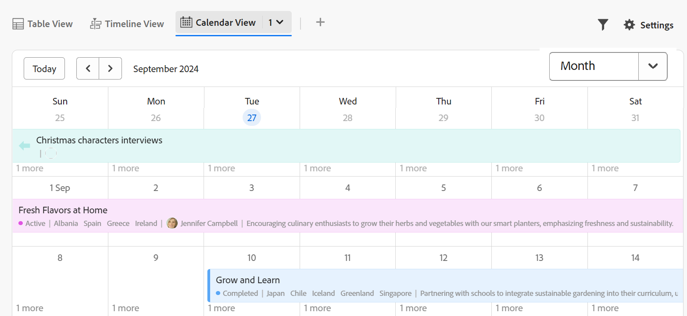

# Información general sobre terminología de Workfront Planning

<!--do not use the snippet for IMPORTANT as it links to this article-->

<!--
The highlighted information on this page refers to functionality not yet generally available. It is available only in the Preview environment for all customers. After the release to Preview, the same features are also available monthly in the Production environment for customers who enabled fast releases.    

For information about fast releases, see [Enable or disable fast releases for your organization](/help/quicksilver/administration-and-setup/set-up-workfront/configure-system-defaults/enable-fast-release-process.md). 
-->

>[!IMPORTANT]
>
>La información de este artículo hace referencia a Adobe Workfront Planning. Workfront Planning es un producto independiente o una funcionalidad adquirida adicionalmente de Adobe Workfront.
>
>
>Este artículo contiene información general sobre Workfront Planning cuando los clientes también compran un paquete de Workfront o de flujo de trabajo.
>
>Para obtener la lista completa de artículos que contienen documentación de Workfront Planning, vea [Información general e índice de artículos de Adobe Workfront Planning](/help/quicksilver/planning/planning-information.md).
>
>Para obtener información sobre Workfront Planning como producto independiente, consulte [Introducción a Adobe Workfront Planning como producto independiente](/help/quicksilver/planning/planning-sta/planning-sta-overview.md).

Aunque Workfront Planning forma parte de Workfront, incluye conceptos propietarios y terminología. Familiarícese con los nuevos conceptos antes de comenzar a configurar Workfront Planning para su organización.

El marco de Workfront Planning es totalmente personalizable. Es posible crear todos los tipos de registros, sus atributos y cualquier campo asociado a ellos para adaptarlos a las necesidades exactas de su organización.

Existen limitaciones en cuanto a la cantidad de objetos de Workfront Planning que se pueden crear. Para obtener más información, consulte [Información general sobre las limitaciones de objetos de Adobe Workfront Planning](/help/quicksilver/planning/general/limitations-overview.md).

A continuación, se muestran los objetos y conceptos principales de Workfront Planning:

* [Espacios de trabajo](#workspaces)
* [Tipos de registro](#record-types)
* [Registros](#records)
* [Plantillas de espacio de trabajo](#workspace-templates)
* [Campos](#fields)
* [Tipos de registros, registros y campos conectados](#connected-record-types-records-and-fields)
* [Campos de búsqueda](#lookup-fields)
* [Jerarquías](#hierarchies)
* [Vistas](#views)
* [Automatizaciones](#automations)
* [Formularios de solicitud](#request-forms)

## Espacios de trabajo

Los espacios de trabajo representan el marco de trabajo de una unidad organizativa. Son colecciones de tipos de registros que definen el ciclo de vida operativo de una determinada organización.

Para obtener más información, consulte [Crear espacios de trabajo](/help/quicksilver/planning/architecture/create-workspaces.md).

## Tipos de registro

Los tipos de registro son los tipos de objetos de Workfront Planning.

Los tipos de registro rellenan espacios de trabajo.

A diferencia de Workfront, donde los tipos de objeto están predefinidos, en Workfront Planning es posible crear tipos de objeto propios.

Por ejemplo, en Workfront, los tipos de objeto Programa, Portafolios, Proyecto, Tarea o Problema ya están creados.

En Workfront Planning es posible crear cualquier tipo de registro que cumpla con los flujos de trabajo de la organización. Posteriormente, defina cómo se relacionarán los tipos de registro entre sí o las dependencias de formularios.

Para más información, consulte [Información general sobre tipos de registro](/help/quicksilver/planning/architecture/overview-of-record-types.md).

## Registros

Un registro es una instancia de un tipo de registro.

Después de añadir un tipo de registro a un espacio de trabajo, podrá empezar a añadir registros de ese tipo a la página del tipo de registro.

Por ejemplo, “Campaña” podría ser un tipo de registro y “Campaña de verano para EMEA” un registro del tipo de registro Campaña.

Para obtener más información, consulte [Creación de registros](/help/quicksilver/planning/records/create-records.md).

## Plantillas de espacio de trabajo

Puede crear un espacio de trabajo con plantillas predefinidas. Utilice los tipos de registro predefinidos y los campos que se incluyan en una plantilla, o bien añada los suyos propios.

Adobe Workfront Planning contiene las siguientes plantillas:

* Operations Initiative Studio
* Estudio de planificación de comunicaciones
* Básico: administración de marketing
* Administración avanzada de marketing
* Empresa: administración de marketing
* Administración de ventas
* Administración de productos

Los administradores del sistema también pueden instalar 6 espacios de trabajo cuando utilicen la plantilla de espacio múltiple de prácticas recomendadas. La plantilla de varios espacios contiene las siguientes plantillas que generan 6 espacios de trabajo independientes pero conectados al mismo tiempo:

* 1.Clasificaciones globales y taxonomías
* 2.Fréscopa Marketing global
* 3.Fréscopa Social Marketing
* 4.Fréscopa Media &amp; PR
* 5.Eventos globales de Fréscopa
* 6.Fréscopa Executive Liderazgo de la empresa

Para obtener más información, consulte los siguientes artículos:

* [Lista de plantillas de área de trabajo](/help/quicksilver/planning/architecture/workspace-templates.md).
* [Crear espacios de trabajo](/help/quicksilver/planning/architecture/create-workspaces.md).

## Campos

Los campos son atributos que se pueden agregar a los tipos de registro. Los campos contienen información sobre el tipo de registro.

Consideraciones sobre los campos de registro:

* Aquellos campos que se añadan para un tipo de registro se asociarán automáticamente a todos los registros de ese tipo y se podrán utilizar para capturar datos sobre esos registros.

* Los campos se muestran como columnas en la vista de tabla aplicada a una página de tipo de registro. También se muestran en la página del registro.

* Los campos son únicos para un tipo de registro y no se transfieren de un tipo de registro a otro.

* Los campos son totalmente personalizables y solo se puede acceder a ellos desde Workfront Planning. No puede acceder a los campos de Workfront Planning desde Workfront.

Para obtener más información, consulte [Crear campos](/help/quicksilver/planning/fields/create-fields.md).

De forma predeterminada, un nuevo tipo de registro está asociado a los siguientes campos predefinidos:

* Nombre
* Descripción
* Fecha de inicio
* Fecha de finalización
* Estado

Puede crear campos personalizados de los siguientes tipos:

* Texto de línea única
* Párrafo
* Selección múltiple
* Selección única
* Fecha
* Número
* Porcentaje
* Divisa
* Casilla de verificación
* Fórmula
* Personas
* Creado por
* Fecha de creación
* Última modificación realizada por
* Fecha de la última modificación
* Aprobado por
* Fecha de aprobación
* ID de registro

<!--update the screen shot above-->

## Tipos de registros, registros y campos conectados

Puede crear una conexión entre las siguientes entidades en Workfront Planning:

* Dos tipos de registros de Workfront Planning.
* Un tipo de registro y un tipo de objeto de proyecto, programa, portafolio, compañía o grupo de Workfront.
* Un tipo de registro y un recurso o carpeta de Adobe Experience Manager.

  Debe poseer una licencia de Adobe Experience Manager para conectar tipos de registros con objetos de Experience Manager.

  

* Un tipo de registro y una marca Adobe GenStudio for Performance Marketing.

  Debe poseer una licencia de Adobe GenStudio for Performance Marketing para conectar tipos de registros con marcas GenStudio.

  

Después de establecer una conexión entre los tipos de registro o los tipos de registro y de objeto, puede conectar registros individuales u objetos de esos tipos entre sí. La conexión entre los registros se muestra como un campo de registro conectado o una conexión.

La conexión de tipos de registros es útil cuando tiene varios tipos de objetos de trabajo que se afectan entre sí. Por ejemplo, puede trabajar con campañas, y cada una puede adaptarse a varias marcas. Para indicar esta relación, puede conectar campañas a marcas. Además, el trabajo de cada campaña puede planificarse en varios proyectos en Workfront. Para indicar esto, puede conectar las campañas a los proyectos relevantes. La conexión de tipos de registros y, posteriormente, la conexión de registros individuales logra esta relación en Workfront Planning.

## Campos de búsqueda

Después de establecer la conexión entre dos tipos de registro y conectar registros individuales, puede hacer referencia a los campos desde los registros conectados desde el registro desde el que se conecta.

Por ejemplo, si conecta un tipo de registro Campaña con un tipo de objeto Proyecto de Workfront, puede mostrar el campo Presupuesto de los proyectos conectados en los registros de campaña.

>[!TIP]
>
>* No puede añadir los siguientes tipos de campo como campos de búsqueda desde el registro conectado o tipos de objeto:
>
>   * Creado por
>   * Última modificación realizada por
>   * Campos de escritura anticipada de Workfront (incluidos campos como Propietario del proyecto o Patrocinador del proyecto)
>

Para obtener información sobre la conexión de tipos de registros, registros y la creación de campos vinculados, consulte los siguientes artículos:

* [Conectar tipos de registro](/help/quicksilver/planning/architecture/connect-record-types.md)
* [Conectar registros](/help/quicksilver/planning/records/connect-records.md)

<!--
not yet:* Fields are reusable across Record Types.
-->

## Jerarquías

Una vez que los tipos de registros están conectados en un espacio de trabajo, puede crear jerarquías que organicen esas conexiones. Las jerarquías organizan los tipos de registros y objetos en relaciones principal-secundario y pueden contener hasta cuatro tipos de objetos.

Si todavía no existe una conexión entre dos tipos de registro, se puede crear a medida que se configura la jerarquía. Una vez definida, la jerarquía establece una ruta estructurada entre los tipos de registros relacionados dentro del espacio de trabajo.

Las jerarquías generan rutas de exploración para sus registros respectivos que se muestran en sus encabezados. De este modo, los usuarios saben dónde se encuentran en la jerarquía en cualquier fase del flujo de trabajo.

Para obtener información general acerca de jerarquías y rutas de exploración, vea [Información general sobre jerarquías y rutas de exploración](/help/quicksilver/planning/architecture/hierarchy-and-breadcrumb-overview.md).

## Vistas

Los registros se muestran en su página de tipo de registro respectiva en distintos tipos de vistas.

Las vistas contienen configuraciones personalizadas de un tipo de vista específico, como la lista de campos (columnas), una lista de registros (filas), su orden (ordenación) y un filtro y agrupación aplicados o aplicables.

Los siguientes son tipos de vista que puede aplicar a la página de tipo de registro:

* **Vista de tabla**: muestra los registros y sus campos, incluidos los campos conectados y de búsqueda, en formato de tabla. Las filas de la tabla son los registros individuales y las columnas son los campos del registro. La vista de tabla es la predeterminada.

  

* **Vista de cronología**: muestra los registros que tienen al menos dos campos de tipo Fecha en una línea de tiempo cronológica. Puede mostrar hasta cinco tipos de registros conectados y sus registros en la vista de cronología.

  

* **Vista de calendario**: muestra los registros que tienen al menos dos campos de tipo Fecha en formato de calendario.
  

<!--
add List view here when it's possible to display Planning RTs in it??
-->

Vista adicional:

* **Vista de lista**: puede mostrar objetos en una vista de lista en las siguientes áreas de Workfront Planning:

  * Proyectos conectados a páginas.
  * Lista de formularios de solicitud

  

Para obtener más información, consulte [Administrar vistas de registros](/help/quicksilver/planning/views/manage-record-views.md).

## Automatizaciones

Puede configurar automatizaciones en Adobe Workfront Planning para que, cuando se activen, creen registros en Workfront Planning cuando se activen a partir de un registro de Planning. Los registros creados se conectan automáticamente a los registros desde los que activa la automatización.

Puede configurar y activar la automatización en la página del tipo de registro en Workfront Planning.

Por ejemplo, puede crear una automatización que tome una campaña de Workfront Planning y cree una marca para asociarla a la campaña.

Para obtener información acerca de cómo crear objetos mediante una automatización existente, vea [Crear objetos mediante automatizaciones de registros de Adobe Workfront Planning](/help/quicksilver/planning/records/create-wf-objects-using-planning-automations.md).

## Formularios de solicitud

Puede crear un formulario de solicitud y asociarlo a un tipo de registro en Adobe Workfront Planning. A continuación, puede compartir el formulario con otros usuarios y estos pueden enviar solicitudes para crear registros de ese tipo.

Para obtener más información, consulte [Crear y administrar un formulario de solicitud en Adobe Workfront Planning](/help/quicksilver/planning/requests/create-request-form.md).