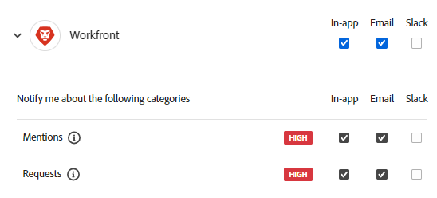

# Administrar las preferencias de las notificaciones para Adobe Workfront Planning

<!--The highlighted information on this page refers to functionality not yet generally available. It is available only in the Preview environment for all customers. After the monthly releases to Production, the same features are also available in the Production environment for customers who enabled fast releases.    

For information about fast releases, see [Enable or disable fast releases for your organization](/help/quicksilver/administration-and-setup/set-up-workfront/configure-system-defaults/enable-fast-release-process.md). -->

{{planning-important-intro}}

Puede recibir notificaciones en la aplicación o por correo electrónico cuando se produzcan las siguientes acciones en Workfront Planning:

* Alguien agrega usted o sus equipos a un comentario en la página de registro
* Alguien pide permiso para tener acceso a una vista o a un área de trabajo <!--or or a record-->
* Alguien le concede permiso para obtener acceso a una vista o a un área de trabajo <!--or or a record--> <!--I could not test this but Isk confirmed-->
* Envía una solicitud de Workfront Planning.
* Alguien aprueba o rechaza una solicitud de Workfront Planning que usted haya enviado.
* El estado cambia a una solicitud de Workfront Planning que ha enviado.

## Requisitos de acceso

+++ Expanda para ver los requisitos de acceso para la funcionalidad en este artículo. 

<table style="table-layout:auto"> 
<col> 
</col> 
<col> 
</col> 
<tbody> 
    <tr> 
<tr> 
</tr>   
<tr> 
   <td role="rowheader">
Paquete de Adobe Workfront
</td> 
   <td> 

Cualquier Workfront y cualquier paquete de Planning
 
Cualquier flujo de trabajo y cualquier paquete de Planning

Para obtener más información sobre lo que se incluye en cada paquete de Workfront Planning, póngase en contacto con su representante de cuentas de Workfront. 
 
   </td> 
  <tr> 
   <td role="rowheader">
Licencia de Adobe Workfront
</td> 
   <td>
Ligero o superior

   </td> 
  </tr> 
  <tr> 
   <td role="rowheader">
Permisos de objeto
</td> 
   <td>   
Permisos de vista o superiores a un espacio de trabajo</a> 
  
   
Los administradores del sistema tienen permisos para todos los espacios de trabajo, incluidos los que no crearon
 </td> 
  </tr> 
<tr>
   <td role="rowheader">
Plantilla de diseño
</td>
   <td> A los usuarios con una licencia Light o Contributor se les debe asignar una plantilla de diseño que incluya Planning.
   
Los usuarios estándar y los administradores del sistema tienen las áreas de Planning habilitadas de forma predeterminada.

</li></ul>
</td>
  </tr> 
</tbody> 
</table>

Para obtener más información acerca de los requisitos de acceso de Workfront, consulte [Requisitos de acceso en la documentación de Workfront](/help/quicksilver/administration-and-setup/add-users/access-levels-and-object-permissions/access-level-requirements-in-documentation.md).

+++   

<!--Old:
<table style="table-layout:auto"> 
<col> 
</col> 
<col> 
</col> 
<tbody> 
    <tr> 
<tr> 
<td> 
   
 Products
 </td> 
   <td> 
   <ul><li>
 Adobe Workfront
</li> 
   <li>
 Adobe Workfront Planning
</li></ul></td> 
  </tr>   
<tr> 
   <td role="rowheader">
Adobe Workfront plan*
</td> 
   <td> 

Any of the following Workfront plans:
 
<ul><li>Select</li> 
<li>Prime</li> 
<li>Ultimate</li></ul> 

Workfront Planning is not available for legacy Workfront plans
 
   </td> 
<tr> 
   <td role="rowheader">
Adobe Workfront Planning package*
</td> 
   <td> 

Any 
 

For more information about what is included in each Workfront Planning plan, contact your Workfront account manager. 
 
   </td> 
 <tr> 
   <td role="rowheader">
Adobe Workfront platform
</td> 
   <td> 

Your organization's instance of Workfront must be onboarded to the Adobe Unified Experience.
 

The users in your organization receive notifications from Workfront Planning only when your organization is onboarded to the Adobe Unified Experience. 

For more information, see <a href="/help/quicksilver/workfront-basics/navigate-workfront/workfront-navigation/adobe-unified-experience.md">Adobe Unified Experience for Workfront</a>. 
 
   </td> 
   </tr> 
  </tr> 
  <tr> 
   <td role="rowheader">
Adobe Workfront license*
</td> 
   <td>

Standard, Light, or Contributor
   
Workfront Planning is not available for legacy Workfront licenses
 
  </td> 
  </tr> 
  <tr> 
   <td role="rowheader">
Access level configuration
</td> 
   <td> 
There are no access level controls for Adobe Workfront Planning
   
</td> 
  </tr> 
<tr> 
   <td role="rowheader">
Object permissions
</td> 
   <td>   
View or higher permissions to a workspace</a> 
  
   
System Administrators have permissions to all workspaces, including the ones they did not create
 </td> 
  </tr> 
<tr>
   <td role="rowheader">
Layout template
</td>
   <td> Users with a Light or Contributor license must be assigned a layout template that includes Planning.
   
Standard users and System Administrators have the Planning areas enabled by default.

</li></ul>
  
</td>
  </tr>

</tbody> 
</table> -->

Para obtener más información sobre las notificaciones de Workfront Planning, consulte también los siguientes artículos:

* Para obtener información acerca de los comentarios en los registros, consulte [Administrar comentarios de registro](/help/quicksilver/planning/records/manage-record-comments.md).
* Para obtener información sobre las notificaciones en la aplicación de Workfront Planning, consulte [Administrar notificaciones en la aplicación para Adobe Workfront Planning](/help/quicksilver/planning/notifications/manage-planning-in-app-notifications.md).
* Para obtener información sobre las notificaciones por correo electrónico de Workfront Planning, consulte [Administrar notificaciones por correo electrónico para Adobe Workfront Planning](/help/quicksilver/planning/notifications/manage-planning-email-notifications.md).

## Administrar preferencias de las notificaciones

1. Inicie sesión en Workfront con sus credenciales de Adobe Experience Cloud.
1. Haga clic en el icono **menú de cuenta**  en la parte superior derecha de la pantalla y, a continuación, haga clic en **Preferencias**.
1. En la sección **Notificaciones**, haga clic en **Workfront**.
1. Seleccione las notificaciones que desee recibir.
O
Anule la selección de las notificaciones que quiera dejar de recibir.

   
1. Las siguientes notificaciones están disponibles para Workfront:

   * **Menciones**: Recibes una notificación cuando alguien te etiqueta a ti o a tu equipo en un comentario en Workfront Planning
   * **Solicitudes**: recibe una notificación cuando alguien realiza una de las siguientes acciones:

      * Solicita o concede permiso para un objeto de Workfront Planning
      * Ha enviado una solicitud de Workfront Planning
      * El estado de una solicitud de Workfront Planning que ha enviado cambios
      * Solicita, concede o rechaza una aprobación para una solicitud de Workfront Planning

   Para obtener más información sobre cómo administrar las notificaciones, consulte [Preferencias y notificaciones de la cuenta](https://experienceleague.adobe.com/en/docs/core-services/interface/features/account-preferences).

<!--OLD: notifications are not available to non-IMS customers: 

When someone adds you to a comment in the record page, you may receive an in-app as well as an email notification about the comment. 

The following scenarios exist:   

* Adobe Unified Experience customers receive both an in-app notification and an email notification. They can manage their in-app and email notification preferences in the Preferences area of their Adobe Experience Cloud profile for the Workfront product. 

    For more information, see [Account preferences and notifications](https://experienceleague.adobe.com/en/docs/core-services/interface/features/account-preferences).

* Customers who are not on the Adobe Unified Experience receive only an email notification. They cannot manage their email notifications preferences and will always receive an email when someone adds them to a comment on a record in Workfront Planning.   

-->
