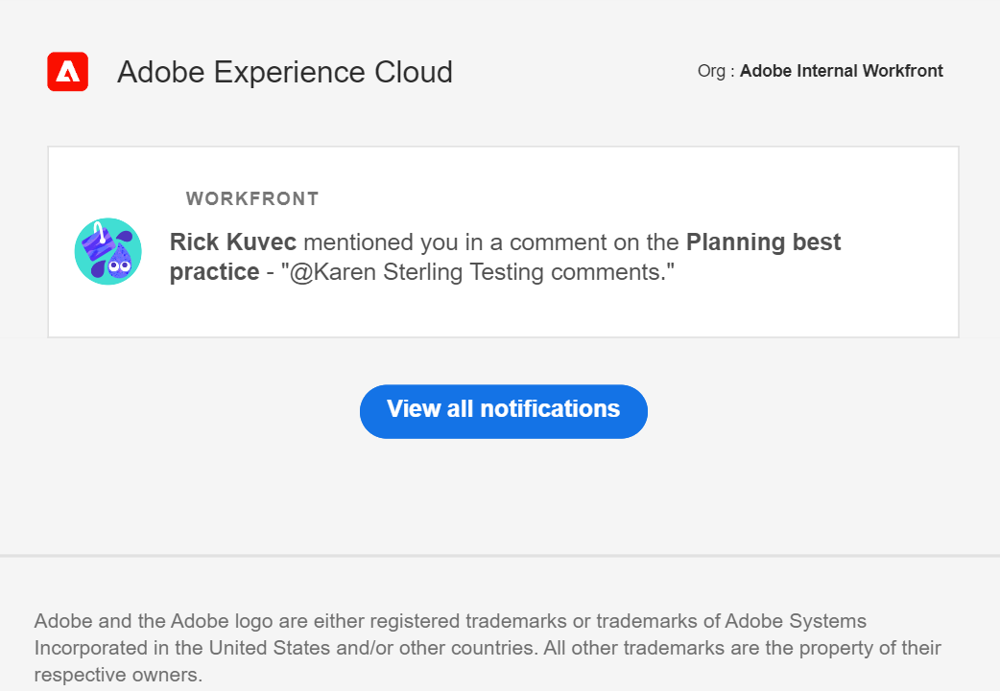
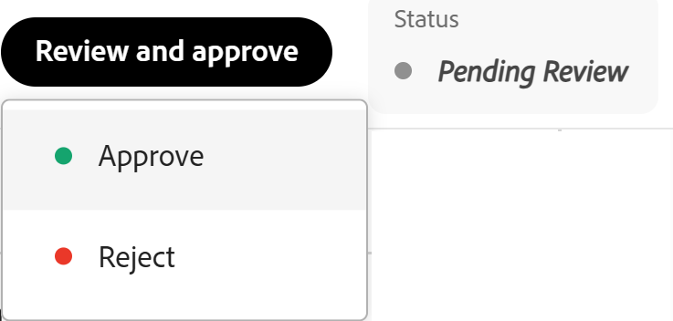
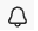

# Administrar notificaciones por correo electrónico de Adobe Workfront Planning

<!--
The highlighted information on this page refers to functionality not yet generally available. It is available only in the Preview environment for all customers. After the release to Preview, the same features are also available monthly in the Production environment for customers who enabled fast releases.    

For information about fast releases, see [Enable or disable fast releases for your organization](/help/quicksilver/administration-and-setup/set-up-workfront/configure-system-defaults/enable-fast-release-process.md). 
-->

{{planning-important-intro}}

Puede recibir notificaciones por correo electrónico de Workfront Planning cuando existan los siguientes escenarios:

* Alguien le etiqueta a usted o a sus equipos en un comentario de registro

  Para obtener información sobre cómo etiquetar a otras personas en un comentario de registro, consulte [Administrar comentarios de registro](/help/quicksilver/planning/records/manage-record-comments.md).
* Alguien le pide permiso para acceder a una vista, un espacio de trabajo, un tipo de registro o un registro
* Alguien confirma que se ha concedido su acceso a una vista, espacio de trabajo, tipo de registro o registro
* Envía una solicitud de Workfront Planning. Para obtener más información, consulte [Crear y administrar un formulario de solicitud en Adobe Workfront Planning](/help/quicksilver/planning/requests/create-request-form.md)
* Alguien aprueba o rechaza una solicitud de Workfront Planning que usted haya enviado. Para obtener más información, consulte [Aprobar una solicitud en Adobe Workfront Planning](/help/quicksilver/planning/requests/approve-request.md)
* El estado cambia a una solicitud de Workfront Planning que ha enviado.

## Requisitos de acceso

+++ Expanda para ver los requisitos de acceso para la funcionalidad en este artículo. 

<table style="table-layout:auto"> 
<col> 
</col> 
<col> 
</col> 
<tbody> 
    <tr> 
<tr> 
</tr>   
<tr> 
   <td role="rowheader">
Paquete de Adobe Workfront
</td> 
   <td> 

Cualquier Workfront o flujo de trabajo con un paquete de Planning
 
Cualquier paquete de Planning cuando se adquiere como producto independiente

   </td> 
  <tr> 
   <td role="rowheader">
Licencia de Adobe Workfront
</td> 
   <td>
Flujo de trabajo ligero o superior

   </td> 
  </tr> 
<tr> 
   <td role="rowheader">
Licencia de planificación de Adobe
</td> 
   <td>
Colaborador de Planning o superior

<b>NOTA</b>

No todos los clientes tienen una licencia de colaborador

   </td> 
  </tr> 
<tr> 
   <td role="rowheader">
Configuración de nivel de acceso
</td> 
   <td> 
Debe agregar un tipo de licencia de flujo de trabajo y de Planning al nivel de acceso cuando tenga un flujo de trabajo y un paquete de Planning a la vez
   
</td> 
  </tr> 
  <tr> 
   <td role="rowheader">
Permisos de objeto
</td> 
   <td>   
Permisos de vista o superiores a un espacio de trabajo</a> 
  
   
Los administradores del sistema tienen permisos para todos los espacios de trabajo, incluidos los que no crearon
 </td> 
  </tr> 
</tbody> 
</table>

Para obtener más información acerca de los requisitos de acceso de Workfront, consulte [Requisitos de acceso en la documentación de Workfront](/help/quicksilver/administration-and-setup/add-users/access-levels-and-object-permissions/access-level-requirements-in-documentation.md).

+++

<!--
OLD: 

<table style="table-layout:auto"> 
<col> 
</col> 
<col> 
</col> 
<tbody> 
    <tr> 
<tr> 
<td> 
   
 Products
 </td> 
   <td> 
   <ul><li>
 Adobe Workfront
</li> 
   <li>
 Adobe Workfront Planning
</li></ul></td> 
  </tr>   
<tr> 
   <td role="rowheader">
Adobe Workfront plan*
</td> 
   <td> 

Any of the following Workfront plans:
 
<ul><li>Select</li> 
<li>Prime</li> 
<li>Ultimate</li></ul> 

Workfront Planning is not available for legacy Workfront plans
 
   </td> 
<tr> 
   <td role="rowheader">
Adobe Workfront Planning package*
</td> 
   <td> 

Any 
 

For more information about what is included in each Workfront Planning plan, contact your Workfront account manager. 
 
   </td> 
 <tr> 
   <td role="rowheader">
Adobe Workfront platform
</td> 
   <td> 

Your organization's instance of Workfront must be onboarded to the Adobe Unified Experience.
 

The users in your organization receive notifications from Workfront Planning only when your organization is onboarded to the Adobe Unified Experience. 

For more information, see <a href="/help/quicksilver/workfront-basics/navigate-workfront/workfront-navigation/adobe-unified-experience.md">Adobe Unified Experience for Workfront</a>. 
 
   </td> 
   </tr> 
  </tr> 
  <tr> 
   <td role="rowheader">
Adobe Workfront license*
</td> 
   <td>
 Standard, Light, or Contributor

   
Workfront Planning is not available for legacy Workfront licenses
 
  </td> 
  </tr> 
  <tr> 
   <td role="rowheader">
Access level configuration
</td> 
   <td> 
You must add both a Workflow and a Planning license type to the access level when you have both a Workflow and a Planning package
   
</td> 
  </tr> 
<tr> 
   <td role="rowheader">
Object permissions
</td> 
   <td>   
View or higher permissions to a workspace</a> 
  
   
System Administrators have permissions to all workspaces, including the ones they did not create
 </td> 
  </tr> 
<tr>
   <td role="rowheader">
Layout template
</td>
   <td> Users with a Light or Contributor license must be assigned a layout template that includes Planning.
   
Standard users and System Administrators have the Planning areas enabled by default.

</li></ul>
  
</td>
  </tr>

</tbody> 
</table>
-->

## Administrar notificaciones por correo electrónico cuando alguien le etiqueta en un comentario

1. (Condicional y opcional) Después de que alguien le etiquete a usted o a su equipo en un comentario de un registro, vaya a la notificación por correo electrónico que le informa de la etiqueta y del comentario. El remitente del correo electrónico es Adobe Experience Cloud.

   

1. (Opcional) Haga clic en el mensaje en el cuadro **Workfront** dentro del correo electrónico.

   Se abre la página de detalles de registro en Workfront. Puede realizar actualizaciones en el registro o responder al comentario.

1. (Condicional) Si está disponible, haga clic en **Ver todas las notificaciones**. <!--check with Lilit - do non-IMS users have this button??-->
La página **Notificaciones** se abre en Adobe Experience Cloud. Se muestran todas las notificaciones de todas las aplicaciones de Adobe Experience Cloud.

## Administrar notificaciones por correo electrónico al solicitar y conceder permisos

1. (Condicional y opcional) Después de que alguien solicite o le conceda permisos para acceder a un objeto de Planning, vaya al mensaje de correo electrónico que le informa de la solicitud de permiso. El remitente del correo electrónico es Adobe Experience Cloud.

1. (Opcional) Haga clic en el mensaje en el cuadro **Workfront** dentro del correo electrónico.

   El objeto para el que solicitó permisos se abre en Workfront.

1. (Condicional) Si está disponible, haga clic en **Ver todas las notificaciones**.
La página **Notificaciones** se abre en Adobe Experience Cloud. Se muestran todas las notificaciones de todas las aplicaciones de Adobe Experience Cloud.

Para obtener información sobre cómo solicitar, conceder o denegar permisos, vea [Solicitar permisos a una vista o área de trabajo](/help/quicksilver/planning/access/request-permissions.md).

Para obtener información sobre cómo administrar las notificaciones de Workfront Planning, consulte [Administrar las preferencias de notificación de Adobe Workfront Planning](/help/quicksilver/planning/notifications/manage-notification-preferences.md).

## Administrar notificaciones por correo electrónico sobre el envío, la aprobación o el rechazo de solicitudes de Workfront Planning

1. (Opcional) Vaya al correo electrónico que Workfront le envía después de enviar una solicitud, o después de que una solicitud enviada se haya aprobado o rechazado. El remitente del correo electrónico es Adobe Workfront.

1. (Opcional) Haga clic en **Abrir solicitud**. Esto abre la solicitud en Workfront Planning.

1. En la esquina superior derecha de la solicitud, haga clic en el botón **Revisar y aprobar** y, a continuación, haga clic en una de las siguientes opciones:

   * **Aprobar** para aprobar la solicitud. Se crea un registro al aprobar una solicitud de Planning.
   * **Rechazar** para rechazar la solicitud. No se crea ningún registro cuando se rechaza una solicitud en Workfront Planning. La solicitud se guardó en el área de solicitudes con el estado **Rechazada**.

   

1. Haga clic en el icono **Notificaciones**  en la esquina superior derecha de la pantalla para acceder a la página **Notificaciones**.

   Para obtener información sobre cómo administrar las notificaciones de Workfront Planning, consulte [Administrar las preferencias de notificación de Adobe Workfront Planning](/help/quicksilver/planning/notifications/manage-notification-preferences.md).
