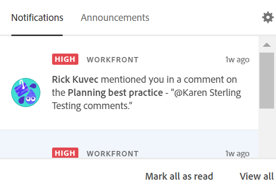

# Administrar notificaciones en la aplicación de Planificación de Adobe Workfront

{{planning-important-intro}}

Puede recibir notificaciones en la aplicación desde Workfront Planning cuando existan los siguientes escenarios:

* Alguien le etiqueta a usted o a sus equipos en un comentario de registro

  Para obtener información sobre cómo etiquetar a otras personas en un comentario de registro, consulte [Administrar comentarios de registro](/help/quicksilver/planning/records/manage-record-comments.md).
* Alguien le pide permiso para acceder a una vista, un espacio de trabajo o un registro
* Alguien confirma que se ha concedido su acceso a una vista, un espacio de trabajo o un registro

## Requisitos de acceso

+++ Expanda para ver los requisitos de acceso para la funcionalidad en este artículo. 

<table style="table-layout:auto"> 
<col> 
</col> 
<col> 
</col> 
<tbody> 
    <tr> 
<tr> 
</tr>   
<tr> 
   <td role="rowheader">
Paquete de Adobe Workfront
</td> 
   <td> 

Cualquier Workfront o flujo de trabajo con un paquete de Planning
 
Cualquier paquete de Planning cuando se adquiere como producto independiente

   </td> 
  <tr> 
   <td role="rowheader">
Licencia de Adobe Workfront
</td> 
   <td>
Flujo de trabajo ligero o superior

   </td> 
  </tr> 
<tr> 
   <td role="rowheader">
Licencia de planificación de Adobe
</td> 
   <td>
Colaborador de Planning o superior

<b>NOTA</b>

No todos los clientes tienen una licencia de colaborador

   </td> 
  </tr> 
<tr> 
   <td role="rowheader">
Configuración de nivel de acceso
</td> 
   <td> 
Debe agregar un tipo de licencia de flujo de trabajo y de Planning al nivel de acceso cuando tenga un flujo de trabajo y un paquete de Planning a la vez
   
</td> 
  </tr> 
  <tr> 
   <td role="rowheader">
Permisos de objeto
</td> 
   <td>   
Permisos de vista o superiores a un espacio de trabajo</a> 
  
   
Los administradores del sistema tienen permisos para todos los espacios de trabajo, incluidos los que no crearon
 </td> 
  </tr> 
</tbody> 
</table>

Para obtener más información acerca de los requisitos de acceso de Workfront, consulte [Requisitos de acceso en la documentación de Workfront](/help/quicksilver/administration-and-setup/add-users/access-levels-and-object-permissions/access-level-requirements-in-documentation.md).

+++   

<!--
OLD:

+++ Expand to view access requirements. 

<table style="table-layout:auto"> 
<col> 
</col> 
<col> 
</col> 
<tbody> 
    <tr> 
<tr> 
<td> 
   
 Products
 </td> 
   <td> 
   <ul><li>
 Adobe Workfront
</li> 
   <li>
 Adobe Workfront Planning
</li></ul></td> 
  </tr>   
<tr> 
   <td role="rowheader">
Adobe Workfront plan*
</td> 
   <td> 

Any of the following Workfront plans:
 
<ul><li>Select</li> 
<li>Prime</li> 
<li>Ultimate</li></ul> 

Workfront Planning is not available for legacy Workfront plans
 
   </td> 
<tr> 
   <td role="rowheader">
Adobe Workfront Planning package*
</td> 
   <td> 

Any 
 

For more information about what is included in each Workfront Planning plan, contact your Workfront account manager. 
 
   </td> 
 <tr> 
   <td role="rowheader">
Adobe Workfront platform
</td> 
   <td> 

Your organization's instance of Workfront must be onboarded to the Adobe Unified Experience.
 

The users in your organization receive notifications from Workfront Planning only when your organization is onboarded to the Adobe Unified Experience. 

For more information, see <a href="/help/quicksilver/workfront-basics/navigate-workfront/workfront-navigation/adobe-unified-experience.md">Adobe Unified Experience for Workfront</a>. 
 
   </td> 
   </tr> 
  </tr> 
  <tr> 
   <td role="rowheader">
Adobe Workfront license*
</td> 
   <td>
 Standard, Light, or Contributor

   
Workfront Planning is not available for legacy Workfront licenses
 
  </td> 
  </tr> 
  <tr> 
   <td role="rowheader">
Access level configuration
</td> 
   <td> 
You must add both a Workflow and a Planning license type to the access level when you have both a Workflow and a Planning package
   
</td> 
  </tr> 
<tr> 
   <td role="rowheader">
Object permissions
</td> 
   <td>   
View or higher permissions to a workspace</a> 
  
   
System Administrators have permissions to all workspaces, including the ones they did not create
  </td> 
  </tr> 
<tr>
   <td role="rowheader">
Layout template
</td>
   <td> Users with a Light or Contributor license must be assigned a layout template that includes Planning.
   
Standard users and System Administrators have the Planning areas enabled by default.

</li></ul>
</td>
  </tr>
</tbody> 
</table> 

+++
-->

## Administrar notificaciones en la aplicación cuando alguien te etiqueta en un comentario

1. (Condicional) Después de que alguien lo etiquete a usted o a sus equipos en un comentario de un registro, vaya al icono de **Notificaciones** de la aplicación  en Adobe Experience Cloud.

   

1. Haga clic en la notificación.

   Se abre la página de detalles de registro en Workfront Planning. Puede realizar actualizaciones en el registro o responder al comentario.

1. (Opcional) Haga clic en **Marcar todo como leído** para indicar que ha leído todas las notificaciones.
1. (Opcional) Haga clic en **Ver todo** para ir a la página **Notificaciones** en Adobe Experience Cloud.

## Administración de notificaciones en la aplicación al solicitar y conceder permisos

Recibirá notificaciones en la aplicación cuando alguien solicite o le conceda permisos para una vista, un espacio de trabajo o un tipo de registro. <!--or record-->

Para obtener información sobre cómo solicitar, conceder o denegar permisos, vea [Solicitar permisos a una vista o área de trabajo](/help/quicksilver/planning/access/request-permissions.md).

Para obtener información sobre cómo administrar las notificaciones de Workfront Planning, consulte [Administrar las preferencias de notificación de Adobe Workfront Planning](/help/quicksilver/planning/notifications/manage-notification-preferences.md).

## Administrar notificaciones en la aplicación al aprobar o rechazar solicitudes de Planning

Recibirá una notificación en la aplicación cuando alguien envíe una solicitud de aprobación o cuando alguien apruebe una solicitud que usted haya enviado.

Para obtener información sobre cómo enviar solicitudes, consulte [Enviar solicitudes de Adobe Workfront Planning para crear registros](/help/quicksilver/planning/requests/submit-requests.md).

Para obtener información acerca de cómo aprobar solicitudes, vea [Aprobar una solicitud en Adobe Workfront Planning](/help/quicksilver/planning/requests/approve-request.md).
