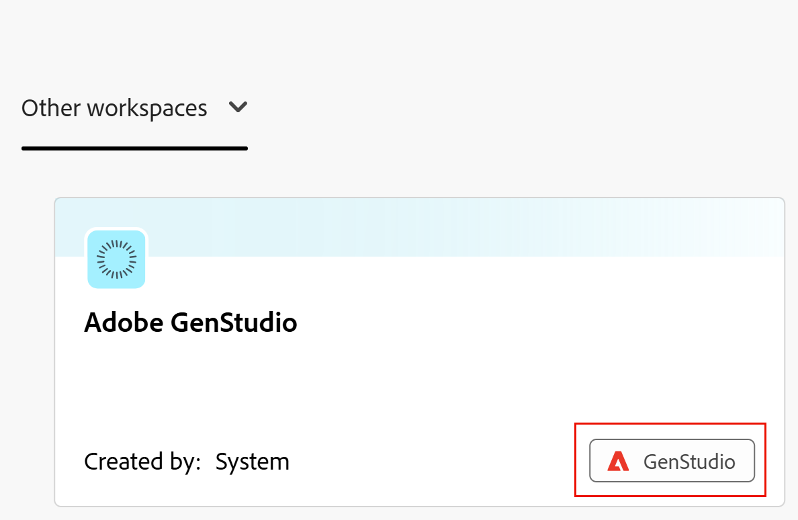

<!--Better metadata, at publishing:
---
title: Get Started with the Workfront Planning and GenStudio for Performance Marketing Integration
description: The GenStudio for Performance Marketing workspace is available in Adobe Workfront Planning when your company has purchased both products. Learn some of the basics about how you can streamline your workflows using this integration.
feature: Workfront Planning
role: User, Admin
author: Alina
recommendations: noDisplay, noCatalog

---
-->

<!--use this article to make this one similar to it: https://experienceleague.adobe.com/en/docs/workfront/using/adobe-workfront-integrations/review-approval-integrations/wf-proof-and-genstudio-->

# Introducción a la integración de Adobe Workfront Planning y Adobe GenStudio for Performance Marketing

<!--update the text in the title everywhere this article is linked from - it changed a few times-->

<!--The information on this page refers to functionality not yet generally available. It is available only in the Preview environment for all customers. After the monthly releases to Production, the same features are also available in the Production environment for customers who enabled fast releases.    

For information about fast releases, see [Enable or disable fast releases for your organization](/help/quicksilver/administration-and-setup/set-up-workfront/configure-system-defaults/enable-fast-release-process.md). -->

Las organizaciones que utilizan Adobe Workfront Planning y Adobe GenStudio for Performance Marketing suelen definir conceptos de marketing como Campañas, Productos, Activaciones y Personas con más detalle de lo que GenStudio admite de forma predeterminada.

Existe una integración nativa entre GenStudio for Performance Marketing y Workfront Planning. Esta integración permite a los usuarios de Workfront Planning administrar las campañas, los productos, las personas, las activaciones, los canales y las regiones utilizados en GenStudio. También les permite configurar GenStudio para que haga referencia a los tipos de registros existentes de Workfront Planning, lo que crea un flujo de trabajo de marketing más conectado y coherente.

El espacio de trabajo de GenStudio for Performance Marketing está disponible en Adobe Workfront Planning cuando su empresa ha adquirido ambos productos.

## Ventajas de integración

Con la integración entre Workfront Planning y GenStudio for Performance Marketing, puede:

<!--check this list and ensure it's accurate and add/ remove some of the benefits-->

* Vea el espacio de trabajo de GenStudio en Workfront Planning.
* Modifique sus campañas, productos, personalidades y activaciones en GenStudio for Performance Marketing y tenga actualizaciones en tiempo real de la misma información en Workfront Planning.
* Modifique sus campañas, productos, personalidades y activaciones en Workfront Planning y tenga actualizaciones en tiempo real de la misma información en GenStudio for Performance Marketing.
* Evite la entrada de datos duplicados.
* Mantenga la alineación entre los esfuerzos de planificación y activación.

## Requisitos de integración

Su organización debe cumplir los siguientes requisitos para que exista la integración entre Workfront Planning y GenStudio for Performance Marketing:

* Workfront y GenStudio for Performance Marketing deben estar habilitados para la misma organización.

  Para obtener más información sobre GenStudio, consulte [Guía del usuario de Adobe GenStudio for Performance Marketing](https://experienceleague.adobe.com/es/docs/genstudio-for-performance-marketing/user-guide/home).

<!--No longer the case: * Your organization must have only one Workfront instance. GenStudio will not be available in Workfront Planning when your company has multiple Workfront instances. -->

* La instancia de Workfront forma parte de la experiencia unificada de Adobe, incluido el uso del sistema Identity Management (IMS).

  Para obtener más información, consulte [Adobe Unified Experience para Workfront](/help/quicksilver/workfront-basics/navigate-workfront/workfront-navigation/adobe-unified-experience.md).

* Los usuarios que utilizan Workfront Planning y GenStudio for Performance Marketing solo deben pertenecer a una instancia de Workfront dentro de la organización IMS.

  Los usuarios solo de Workfront pueden ver GenStudio Workspace, aunque no sean usuarios de GenStudio for Performance Marketing.

<!--not sure: true for Planning? This is true for GenS and WF Proof: * The integration must be enabled in the Workfront Setup area.-->

## Requisitos de acceso

En la tabla siguiente se describen los requisitos de acceso y permisos para utilizar Adobe Workfront Planning con Adobe GenStudio for Performance Marketing:

<table style="table-layout:auto"> 
<col> 
</col> 
<col> 
</col> 
<tbody> 
    <tr> 
<tr> 
</tr>   
<tr> 
   <td role="rowheader">
paquete de Adobe Workfront
</td> 
   <td> 
<ul> 
<li>
Cualquier Workfront y cualquier paquete de Planning
</li>
O
<li>
Cualquier flujo de trabajo y cualquier paquete de Planning
</li></ul>

Para obtener más información sobre lo que se incluye en cada paquete de Workfront Planning, póngase en contacto con su representante de cuentas de Workfront. 
 
   </td> 
   <tr> 
<td> 
   
 Productos adicionales
 </td> 
   <td> 
   
 Adobe GenStudio for Performance Marketing
</td> 
  </tr>
  <tr> 
   <td role="rowheader">
Licencia de Adobe Workfront
</td> 
   <td>
Estándar

   </td> 
  </tr> 
  <tr> 
   <td role="rowheader">
Funciones de usuario de Adobe GenStudio for Performance Marketing
</td> 
   <td>
<ul><li>Cualquier función de usuario de GenStudio para acceder a campañas, productos y personas</li>
   <li>GenStudio System Manager para acceder a las activaciones <!--and Events--></li></ul>
   Para obtener más información, consulte <a href="https://experienceleague.adobe.com/es/docs/genstudio-for-performance-marketing/user-guide/intro/user-roles">Funciones de usuario y permisos</a>. 
   

  </td> 
  </tr>   
<tr> 
   <td role="rowheader">
Permisos de objeto
</td> 
   <td>  
   
En Workfront Planning: 

   <ul>
   <li>
Administre permisos en GenStudio Workspace para agregar nuevos campos o tipos de registros a GenStudio Workspace
</li>
   <li>
Permisos de contribución para agregar, actualizar o eliminar registros en el espacio de trabajo de GenStudio GenStudio
 </li>  
   </ul>
   
Ningún usuario puede quitar tipos de registros o campos de GenStudio for Performance Marketing del espacio de trabajo de GenStudio en Workfront Planning

   
En Adobe GenStudio for Performance Marketing: 

   <ul>
   <li>
 Cualquier permiso de Adobe GenStudio for Performance Marketing
</li>
   <li>
 Crear permisos en Adobe GenStudio for Performance Marketing para crear elementos
</li></ul>
   </td>  
</tbody> 
</table>

Para obtener información sobre el acceso a Adobe Workfront Planning, consulte [Información general sobre el acceso a Adobe Workfront Planning](/help/quicksilver/planning/access/access-overview.md).

Para obtener más información sobre Adobe GenStudio for Performance Marketing, consulte [Guía del usuario de Adobe GenStudio for Performance Marketing](https://experienceleague.adobe.com/es/docs/genstudio-for-performance-marketing/user-guide/home).

<!--Old:
<table style="table-layout:auto"> 
<col> 
</col> 
<col> 
</col> 
<tbody> 
    <tr> 
    <td role="rowheader">
Adobe Workfront package
</td> 
   <td> 

Any Workfront package

Any Planning package
  

   </td> </tr>
   <tr> 
<td> 
   
 Additional products
 </td> 
   <td> 
   
 Adobe GenStudio for Performance Marketing
</td> 
  </tr>
  <tr> 
   <td role="rowheader">
Adobe Workfront license
</td> 
   <td>
 Standard

  </td> 
  </tr> 
   
  <tr> 
   <td role="rowheader">
Adobe GenStudio for Performance Marketing user roles
</td> 
   <td>
<ul><li>Any GenStudio user role to access Campaigns, Products, and Personas</li>
   <li>GenSudio System Manager to access Activations ****and Events****</li></ul>
   For information, see <a href="https://experienceleague.adobe.com/es/docs/genstudio-for-performance-marketing/user-guide/intro/user-roles">User roles and permissions</a>. 
   

  </td> 
  </tr>   
<tr> 
   <td role="rowheader">
Object permissions
</td> 
   <td>  
   
In Workfront Planning: 

   <ul>
   <li>
Manage permissions to the GenStudio workspace to add new fields or record types to the GenStudio workspace
</li>
   <li>
Contribute permissions to the GenStudio workspace to add, update, or delete records in the GenStudio workspace
 </li>  
   </ul>
   
No users can remove GenStudio for Performance Marketing record types or fields from the GenStudio workspace in Workfront Planning

   
In Adobe GenStudio for Performance Marketing: 

   <ul>
   <li>
 Any permissions in Adobe GenStudio for Performance Marketing
</li>
   <li>
 Create permissions in Adobe GenStudio for Performance Marketing to create items
</li></ul>
   </td> 
  </tr> 
</tbody> 
</table> -->

## Descripción general de las funciones de integración de Workfront Planning y GenStudio for Performance Marketing

Según la cantidad de instancias de Workfront que tenga su organización, tendrá automáticamente los siguientes permisos para el espacio de trabajo de GenStudio en Planning:

<!--this table exists in the article Manage GenStudio workspace in Planning-->

<table style="table-layout:auto"> 
<col> 
</col> 
<col> 
</col> 
<tbody> 
    <tr> 
    <td role="rowheader">
Una instancia de Workfront
</td> 
   <td> 

El espacio de trabajo de GenStudio está visible en su instancia de Workfront Planning

Todos los usuarios, incluidos los administradores de Workfront, tienen acceso de forma predeterminada a Contribute en el espacio de trabajo de GenStudio en Planning

Los administradores de Workfront pueden modificar y conceder permisos de administración en GenStudio Workspace a cualquier persona

</td> </tr>
   <tr> 
<td> 
   
 Varias instancias de Workfront
 </td> 
   <td>

El espacio de trabajo de GenStudio es visible desde todas las instancias de Workfront

Todos los usuarios con acceso a GenStudio for Performance Marketing y Workfront Planning tienen permisos de contribución en GenStudio en Planning de forma predeterminada
 

Los administradores de Workfront no pueden conceder permisos de administración a GenStudio Workspace a nadie

</td> 
  </tr>
   </tbody> 
</table>

<!--If Iskuhi confirms, add this or a corrected version to the second row of the table above:

The following are the scenarios for when your organization has more than one instance of Workfront with Workfront Planning:

   <ul><li>If your company has multiple instances of Workfront at the moment when they purchase Adobe GenStudio for Performance Marketing, the GenStudio workspace is visible from all Workfront instances.</li>
   <li>If your company adds more Workfront instances after their original instance has already been integrated with Adobe GenStudio for Performance Marketing, the GenStudio workspace is visible only from the original Workfront instance. For information about connecting additional instance of Workfront to Adobe GenStudio, contact your account representative. </li></ul>  
   
   -->

Para obtener información acerca de los permisos de Workfront Planning, vea [Información general sobre los permisos de uso compartido en Adobe Workfront Planning](/help/quicksilver/planning/access/sharing-permissions-overview.md).

Las secciones siguientes describen lo siguiente:

* Capacidades para actualizar información de Workfront Planning desde GenStudio for Performance Marketing
* Funciones para actualizar información de GenStudio for Performance Marketing desde Workfront Planning
* Limitaciones de lo que se puede y no se puede administrar en un espacio de trabajo de GenStudio desde Workfront Planning.

<!--maybe make 2 sections here once Iskuhi answers - one for one instance and one for multiple WF instances??-->

<!--add here a link from the GenS articles about what you can/ cannot do from GenStudio that might in the end reflect in Planning - this should come from the GenS team-->

### El espacio de trabajo de GenStudio en Workfront Planning

* El espacio de trabajo de GenStudio muestra un indicador visual en Workfront Planning para identificarlo como representante del espacio de trabajo de GenStudio for Performance Marketing.

  

  Para obtener más información, consulte [Administrar el espacio de trabajo de GenStudio en Adobe Workfront Planning](/help/quicksilver/planning/planning-and-genstudio-integration/manage-gen-studio-workspace-in-planning.md).
* Cuando tenga permisos de administración en el espacio de trabajo de GenStudio en Planning, podrá:

   * Actualizar el espacio de trabajo de GenStudio en Planning (nombre, descripción, icono)
   * Creación de secciones
   * Agregar tipos de registros
   * Compártalo con otros usuarios

     Puede compartir GenStudio Workspace con otras personas que no tengan cuenta de GenStudio. Solo puede compartirlo con los usuarios disponibles en el sistema Identity Management (IMS) de su organización. <!--check to see this is correct-->
     <!--* Delete the workspace - check to see if this is possible; the link is there, but???-->

* Si tiene permisos de contribución en el espacio de trabajo de GenStudio en Planning, no podrá modificarlo desde Workfront Planning.

### Tipos de registro en GenStudio Workspace

* Los tipos de registro visibles tanto en GenStudio for Performance Marketing como en Planning tienen un indicador GenStudio en Workfront Planning.

  
* Cuando tenga permisos de administración en el espacio de trabajo de GenStudio en Planning, puede hacer lo siguiente desde Workfront Planning:
   * Editar información de tipos de registros de GenStudio (su aspecto, configuración avanzada).
   * Compartir tipos de registros de GenStudio con otros usuarios.
   * Crear tipos de registros. Estos tipos de registros permanecen únicamente en Workfront Planning. No se muestran en GenStudio.
   * Habilite los registros de GenStudio Workspace para conectarse desde otros espacios de trabajo.
   * Habilite registros de GenStudio Workspace para agregarlos a otros espacios de trabajo.
* Si tiene permisos de contribución en el espacio de trabajo de GenStudio en Planning, no puede modificar los tipos de registros de GenStudio desde Planning.

### Registros en GenStudio Workspace

* Al editar registros de GenStudio desde GenStudio for Performance Marketing, los cambios son visibles en el espacio de trabajo de GenStudio en todas las instancias de Workfront.
* No puede crear ni eliminar registros de activación del espacio de trabajo de GenStudio en Workfront Planning.
* Si tiene permisos de Administración o de Contribución en el espacio de trabajo de GenStudio en Planning, puede hacer lo siguiente desde Workfront Planning:
   * Añada o elimine registros para que sean visibles en GenStudio for Performance Marketing (o se eliminen de ella).

     Los registros eliminados de Workfront Planning o GenStudio for Performance Marketing se colocan en el grupo de Workfront Planning eliminados recientemente durante 30 días. GenStudio for Performance Marketing no tiene un grupo eliminado recientemente.
   * Restaurar un registro desde el grupo eliminado recientemente. La restauración de los registros eliminados vuelve a colocarlos en Workfront Planning y GenStudio for Performance Marketing.
   * Agregue registros de las siguientes maneras:

      * Manualmente, desde cero, desde cualquier vista con el botón Nuevo registro
      * Importándolos mediante un archivo CSV o de Excel en la vista de tabla
      * Manualmente, en cualquier vista de Workfront Planning
      * Al enviar una solicitud a un formulario de solicitud de tipo de registro en Workfront.

  Para obtener más información, consulte [Crear registros](/help/quicksilver/planning/records/create-records.md).
* Puede editar la información de los registros de todos los registros del espacio de trabajo de GenStudio desde Workfront Planning.

  Para obtener más información, consulte [Editar registros](/help/quicksilver/planning/records/edit-records.md).

### Campos de tipo de registro en GenStudio Workspace

* Los campos de tipo de registro se importan de GenStudio for Performance Marketing a Workfront Planning de forma predeterminada.
* No se pueden agregar campos a tipos de registro desde GenStudio for Performance Marketing.
<!--Iskuhi said this is not possible but I can add fields: * You cannot create or delete Activation records' fields from the GenStudio workspace in Workfront Planning. -->
* Cuando tenga permisos de administración en el espacio de trabajo de GenStudio en Planning, puede hacer lo siguiente desde Workfront Planning:

   * Edite la configuración del campo GenStudio.
   * Cree campos para los tipos de registros de GenStudio, si tiene acceso de Administración en el espacio de trabajo de Gen Studio.

     Cuando se crean campos para tipos de registros de GenStudio en Planning, son visibles desde las áreas siguientes:

      * Vistas de Workfront Planning
      * Páginas de detalles de registro de Workfront Planning
      * páginas de detalles de registro de GenStudio

     >[!TIP]
     >
     >Los campos creados en Workfront Planning no son visibles en la vista de lista de GenStudio.

   * Ocultar campos en la vista de tabla de un tipo de registro de GenStudio en Workfront Planning.
&lt;!—* Elimine los campos creados en Workfront Planning para los tipos de registros de GenStudio desde Workfront Planning. — esto no es posible, per Iskuhi; el vínculo está allí, pero generará un error—>

  <!--this is not true: You cannot delete fields imported from GenStudio from Workfront Planning.-->

* Cuando tenga permisos de contribución en el espacio de trabajo de GenStudio en Planning:

   * No puede editar la configuración de campos, eliminar ni agregar campos desde el espacio de trabajo de GenStudio en Workfront Planning.
   * Puede ocultar campos de la vista de tabla en Workfront Planning.

#### Los campos Creado por y Aprobado por

* Puede agregar los campos Creado por y Aprobado por para los tipos de registro de GenStudio en Workfront Planning desde Workfront Planning.
* Los registros que se muestran en los tipos de registro Canal y Región mostrarán &quot;Sistema&quot; como el usuario Creado por. Estos registros se crean automáticamente cuando el espacio de trabajo de GenStudio se crea en Workfront Planning.
* Los registros creados en GenStudio después de que el espacio de trabajo estuviera disponible en Workfront Planning mostrarán el nombre del usuario de IMS que creó el registro en el campo Creado por, aunque el usuario haya creado los registros en GenStudio y no sea un usuario de Workfront.
* El campo Aprobado por muestra el nombre del aprobador cuando se envía un formulario de solicitud para crear un registro en el tipo de registro de GenStudio en Workfront Planning.
* Los campos Creado por y Aprobado por se muestran en los detalles de los registros en GenStudio for Performance Marketing. No se muestran en la vista de lista.

### Registrar vistas en GenStudio Workspace

>[!NOTE]
>
>Los tipos de registros de GenStudio se muestran en la vista de tabla predeterminada importada desde la vista de lista de GenStudio for Performance Marketing.
>
>No puede eliminar la vista de tabla original que se importó de forma predeterminada desde GenStudio for Performance Marketing.

* No se pueden crear varias vistas en GenStudio for Performance Marketing.

* Cuando tenga permisos de administración en el espacio de trabajo de GenStudio en Planning, puede hacer lo siguiente desde Workfront Planning:

   * Cree vistas para los tipos de registros de GenStudio.

     Para obtener más información, consulte [Administrar vistas de registros](/help/quicksilver/planning/views/manage-record-views.md).

   * Cambie el nombre, comparta, exporte, duplique o elimine cualquier vista personalizada de los tipos de registro de GenStudio.

* Si tiene permisos de contribución en el espacio de trabajo de GenStudio en Planning, puede hacer lo siguiente desde Workfront Planning:

   * Cree vistas para los tipos de registros de GenStudio.

     Para obtener más información, consulte [Administrar vistas de registros](/help/quicksilver/planning/views/manage-record-views.md).

   * Cambie el nombre, exporte, duplique o elimine las vistas personalizadas de los tipos de registros de GenStudio.

     No puede compartir vistas desde GenStudio Workspace en Workfront Planning

### Registrar conexiones en GenStudio Workspace

Puede crear conexiones entre tipos de registros en espacios de trabajo de GenStudio en los que tenga permisos de administración.

Puede realizar las siguientes conexiones entre los tipos de registros de GenStudio y otros tipos de registros u objetos en Workfront Planning:

* Dos tipos de registros GenStudio
* Un tipo de registro GenStudio y un tipo de registro Planning del mismo espacio de trabajo
* Un tipo de registro GenStudio y un tipo de registro Planning de otro espacio de trabajo, si los tipos de registro están configurados para conectarse desde otro espacio de trabajo.
* Un tipo de registro GenStudio y un tipo de objeto Workfront (proyectos, portafolios, programas, empresas, grupos)
* Un tipo de registro GenStudio y un tipo de objeto AEM Assets.

### Solicitar formularios y automatizaciones en el tipo de registro de GenStudio

* Puede agregar formularios de solicitud a un tipo de registro de GenStudio en Workfront Planning.

  Para obtener más información, consulte [Crear y administrar un formulario de solicitud en Adobe Workfront Planning](/help/quicksilver/planning/requests/create-request-form.md).
* Puede configurar automatizaciones para un tipo de registro de GenStudio en Workfront Planning.

  Para obtener más información, consulte [Configuración de automatizaciones de Adobe Workfront Planning](/help/quicksilver/planning/records/configure-automations-to-create-records.md).

## El entorno de vista previa

* El espacio de trabajo de GenStudio accesible desde el entorno de producción también se muestra en el entorno de vista previa de la misma instancia de Workfront.
* Puede realizar todas las actividades descritas en este artículo en el espacio de trabajo de GenStudio en Workfront Planning en su entorno de vista previa, pero estos cambios no serán visibles desde GenStudio.

  Solo los cambios que realice en los elementos del entorno de producción se sincronizan entre Workfront Planning y GenStudio.

  GenStudio no tiene un entorno de vista previa.

