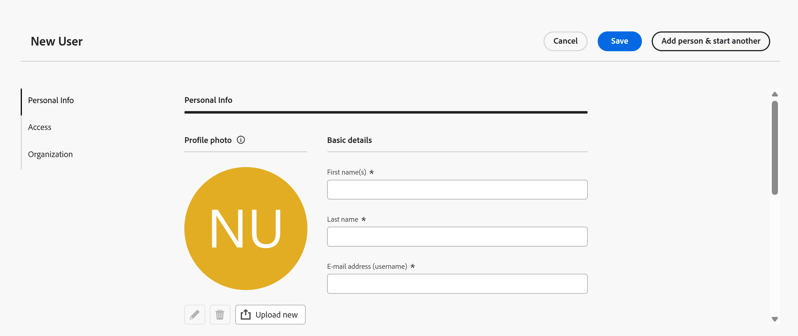

# Administrar usuarios en Adobe Workfront Planning como producto independiente

>[!IMPORTANT]
>
>La información de este artículo hace referencia a Adobe Workfront Planning, cuando se compra como producto independiente. Consulte este artículo cuando su empresa haya adquirido un paquete exclusivo de Adobe Workfront Planning y no un paquete de flujo de trabajo de Workfront.
>
>Para obtener información acerca de Adobe Workfront Planning cuando se adquiere junto con un paquete de Workfront, consulte [Introducción a Adobe Workfront Planning](/help/quicksilver/planning/general/planning-overview.md).
>

Puede administrar usuarios en Adobe Workfront Planning como producto independiente de forma similar a como lo hace en Adobe Workfront.

Existen algunas limitaciones en los niveles de acceso que puede asignar a los usuarios en Workfront Planning.

## Requisitos de acceso

+++ Expanda para ver los requisitos de acceso para la funcionalidad en este artículo. 

<table style="table-layout:auto"> 
<col> 
</col> 
<col> 
</col> 
<tbody> 
    <tr> 
<tr> 
</tr>   
<tr> 
   <td role="rowheader">
Paquete de planificación de Adobe Workfront
</td> 
   <td> 

Cualquier Workfront Planning como paquete independiente

</td> </tr>
  <tr> 
   <td role="rowheader">
Licencia de Adobe Workfront
</td> 
   <td>
Administrador de Planning

   </td> 
  </tr>

</tbody> 
</table>

Para obtener más información sobre el acceso necesario para Workfront como paquete independiente, consulte [Acceso necesario para Adobe Workfront Planning como producto independiente](/help/quicksilver/planning/planning-sta/access-needed-for-planning-sta.md).
+++    

## Niveles de acceso en Adobe Workfront Planning

Puede asignar los siguientes niveles de acceso a los usuarios en Workfront Planning cuando se adquiera como producto independiente:

* Administrador de Planning
* Estándar de planificación

Para obtener más información sobre las funcionalidades incluidas en cada acceso, consulte [Acceso necesario para Adobe Workfront Planning como producto independiente](/help/quicksilver/planning/planning-sta/access-needed-for-planning-sta.md).

Tenga en cuenta lo siguiente al trabajar con niveles de acceso en Workfront Planning como producto independiente:

* No puede crear ni modificar los niveles de acceso en Workfront Planning. Están preconfiguradas.

* Después de agregar un usuario a Adobe Admin Console como administrador para el producto Workfront, se le asigna automáticamente este nivel de acceso en Workfront Planning y su nivel de acceso no se puede editar en Planning.
* Sólo puede asignar un nivel de acceso de Planning Standard a los usuarios de Planning después de agregar los usuarios a Admin Console. Este es el único nivel de acceso que puede asignar manualmente a un usuario.

## Administrar usuarios en Workfront Planning como producto independiente

1. Como administrador de Planning, realice una de las siguientes acciones:

   * Si es un cliente nuevo de Workfront Planning, recibe un correo electrónico de Adobe Workfront que le avisa de que ahora tiene una cuenta en Adobe Workfront. Utilice el vínculo del correo electrónico para iniciar sesión en Admin Console.

   * Si ya es administrador de Workfront Planning y desea agregar otros a su cuenta, inicie sesión en Admin Console.

   Para obtener más información, consulte [Administrar usuarios en Adobe Admin Console](/help/quicksilver/administration-and-setup/add-users/create-and-manage-users/admin-console.md).

1. En Admin Console, empiece a agregar usuarios en una de las siguientes pestañas:

   * **Administradores**: Los usuarios se crean automáticamente como un usuario administrador de Planning en Planning.
   * **Usuarios**: Debe asignar un nivel de acceso en Workfront Planning.

1. (Condicional) Inicie sesión en Workfront desde la página de inicio de Adobe CX Enterprise.

   Se abre Workfront Planning.
1. Haga clic en **Menú principal** > **Usuarios** > **Nuevo usuario**.

   

1. En el cuadro **Nuevo usuario**, actualice la siguiente información:

   * **Nombre(s)**: El mismo nombre que agregó a Admin Console.
   * **Apellido**: El mismo nombre que agregó a Admin Console.
   * **Dirección de correo electrónico (nombre de usuario)**: El mismo correo electrónico que agregó a Admin Console.
   * **El usuario está activo**: Para indicar que el usuario está activo, que puede iniciar sesión en Workfront Planning y que se le pueden asignar registros, active la configuración.
   * **Nivel de acceso**: seleccione Estándar de planificación para un usuario que no sea administrador. Es la única opción.

     >[!TIP]
     >
     >Al agregar un usuario que ya estaba configurado como administrador en Admin Console, se agrega automáticamente al usuario el nivel de acceso de administrador de Planning. No se puede editar.

   * **Equipos**: en el menú desplegable, seleccione los equipos que desea asociar con el usuario. Se deben crear equipos para poder asignarlos a usuarios.

     Para obtener más información, consulte [Administrar equipos](/help/quicksilver/planning/planning-sta/manage-teams-in-planning-sta.md).

1. Haz clic en **Cargar ahora** para agregar una imagen de perfil y luego haz clic en **Guardar**.

1. Haga clic en **Guardar** o **Agregar persona y comenzar otra** para guardar el usuario y agregar otra.

   Los usuarios se agregan y reciben un correo electrónico para iniciar sesión en Workfront Planning.
1. (Opcional) Para editar un usuario existente, realice una de las siguientes acciones:

   * Pase el ratón sobre el nombre del usuario en la lista y luego haga clic en el menú **Más**  > **Editar usuario**
   * Seleccione al usuario en la lista y luego haga clic en **Editar usuario** en la barra de herramientas azul en la parte inferior de la página.
1. (Opcional) Para eliminar un usuario, realice una de las siguientes acciones:

   * Pase el ratón sobre el nombre del usuario en la lista y luego haga clic en el menú **Más**  > **Eliminar usuario**
   * Seleccione el equipo en la lista y luego haga clic en **Eliminar usuario** en la barra de herramientas azul en la parte inferior de la página
1. Haga clic en **Eliminar** para confirmarlo.
1. (Opcional) Para desactivar un usuario, realice una de las siguientes acciones:

   * Pase el ratón sobre el nombre del usuario en la lista y luego haga clic en el menú **Más**  > **Desactivar**
   * Seleccione el equipo en la lista y luego haga clic en **Desactivar** en la barra de herramientas azul al final de la página
1. Haga clic en **Desactivar** para confirmar.

   Para mantener registros históricos de su trabajo, recomendamos desactivar usuarios, en lugar de eliminarlos.

