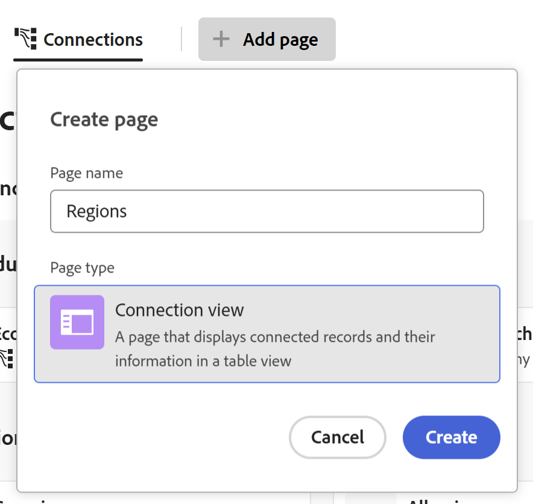
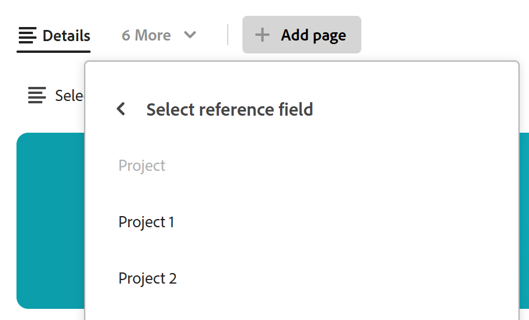
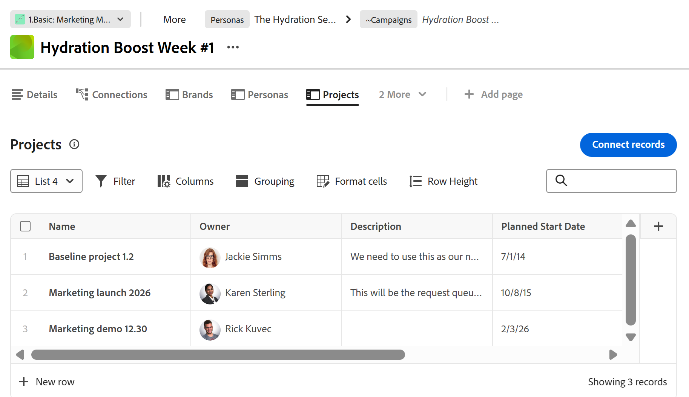

# Agregar una página de Registros conectados a un registro

La información resaltada en esta página hace referencia a una funcionalidad que aún no está disponible de forma general. Solo está disponible en el entorno de vista previa para todos los clientes. Después de las versiones mensuales en Production, las mismas funciones también están disponibles en el entorno Production para los clientes que habilitaron versiones rápidas. 

Para obtener información sobre las versiones rápidas, consulte [Habilitar o deshabilitar las versiones rápidas para su organización](/help/quicksilver/administration-and-setup/set-up-workfront/configure-system-defaults/enable-fast-release-process.md). 

Puede ver información de registros u objetos conectados agregando una ficha para una página Registros conectados a un registro en Adobe Workfront Planning. Esto agrega los registros conectados en una vista de tabla a la ficha.

Tenga en cuenta lo siguiente al agregar una página Registros conectados a un registro:

* Puede agregar una página Registros conectados a un registro después de conectar tipos de registro u objeto al tipo de registro desde su vista de tabla.

* Puede agregar una página Registros conectados desde el área de vista previa de un registro o desde la página del registro.

* Sólo puede tener una página de registros conectada para un tipo de registro específico.

  Por ejemplo, si crea una página de registros conectados para una campaña y desea mostrar sus personalidades conectadas, solo puede tener una página de registros conectados para personalidades.

* Las páginas Registros conectados sólo muestran los objetos o registros conectados de un tipo de objeto o registro. La página no muestra todos los registros de ese tipo.

* Según el tipo de objeto o registro que se muestre en la página de registros conectados, se pueden mostrar con las siguientes vistas:

   * Puede mostrar registros de Planning conectados en los siguientes tipos de vistas:
      * Tabla
      * Cronología
      * Calendario
   * Puede mostrar los proyectos de Workfront conectados en una vista de lista.

* Puede agregar páginas Registros conectados para los siguientes tipos de registros u objetos conectados:

   * Tipos de registros de Workfront Planning
   * Proyectos Workfront

     Puede ver los proyectos de Workfront conectados incluso cuando no tenga permisos para acceder a ellos en Workfront.

## Requisitos de acceso

+++ Expanda para ver los requisitos de acceso para la funcionalidad en este artículo. 

<table style="table-layout:auto"> 
<col> 
</col> 
<col> 
</col> 
<tbody> 
    <tr> 
<tr> 
</tr>   
<tr> 
   <td role="rowheader">
Paquete de Adobe Workfront
</td> 
   <td> 

Cualquier Workfront y cualquier paquete de Planning

Cualquier flujo de trabajo y cualquier paquete de Planning

Para obtener más información sobre lo que se incluye en cada paquete de Workfront Planning, póngase en contacto con su representante de cuentas de Workfront. 
 
   </td> 
<tr>
<td> 
   
 Productos adicionales
 </td> 
   <td> 
   
 Además de Adobe Workfront, debe tener lo siguiente si desea agregar una página de registro conectada para objetos de las siguientes aplicaciones:

   <ul><li>
Licencia de Adobe Experience Manager e integración entre Adobe Experience Manager y Workfront para conectar objetos de AEM con tipos de registros de Planning.

   
Para obtener más información, consulte <a href="/help/quicksilver/documents/adobe-workfront-for-experience-manager-assets-essentials/workfront-for-aem-asset-essentials.md">Adobe Workfront para Experience Manager Assets y Assets Essentials: índice de artículo</a>. 
</li>
   <li>
 Licencia de Adobe GenStudio for Performance Marketing para conectar tipos de registros con marcas de GenStudio

   
Para obtener más información, consulte <a href="https://experienceleague.adobe.com/en/docs/genstudio-for-performance-marketing/user-guide/get-started">Introducción a Adobe GenStudio for Performance Marketing</a>.
</li></ul>
   </td> 
  </tr>

<tr> 
   <td role="rowheader">
Licencia de Adobe Workfront
</td> 
   <td>
Estándar

   </td> 
  </tr> 
  <tr>
   <td role="rowheader">
Permisos de objeto
</td>
   <td>
   
Permisos de contribución o superior para un espacio de trabajo, tipo de registro y administrar permisos para un registro 
  
   
Los administradores del sistema tienen permisos para todos los espacios de trabajo, incluidos los que no crearon
 
  </td>
  </tr>   
</tbody> 
</table>

Para obtener más información acerca de los requisitos de acceso de Workfront, consulte [Requisitos de acceso en la documentación de Workfront](/help/quicksilver/administration-and-setup/add-users/access-levels-and-object-permissions/access-level-requirements-in-documentation.md).

+++   

## Agregar una página de Registros conectados a un registro

Primero debe conectar los tipos de registros con otros tipos de registros o proyectos de Workfront antes de agregar una página de registros conectada a un registro.

1. Haga clic en el nombre del registro para abrirlo desde cualquier vista de una página de tipo de registro.
1. Haga clic en **Agregar página** en una de las siguientes áreas:

   * Ventana de vista previa del registro
   * La página de detalles del registro, después de hacer clic en el icono **Abrir en ficha nueva**  en la esquina superior derecha de la página de vista previa.

   Se abre el cuadro **Crear página**.

   

1. Agregue **Nombre de página**, haga clic en **Página de registros conectados** para el **Tipo de página** y, a continuación, haga clic en **Crear**.
1. (Opcional) Haga clic en el nombre de un registro conectado o tipo de objeto en la lista, o búsquelo y, a continuación, haga clic en él cuando aparezca en la lista para crear la página para ese registro o tipo de objeto.

   >[!TIP]
   >
   >Puede crear una página de registros conectados por tipo de registro. Si un tipo de registro conectado ya tiene una página, ya no se muestra como opción.
   >

1. (Opcional y condicional) Si se muestra más de un campo conectado del tipo de registro u objeto para el que está creando la página, haga clic en el campo cuyos registros u objetos desee mostrar en la página de registros conectados de la lista **Seleccionar campo de referencia**.

   

   Se agrega una de las siguientes páginas a la página registros conectados:

   * La vista de tabla de un tipo de registro
   * La vista de lista de un tipo de objeto de proyecto

   Los registros o proyectos conectados al registro actual se muestran en la vista de tabla o lista.

   >[!TIP]
   >
   >Debe agregar registros conectados en la tabla o en el área Detalles de un registro para poder mostrarlos en una página de registros conectados. De lo contrario, la tabla o la lista estarán vacías.

   Los cinco primeros campos de los registros conectados se muestran de forma predeterminada. De forma predeterminada, no se muestran campos de búsqueda.

   

1. (Condicional) Según el tipo de registros que muestre en la página de registros conectada, realice una de las siguientes acciones:

   * Administrar registros de Planning
Para obtener más información, consulte la sección [Administrar la página de registros conectados para registros de Planning](#manage-the-connected-records-page-for-planning-records) en este artículo.
   * Administrar proyectos de Workfront
Para obtener más información, consulte la sección [Administrar la página de registros conectados para proyectos de Workfront](#manage-the-connected-records-page-for-workfront-projects) en este artículo.

1. (Opcional) Haga doble clic en el nombre de la ficha **Página de registros conectados**

   O

   Pase el ratón sobre el nombre de la ficha, luego haga clic en **Más**  y, a continuación, haga clic en **Cambiar nombre** para cambiar el nombre a la nueva ficha de página de registros conectados.

1. (Opcional) Pase el ratón sobre el nombre de la pestaña de la página de registros conectados, haga clic en **Más**  y, a continuación, haga clic en **Eliminar** para quitar a la pestaña.

### Administrar la página de registros conectados para registros de Planning

<!--

#### Manage the connected records page for Planning records in the Production environment

When you create a connected records page for  connected Planning records in the Production environment, do the following: (****or AEM Assets - AEM is not available yet?? see note below********)

1. Go to a record type page and click the name of a record. This opens the record's preview page.
1. Click the tab for a connected records page that display Planning records.
   The records connected to the record you selected display in the table view. 
1. Click **Connect** at the bottom of the table view to connect existing records, select them from the connection box, then click outside the box to close it. The records are automatically added to the table and connected to the record you selected. The records must exist before you can add them.

   For more information, see [Connect records](/help/quicksilver/planning/records/connect-records.md).

1. Edit any information from the connected records inline in the table view. 
1. Hover over a connected record's name, then click the **More** menu 

   Or 
   
   Select one of the records, then click one of the following options in the blue bar at the bottom of the list: 

   * **View** to open the record page in a new tab
   * **Copy link** to copy a link to the record page
   * **Edit thumbnail** to open the **Record thumbnail** box and edit the record's thumbnail image
   * **Duplicate** to duplicate the connected record. The duplicated record is also connected to the current record.
   * **Insert record above or below** to add new records to the connected record type. New records added here are also connected to the current record. This option is not available in the blue bar when selecting a record in the table.
   * **Delete** to delete the record. Deleting a connected record deletes it from its record type and from everywhere where the record is connected. The deleted records move to the **Recently deleted** bin of their record type.

      For information about editing records in the table view, see [Edit records](/help/quicksilver/planning/records/edit-records.md). 

      >[!TIP]
      >
      >You can select more than one record or object to delete them.
      >

1. Inline edit any of the records in the table on the connected records page.
1. Use any of the following view elements in the toolbar of a connected record page to manage the table view:

   * **Filters**
   * **Sort**
   * **Grouping**
   * **Fields**, to display, hide, or rearrange fields
   * **Row height**
   * **Search**

   For information, see [Manage the table view](/help/quicksilver/planning/views/manage-the-table-view.md). 

   >[!NOTE]
   >
   >You cannot create, edit, or delete fields in the table view of a connected record's tab.
   >

#### Manage the connected records page for Planning records in the Preview environment

When you create a connected records page for connected Planning records in the Preview environment, do the following: (***********or AEM Assets -- AEM is not available yet?? see note below**********)

-->

1. Vaya a una página de tipo de registro y haga clic en el nombre de un registro. Se abre la página de vista previa del registro.
1. Haga clic en la ficha de una página de registros conectados que muestra registros de Planning.
Los registros conectados al registro seleccionado se muestran en la vista de tabla.
1. Haga clic en **Conectar registros** en la esquina superior derecha de la página de registros conectada para conectar los registros existentes, selecciónelos en el cuadro de conexión y haga clic fuera del cuadro para cerrarlo. Los registros se agregan automáticamente a la tabla y se conectan al registro seleccionado. Los registros deben existir antes de que pueda agregarlos.

   Para obtener más información, consulte [Conectar registros](/help/quicksilver/planning/records/connect-records.md).

1. Haga clic en **Nueva fila** en la parte inferior de la tabla para agregar registros nuevos. Los registros nuevos se conectan automáticamente a los registros seleccionados.
1. Edite cualquier información de los registros conectados en línea en la vista de tabla.
1. Pase el ratón sobre el nombre de un registro conectado y luego haga clic en el menú **Más** 

   O

   Seleccione uno de los registros y, a continuación, haga clic en una de las siguientes opciones de la barra azul situada en la parte inferior de la lista:

   * **Ver** para abrir la página de registros en una nueva pestaña
   * **Copiar vínculo** para copiar un vínculo a la página de registro
   * **Editar miniatura** para abrir el cuadro **Grabar miniatura** y editar la imagen en miniatura del registro
   * **Duplicate** para duplicar el registro conectado. El registro duplicado también está conectado al registro actual.
   * **Inserte un registro por encima o por debajo de** para agregar nuevos registros al tipo de registro conectado. Los registros nuevos agregados aquí también están conectados al registro actual. Esta opción no está disponible en la barra azul al seleccionar un registro de la tabla.
   * **Eliminar** para eliminar el registro. Al eliminar un registro conectado, se elimina de su tipo de registro y de cualquier lugar donde esté conectado. Los registros eliminados se mueven al grupo **Eliminados recientemente** de su tipo de registro.

     Para obtener información acerca de cómo editar registros en la vista de tabla, vea [Editar registros](/help/quicksilver/planning/records/edit-records.md).

     >[!TIP]
     >
     >Puede seleccionar más de un registro u objeto para eliminarlos.

1. Edite en línea cualquiera de los registros de la tabla de la página de registros conectados.
1. Utilice cualquiera de los siguientes elementos de vista en la barra de herramientas de una página de registro conectada para administrar la vista de tabla:

   * **Filtros**
   * **Ordenar**
   * **Agrupación**
   * **Campos**, para mostrar, ocultar o reorganizar campos
   * **Altura de fila**
   * **Búsqueda**

   Para obtener más información, consulte [Administrar la vista de tabla](/help/quicksilver/planning/views/manage-the-table-view.md).

   >[!NOTE]
   >
   >No puede crear, editar ni eliminar campos en la vista de tabla de la ficha de un registro conectado.
   >

1. Haga clic en el menú desplegable de vistas en la esquina superior derecha de la página de registros conectada, haga clic en **Nueva vista** para agregar una nueva vista para la página y, a continuación, haga lo siguiente:

   1. Agregar **nombre de vista**.
   1. En el área **Tipo de vista**, seleccione uno de los siguientes tipos de vistas:

      * Tabla
Para obtener más información, vea [Administrar la vista de tabla](/help/quicksilver/planning/views/manage-the-table-view.md)
      * Cronología
Para obtener más información, consulte [administrar la vista de cronología](/help/quicksilver/planning/views/manage-the-timeline-view.md).
      * Calendario
Para obtener más información, vea [Administrar la vista de calendario](/help/quicksilver/planning/views/manage-the-calendar-view.md).

        Para obtener más información, consulte la sección [Administrar varias vistas desde la página de registros conectados](#manage-multiple-views-from-the-connected-records-page) en este artículo.

   1. Haga clic en **Crear**.
Se añade una nueva vista al menú desplegable de vistas.

   1. (Opcional) Pase el ratón sobre el nombre de una vista que haya creado, haga clic en el menú **Más**  y, a continuación, haga clic en una de las siguientes opciones:

      * **Cambiar nombre**, para agregar un nuevo nombre para la vista.
      * **Compartir**

        Para obtener más información, consulte [Compartir vistas](/help/quicksilver/planning/access/share-views.md).
      * **Exportar**

      * **Eliminar**
Para obtener más información, consulte [Eliminar vistas de registros](/help/quicksilver/planning/views/delete-record-views.md).

        

        >[!NOTE]
        >
        >No puede eliminar una vista de sistema creada por Workfront.

### Administrar la página de registros conectados para proyectos de Workfront

Cuando cree una página de registros conectada para proyectos conectados de Workfront, haga lo siguiente para administrar la página:

1. Vaya a una página de tipo de registro y haga clic en el nombre de un registro. Se abre la página de vista previa del registro.
1. Haga clic en la ficha de una página de registros conectada que muestre proyectos de Workfront.

   

   Los proyectos conectados al registro seleccionado se muestran en la vista de lista.

   Para obtener información acerca de cómo administrar o editar objetos en la vista de lista, vea [Administrar la vista de lista](/help/quicksilver/planning/views/manage-the-list-view.md).

<!-- 
removed this part, so we won't have to have duplicate information to keep up with for the list view in Planning: 
1. Click **Connect records** in the upper-right corner of the connected record page to connect existing projects.

   For information, see [Connect records](/help/quicksilver/planning/records/connect-records.md).
1. Double-click inside a cell in the list view to edit a project's fields. Some fields are read-only. 
1. Do one of the following to edit the list view: 

   * Click **New row** to create a project without a template. The new project is automatically connected to the current record.

      For more information, see [Create Workfront objects from Workfront Planning as you connect them to records](/help/quicksilver/planning/records/create-workfront-objects-from-workfront-planning.md).
   * Click **Create records **in the upper-right corner of the view to add existing projects. Projects are immediately connected to the selected record. 

   * Hover over a project name in the list and click the **More** menu [More menu](assets/more-menu.png) and click **View** to open the project in another tab
     
      Or

      Select one or more projects, and from the actions bar at the bottom of the list, click **Delete** or **Disconnect** to remove the item from the list.
      

   * Click the views dropdown menu, and click **New view** to add a new view for the page, then do the following, or click the **More** menu  to the right of a new name, then **Rename**, **Share**, or **Delete** the view. 

      You cannot rename, share or delete System Views or views you do not have Manage permissions to.

      

   * Click one of the following to update the view's elements: 

      * **Filter** to limit the amount of information in the list
      * **Columns** to hide columns or change their order
      * The **+** icon in the upper-right corner of the table view to add existing fields to the list. Fields must exist before you can add them. 

   For more information about managing objects in a list view, see [Manage the list view](/help/quicksilver/planning/views/manage-the-list-view.md).
-->

<!--
 this is repetitive from an earlier section above: 

## Manage multiple views from the connected records page

You can add and manage multiple view types from the connected records page of a record. 

The views you create in the Connected records page of a record type are available everywhere in Workfront Planning where that record type page displays. Views created for the same record type anywhere else in Workfront Planning are also accessible in all connected records pages of that record type. 

To manage multiple views from the connected records page: 

1. (Conditional) When displaying Planning records in the connected records page, click the dropdown menu to the right of the view name, then click **New view** to add a view, then select from the following options: 

   * **Table**. For more information, see [Manage the table view](/help/quicksilver/planning/views/manage-the-table-view.md). 
   * **Timeline**. For more information, see [Manage the timeline view](/help/quicksilver/planning/views/manage-the-timeline-view.md).
   * **Calendar**. For more information, see [Manage the calendar view](/help/quicksilver/planning/views/manage-the-calendar-view.md). 

1. (Optional) Hover over the name of a view in the Connected records page, then click the **More** menu , then click one of the following: 

   * **Rename**
   * **Share**. For more information, see [Share views](/help/quicksilver/planning/access/share-views.md).

   >[!TIP]
   >
   >Sharing views from Connected records pages makes them accessible to users in all areas of Workfront Planning where the view displays. 
   >Also, if a view is shared from any other area of Workfront Planning, it is also available to the same users in Connected records pages. 

   * **Export** 
   * **Delete**

   <!--
   not possible right now: * **Duplicate**. For more information, see [Duplicate record views](/help/quicksilver/planning/views/duplicate-record-views.md).
      >[!TIP]
      >
      >Duplicating a view from Connected records pages makes it available in all other areas of Workfornt planning, when viewing the same record types.
      -->

<!--
No longer possible: 1. (Optional and conditional) When you create a connected records page for the following Workfront object types:
         * Portfolios
         * Programs
         * Groups
         * Companies
      Do any of the following in the table view of the connected records page: 
      * Click the name of a object. This opens the object's page in a new tab. 
      * Click **Connect** at the bottom of the table view to connect existing objects, select them from the connection box, then click outside the box to close it. The objects are automatically added to the table. The objects must exist before you can add them.
      For more information, see [Connect records](/help/quicksilver/planning/records/connect-records.md).
      * Select one of the objects in the table view, then click one of the following options in the blue bar at the bottom of the list: 
      * **View** to open the record page in a new tab
      * **Copy link** to copy a link to the record page
      * **Disconnect** to disconnect the object from the record you are viewing. 
      TIP      
      You can select more than one record or object to disconnect them.
      -->
