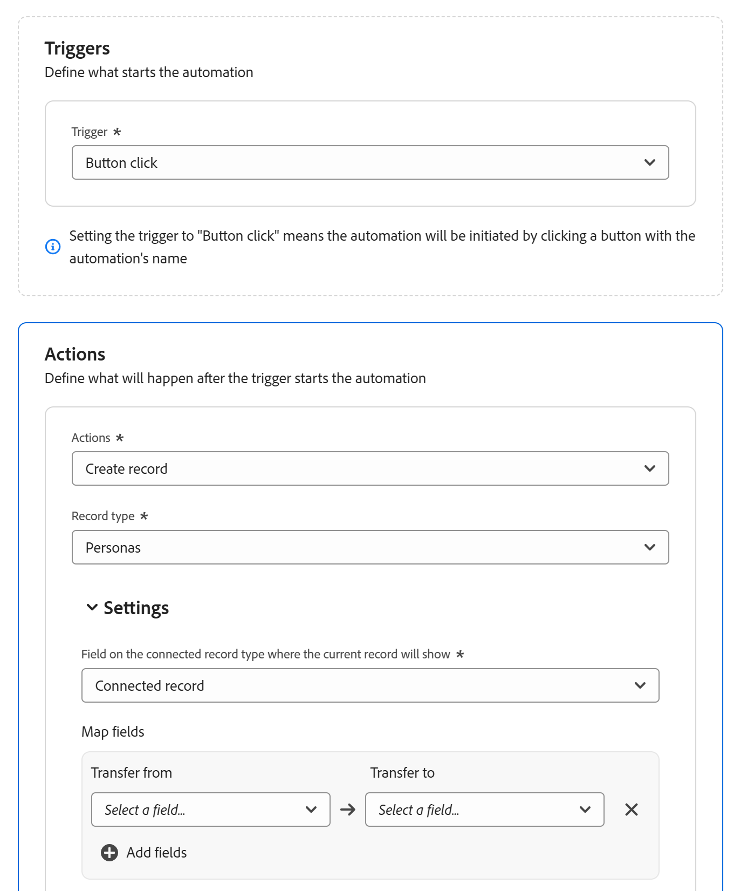

# Configuración de automatizaciones de Adobe Workfront Planning

<!--add screen shots when UI is finalized AND redo all the steps - some things got changed and moved around-->

<!--you might need to add something about notifications and emails?!-->
<!--add a new section to this article to mention a new way to create objects: help/quicksilver/planning/records/create-records.md-->
<!-- add a new section to this article to mention a new way to create WF objects from Planning: help/quicksilver/planning/records/create-workfront-objects-from-workfront-planning.md-->

<!-- if they give access to use the automation to people with LESS than Manage permissions to a workspace, split this article in two: the Configure section should be for admins and the "Use a Workfront Planning automation to create an object" should be for all other users-->

<!--The highlighted information on this page refers to functionality not yet generally available. It is available only in the Preview environment for all customers. After the monthly releases to Production, the same features are also available in the Production environment for customers who enabled fast releases.    

For information about fast releases, see [Enable or disable fast releases for your organization](/help/quicksilver/administration-and-setup/set-up-workfront/configure-system-defaults/enable-fast-release-process.md). -->

Puede configurar automatizaciones en Adobe Workfront Planning que, cuando estén activadas, creen objetos en Workfront o registros en Workfront Planning cuando se activen desde un registro de Planning. Los objetos o registros creados se conectan automáticamente a los registros desde los que activa la automatización.

Puede configurar y activar la automatización en la página del tipo de registro en Workfront Planning.

Por ejemplo, puede crear una automatización que tome una campaña de Workfront Planning y cree un proyecto en Workfront para rastrear el progreso de esa campaña.

En este artículo se describe cómo administrar las automatizaciones, incluido cómo editarlas, deshabilitarlas, eliminarlas y almacenarlas en déclencheur para crear objetos y registros.

Para obtener información acerca de cómo crear registros u objetos mediante una automatización existente, vea [Crear objetos mediante automatizaciones de registros de Adobe Workfront Planning](/help/quicksilver/planning/records/create-wf-objects-using-planning-automations.md).

## Requisitos de acceso

+++ Expanda para ver los requisitos de acceso para la funcionalidad en este artículo. 

<table style="table-layout:auto"> 
<col> 
</col> 
<col> 
</col> 
<tbody> 
    <tr> 
<tr> 
</tr>   
<tr> 
   <td role="rowheader">
paquete de Adobe Workfront
</td> 
   <td> 
<ul> 
<li>
Cualquier Workfront y cualquier paquete de Planning
</li>
O
<li>
Cualquier flujo de trabajo y cualquier paquete de Planning
</li></ul>

Para obtener más información sobre lo que se incluye en cada paquete de Workfront Planning, póngase en contacto con su representante de cuentas de Workfront. 
 
   </td> 
  <tr> 
   <td role="rowheader">
Licencia de Adobe Workfront
</td> 
   <td>
Estándar

   </td> 
  </tr> 
  <tr> 
   <td role="rowheader">
Permisos de objeto
</td> 
   <td> 
Administre permisos al espacio de trabajo y al tipo de registro donde desee crear automatizaciones. 

   
Los administradores del sistema tienen permisos de administración en todos los espacios de trabajo, incluidos los que no han creado

   </td> 
  </tr>  
</tbody> 
</table>

Para obtener más información acerca de los requisitos de acceso de Workfront, consulte [Requisitos de acceso en la documentación de Workfront](/help/quicksilver/administration-and-setup/add-users/access-levels-and-object-permissions/access-level-requirements-in-documentation.md).

+++   

<!--Old:
<table style="table-layout:auto"> 
<col> 
</col> 
<col> 
</col> 
<tbody> 
    <tr> 
<tr> 
<td> 
   
 Products
 </td> 
   <td> 
   <ul><li>
 Adobe Workfront
</li> 
   <li>
 Adobe Workfront Planning
</li></ul></td> 
  </tr>   
<tr> 
   <td role="rowheader">
Adobe Workfront plan*
</td> 
   <td> 

Any of the following Workfront plans:
 
<ul><li>Select</li> 
<li>Prime</li> 
<li>Ultimate</li></ul> 

Workfront Planning is not available for legacy Workfront plans
 
   </td> 
<tr> 
   <td role="rowheader">
Adobe Workfront Planning package*
</td> 
   <td> 

Any 
 

For more information about what is included in each Workfront Planning plan, contact your Workfront account manager. 
 
   </td> 
 <tr> 
   <td role="rowheader">
Adobe Workfront platform
</td> 
   <td> 

Your organization's instance of Workfront must be onboarded to the Adobe Unified Experience to be able to access Workfront Planning.
 

For more information, see <a href="/help/quicksilver/workfront-basics/navigate-workfront/workfront-navigation/adobe-unified-experience.md">Adobe Unified Experience for Workfront</a>. 
 
   </td> 
   </tr> 
  </tr> 
  <tr> 
   <td role="rowheader">
Adobe Workfront license*
</td> 
   <td> Standard
   
Workfront Planning is not available for legacy Workfront licenses
 
  </td> 
  </tr> 
  <tr> 
   <td role="rowheader">
Access level configuration
</td> 
   <td> 
There are no access level controls for Adobe Workfront Planning
 
   
Edit access with access to Create objects in Workfront for the object types that you want to create (projects, portfolios, programs). 
  
</td> 
  </tr> 
<tr> 
   <td role="rowheader">
Object permissions
</td> 
   <td> 
Manage permissions to the workspace and to the record type where you want to create automations. 

   
System Administrators have Manage permissions to all workspaces, including the ones they did not create

   </td> 
  </tr> 
</tbody> 
</table> -->

## Configuración de una automatización en Workfront Planning

Debe configurar una automatización para un tipo de registro en Workfront Planning antes de poder utilizarlo para crear objetos.

{{step1-to-planning}}

1. Haga clic en una tarjeta de tipo de registro y, a continuación, haga clic en el nombre de un registro.

   Se abre la página de tipo de registro.
1. Haga clic en el menú **Más**  que hay a la derecha del nombre del tipo de registro y, a continuación, haga clic en **Administrar automatizaciones**.

   Se abre la lista de automatizaciones disponibles para el tipo de registro seleccionado.

1. Haga clic en **Nueva automatización** en la esquina superior derecha de la pantalla. Se abre el cuadro **Nueva automatización**.
1. Actualice los campos siguientes:

   * Reemplace **automatización sin título** por el texto que desea que aparezca en el botón de automatización. Los usuarios harán clic en este botón cuando utilicen la automatización para crear un objeto de Workfront o un registro de Planning.
   * **Descripción**: agregue una descripción para identificar el propósito de la automatización.
1. Haga clic en **Guardar**.
Se abre la página de detalles de automatización.

1. En la página de detalles de la automatización, actualice los campos siguientes en la sección **Déclencheur**:

   * **Déclencheur**: seleccione la acción que almacenará en déclencheur la automatización. Por ejemplo, seleccione **clic en botón**. <!--update this step with a list of all possible triggers; right now only Button click is available-->

1. Actualice los campos siguientes en la sección **Acciones**: <!--submitted bugs for these fields - see if they need changing here-->
   * **Acciones**: seleccione la acción que desea que realice Workfront al activar la automatización. Este campo es obligatorio.
Seleccione una de las siguientes acciones:

      * Crear varios proyectos
      * Crear un proyecto único
      * Crear proyecto
      * Crear registro
      * Crear programa
      * Crear portafolio
      * Crear grupo

     >[!TIP]
     >
     >Una vez guardada la automatización, ya no puede cambiar la acción seleccionada en este campo.

1. (Condicional) Según la acción seleccionada, actualice los campos siguientes:

   * **Crear un solo proyecto**: <!--replace to the left: Create a single project-->
      * **Campo conectado donde se crea el proyecto**: este es el campo conectado donde se mostrará el nuevo proyecto. Este campo es obligatorio.
      * **Plantilla de proyecto**: seleccione una plantilla de proyecto que Workfront usará para crear el proyecto.

   * Cree varios proyectos:
      * **Campo conectado donde se crea el proyecto**: este es el campo conectado donde se mostrará el nuevo proyecto. Este campo es obligatorio.
      * **Campo cuyas opciones crearán los registros**: elija un campo de selección múltiple o única del tipo de registro seleccionado. Workfront crea un proyecto para cada opción de campo seleccionada actualmente en el registro desde el que se almacena en déclencheur la automatización.

     >[!TIP]
     >
     >Se crea un proyecto únicamente para las opciones seleccionadas actualmente en el campo de selección múltiple o única del registro desde el que se ejecuta la automatización y no para todas las opciones posibles para ese campo.
     >

      * **Usar la misma plantilla**: seleccione esta opción para usar la misma plantilla para cada nuevo proyecto. Si la opción no está seleccionada, seleccione una **plantilla de proyecto** para cada opción de campo.
      * **Plantilla de proyecto**: Si seleccionó la opción **Usar la misma plantilla**, seleccione una plantilla de proyecto que Workfront usará para crear los proyectos.

   * **Crear cartera**:
      * **Campo conectado donde se crea el portafolio**: este es el campo conectado donde se mostrará el nuevo portafolio. Este campo es obligatorio.
      * **Formulario personalizado para adjuntar al nuevo portafolio**: seleccione un formulario personalizado para adjuntarlo al nuevo portafolio. Debe crear un formulario personalizado de portafolio para poder seleccionarlo.
   * **Crear programa**:
      * **Campo conectado donde se crea el programa**: Este es el campo conectado donde se mostrará el nuevo programa. Este campo es obligatorio.
      * **Portafolio de programas**: seleccione un portafolio donde se agregará el nuevo programa. Este campo es obligatorio.
      * **Formulario personalizado para adjuntar al nuevo programa**: seleccione un formulario personalizado para adjuntarlo al nuevo programa. Debe crear un formulario personalizado de programa para poder seleccionarlo.
   * **Crear grupo**:
      * **Campo conectado donde se crea el grupo**: Este es el campo conectado donde se mostrará el nuevo grupo. Este campo es obligatorio.
      * **Formulario personalizado para adjuntar al nuevo grupo**: seleccione un formulario personalizado para adjuntarlo al nuevo programa. Debe crear un formulario personalizado de programa para poder seleccionarlo.
   * **Crear registro**:
      * **Tipo de registro**: seleccione el tipo de registro que desea crear.

        Se muestra la subsección **Configuración**. Actualice los campos siguientes en la subsección **Configuración**:

         * **Campo del tipo de registro conectado donde se mostrará el registro actual**: Este es el campo conectado del tipo de registro seleccionado para la acción donde se mostrará el registro actual.

        Por ejemplo, si está creando una automatización para que las campañas conecten registros de producto desde, este es el campo conectado del tipo de registro de producto desde donde se mostrarán las campañas, después de crear los productos con la automatización.

        Este campo es obligatorio.

        <!--submitted a change in functionality and UI text for this - revise??-->
En el área **Asignar campos**, actualice la siguiente información:

         * **Transferir de**: seleccione campos del tipo de registro para el que se creó la automatización para asignarlos a los campos del tipo de registro conectado.
         * **Transferir a**: seleccione campos del registro recién creado que se rellenarán con información del registro desde el que está ejecutando la automatización.

        >[!TIP]
        >
        >* Los tipos de campo del tipo de registro original deben coincidir con los tipos de campo del tipo de registro recién creado.
        >* Si no elige ningún campo, los nombres de los registros nuevos serán **Registro sin título**.

1. (Opcional y condicional) Si seleccionó crear un registro, haga clic en **Agregar campos** para asignar campos de búsqueda adicionales de un registro a otro.
1. (Condicional) Si no hay campos de conexión entre el tipo de registro original y el tipo de registro seleccionado en el campo **Tipo de registro**, haga clic en **Agregar campo conectado**.

   

   Se crean los dos campos siguientes:

   * Se crea un nuevo campo de conexión denominado **Registro conectado** para el tipo de registro indicado en el campo **Tipo de registro**.
   * Se crea un nuevo campo de conexión con el mismo nombre que el indicado en el campo **Tipo de registro** para el tipo de registro para el que está configurando la automatización.

     Por ejemplo, si está configurando una automatización para que Campaigns cree automáticamente otro tipo de registro llamado Brands y hace clic en **Agregar campo conectado**, se crearán los siguientes campos:

      * El campo de conexión **Registro conectado** se ha creado para el tipo de registro **Marcas**.
      * El campo de conexión **Marcas** se ha creado para el tipo de registro **Campañas**.

1. (Opcional) Si no hay campos de conexión entre el tipo de registro original y el objeto de Workfront seleccionado en el área Acciones, haga clic en **Agregar campo conectado**.

   

   Se crean las siguientes opciones:

   * Se crea un nuevo campo de conexión denominado **Conectado &lt; nombre del objeto de Workfront >** para el tipo de registro para el que se genera la automatización. Por ejemplo, se crea un campo **Proyecto conectado** para el tipo de registro para el que está generando la automatización, cuando decide crear proyectos automáticamente.
   * Se agrega una nueva tarjeta de tipo de registro a la sección Planificación de un proyecto de Workfront, en Workfront con el nombre del tipo de registro para el que está configurando la automatización.

1. Haga clic en **Guardar** en la esquina superior derecha de la página de detalles de automatización.

   La automatización se muestra en la lista de automatizaciones y está disponible para su uso en registros.

## Administración de automatizaciones existentes

{{step1-to-planning}}

1. Haga clic en una tarjeta de tipo de registro y, a continuación, haga clic en el nombre de un registro.

   Se abre la página de tipo de registro.
1. Haga clic en el menú **Más**  que hay a la derecha del nombre del tipo de registro y, a continuación, haga clic en **Administrar automatizaciones**.

   Se abre la lista de automatizaciones disponibles para el tipo de registro seleccionado.

1. (Opcional) Para editar, deshabilitar o eliminar una automatización, realice una de las siguientes acciones:

   1. En la lista de automatizaciones, pase el ratón sobre el nombre de una automatización guardada y luego haga clic en el menú **Más** .

   1. Haga clic en **Editar** para actualizar la siguiente información:

      * Haga clic en el menú **Más**  que se encuentra a la derecha del nombre de la automatización y, a continuación, haga clic en **Editar** para cambiar el nombre de la automatización.
      * Cualquier campo en la automatización, excepto el campo **Actions**.

        >[!TIP]
        >
        >No puede cambiar la acción que seleccionó originalmente para una automatización.

   1. Haga clic en **Deshabilitar** para quitar la automatización de la vista de tabla del registro e impedir que los usuarios la usen para crear registros u objetos.

      Los registros que se han creado con una automatización deshabilitada permanecen conectados al registro seleccionado originalmente.

      Para que vuelva a estar disponible, vuelve a hacer clic en el menú **Más**  y, a continuación, haz clic en **Activar**.
   1. Haga clic en **Eliminar** para eliminar la automatización. Una automatización eliminada no se puede recuperar.

      Los registros creados con una automatización eliminada permanecen conectados al registro seleccionado originalmente.
