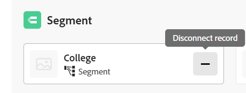

# Conectar registros

<!--

The highlighted information on this page refers to functionality not yet generally available. It is available only in the Preview environment for all customers. After the monthly releases to Production, the same features are also available in the Production environment for customers who enabled fast releases.    

For information about fast releases, see [Enable or disable fast releases for your organization](/help/quicksilver/administration-and-setup/set-up-workfront/configure-system-defaults/enable-fast-release-process.md). 

-->

{{planning-important-intro}}

Puede conectar registros de Adobe Workfront Planning entre sí o a objetos de otras aplicaciones. Puede mostrar información de un registro en otro registro cuando los conecte.

Este artículo describe cómo conectar registros. Para obtener información más general acerca de los registros de conexión, vea [Información general sobre los registros conectados](/help/quicksilver/planning/records/connected-records-overview.md).

Primero debe conectar dos tipos de registro entre sí o un tipo de registro a un tipo de objeto de otra aplicación. Esto crea campos de registro conectados. A continuación, puede conectar registros entre sí o registros a otros objetos de otras aplicaciones en los campos de registros conectados.

Conectar registros es similar a conectar registros a objetos de otra aplicación.

Para obtener información acerca de cómo conectar tipos de registros entre sí o con tipos de objetos de otras aplicaciones, consulte [Conectar tipos de registro](/help/quicksilver/planning/architecture/connect-record-types.md).

Para ver un ejemplo de cómo conectar tipos de registros, consulte [Ejemplo de conexión de tipos de registro y registros](/help/quicksilver/planning/architecture/example-connect-record-types-and-records.md).

Puede conectar lo siguiente:

* Registros de Adobe Workfront Planning entre sí
* Registros de Adobe Workfront Planning con objetos de otras aplicaciones.

  Puede conectar registros con objetos de los tipos que se indican a continuación desde las aplicaciones siguientes:

   * Adobe Workfront

      * Proyectos
      * Portafolios
      * Programas
      * Compañías
      * Grupos

   * Adobe Experience Manager Assets

      * Archivos de imágenes
      * Carpetas

  <!--when you add more objects, fix the Access Requirements below which right now refer only to projects-->

## Requisitos de acceso

+++ Expanda para ver los requisitos de acceso para la funcionalidad en este artículo. 

<table style="table-layout:auto"> 
<col> 
</col> 
<col> 
</col> 
<tbody> 
    <tr> 
<tr> 
</tr>   
<tr> 
   <td role="rowheader">
Paquete de Adobe Workfront
</td> 
   <td> 

Cualquier Workfront y cualquier paquete de Planning

Cualquier flujo de trabajo y cualquier paquete de Planning

Para obtener más información sobre lo que se incluye en cada paquete de Workfront Planning, póngase en contacto con su representante de cuentas de Workfront. 
 
   </td> 
<tr> 
<td> 
   
 Productos adicionales
 </td> 
   <td> 
   
 Además de Adobe Workfront, debe tener lo siguiente si desea conectar registros con objetos de las siguientes aplicaciones:

   <ul><li>
Licencia de Adobe Experience Manager Assets e integración entre AEM Assets y Workfront para conectar recursos de AEM con tipos de Planning.

   
Para obtener más información, consulte <a href="/help/quicksilver/documents/adobe-workfront-for-experience-manager-assets-essentials/workfront-for-aem-asset-essentials.md">Adobe Workfront para Experience Manager Assets y Assets Essentials: índice de artículo</a>. 
</li>
   <li>
 Licencia de Adobe GenStudio for Performance Marketing para conectar tipos de registros con marcas de GenStudio

   
Para obtener más información, consulte <a href="https://experienceleague.adobe.com/es/docs/genstudio-for-performance-marketing/user-guide/get-started">Introducción a Adobe GenStudio for Performance Marketing</a>.
</li></ul>
   </td> 
  </tr>   
<tr> 
  <tr> 
   <td role="rowheader">
Licencia de Adobe Workfront
</td> 
   <td>
Estándar

   </td> 
  </tr> 
   <tr> 
   <td role="rowheader">
Configuración de nivel de acceso
</td> 
   <td> 
No hay controles de nivel de acceso para Adobe Workfront Planning
 
   
Acceso superior o de visualización para los tipos de objeto a los que desea conectarse en Workfront y AEM Assets. 
  
</td> 
  </tr>
  <tr> 
   <td role="rowheader">
Permisos de objeto
</td> 
   <td>   
Permisos de contribución o superiores a un espacio de trabajo y tipo de registro para conectar registros. 
  
   
Permite ver o aumentar los permisos de un espacio de trabajo y tipo de registro para ver todas las conexiones a objetos y campos desde otras aplicaciones, independientemente del acceso que tenga en la otra aplicación. 

   
Permisos de visualización superiores a los objetos que desea vincular desde Workfront o Experience Manager Assets. 

   
Los administradores del sistema tienen permisos para todos los espacios de trabajo, incluidos los que no crearon.
 </td> 
  </tr>   
</tbody> 
</table>

Para obtener más información acerca de los requisitos de acceso de Workfront, consulte [Requisitos de acceso en la documentación de Workfront](/help/quicksilver/administration-and-setup/add-users/access-levels-and-object-permissions/access-level-requirements-in-documentation.md).

+++   

<!--Old:

<table style="table-layout:auto"> 
<col> 
</col> 
<col> 
</col> 
<tbody> 
    <tr> 
<tr> 
<td> 
   
 Products
 </td> 
   <td> 
   <ul><li>
 Adobe Workfront
</li> 
   <li>
 Adobe Workfront Planning
</li>
   <li>
Adobe Experience Manager Assets, if you want to connect AEM assets with Planning records

   
You must have an Adobe Experience Manager Assets license and an integration between AEM Assets and Workfront.
    For information, see <a href="/help/quicksilver/documents/adobe-workfront-for-experience-manager-assets-essentials/workfront-for-aem-asset-essentials.md">Adobe Workfront for Experience Manager Assets and Assets Essentials: article index</a>. 

   </li>  
   </ul></td> 
  </tr>   
<tr> 
   <td role="rowheader">
Adobe Workfront plan*
</td> 
   <td> 

Any of the following Workfront plans:
 
<ul><li>Select</li> 
<li>Prime</li> 
<li>Ultimate</li></ul> 

Workfront Planning is not available for legacy Workfront plans
 
   </td> 
<tr> 
   <td role="rowheader">
Adobe Workfront Planning package*
</td> 
   <td> 

Any 
 

For more information about what is included in each Workfront Planning plan, contact your Workfront account manager. 
 
   </td> 
 <tr> 
   <td role="rowheader">
Adobe Workfront platform
</td> 
   <td> 

Your organization's instance of Workfront must be onboarded to the Adobe Unified Experience to be able to access Workfront Planning.
 

For more information, see <a href="/help/quicksilver/workfront-basics/navigate-workfront/workfront-navigation/adobe-unified-experience.md">Adobe Unified Experience for Workfront</a>. 
 
   </td> 
   </tr> 
  </tr> 
  <tr> 
   <td role="rowheader">
Adobe Workfront license*
</td> 
   <td> Standard
   
Workfront Planning is not available for legacy Workfront licenses
 
  </td> 
  </tr> 
  <tr> 
   <td role="rowheader">
Access level configuration
</td> 
   <td> 
There are no access level controls for Adobe Workfront Planning objects
 
   
View or higher permissions to the object types you want to link from Workfront.
   
</td> 
  </tr> 
<tr> 
   <td role="rowheader">
Object permissions
</td> 
   <td>   
Contribute or higher permissions to a workspace and record type to connect records 
  
   
View or higher permissions to a workspace and record type to view all connections to objects and fields from other applications, regardless of your access in the other application. 

   
View or higher permissions to the objects you want to link from Workfront or Experience Manager Assets. 

   
System Administrators have permissions to all workspaces, including the ones they did not create.
 </td> 
  </tr> 
</tbody> 
</table> -->

## Consideraciones para conectar registros

* Para conectar registros con otros registros u objetos, debe tener lo siguiente:

   * Al menos un espacio de trabajo, tipo de registro y registro.

     Para obtener más información, consulte los siguientes artículos:

      * [Crear espacios de trabajo](/help/quicksilver/planning/architecture/create-workspaces.md)
      * [Crear tipos de registro](/help/quicksilver/planning/architecture/create-record-types.md)
      * [Crear registros](/help/quicksilver/planning/records/create-records.md)

   * Conexiones entre los tipos de registro o entre los tipos de registro y los objetos de otras aplicaciones. Para obtener más información, consulte [Conectar tipos de registros](/help/quicksilver/planning/architecture/connect-record-types.md).

* Puede conectar uno o varios registros u objetos entre sí. Esto depende del tipo de conexión seleccionado al conectar los tipos de registro u objeto. Para obtener más información, consulte [Información general sobre los tipos de registros de Connect](/help/quicksilver/planning/architecture/connect-record-types-overview.md).

## Conectar registros desde Workfront Planning

Puede conectar registros de Workfront Planning en las siguientes áreas de un registro de Planning:

* Los campos de registro conectados en la vista de tabla.
* El cuadro de vista previa o la página del registro en los campos de registro conectados de la ficha Detalles.
* Cuadro de vista previa o página del registro en la ficha Conexiones.
* La página del registro en una ficha de página Registros conectados.

### Conecte los registros de Workfront Planning desde la vista de tabla o desde el área Detalles de un registro

{{step1-to-planning}}

1. Haga clic en el espacio de trabajo cuyos registros desee conectar.

   El espacio de trabajo se abre y los tipos de registro se muestran como tarjetas.
1. Haga clic en la tarjeta de un tipo de registro para abrir la página del tipo de registro.
1. Haga clic en el nombre de una vista de tabla para abrirla.
1. (Opcional) Añada registros al tipo de registro seleccionado añadiendo una nueva fila a la tabla. Para obtener más información, consulte [Crear registros](/help/quicksilver/planning/records/create-records.md).
1. (Condicional) Después de conectar el tipo de registro seleccionado con otro tipo de registro, vaya al campo conectado de un registro y haga clic dentro del campo o haga clic en **Conectar** para agregar un registro.

   

1. Realice una de las siguientes acciones:

   * Haga clic en el nombre de un registro conectado de la lista para añadirlo al registro seleccionado. El registro se añade automáticamente.
   * Empiece a escribir el nombre de un registro y haga clic en él cuando aparezca en la lista. El registro se añade automáticamente.

   >[!TIP]
   >
   >Si sólo se seleccionó la imagen del registro para mostrarla cuando se conectaron los tipos de registro, sólo se mostrará la miniatura o el icono del registro en el campo conectado. Para obtener más información, consulte [Conectar tipos de registro](/help/quicksilver/planning/architecture/connect-record-types.md).
   >

1. (Condicional) Si seleccionó Uno a varios o Uno a uno para el tipo Conexión cuando conectó los tipos de registro, e intenta conectar un registro o un objeto que ya está conectado en otro lugar, recibirá una advertencia indicando que conectarlo de nuevo lo quitará de la conexión original. Haga clic en **Conectar** para permitir la eliminación y conectar el registro, o en **Cancelar** para volver al campo y seleccionar otro registro.
1. (Opcional) Si no encuentra un objeto para conectarse y desea agregarlo, haga clic en **+ Agregar**

   O

   Empiece a escribir un nombre para el objeto y, a continuación, haga clic en **+ Agregar** para crearlo y agregarlo.

   Para obtener más información, vea la sección &quot;Crear registros a medida que los conecta desde otros registros&quot; en el artículo [Crear registros](/help/quicksilver/planning/records/create-records.md).

   >[!TIP]
   >
   >    Puede abrir la página de un registro y conectar otros registros haciendo lo siguiente en la vista de tabla:
   >1. Haga clic en el nombre del registro en la vista.
   >1. Busque el campo de registro vinculado y haga doble clic en el campo (si hay registros ya conectados)
   >O
   >Haga clic en **Conectar registros** (si el campo está vacío) para agregar registros del tipo de objeto o registro conectado.
   >
   >

1. (Opcional) Haga clic en **Ver todo** para mostrar todos los registros.

1. (Condicional) Si hizo clic en **Ver todo** en el paso anterior, se muestra el cuadro **Conectar objetos**.

   

1. Comience a escribir el nombre de un registro en el cuadro de búsqueda y, a continuación, selecciónelo cuando aparezca en la lista

   O

   Seleccione el nombre de uno o varios registros en el cuadro y, a continuación, haga clic en **Conectar objetos**.

   Se añaden los elementos siguientes:

   * Los registros vinculados se muestran en el campo de registro vinculado del registro seleccionado en un paso anterior.
   * Los campos vinculados se rellenan con la información de los registros vinculados si añadió campos de búsqueda vinculados al conectar los tipos de registro.

   Al actualizar los registros vinculados, se actualizan automáticamente los campos vinculados de los registros que está vinculando. Los campos vinculados no se pueden editar manualmente.

   >[!TIP]
   >
   >* Utilizamos “campos vinculados” y “campos de búsqueda” indistintamente.
   >
   >* Si elige conectar varios registros al conectar los tipos de registro, los valores de campo de los objetos múltiples se muestran separados por comas o se agregan según el agregador elegido al conectar los tipos de registro.
   >* No puede agregar campos de escritura anticipada de Workfront (incluidos campos como Propietario del proyecto o Patrocinador del proyecto) como campos de búsqueda.
   >
   >* La información del campo de fecha de los objetos de Workfront se muestra en formato de 24 horas en Workfront Planning, independientemente de cómo se muestre en Workfront.
   >
   >   Por ejemplo, si la fecha planificada de inicio de un proyecto se muestra como las 3:00 p.m. en Workfront, se mostrará como 15:00 en Workfront Planning en un campo de búsqueda importado.

1. (Opcional) Cierre la página de tipo de registro y vaya al espacio de trabajo seleccionado.
1. Haga clic en la tarjeta del tipo de registro al que está vinculado.

   Por ejemplo, si conectó el registro **Campaña** con el registro Producto, haga clic en la tarjeta **Producto**.

   La tarjeta de tipo de registro se debe abrir en la vista de tabla. Si no es así, seleccione una vista de tabla.

   Observe que el campo de registro vinculado **Campaña** muestre los nombres de las campañas que vinculó a los productos en la página Tipo de registro de producto. La actualización de la información de la Campaña actualiza automáticamente el campo de registro vinculado a la Campaña para el tipo de registro Producto.

### Conecte los registros de Workfront Planning a los objetos de Workfront desde la vista de tabla o el área de Detalles de un registro

<!--when we will have more applications to link to from Planning, change the title to something like: Connect Workfront Planning records to objects from other applications-->

Después de crear una conexión entre un tipo de registro y un tipo de objeto de Workfront, puede conectar registros individuales a objetos en Workfront. Los campos de Workfront que ha conectado se rellenan automáticamente en los registros desde los que está vinculando los objetos.

>[!NOTE]
>
>No puede conectar tipos de objetos de Workfront con tipos de registros de Workfront Planning desde Workfront.

{{step1-to-planning}}

1. Haga clic en el espacio de trabajo cuyos registros desee conectar.

   El espacio de trabajo se abre y los tipos de registro se muestran como tarjetas.
1. Haga clic en la tarjeta de un tipo de registro para abrir la página del tipo de registro.
1. Seleccione una vista de **Tabla** del menú desplegable **Vista**.

1. Haga clic en **Nuevo registro** para añadir registros individuales al tipo de registro que seleccionó. Para obtener más información, consulte [Crear registros](/help/quicksilver/planning/records/create-records.md).

1. (Condicional) Después de conectar el tipo de registro seleccionado con un tipo de objeto de Workfront, vaya al campo conectado de un registro y haga clic en el campo o haga clic en **Conectar** para agregar objetos de Workfront.

   

1. Realice una de las siguientes acciones:

   * Haga clic en un objeto de la lista para añadirlo al registro seleccionado. Los objetos se muestran alfabéticamente. El objeto se añade automáticamente.
   * Empiece a escribir el nombre de un objeto y haga clic en él cuando se muestre en la lista. El objeto se añade automáticamente.

   >[!TIP]
   >
   >Puede abrir la página de un registro desde la vista, hacer doble clic en el campo de registro vinculado o hacer clic en **Conectar** en el campo para agregar objetos del tipo de objeto conectado.

1. (Opcional) Si no encuentra un objeto para conectarse y desea agregarlo, haga clic en **+ Agregar**

   O

   Empiece a escribir un nombre para el objeto y, a continuación, haga clic en **+ Agregar** para crear y agregar un nuevo proyecto, portafolio o programa.

   Para obtener más información, consulte [Crear objetos de Workfront desde Workfront Planning](/help/quicksilver/planning/records/create-workfront-objects-from-workfront-planning.md)

1. (Opcional) Haga clic en **Ver todos** para mostrar todos los objetos para los que tiene al menos permisos de visualización.

   Si hizo clic en **Ver todos** en el paso anterior, se muestra el cuadro **Conectar objetos**.

   

1. Comience a escribir el nombre de un objeto de Workfront en el cuadro de búsqueda y, a continuación, selecciónelo cuando se muestre en la lista

   O

   Seleccione el nombre de uno o varios objetos en el cuadro y, a continuación, haga clic en **Conectar objetos**.

   >[!IMPORTANT]
   >
   >* Puede añadir solamente objetos de Workfront para los que tenga acceso de visualización.
   >
   >* Una vez añadidos los objetos de Workfront, todas las personas con permisos de Vista o superiores al espacio de trabajo pueden ver los objetos de Workfront y su información de campo, independientemente de sus permisos o acceso en Workfront.

   Se añaden los elementos siguientes:

   * Los objetos de Workfront seleccionados se añaden al campo de registro vinculado.
   * Si los añadió al conectar el tipo de registro con Workfront, los campos vinculados (o los campos de búsqueda) de los objetos de Workfront se rellenan automáticamente con información de Workfront.

   Para obtener más información sobre cómo conectar tipos de registros con objetos de otra aplicación, consulte [Conectar tipos de registros](/help/quicksilver/planning/architecture/connect-record-types.md).

1. (Opcional) Haga clic en el nombre de un objeto de Workfront conectado a un registro de Workfront Planning, ya sea en el campo vinculado de una vista de tabla o desde el campo vinculado en la página de registro.

   Se abrirá el objeto de Workfront en Workfront si posee al menos permisos de visualización sobre el objeto.

   >[!TIP]
   >
   >* Si decide conectar varios registros al conectar los tipos de registro, los valores de los campos de búsqueda se muestran separados por comas o se agregan según el agregador elegido.
   >
   >* No se crea un campo de registro vinculado para los objetos de Workfront vinculados en Workfront.

1. (Opcional) En la vista de tabla del tipo de registro, pase el puntero por encima del encabezado de columna del objeto de Workfront vinculado, haga clic en el menú desplegable y, a continuación, haga clic en **Editar campos de búsqueda**.

1. Añadir campos de objeto de Workfront desde el área **Campos no seleccionados**

   O

   Quitar campos del objeto de Workfront del área **Campos seleccionados**.

   Esto añade o quita campos vinculados de los registros de Workfront Planning. La información asociada a los campos eliminados permanece en Workfront.

### Conecte los registros de Workfront Planning a los objetos de Adobe Experience Manager desde la vista de tabla o el área de Detalles de un registro

<!--when we will have more applications to link to from Planning, change the title to something like: Connect Workfront Planning records to objects from other applications-->

>[!IMPORTANT]
>
>Debe poseer una licencia de Adobe Experience Manager Assets, mientras que la instancia de Workfront de su organización debe estar integrada en Adobe Business Platform o Adobe Admin Console para poder conectar los registros de Workfront Planning a Adobe Experience Manager Assets.
>
>Si tiene dudas acerca de la incorporación a Adobe Admin Console, consulte las [Preguntas frecuentes sobre la experiencia unificada de Adobe](/help/quicksilver/workfront-basics/navigate-workfront/workfront-navigation/unified-experience-faq.md).

Después de crear una conexión entre un tipo de registro y Adobe Experience Manager Assets, puede conectar registros individuales a recursos de Experience Manager. Los campos de recursos que conectó desde Experience Manager Assets al crear la conexión se rellenan automáticamente en el tipo de registro desde el que se vinculó.

>[!NOTE]
>
>Se puede acceder a los registros de planificación y a sus campos desde Experience Manager Assets cuando el administrador de Workfront configura la asignación de metadatos mediante la integración entre Workfront y Adobe Experience Manager Assets. Para obtener más información, consulte [Configuración de la asignación de metadatos de recursos entre Adobe Workfront y Experience Manager Assets](https://experienceleague.adobe.com/es/docs/experience-manager-cloud-service/content/assets/integrations/configure-asset-metadata-mapping).

Para conectar registros con recursos de Experience Manager:

{{step1-to-planning}}

1. Haga clic en el espacio de trabajo cuyos registros desee conectar.

   Se abre el espacio de trabajo y se muestran los tipos de registro.
1. Haga clic en la tarjeta de un tipo de registro para abrir la página del tipo de registro.
1. Seleccione una vista de **Tabla** del menú desplegable **Vista** en la esquina superior derecha de la página de tipo de registro.

1. (Opcional) Haga clic en **Nuevo registro** para añadir nuevos registros al tipo de registro que seleccionó. Para obtener más información, consulte [Crear registros](/help/quicksilver/planning/records/create-records.md).
1. (Condicional) Después de conectar el tipo de registro seleccionado con Experience Manager Assets, vaya al campo conectado de un registro y haga clic en el campo o haga clic en **Conectar** para agregar recursos de Experience Manager al registro y, a continuación, haga clic en el icono **+**.

   >[!TIP]
   >
   >  Puede añadir haciendo clic en el icono **+** en el campo de objeto vinculado en la página de registro para conectar recursos al registro.

   Se muestra el cuadro **Seleccionar recursos**. <!--we might change this to Connect assets-->

   

1. Haga clic para seleccionar algunos de los siguientes tipos de recursos:

   * Imágenes
   * Carpetas

   Puede seleccionar varios recursos.

   >[!IMPORTANT]
   >
   > Solo puede conectar recursos a los que tenga acceso para verlos en Experience Manager. Una vez conectados, todos los usuarios de Workfront Planning pueden ver los recursos en Workfront Planning, independientemente de su acceso en Experience Manager Assets.

1. Haga clic en **Seleccionar**. <!-- we might change this to Connect-->

   Se añaden los elementos siguientes:

   * Los recursos del Experience Manager seleccionados se añaden al campo de registro vinculado.
   * Los campos vinculados (o campos de búsqueda) se rellenan con información de los recursos conectados del Experience Manager.

     Cualquier información existente de los campos de los recursos de Experience Manager se muestra automáticamente en los campos vinculados o de búsqueda.

     >[!TIP]
     >
     >* Cuando se selecciona conectar varios registros al conectar los tipos de registro, los valores de los objetos múltiples se muestran separados por comas o agregados según el agregador elegido.
     >
     >* No se crea un campo de registro vinculado a los registros vinculados de Workfront Planning para los recursos de Experience Manager vinculados en la aplicación de Experience Manager Assets.

1. (Opcional) Vaya al tipo de registro desde el que vinculó a Experience Manager Assets y haga clic en el nombre de un recurso en el campo de registro vinculado. Los detalles de Experience Manager del recurso se muestran en una ventana emergente.

   

   Se muestran los campos siguientes para un archivo de imagen:

   * Una miniatura de la imagen
   * El nombre del archivo de imagen
   * Dimensiones
   * Tamaño
   * Descripción
   * Ruta del archivo en el Experience Manager
   * El tipo de recurso
   * Fecha de creación
   * Fecha de modificación

1. (Opcional) Para abrir la página de registro de recursos de Experience Manager en Experience Manager, vaya a la página de tipo de registro del registro desde el que está vinculando, haga clic en el nombre de un recurso en el campo de registro vinculado para abrir la ventana emergente y, a continuación, haga clic en el icono **Abrir en AEM**  para abrir el recurso.

   Se abrirá el recurso del Experience Manager en Adobe Experience Manager Assets.

1. (Opcional) En la vista de tabla del tipo de registro, pase el puntero por encima del encabezado de columna del recurso de Experience Manager vinculado, haga clic en el menú desplegable y, a continuación, haga clic en **Editar campos de búsqueda**.

1. Añadir campos de objeto de Experience Manager Assets desde el área **Campos no seleccionados**

   O

   Quitar campos del objeto Workfront del área **Campos seleccionados**.

   Esto añade o elimina campos vinculados de los registros. La información asociada con los campos eliminados permanece en Adobe Experience Assets.

### Conecte los registros de Workfront Planning con otros registros u objetos desde la ficha Conexiones de la página de registros

1. Vaya a cualquier vista de un tipo de registro que se haya conectado a otros tipos de registros de Planning o tipos de objetos de otras aplicaciones.
1. Siga los pasos descritos en las subsecciones anteriores para buscar un registro en la vista que desee conectar con otros registros u objetos.
1. Haga clic en el nombre de un registro.

   Se abre la página de vista previa.
1. (Opcional) Haga clic en el icono **Abrir en ficha nueva**  para abrir la página del registro en una nueva ficha del explorador.
   <!--1. (Optional and conditional) Click the name of a record type in the breadcrumb of the record page header to access another record type in the same hierarchy. Hierarchies must exist for the record type of the record you are connecting before you can view them in the breadcrumb. For information, see [Create workspace hierarchies](/help/quicksilver/planning/architecture/create-workspace-hierarchies.md). -->
1. Haga clic en la ficha **Conexiones** de la vista previa o página del registro.

   

   Todos los tipos de registros u objetos vinculados al tipo de registro seleccionado se muestran como secciones. Los registros u objetos conectados se muestran debajo de sus nombres de tipo de registro u objeto en las tarjetas.

   >[!TIP]
   >
   >    Solo se muestran de forma predeterminada los registros conectados que tienen registros individuales conectados.

1. (Opcional) Haga clic en **Mostrar todas las conexiones** para mostrar todos los tipos de registros conectados, incluidos los que no tienen registros conectados.

1. (Opcional) Haga clic en la flecha hacia abajo situada a la izquierda de una sección para contraerla.

1. (Condicional) Haga clic en **Conectar** para agregar más registros u objetos del mismo tipo.
1. (Opcional) Si no encuentra un registro o un objeto para conectarse y desea agregarlo, haga clic en **+ Agregar**

   O

   Empiece a escribir un nombre para el objeto y, a continuación, haga clic en **+ Agregar** para crearlo y agregarlo al registro.

   Para obtener más información, vea la sección &quot;Crear registros a medida que los conecta desde otros registros&quot; en el artículo [Crear registros](/help/quicksilver/planning/records/create-records.md).
1. Siga los pasos descritos en las secciones anteriores para conectar registros de Workfront Planning u objetos de Workfront o Experience Manager Assets.
Los registros y objetos se agregan inmediatamente.
1. (Opcional) Pase el ratón sobre la tarjeta conectada de un registro u objeto y, a continuación, haga clic en el icono **Desconectar registro**  para desconectarlo del registro seleccionado.

   

   El registro se desconecta inmediatamente de todas las áreas de Workfront Planning o de otras aplicaciones en las que podría mostrarse como conectado. También se quitan todos los valores de campo de búsqueda.

### Conectar registros desde la página Registros conectados de un registro

1. Vaya a cualquier vista de un tipo de registro que se haya conectado a otros tipos de registros de Planning o tipos de objetos de otras aplicaciones.
1. Siga los pasos descritos en las subsecciones anteriores para buscar un registro en la vista que desee conectar con otros registros u objetos.
1. Haga clic en el nombre de un registro.

   Se abre la página de vista previa.
1. (Opcional) Haga clic en el icono **Abrir en ficha nueva**  para abrir la página del registro.
1. Haga clic en una ficha **Página de registros conectados** existente de la página del registro. Primero debe crear una **página Registros conectados**.

   Aparece una página de tipo de registro conectado en la vista de tabla.

   Todos los registros conectados de un tipo se muestran en la tabla.

   >[!TIP]
   >
   >Debe agregar registros conectados al registro actual para verlos en la página de registros conectados.

1. Haga clic en **Conectar** en una lista de registros o en **Conectar registros** en una lista de proyectos para agregar o quitar registros o proyectos existentes.

   

   Para obtener más información, vea [Agregar la página Registros conectados a un registro](/help/quicksilver/planning/records/add-a-connected-records-page-to-a-record.md).
1. Haga clic en **Nueva fila** en una lista de proyectos para crear un proyecto sin plantilla. Los nuevos proyectos se conectan automáticamente al registro actual.
1. (Opcional) Si no encuentra un registro conectado, haga clic en **+ Agregar** para crearlo y conectarlo.

## Conexión de registros desde objetos de Workfront

Debe tener lo siguiente para conectar registros de Workfront Planning desde objetos de Workfront:

* Conexiones entre los tipos de registro y los tipos de objeto de Workfront que se establecen en Workfront Planning.
* El administrador de Workfront o de grupo debe agregar cualquiera de las siguientes opciones a un tipo de objeto de Workfront:

   * La sección Planificación muestra los proyectos, portafolios y programas de Workfront en la plantilla de diseño.

   * El campo personalizado Conexiones de Planning a un formulario personalizado para uno de los siguientes objetos:

      * Proyecto
      * Portafolio
      * Programa
      * Grupo
      * Compañía

  Para obtener más información, consulte [Administrar conexiones de registro desde objetos de Workfront](/help/quicksilver/planning/records/manage-records-in-planning-section.md).
