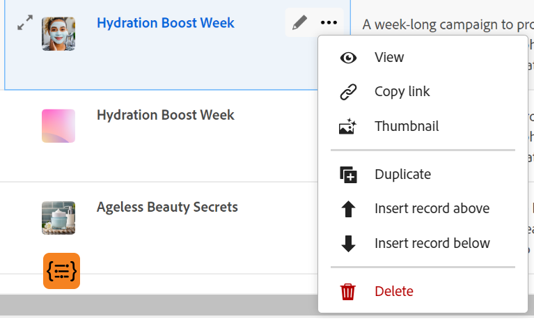
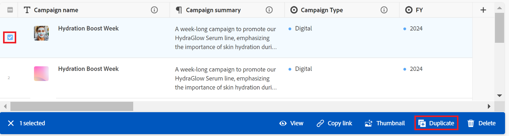

# Duplicar registros

La información resaltada en esta página hace referencia a una funcionalidad que aún no está disponible de forma general. Solo está disponible en el entorno de vista previa para todos los clientes. Después de las versiones mensuales en Production, las mismas funciones también están disponibles en el entorno Production para los clientes que habilitaron versiones rápidas. 

Para obtener información sobre las versiones rápidas, consulte [Habilitar o deshabilitar las versiones rápidas para su organización](/help/quicksilver/administration-and-setup/set-up-workfront/configure-system-defaults/enable-fast-release-process.md). 

{{planning-important-intro}}

En Adobe Workfront Planning, un registro es una instancia de un tipo de registro.

Puede duplicar un registro existente en la vista de tabla. Se agrega una copia idéntica del registro existente a la página de tipo de registro.

## Requisitos de acceso

+++ Expanda para ver los requisitos de acceso para la funcionalidad en este artículo. 

<table style="table-layout:auto"> 
<col> 
</col> 
<col> 
</col> 
<tbody> 
    <tr> 
<tr> 
</tr>   
<tr> 
   <td role="rowheader">
Paquete de Adobe Workfront
</td> 
   <td> 

Cualquier Workfront y cualquier paquete de Planning
 
Cualquier flujo de trabajo y cualquier paquete de Planning

Para obtener más información sobre lo que se incluye en cada paquete de Workfront Planning, póngase en contacto con su representante de cuentas de Workfront. 
 
   </td> 
  <tr> 
   <td role="rowheader">
Licencia de Adobe Workfront
</td> 
   <td>
Estándar

   </td> 
  </tr> 
  <tr> 
   <td role="rowheader">
Permisos de objeto
</td> 
   <td>   
Permisos de contribución o superior para un espacio de trabajo, tipo de registro y administrar permisos para un registro 

   
Los administradores del sistema tienen permisos para todos los espacios de trabajo, incluidos los que no crearon
 </td> 
  </tr>   
</tbody> 
</table>

Para obtener más información acerca de los requisitos de acceso de Workfront, consulte [Requisitos de acceso en la documentación de Workfront](/help/quicksilver/administration-and-setup/add-users/access-levels-and-object-permissions/access-level-requirements-in-documentation.md).

+++   

<!--
Old:

<table style="table-layout:auto"> 
<col> 
</col> 
<col> 
</col> 
<tbody> 
    <tr> 
<tr> 
<td> 
   
 Products
 </td> 
   <td> 
   <ul><li>
 Adobe Workfront
</li> 
   <li>
 Adobe Workfront Planning
</li></ul></td> 
  </tr>   
<tr> 
   <td role="rowheader">
Adobe Workfront plan*
</td> 
   <td> 

Any of the following Workfront plans:
 
<ul><li>Select</li> 
<li>Prime</li> 
<li>Ultimate</li></ul> 

Workfront Planning is not available for legacy Workfront plans
 
   </td> 
<tr> 
   <td role="rowheader">
Adobe Workfront Planning package*
</td> 
   <td> 

Any 
 

For more information about what is included in each Workfront Planning plan, contact your Workfront account manager. 
 
   </td> 
 <tr> 
   <td role="rowheader">
Adobe Workfront platform
</td> 
   <td> 

Your organization's instance of Workfront must be onboarded to the Adobe Unified Experience to be able to access Workfront Planning.
 

For more information, see <a href="/help/quicksilver/workfront-basics/navigate-workfront/workfront-navigation/adobe-unified-experience.md">Adobe Unified Experience for Workfront</a>. 
 
   </td> 
   </tr> 
  </tr> 
  <tr> 
   <td role="rowheader">
Adobe Workfront license*
</td> 
   <td>
 Standard

   
Workfront Planning is not available for legacy Workfront licenses
 
  </td> 
  </tr> 
  <tr> 
   <td role="rowheader">
Access level configuration
</td> 
   <td> 
There are no access level controls for Adobe Workfront Planning
   
</td> 
  </tr> 
<tr> 
   <td role="rowheader">
Object permissions
</td> 
   <td>   
Contribute or higher permissions to a workspace and record type</a> 
  
   
System Administrators have permissions to all workspaces, including the ones they did not create
 </td> 
  </tr> 
</tbody> 
</table>
-->

## Duplicar un registro <!--in a record type table (I don't think you can create them elsewhere right now)-->

Puede crear registros en la vista de tabla de una página de tipo de registro duplicando una existente. Se crea un registro idéntico al existente y se agrega bajo el registro original.

{{step1-to-planning}}

1. Haga clic en el espacio de trabajo donde desee añadir registros.

   El espacio de trabajo se abre y los tipos de registro se muestran como tarjetas.

1. Haga clic en una tarjeta de tipo de registro. Para obtener información acerca de cómo crear un tipo de registro, consulte [Crear tipos de registros](/help/quicksilver/planning/architecture/create-record-types.md).

   La página de tipo de registro se abre en la vista a la que se accedió por última vez. De forma predeterminada, se abre una página de tipo de registro en la vista de tabla.
Todos los registros del tipo seleccionado se muestran en la vista.

1. (Condicional) Seleccione una vista de tabla.

1. Realice una de las siguientes acciones:

   * Pase el ratón sobre el nombre de un registro, luego haga clic en el menú **Más** alineado con el nombre del registro y luego haga clic en el icono **Duplicar**  .

     

   * Seleccione un registro y, a continuación, haga clic en el icono **Duplicate**  en la barra de herramientas de la parte inferior de la página.

     

   Debajo del registro original se crea un registro idéntico con un nombre idéntico. Todos los campos del nuevo registro se rellenan con la misma información que en el registro original.

1. (Opcional) Comience a actualizar la información sobre el nuevo registro en los campos disponibles en la vista de tabla o haga clic en el registro y actualice la información en la vista previa o página del registro.

   >[!NOTE]
   >
   >  * No hay campos obligatorios para los registros. Sin embargo, se recomienda añadir información para el campo principal de un registro, ya que es útil identificar registros al vincular registros entre sí. Para obtener más información acerca de los campos principales, consulte [Administrar la vista de tabla](/help/quicksilver/planning/views/manage-the-table-view.md) e [Información general del campo principal](/help/quicksilver/planning/fields/primary-field-overview.md).
   >
   >  * Los campos que hacen referencia a otros tipos de registro o campos calculados son campos de sólo lectura.

   Para obtener más información acerca de cómo editar registros, vea [Editar registros](/help/quicksilver/planning/records/edit-records.md).

1. (Opcional) Utilice los siguientes métodos abreviados del teclado para deshacer o rehacer la adición de nuevos registros o su información al añadirlos en la vista de tabla:

   * CTRL + Z (⌘ + Z para Mac) para deshacer un cambio
   * CTRL + Mayús + Z (⌘ + Mayús + Z para Mac) para rehacer un cambio.
