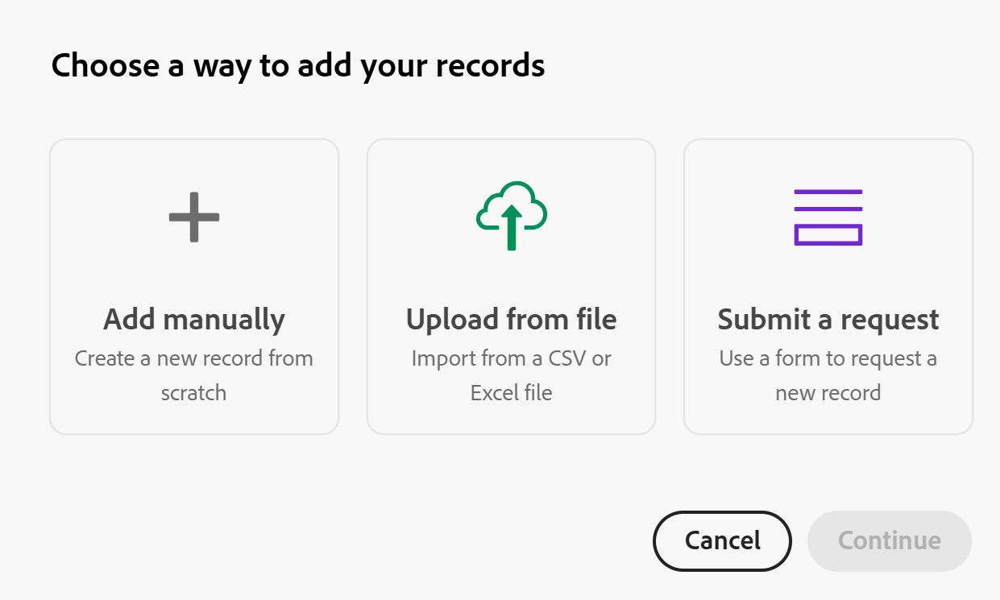

# Crear registros

<!--
The highlighted information on this page refers to functionality not yet generally available. It is available only in the Preview environment for all customers. After the monthly releases to Production, the same features are also available in the Production environment for customers who enabled fast releases.    

For information about fast releases, see [Enable or disable fast releases for your organization](/help/quicksilver/administration-and-setup/set-up-workfront/configure-system-defaults/enable-fast-release-process.md). 

-->

{{planning-important-intro}}

En Adobe Workfront Planning, un registro es una instancia de un tipo de registro.

Para crear registros, siga uno de estos procedimientos:

* [Utilice el botón Nuevo registro o Solicitar registro de cualquier vista de tipo de registro](#create-records-using-the-new-record-or-request-record-button-from-any-record-type-view)
* [Añádalos en línea desde la vista de tabla de tipo de registro](#create-records-by-adding-them-inline-from-the-record-type-table-view)
* [Añádalos en la vista de escala de tiempo de tipo de registro](#create-records-by-adding-them-in-the-record-type-timeline-view)
* [Añádalos en la vista de calendario de tipo de registro](#create-records-by-adding-them-in-the-record-type-calendar-view)
* [Copie y pegue una lista de registros de una lista externa](#create-records-by-copying-and-pasting-them-from-an-external-list)
* [Duplicar registros desde una vista de tabla](#create-records-by-duplicating-them)
* [Conectarlos desde otros registros](#create-records-as-you-connect-them)
* [Envío de un formulario de solicitud a un tipo de registro](#create-records-by-submitting-a-request-form-to-a-record-type)
* [Importar información desde un archivo CSV o de Excel](#create-records-by-importing-records-from-a-csv-or-excel-file)
* [Usar automatizaciones](#create-records-by-using-automations)

Para obtener información acerca de la administración de registros en las vistas de tabla o línea de tiempo, consulte los siguientes artículos:

* [Administrar la vista de tabla](/help/quicksilver/planning/views/manage-the-table-view.md)
* [Administrar la vista de cronología](/help/quicksilver/planning/views/manage-the-timeline-view.md)

## Requisitos de acceso

+++ Expanda para ver los requisitos de acceso para la funcionalidad en este artículo. 

<table style="table-layout:auto"> 
<col> 
</col> 
<col> 
</col> 
<tbody> 
    <tr> 
<tr> 
</tr>   
<tr> 
   <td role="rowheader">
paquete de Adobe Workfront
</td> 
   <td> 

Cualquier Workfront y cualquier paquete de Planning
 
Cualquier flujo de trabajo y cualquier paquete de Planning

Para obtener más información sobre lo que se incluye en cada paquete de Workfront Planning, póngase en contacto con su representante de cuentas de Workfront. 
 
   </td> 
  <tr> 
   <td role="rowheader">
Licencia de Adobe Workfront
</td> 
   <td>
Estándar

   </td> 
  </tr> 
  <tr> 
   <td role="rowheader">
Permisos de objeto
</td> 
   <td> 
Conceda permisos de contribución o superiores al espacio de trabajo y tipo de registro donde desee agregar registros. 

   
Ver o permisos superiores al espacio de trabajo y tipo de registro para crear registros mediante el botón Solicitar registro de la página de registros

   
Los administradores del sistema tienen permisos para todos los espacios de trabajo, incluidos los que no crearon

   
Administre permisos a objetos Workfront (portafolios) para agregar objetos secundarios (proyectos).

   </td> 
  </tr>  
</tbody> 
</table>

Para obtener más información acerca de los requisitos de acceso de Workfront, consulte [Requisitos de acceso en la documentación de Workfront](/help/quicksilver/administration-and-setup/add-users/access-levels-and-object-permissions/access-level-requirements-in-documentation.md).

+++   

<!--Old:
<table style="table-layout:auto"> 
<col> 
</col> 
<col> 
</col> 
<tbody> 
    <tr> 
<tr> 
<td> 
   
 Products
 </td> 
   <td> 
   <ul><li>
 Adobe Workfront
</li> 
   <li>
 Adobe Workfront Planning
</li></ul></td> 
  </tr>   
<tr> 
   <td role="rowheader">
Adobe Workfront plan*
</td> 
   <td> 

Any of the following Workfront plans:
 
<ul><li>Select</li> 
<li>Prime</li> 
<li>Ultimate</li></ul> 

Workfront Planning is not available for legacy Workfront plans
 
   </td> 
<tr> 
   <td role="rowheader">
Adobe Workfront Planning package*
</td> 
   <td> 

Any 
 

For more information about what is included in each Workfront Planning plan, contact your Workfront account manager. 
 
   </td> 
 <tr> 
   <td role="rowheader">
Adobe Workfront platform
</td> 
   <td> 

Your organization's instance of Workfront must be onboarded to the Adobe Unified Experience to be able to access Workfront Planning.
 

For more information, see <a href="/help/quicksilver/workfront-basics/navigate-workfront/workfront-navigation/adobe-unified-experience.md">Adobe Unified Experience for Workfront</a>. 
 
   </td> 
   </tr> 
  </tr> 
  <tr> 
   <td role="rowheader">
Adobe Workfront license*
</td> 
   <td> Standard
   
Workfront Planning is not available for legacy Workfront licenses
 
  </td> 
  </tr> 
  <tr> 
   <td role="rowheader">
Access level configuration
</td> 
   <td> 
There are no access level controls for Adobe Workfront Planning
 
   
Edit access in Workfront for the object types that you want to create (projects, programs, and portfolios) as you connect the records to them. 
  
</td> 
  </tr> 
<tr> 
   <td role="rowheader">
Object permissions
</td> 
   <td> 
Contribute or higher permissions to the workspace and record type where you want to add records. 

   
View or higher permissions to the workspace and record type to create records using the Request record button on the record page

   
System Administrators have permissions to all workspaces, including the ones they did not create

   
Manage permissions to Workfront objects (portfolios) to add children objects (projects).

   </td> 
  </tr> 

</tbody> 
</table> -->

## Crear registros con el botón Nuevo registro o Solicitar registro desde cualquier vista de tipo de registro

Los usuarios con permisos de visualización en el espacio de trabajo y tipo de registro solo pueden crear registros mediante el botón Solicitar registro de la página de tipo de registro.

Los usuarios con permisos de Contribute y Manage para el espacio de trabajo y el tipo de registro pueden crear registros con el botón New record de la página de tipos de registros.

>[!IMPORTANT]
>
>Un administrador del espacio de trabajo debe crear un formulario de solicitud para el tipo de registro para que los usuarios con permisos de Vista puedan agregar registros mediante un formulario de solicitud. De lo contrario, los usuarios con permisos de visualización no podrán crear registros.

{{step1-to-planning}}

1. Haga clic en el espacio de trabajo donde desee añadir registros.

   El espacio de trabajo se abre y los tipos de registro se muestran como tarjetas.

1. Haga clic en una tarjeta de tipo de registro. Para obtener información acerca de cómo crear un tipo de registro, consulte [Crear tipos de registros](/help/quicksilver/planning/architecture/create-record-types.md).

   La página de tipo de registro se abre en la vista a la que se accedió por última vez. De forma predeterminada, se abre una página de tipo de registro en la vista de tabla.
Todos los registros del tipo seleccionado se muestran en la vista.

1. (Condicional) Desde cualquier vista, haga clic en una de las siguientes opciones en la esquina superior derecha de la pantalla, según los permisos de espacio de trabajo y tipo de registro:

   * Haga clic en **Nuevo registro**, si tiene permisos de Contribute o superiores en el área de trabajo y el tipo de registro

     O

   * Haga clic en **Solicitar registro**, si tiene permisos de visualización en el área de trabajo y tipo de registro.

1. (Condicional) Si hizo clic en **Nuevo registro**, haga lo siguiente:

   1. Haga clic en una de las siguientes formas de crear un registro y, a continuación, haga clic en **Continuar**:

      * **Agregar manualmente**. Se abre el cuadro de vista previa del registro.\
        Agregue información sobre el registro, tal como se describe en la sección [Crear registros agregándolos en línea desde la vista de tabla de tipo de registro](#create-records-by-adding-them-inline-from-the-record-type-table-view) de este artículo, empezando por el paso 6. <!--insure this stays accurate-->
      * **Cargar desde archivo**
Agregue registros, tal como se describe en el artículo [Cree registros importando información desde un archivo CSV o de Excel](/help/quicksilver/planning/records/import-file-to-create-records.md), a partir del paso 6. <!--ensure this stays accurate-->
      * **Enviar una solicitud**
Se abre el formulario de solicitud del tipo de registro.

        Un administrador del espacio de trabajo debe crear un formulario de solicitud para poder agregar un registro mediante un formulario de solicitud.

        >[!TIP]
        >
        >Algunos tipos de registro pueden tener varios formularios. Haga clic en uno para abrirlo.

        Agregue el registro, tal como se describe en el artículo [Envíe solicitudes de Adobe Workfront Planning para crear registros](/help/quicksilver/planning/requests/submit-requests.md), a partir del paso 6. <!--ensure this stays accurate-->

      

1. (Condicional) Si hizo clic en **Solicitar registro**, haga lo siguiente:

   1. (Condicional) Si el tipo de registro tiene más de un formulario de solicitud, haga clic en uno para seleccionarlo.
   2. Continúe agregando información en el formulario para crear el registro, como se describe en el artículo [Enviar solicitudes de Adobe Workfront Planning para crear registros](/help/quicksilver/planning/requests/submit-requests.md), a partir del paso 6. <!--ensure this stays accurate-->

1. (Condicional) Revise los registros nuevos.

   Dependiendo de cómo haya elegido agregar el registro, pueden producirse algunas de las siguientes situaciones:

   * Se agregará un nuevo registro al tipo de registro, a menos que elija agregarlo mediante un formulario de solicitud con un proceso de aprobación. Todos los aprobadores deben conceder la aprobación antes de crear el registro.
   * Si ha agregado registros mediante una hoja de cálculo CSV o de Excel, se agregarán varios registros al tipo de registro.
   * Se añade una nueva solicitud en la pestaña Planificación del área de Solicitudes de Workfront si ha añadido la solicitud enviando un formulario de solicitud.

<!-- this is not possible anymore: 

## Create records by connecting them from another application

You can import records from other applications by linking them to existing records. This creates a linked record for the other application's connected object. 

1. Create a record type, as described in the [Create record types](/help/quicksilver/planning/architecture/create-record-types.md).

1. Create records for the record type you created in the previous step. For information, see the section [Create records by manually adding them to a record type](#create-records-by-manually-adding-them-to-a-record-type) in this article. 

1. Create a connection to an object type from another application for the record type you created. For information, see [Connect record types](/help/quicksilver/planning/architecture/connect-record-types.md).

1. Add objects from another application to the records you created above using the linked record field you created in the previous step. For information, see [Connect records](/help/quicksilver/planning/records/connect-records.md). 

    The following items are created in Workfront Planning:

    * A read-only record type that refers to the other application's record type you linked to in the connected record field. 

      For example, if you connect a Planning record type to Workfront project, a read-only record type named "Workfront project" is created in the same workspace. You can access the read-only Workfront record types from the table view of the Planning records you're linking from. 
   
-->

## Crear registros agregándolos en línea desde la vista de tabla de tipo de registro

Puede crear registros en la vista de tabla de una página de tipo de registro a medida que los agrega en línea.

Para obtener información acerca de cómo editar información de registro, consulte [Editar registros](/help/quicksilver/planning/records/edit-records.md).

{{step1-to-planning}}

1. Haga clic en el espacio de trabajo donde desee añadir registros.

   El espacio de trabajo se abre y los tipos de registro se muestran como tarjetas.

1. Haga clic en una tarjeta de tipo de registro. Para obtener información acerca de cómo crear un tipo de registro, consulte [Crear tipos de registros](/help/quicksilver/planning/architecture/create-record-types.md).

   La página de tipo de registro se abre en la vista a la que se accedió por última vez. De forma predeterminada, se abre una página de tipo de registro en la vista de tabla.
Los registros del tipo seleccionado se muestran en la vista.

1. (Condicional) Desde la vista de tabla, realice una de las siguientes acciones:

   * Haga clic en **Nuevo registro** en la última fila de la tabla o después del último registro de una agrupación

     >[!TIP]
     >
     >Cuando se agrega un nuevo registro después del último registro de una agrupación o subagrupación, Workfront rellena automáticamente los campos incluidos en las agrupaciones. Puede editar manualmente estos campos, si es necesario, y los registros pueden eliminarse de la agrupación.

   * Haga clic en **Mayús + Intro** en el teclado desde cualquier columna o fila de la tabla. Esto añade una fila vacía debajo del registro desde el que comienza.
   * Pase el ratón sobre el campo principal de un registro, haga clic en el menú **Más** , a la derecha del campo, y luego haga clic en **Insertar registro arriba** o **Insertar registro abajo**.

   

   Workfront carga automáticamente una miniatura en cada registro nuevo. Podrá modificar estas imágenes más adelante. Para obtener más información, vea [Agregar una imagen de portada a un registro](/help/quicksilver/planning/records/add-a-cover-image-to-a-record.md).

   Se agrega un nuevo registro en la tabla.

1. Haga clic en el campo principal del nuevo registro

   O

   Haga clic en el icono **Abrir detalles**  a la izquierda del nombre del registro.

   El cuadro de vista previa se abre en la tabla.

1. Escriba información sobre el nuevo registro en los campos que ve en el cuadro de vista previa.

   >[!NOTE]
   >
   >  * No hay campos obligatorios para los registros. Sin embargo, se recomienda añadir información para el campo principal de un registro, ya que es útil identificar registros al vincular registros entre sí. Para obtener más información acerca de los campos principales, consulte [Administrar la vista de tabla](/help/quicksilver/planning/views/manage-the-table-view.md) e [Información general del campo principal](/help/quicksilver/planning/fields/primary-field-overview.md).
   >
   >  * Los campos que hacen referencia a otros tipos de registro o campos calculados son campos de sólo lectura.

1. (Condicional) Cuando agregue registros a la tabla, antes de abrir el cuadro de vista previa del registro, siga agregando información en cada fila y, a continuación, haga clic en **Escribir** en el teclado para guardar los cambios.

   O

   Haga clic en el nombre del nuevo registro o en el icono **Abrir detalles** , a la izquierda del nombre del registro, para abrir el cuadro de vista previa y editar la información del registro en el área de detalles.

   >[!TIP]
   >
   >Solo puede obtener acceso al icono **Abrir detalles** desde el campo de nombre del registro cuando el campo Nombre es un campo principal.

1. (Opcional) En el cuadro de vista previa del registro, haga clic en el icono **Abrir en ficha nueva**  en la esquina superior derecha para abrir la página del registro en una ficha nueva. Continúe editando el registro en la página de registros. Para obtener más información, consulte [Editar registros](/help/quicksilver/planning/records/edit-records.md).

   Workfront guardará automáticamente los cambios.

1. (Opcional) Cierre el cuadro de vista previa o haga clic en la flecha hacia atrás situada a la izquierda del nombre del registro, si ha abierto la página del registro.

1. (Opcional) Desde la vista de tabla, utilice los siguientes métodos abreviados del teclado para deshacer o rehacer la adición de nuevos registros o su información, al agregarlos en la vista de tabla:

   * CTRL + Z (⌘ + Z para Mac) para deshacer un cambio
   * CTRL + Mayús + Z (⌘ + Mayús + Z para Mac) para rehacer un cambio

## Crear registros agregándolos en la vista de escala de tiempo de tipo de registro

Puede crear registros en la vista de escala de tiempo de una página de tipo de registro haciendo doble clic en ella.

Para obtener información acerca de cómo crear una vista de escala de tiempo, vea [Administrar la vista de escala de tiempo](/help/quicksilver/planning/views/manage-the-timeline-view.md).

{{step1-to-planning}}

1. Haga clic en el espacio de trabajo donde desee añadir registros.

   El espacio de trabajo se abre y los tipos de registro se muestran como tarjetas.

1. Haga clic en una tarjeta de tipo de registro.

   La página de tipo de registro se abre en la vista a la que se accedió por última vez.

1. Haga clic para abrir una vista de escala de tiempo o crear primero una vista de escala de tiempo.

   >[!NOTE]
   >
   >Puede crear una vista de escala de tiempo únicamente si existen al menos dos campos de fecha asociados al tipo de registro.
1. Haga doble clic en cualquier lugar de la cronología.

   Se abre la casilla **Nuevo registro**. <!--might need a new screen shot for Production - might add a title etc-->

   
1. Actualice la siguiente información:

   * **Nombre**: escriba el nombre del registro. Si lo deja vacío, Workfront lo nombra **Sin título** de manera predeterminada.

     >[!TIP]
     >
     >Si muestra el nombre del registro en las barras de registros según la configuración de la escala de tiempo, el nombre no será visible en la barra de registros si se deja vacío.

   * **Campos de fecha de registro**: Actualice las fechas del registro.

     Los nombres de los campos de fecha se personalizan según los campos seleccionados para las fechas de inicio y finalización cuando se creó la vista de cronología.

     De forma predeterminada, los valores de fecha se preseleccionan en función de cómo se muestre la vista de cronología. Se dan los siguientes escenarios:

      * Por **año**: las fechas de inicio y finalización del registro abarcan un mes.
      * Por **trimestre**: las fechas de inicio y finalización del registro abarcan una semana.
      * Por **mes**: las fechas de inicio y finalización del registro abarcan tres días.

1. (Opcional) Haga clic en uno de los iconos siguientes:

   * **Expandir**  para abrir los detalles del registro en la ventana de vista previa.
   * **Eliminar**  para eliminar el registro.
   * **Cerrar**  para cerrar el cuadro de nuevo registro.

   El registro se agrega inmediatamente a la escala de tiempo, así como a las vistas de tabla y calendario, a menos que haga clic en el icono **Eliminar**.

1. (Opcional) Pase el ratón sobre uno de los márgenes de la barra de registro en la cronología y, a continuación, arrastre y suelte los extremos de la barra en una fecha diferente. Esto cambia automáticamente la fecha de inicio y de finalización del registro.

   Para obtener más información, consulte [Editar registros](/help/quicksilver/planning/records/edit-records.md).

1. (Opcional) Haga clic en la barra de registros de la cronología para abrir la ventana de detalles del registro y actualizar su información, eliminarla o agregar comentarios.

   >[!TIP]
   >
   >De forma predeterminada, Workfront asocia el registro con una miniatura y una imagen de portada.
   >
   >La miniatura solo se muestra en la vista de la cronología cuando está habilitada en la Configuración de la vista.

## Crear registros agregándolos en la vista de calendario de tipo de registro

Puede crear registros en la vista de calendario de una página de tipo de registro haciendo doble clic en cualquier lugar del calendario.

Para obtener información acerca de cómo crear una vista de calendario, vea [Administrar la vista de calendario](/help/quicksilver/planning/views/manage-the-calendar-view.md).

{{step1-to-planning}}

1. Haga clic en el espacio de trabajo donde desee añadir registros.

   El espacio de trabajo se abre y los tipos de registro se muestran como tarjetas.

1. Haga clic en una tarjeta de tipo de registro.

   La página de tipo de registro se abre en la vista a la que se accedió por última vez.

1. Haga clic en para abrir una vista de calendario o crear una vista de calendario.

   >[!NOTE]
   >
   >Puede crear una vista de calendario únicamente si existen al menos dos campos de fecha asociados al tipo de registro.
1. Haga doble clic en cualquier lugar del calendario.

   Se abre la casilla **Nuevo registro**. <!--(********might need a new screen shot for Production - might add a title etc*********ALSO CHECK IF THE SAME ONE NEEDS REPLACING FOR TIMELINE?????)-->

   

1. Actualice la siguiente información:

   * **Nombre**: escriba el nombre del registro. Si lo deja vacío, Workfront lo nombra **Sin título** de manera predeterminada.

     >[!TIP]
     >
     >Si muestra el nombre del registro en las barras de registros según la configuración del calendario, el nombre no será visible en la barra de registros si se deja vacío.

   * **Campos de fecha de registro**: Actualice las fechas del registro.

     Los nombres de los campos de fecha se personalizan según los campos seleccionados para las fechas de inicio y finalización cuando se creó la vista de calendario.

     De forma predeterminada, los valores de fecha se preseleccionan en función de cómo se muestre la vista de calendario. Se dan los siguientes escenarios:

      * Por **mes**: las fechas de inicio y finalización del registro abarcan un día.
      * Por **semana**: las fechas de inicio y finalización del registro abarcan dos días.

1. (Opcional) Haga clic en uno de los iconos siguientes:

   * **Expandir**  para abrir los detalles del registro en la ventana de vista previa.
   * **Eliminar**  para eliminar el registro.
   * **Cerrar**  para cerrar el cuadro de nuevo registro.

   El registro se agrega inmediatamente al calendario y a las vistas de tabla y escala de tiempo, a menos que haga clic en el icono **Eliminar**.
1. (Opcional y condicional) Elija **Mes** en el menú desplegable de la esquina superior, pase el ratón sobre uno de los márgenes de la barra de registros en el calendario y, a continuación, arrastre y suelte los extremos de la barra a una fecha diferente. Esto cambia automáticamente la fecha de inicio y de finalización del registro.

   Para obtener más información, consulte [Editar registros](/help/quicksilver/planning/records/edit-records.md).
1. (Opcional) Haga clic en la barra de registros del calendario para abrir la ventana de detalles del registro y actualizar su información, eliminarla o agregar comentarios.

   >[!TIP]
   >
   >De forma predeterminada, Workfront asocia el registro con una miniatura y una imagen de portada.
   >
   >La miniatura solo se muestra en la vista de calendario cuando está habilitada en la Configuración de la vista.

   <!--(*********when this is available in both monthly and weekly, add more steps to show resizing the timeline and dragging and dropping the record in the calendar*******)-->

## Cree registros copiándolos y pegándolos desde una lista externa

1. Comience a crear registros en la vista de tabla, tal como se describe en la sección [Crear registros añadiéndolos manualmente a un tipo de registro](#create-records-by-manually-adding-them-to-a-record-type) en este artículo.

   Asegúrese de que la vista de tabla tiene las columnas (o los campos) que desea rellenar con la información del nuevo registro.

1. Haga clic en **Nuevo &lt; Nombre de tipo de registro >** en la última fila de la tabla para añadir tantas filas nuevas a la tabla como registros nuevos desee.

   Por ejemplo, añada 10 filas a la vista de tabla si desea pegar la información de 10 registros nuevos de otra aplicación.

1. En otra aplicación, cree una lista de registros que desee importar.

   Por ejemplo, puede utilizar una hoja de cálculo de Excel para crear la lista.

   La lista debe contener información en formato de tabla.

   >[!TIP]
   >
   > Las columnas de la lista deben contener información sobre los campos existentes que tiene en Workfront.
   >
   > Asegúrese de que ya ha creado los campos deseados en Workfront y de que la información de la hoja se muestra en el formato correcto, coincidiendo con el de cada campo en Workfront.

1. Desde otra aplicación, seleccione varias filas y columnas y pegue la información en la vista de tabla de tipo de registro, empezando por el primer registro nuevo.

   Se ha importado la siguiente información en el área de Workfront Planning:

   * Las filas contienen los registros nuevos
   * Las columnas rellenan la información de los campos de los registros.

## Creación de registros duplicándolos

Para obtener información sobre la duplicación de registros, consulte [Registros duplicados](/help/quicksilver/planning/records/copy-or-duplicate-records.md).

## Crear registros a medida que los conecta

Puede crear los siguientes tipos de objetos a medida que los conecta desde otros registros:

* Registros de Workfront Planning
* Objetos de Workfront

En esta sección se describe cómo crear registros de Workfront Planning a medida que se conectan desde otros registros.

>[!NOTE]
>
>Crear proyectos y portafolios de Workfront a medida que se conectan a registros de Workfront Planning es similar a crear registros de Planning a medida que se conectan desde otros registros.
>
>Para obtener información acerca de la creación de objetos de Workfront desde Workfront Planning, vea [Crear objetos de Workfront desde Workfront Planning al conectarlos a registros](/help/quicksilver/planning/records/create-workfront-objects-from-workfront-planning.md).

Debe tener lo siguiente para poder agregar nuevos registros conectándolos desde registros existentes:

* Tipos de registros conectados. Para obtener más información, consulte [Conectar tipos de registros](/help/quicksilver/planning/architecture/connect-record-types.md).
* Registros.
* El acceso y los permisos correctos en Workfront Planning y Workfront, tal como se describe en la sección [Requisitos de acceso](#access-requirements) de este artículo.

Para crear registros al conectarlos desde otros registros:

1. Empiece a conectar los registros de Workfront Planning, tal como se describe en el artículo [Conectar registros](/help/quicksilver/planning/records/connect-records.md). Puede conectar registros de las siguientes áreas:

   * Campo de conexión en las siguientes áreas de Workfront Planning:

      * La vista de tabla
      * Página de detalles o cuadro de vista previa de un registro

   * Campo de conexión en la sección de planificación de un proyecto, portafolio o programa en Workfront.

     Para obtener más información, consulte [Administrar conexiones de registro desde objetos de Workfront](/help/quicksilver/planning/records/manage-records-in-planning-section.md).

1. (Condicional) Si no encuentra un registro al intentar conectarlo, haga clic en **+ Agregar**

   O
Empiece a escribir un nombre y luego haga clic en **+ Agregar**. El botón **+ Agregar** va seguido del nombre del tipo de registro al que se está conectando. Por ejemplo, &quot;Agregar marcas&quot; al agregar una marca a una campaña existente. El nombre que ha escrito también sigue al botón Agregar.

   

   El registro se crea y se agrega al campo de registro conectado.

   >[!IMPORTANT]
   >
   >* Solo puede crear proyectos, portafolios y programas en Workfront al conectarlos desde un registro.
   >
   >* No se pueden crear grupos o empresas al conectarlos desde un registro en Workfront Planning.
   > 

1. (Opcional) Vaya a la vista de tabla del tipo de registro cuyo registro ha creado. Se muestra un nuevo registro en la última fila de la vista.
1. (Opcional) Empiece a agregar información para el nuevo registro en la vista de tabla
O
Haga clic en su nombre para abrir la página de detalles y agregar información allí.

## Crear registros enviando un formulario de solicitud a un tipo de registro

Después de que alguien cree un formulario de solicitud para un tipo de registro y comparta un vínculo con usted, puede enviar una solicitud que cree un registro para ese tipo de registro.

Para obtener más información, consulte [Crear y administrar un formulario de solicitud en Adobe Workfront Planning](/help/quicksilver/planning/requests/create-request-form.md).

Tanto los usuarios de Workfront como los usuarios externos a su organización pueden enviar solicitudes a los tipos de registros de Planning y crear registros, si tienen un vínculo al formulario de solicitud.

Para obtener más información, consulte [Enviar solicitudes de Adobe Workfront Planning para crear registros](/help/quicksilver/planning/requests/submit-requests.md).

## Crear registros al importar tipos de registros desde un archivo CSV o de Excel

Puede importar registros al importar tipos de registros mediante un archivo CSV o de Excel.

Para obtener más información, consulte [Crear tipos de registros](/help/quicksilver/planning/architecture/create-record-types.md).

## Crear registros importándolos desde un archivo CSV o de Excel

Puede importar registros para tipos de registros existentes al importar información desde un archivo CSV o de Excel.

Para obtener más información, vea [Crear registros importando información desde un archivo CSV o de Excel](/help/quicksilver/planning/records/import-file-to-create-records.md).

## Creación de registros mediante automatizaciones

Puede configurar automatizaciones en Workfront Planning para que, cuando se activen, creen registros cuando se activen a partir de un registro de Planning. Los registros creados se conectan automáticamente a los registros desde los que activa la automatización.

Puede configurar y activar la automatización en la página del registro en Workfront Planning. El registro conectado que se crea se coloca en el campo conectado del tipo de registro desde el que se ejecuta la automatización.

Para obtener más información, vea [Crear objetos mediante automatizaciones de registros de Adobe Workfront Planning](/help/quicksilver/planning/records/create-wf-objects-using-planning-automations.md).

