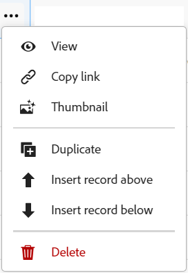
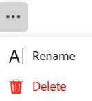

# Eliminar registros

La información resaltada en esta página hace referencia a una funcionalidad que aún no está disponible de forma general. Solo está disponible en el entorno de vista previa para todos los clientes. Después de las versiones mensuales en Production, las mismas funciones también están disponibles en el entorno Production para los clientes que habilitaron versiones rápidas. 

Para obtener información sobre las versiones rápidas, consulte [Habilitar o deshabilitar las versiones rápidas para su organización](/help/quicksilver/administration-and-setup/set-up-workfront/configure-system-defaults/enable-fast-release-process.md). 

{{planning-important-intro}}

Puede eliminar los registros que ya no sean relevantes en Adobe Workfront Planning. Puede recuperar los registros eliminados durante 30 días después de haberlos eliminado. Para obtener información acerca de cómo recuperar los registros eliminados, vea [Recuperar registros eliminados](/help/quicksilver/planning/records/restore-deleted-records.md).

## Requisitos de acceso

+++ Expanda para ver los requisitos de acceso para la funcionalidad en este artículo. 

<table style="table-layout:auto"> 
<col> 
</col> 
<col> 
</col> 
<tbody> 
    <tr> 
<tr> 
</tr>   
<tr> 
   <td role="rowheader">
Paquete de Adobe Workfront
</td> 
   <td> 

Cualquier Workfront y cualquier paquete de Planning
 
Cualquier flujo de trabajo y cualquier paquete de Planning

Para obtener más información sobre lo que se incluye en cada paquete de Workfront Planning, póngase en contacto con su representante de cuentas de Workfront. 
 
   </td> 
  <tr> 
   <td role="rowheader">
Licencia de Adobe Workfront
</td> 
   <td>
Estándar

   </td> 
  </tr> 
  <tr> 
   <td role="rowheader">
Permisos de objeto
</td> 
   <td>   
Permisos de contribución o superior para un espacio de trabajo, tipo de registro y administrar permisos para un registro 
   
   
Los administradores del sistema tienen permisos para todos los espacios de trabajo, incluidos los que no crearon
 </td> 
  </tr>   
</tbody> 
</table>

Para obtener más información acerca de los requisitos de acceso de Workfront, consulte [Requisitos de acceso en la documentación de Workfront](/help/quicksilver/administration-and-setup/add-users/access-levels-and-object-permissions/access-level-requirements-in-documentation.md).

+++   

<!--
Old:
<table style="table-layout:auto"> 
<col> 
</col> 
<col> 
</col> 
<tbody> 
    <tr> 
<tr> 
<td> 
   
 Products
 </td> 
   <td> 
   <ul><li>
 Adobe Workfront
</li> 
   <li>
 Adobe Workfront Planning
</li></ul></td> 
  </tr>   
<tr> 
   <td role="rowheader">
Adobe Workfront plan*
</td> 
   <td> 

Any of the following Workfront plans:
 
<ul><li>Select</li> 
<li>Prime</li> 
<li>Ultimate</li></ul> 

Workfront Planning is not available for legacy Workfront plans
 
   </td> 
<tr> 
   <td role="rowheader">
Adobe Workfront Planning package*
</td> 
   <td> 

Any 
 

For more information about what is included in each Workfront Planning plan, contact your Workfront account manager. 
 
   </td> 
 <tr> 
   <td role="rowheader">
Adobe Workfront platform
</td> 
   <td> 

Your organization's instance of Workfront must be onboarded to the Adobe Unified Experience to be able to access Workfront Planning.
 

For more information, see <a href="/help/quicksilver/workfront-basics/navigate-workfront/workfront-navigation/adobe-unified-experience.md">Adobe Unified Experience for Workfront</a>. 
 
   </td> 
   </tr> 
  </tr> 
  <tr> 
   <td role="rowheader">
Adobe Workfront license*
</td> 
   <td>
 Standard

   
Workfront Planning is not available for legacy Workfront licenses
 
  </td> 
  </tr> 
  <tr> 
   <td role="rowheader">
Access level configuration
</td> 
   <td> 
There are no access level controls for Adobe Workfront Planning
   
</td> 
  </tr> 
<tr> 
   <td role="rowheader">
Object permissions
</td> 
   <td>   
Contribute or higher permissions to a workspace and record type </a> 
  
   
System Administrators have permissions to all workspaces, including the ones they did not create
 </td> 
  </tr> 
</tbody> 
</table>
-->

## Consideraciones sobre la eliminación de registros

* Puede eliminar los registros que usted u otro usuario hayan creado.
* Puede recuperar los registros eliminados que usted u otros usuarios hayan eliminado.
* Si los registros eliminados están vinculados a otros registros, los registros vinculados no se eliminan, pero también se elimina la información del registro eliminado.
* No se pueden eliminar registros de la escala de tiempo o de las vistas de calendario.

## Eliminar registros

Puede eliminar un registro de las siguientes áreas:

* [Desde la página del registro](#delete-a-record-from-the-records-page)
* [Desde la vista de tabla de un tipo de registro](#delete-a-record-from-the-record-type-table-view)

### Eliminar un registro de la página del registro

{{step1-to-planning}}

1. Haga clic en el espacio de trabajo cuyos registros desee eliminar.

   El espacio de trabajo se abre y los tipos de registro se muestran como tarjetas.

1. Haga clic en una tarjeta de tipo de registro.

   Se abre la página de tipo de registro.
1. Realice una de las siguientes acciones:

   * En la vista Tabla, haga clic en el nombre de un registro.
   * En la vista Tabla, pase el ratón sobre el nombre de un registro, haga clic en el menú **Más**  y, a continuación, haga clic en **Ver**

     
   * En una vista Cronología, haga clic en una barra de registro.

   Se abre la página de registro.

1. Haga clic en el menú **Más**  que se encuentra a la derecha del nombre del registro, luego haga clic en **Eliminar** y después en **Eliminar** de nuevo para confirmar.

    <!--ensure the options have not changed or been renamed-->
Se elimina el registro.
1. (Opcional) Vaya a la vista de tabla de la página del registro y haga clic en el icono **Deshacer**  en la esquina superior derecha de la vista; a continuación, haga clic en **Eliminados recientemente** para recuperar los registros eliminados.

Para obtener información acerca de cómo recuperar los registros eliminados, vea [Recuperar registros eliminados](/help/quicksilver/planning/records/restore-deleted-records.md).

### Eliminar un registro de la vista de tabla de tipo de registro

{{step1-to-planning}}

1. Haga clic en el espacio de trabajo cuyos registros desee eliminar.

   El espacio de trabajo se abre y los tipos de registro se muestran como tarjetas.

1. Haga clic en una tarjeta de tipo de registro.

   Se abre la página de tipo de registro.
1. (Condicional) En el menú desplegable **Vista** de la esquina superior izquierda de la tabla, seleccione una Vista de tabla. Esta debe ser la vista predeterminada, a menos que haya visto el tipo de registro en la vista de cronología cuando accedió por última vez.

   Los registros asociados al tipo de registro seleccionado se muestran en la vista de tabla.
1. Realice una de las siguientes acciones:

   * Haga clic con el botón derecho en una fila de registro y, a continuación, haga clic en **Eliminar**.
   * Haga clic en el menú **Más**  que se encuentra a la derecha del nombre del registro y, a continuación, haga clic en **Eliminar**.

     

   * Haga clic en el icono **Abrir detalles**  para abrir el cuadro con la información detallada del registro, haga clic en **Más**  a la derecha del nombre del registro y, a continuación, en **Eliminar**.

   Se elimina el registro.

1. (Opcional) Realice una de las siguientes acciones para deshacer o rehacer la eliminación de un registro:

   * Haga clic en el icono **Deshacer**  y, a continuación, **Eliminado(a) recientemente** para recuperar los registros eliminados. Para obtener información acerca de cómo recuperar los registros eliminados, vea [Recuperar registros eliminados](/help/quicksilver/planning/records/restore-deleted-records.md).
   * Utilice los siguientes métodos abreviados del teclado para deshacer o rehacer la eliminación de un registro:

      * CTRL + Z (⌘ + Z para Mac) para deshacer la eliminación de un registro
      * CTRL + Mayús + Z (⌘ + Mayús + Z para Mac) para rehacer la eliminación del registro

