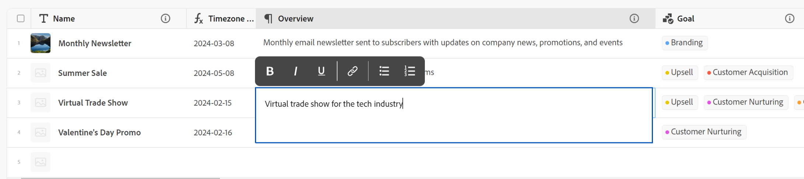

<!--update the metadata with real information when making this avilable in TOC and in the left nav-->

# Edición de registros

{{planning-important-intro}}

Puede editar la información de los registros en Adobe Workfront Planning editando los valores de los campos asociados a los registros.

Debe crear tipos de registros antes de empezar a crear y editar registros.

Para obtener más información, consulte [Creación de tipos de registros](/help/quicksilver/planning/architecture/create-record-types.md).

Para obtener información sobre la creación de registros, consulte [Creación de registros](/help/quicksilver/planning/records/create-records.md).

&lt;!— mencione aquí que los campos de la vista Detalles son los mismos que los de la vista de tabla — este artículo está vinculado desde Administrar vistas de registros a hacer referencia a esta información—>

## Requisitos de acceso

Debe tener el siguiente acceso para realizar los pasos de este artículo:

<table style="table-layout:auto">
 <col>
 </col>
 <col>
 </col>
 <tbody>
    <tr>
<tr>
<td>
   
 Product
 </td>
   <td>
   
 Adobe Workfront
 </td>
  </tr>  
 <td role="rowheader">
acuerdo con Adobe Workfront
</td>
   <td>

Su organización debe estar inscrita en la fase de acceso anticipado para Workfront Planning 

   </td>
  </tr>
  <tr>
   <td role="rowheader">
plan de Adobe Workfront
</td>
   <td>

Cualquiera

   </td>
  </tr>
  <tr>
   <td role="rowheader">
Licencia de Adobe Workfront*
</td>
   <td>
   
Nuevo: claro o superior

   O
   
Actual: Trabajo o superior
 
  </td>
  </tr>

<tr>
   <td role="rowheader">
Configuraciones de nivel de acceso
</td>
   <td> 
No hay controles de acceso para Adobe Workfront Planning
  
</td>
  </tr>
<tr>
   <td role="rowheader">
Permisos
</td>
   <td> 
Permisos de contribución o superiores en un espacio de trabajo</a> 
  
   
Los administradores del sistema tienen permisos para todos los espacios de trabajo, incluidos los que no crearon

</td>
  </tr>
<tr>
   <td role="rowheader">
Plantilla de diseño
</td>
   <td> 
El administrador del grupo o de Workfront debe agregar el área de Planning a la plantilla de diseño. Para obtener más información, consulte <a href="/help/quicksilver/planning/access/access-overview.md">Acceso a información general</a>. 
  
</td>
  </tr>

</tbody>
</table>

*Para obtener más información, consulte [Requisitos de acceso en la documentación de Workfront](/help/quicksilver/administration-and-setup/add-users/access-levels-and-object-permissions/access-level-requirements-in-documentation.md).

## Consideraciones acerca de la edición de registros

* Puede editar los registros que haya creado o los creados por otros usuarios si dispone de permisos para el espacio de trabajo.
* Puede editar los campos de registro desde las siguientes áreas:

   * Vista previa del registro en una vista de registros
   * La página del registro
   * En línea, en una vista de tabla.

* Cuando un usuario edita un registro en una vista, los cambios son visibles inmediatamente en todas las vistas y las páginas de registros para todos los demás usuarios.

* Los siguientes tipos de campos se actualizan automáticamente y no se pueden editar sus valores manualmente:
   * Campos vinculados de otros registros
   * Campos de tipo fórmula
   * Campos del sistema (Creado por, Fecha de creación, Última modificación por, Fecha de última modificación)
* Si los registros que muestra están vinculados a otros registros, la nueva información de los registros que está modificando se reflejará en los registros vinculados.
* No puede editar registros de forma masiva. <!--this will probably change-->
* Las direcciones URL se reconocen como vínculos en tipos de campo de texto de una sola línea solo cuando comienzan con lo siguiente: http://, https://, ftp:// o www. .
* Puede agregar una imagen de portada a cada registro. La imagen es única para cada registro y no se aplica a todos los registros del mismo tiempo.
* Puede editar el orden de los campos en una página de registro y agregar una imagen de portada para un registro. Para obtener más información, consulte [Administrar el diseño de página de registro](/help/quicksilver/planning/records/manage-the-record-page.md).

## Edición de registros

Puede editar un registro desde las siguientes áreas:

* [Desde la vista de tabla de un tipo de registro](#edit-a-record-inline-in-the-table-view-of-a-record-type)
* [Desde la previsualización del registro en una vista](#edit-a-record-from-the-records-preview-in-a-view)
* [Desde la página del registro](#edit-a-record-from-the-records-page)
* [Desde un objeto Workfront en la sección Planificación](#edit-a-record-from-a-workfront-object-in-the-planning-section)

### Editar un registro en línea en la vista de tabla de un tipo de registro

{{step1-to-planning}}

1. Haga clic en el área de trabajo cuyos registros desee editar

   El espacio de trabajo se abre y los tipos de registro se muestran como tarjetas.
1. Haga clic en una tarjeta de tipo de registro.

   Se abre la página de tipo de registro.
1. (Condicional) Haga clic en la pestaña de una vista de tabla o en **+ Ver** para crear una vista de tabla. La vista de tabla debe ser la vista predeterminada, a menos que haya visto el tipo de registro en otro tipo de vista cuando accedió por última vez.

   Los registros asociados al tipo de registro seleccionado se muestran en la vista de tabla.
1. Haga clic dentro de la fila de un registro para empezar a editar la información sobre el registro en línea.

   

   >[!TIP]
   >
   >  No puede editar la información de los siguientes campos, ya que son de solo lectura y Workfront los actualiza automáticamente:
   >  
   >  * Campos vinculados que se crean conectando tipos de registro. Para obtener más información, consulte [Conectar tipos de registros](/help/quicksilver/planning/architecture/connect-record-types.md).
   >  * Campos de los siguientes tipos: Creado por, Fecha de creación, Última modificación por, Fecha de última modificación, Campos de fórmula.

1. (Opcional y condicional) Cuando edite un campo de tipo Párrafo, utilice el siguiente **Texto enriquecido** opciones de formato:

   * Negrita
   * Cursiva
   * Subrayado
   * Añadir un vínculo
   * Agregar una lista con viñetas
   * Añadir una lista numerada

   

1. (Opcional) Haga doble clic en un campo de registro conectado para agregar registros u objetos conectados a otro registro. Para obtener más información, consulte [Conectar registros](/help/quicksilver/planning/records/connect-records.md).
1. Prensa **Entrar** en el teclado o haga clic fuera de una fila para guardar los cambios. Los cambios se guardan automáticamente. A **Guardado** Este indicador se muestra brevemente en la esquina superior derecha de la vista de tabla para mostrar que los cambios se han guardado.

1. (Opcional) Para copiar y pegar información de un campo a otro, siga uno de estos procedimientos:

   * Copie uno o varios valores existentes de un campo y péguelos en un campo del mismo tipo en otro registro
   * Haga clic en el encabezado de una columna para seleccionarla y copiarla. A continuación, haga clic en el encabezado de otra columna y pegue el contenido de la columna copiada. Las columnas deben contener tipos de campo similares.
   * Con la tecla Mayús pulsada, haga clic en para seleccionar varias filas de una tabla, copie la información de las filas seleccionadas y, a continuación, haga clic en una fila diferente y pegue la información seleccionada en la nueva fila y en las filas siguientes.
   * Copie la información de una celda, seleccione varias celdas y pegue la misma información en varias celdas. Puede seleccionar varias celdas y pegar la misma información en varias celdas de filas y columnas adyacentes.

   >[!NOTE]
   >
   >Tenga en cuenta lo siguiente:
   >
   >* Utilice los siguientes métodos abreviados del teclado para copiar y pegar información:
   >   * Copiar: CTRL + C (⌘ + C para Mac)
   >   * Pegar: CTRL + V (⌘ + V para Mac)
   >
   >* No se pueden copiar y pegar valores de campo en la página de registro. Esta funcionalidad solo se admite en la vista de tabla de un tipo de registro.
   >* No puede copiar y pegar valores de campo para los siguientes tipos de campo:
   >
   >
   >    * Campos vinculados (o campos de búsqueda) que se crean conectando tipos de registros. Puede copiar y pegar campos de registro vinculados. Para obtener más información, consulte [Conectar tipos de registros](/help/quicksilver/planning/architecture/connect-record-types.md).
   >    * Campos de los siguientes tipos: Creado por, Fecha de creación, Última modificación por, Fecha de última modificación

1. (Opcional) Utilice los siguientes métodos abreviados del teclado para deshacer o rehacer la edición o copiar y pegar la información de los registros:

   * CTRL + Z (⌘ + Z para Mac) para deshacer un cambio
   * CTRL + Mayús + Z (⌘ + Mayús + Z para Mac) para rehacer un cambio

   >[!TIP]
   >
   >    Puede utilizar los métodos abreviados de teclado varias veces seguidas para deshacer varios cambios.

1. (Opcional) Agregue una miniatura a un registro. Para obtener más información, consulte [Añadir una miniatura en un registro](/help/quicksilver/planning/records/add-thumbnails-to-records.md).

### Editar un registro desde la vista previa del registro en una vista

{{step1-to-planning}}

1. Haga clic en el área de trabajo cuyos registros desee editar

   El espacio de trabajo se abre y los tipos de registro se muestran como tarjetas.

1. Haga clic en una tarjeta de tipo de registro.

   Se abre la página de tipo de registro.

1. Desde cualquier vista, haga clic en el registro

   O

   En la vista de tabla, haga clic en **Abrir detalles** icono  en la primera columna. La vista previa del registro se abrirá en la vista.

   

1. (Opcional) Haga clic en **Más** a la derecha del título del registro y haga clic en **Cambiar nombre**. Se actualiza el campo que se muestra como título del registro.

   El título del registro es el campo principal del registro cuando se ve en una vista de tabla. Para obtener más información, consulte [Resumen del campo principal](/help/quicksilver/planning/fields/primary-field-overview.md).

1. Comience a editar la información del campo en la vista previa del registro.

   >[!TIP]
   >
   >  No puede editar la información de los siguientes campos, ya que son de solo lectura y Workfront los actualiza automáticamente:
   >  
   >  * Campos de búsqueda de otros registros creados conectando tipos de registros. Para obtener más información, consulte [Conectar tipos de registros](/help/quicksilver/planning/architecture/connect-record-types.md).
   >  * Campos de los siguientes tipos: Creado por, Fecha de creación, Última modificación por, Fecha de última modificación, Campos de fórmula.

1. (Opcional) Haga clic en **Añadir portada** para agregar una imagen de portada al registro. Para obtener más información, consulte [Agregar una imagen de portada a un registro](/help/quicksilver/planning/records/add-a-cover-image-to-a-record.md).

1. (Opcional) Pase el ratón sobre el icono de miniatura y haga clic en **Más**  > **Editar miniatura** para añadir una imagen en miniatura. Para obtener más información, consulte [Añadir una miniatura en un registro](/help/quicksilver/planning/records/add-thumbnails-to-records.md).

   Workfront guarda automáticamente los cambios.

1. (Opcional) Haga clic en **Abrir en ficha nueva** icono  <!--check the icon; they are changing it--> en la esquina superior derecha de la vista previa del registro para abrir la página del registro en una nueva pestaña. Siga editando el registro como se describe en [Editar un registro desde la página del registro](#edit-a-record-from-the-records-page) de este artículo.

### Editar un registro desde la página del registro

{{step1-to-planning}}

1. Haga clic en el área de trabajo cuyos registros desee editar

   El espacio de trabajo se abre y los tipos de registro se muestran como tarjetas.

1. Haga clic en una tarjeta de tipo de registro.

   Se abre la página de tipo de registro.

1. Realice una de las siguientes acciones:

   * Desde cualquier vista, acceda a la vista previa del registro, tal como se describe en la [Editar un registro desde la vista previa del registro en una vista](#edit-a-record-from-the-records-preview-in-a-view) de este artículo y, a continuación, haga clic en la **Abrir en ficha nueva** icono  <!--check the icon; they are changing it--> en la esquina superior derecha de la vista previa del registro para abrir la página del registro en una nueva pestaña.

   * Desde el **Tabla** , pase el ratón sobre el nombre de un registro y haga clic en el botón **Más** menú , luego haga clic en **Ver**

     

     Se abre la página de registro.

     

1. (Opcional) Haga clic en **Más** a la derecha del título del registro y haga clic en **Cambiar nombre**. Se actualiza el campo que se muestra como título del registro.

   El título del registro es el campo principal del registro cuando se ve en una vista de tabla. Para obtener más información, consulte [Administrar la vista de tabla](/help/quicksilver/planning/views/manage-the-table-view.md).

1. Haga clic en cualquier campo editable de la página de registro para editarlo.

   >[!TIP]
   >
   >  No puede editar la información de los siguientes campos, ya que son de solo lectura y Workfront los actualiza automáticamente:
   >  
   >  * Campos vinculados que se crean conectando tipos de registro. Para obtener más información, consulte [Conectar tipos de registros](/help/quicksilver/planning/architecture/connect-record-types.md).
   >  * Campos de los siguientes tipos: Creado por, Fecha de creación, Última modificación por, Fecha de última modificación, Campos de fórmula.

1. (Opcional) Haga clic en **Añadir portada** para agregar una imagen de portada al registro

   O

   Pase el ratón sobre la imagen de portada existente y luego haga clic en **Más** menú  > **Cargar** para agregar una nueva imagen de portada para el registro.

   Para obtener más información, consulte [Agregar una imagen de portada a un registro](/help/quicksilver/planning/records/add-a-cover-image-to-a-record.md).

1. (Opcional) Pase el ratón sobre una miniatura existente o **icono de miniatura** , luego haga clic en **Más** menú  > **Editar miniatura** para añadir una miniatura para el registro.

   Para obtener más información, consulte [Añadir una miniatura en un registro](/help/quicksilver/planning/records/add-thumbnails-to-records.md).

   Workfront guarda automáticamente los cambios.

## Edición de un registro de un objeto de Workfront en la sección Planificación

Después de conectar registros con objetos de Workfront, puede editar los registros de Workfront Planning en Workfront desde la sección Planificación del objeto.

Para obtener más información, consulte [Administrar registros en la sección Planificación de objetos de Adobe Workfront](/help/quicksilver/planning/records/manage-records-in-planning-section.md).