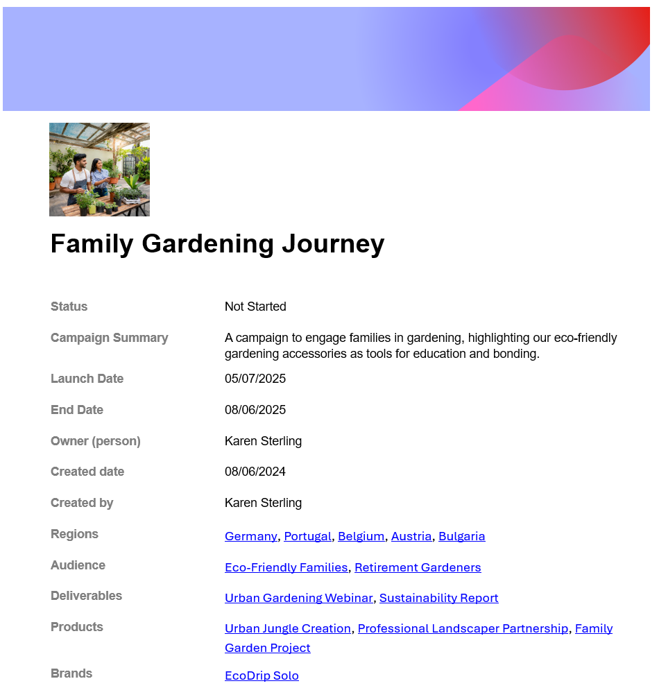

# Exportar detalles de un registro

La información resaltada en esta página hace referencia a una funcionalidad que aún no está disponible de forma general. Solo está disponible en el entorno de vista previa para todos los clientes o en el entorno de producción para los clientes que habilitaron versiones rápidas.

Para obtener información acerca de las versiones rápidas, consulte [Habilitar o deshabilitar las versiones rápidas para su organización](/help/quicksilver/administration-and-setup/set-up-workfront/configure-system-defaults/enable-fast-release-process.md).

Para colaborar de forma más eficaz con otras personas que no tengan una cuenta de Workfront, puede exportar la página de detalles de un registro a un archivo de Microsoft Word y compartirlo con ellas.

## Requisitos de acceso

+++ Expanda para ver los requisitos de acceso para la funcionalidad en este artículo. 

<table style="table-layout:auto"> 
<col> 
</col> 
<col> 
</col> 
<tbody> 
    <tr> 
<tr> 
</tr>   
<tr> 
   <td role="rowheader">
Paquete de Adobe Workfront
</td> 
   <td> 

Cualquier Workfront y cualquier paquete de Planning
 
Cualquier flujo de trabajo y cualquier paquete de Planning

Para obtener más información sobre lo que se incluye en cada paquete de Workfront Planning, póngase en contacto con su representante de cuentas de Workfront. 
 
   </td> 
  <tr> 
   <td role="rowheader">
Licencia de Adobe Workfront
</td> 
   <td>
Ligero o superior

   </td> 
  </tr> 
  <tr> 
   <td role="rowheader">
Permisos de objeto
</td> 
   <td>   
Ver permisos superiores a un área de trabajo, tipo de registro y registro 
  
   
Los administradores del sistema tienen permisos para todos los espacios de trabajo, incluidos los que no crearon
 </td> 
  </tr> 
  </tr>

</tbody> 
</table>

Para obtener más información acerca de los requisitos de acceso de Workfront, consulte [Requisitos de acceso en la documentación de Workfront](/help/quicksilver/administration-and-setup/add-users/access-levels-and-object-permissions/access-level-requirements-in-documentation.md).

+++  

<!--
Old:

<table style="table-layout:auto"> 
<col> 
</col> 
<col> 
</col> 
<tbody> 
    <tr> 
<tr> 
<td> 
   
 Products
 </td> 
   <td> 
   <ul><li>
 Adobe Workfront
</li> 
   <li>
 Adobe Workfront Planning
</li></ul></td> 
  </tr>   
<tr> 
   <td role="rowheader">
Adobe Workfront plan*
</td> 
   <td> 

Any of the following Workfront plans:
 
<ul><li>Select</li> 
<li>Prime</li> 
<li>Ultimate</li></ul> 

Workfront Planning is not available for legacy Workfront plans
 
   </td> 
<tr> 
   <td role="rowheader">
Adobe Workfront Planning package*
</td> 
   <td> 

Any 
 

For more information about what is included in each Workfront Planning plan, contact your Workfront account manager. 
 
   </td> 
 <tr> 
   <td role="rowheader">
Adobe Workfront platform
</td> 
   <td> 

Your organization's instance of Workfront must be onboarded to the Adobe Unified Experience to be able to access Workfront Planning.
 

For more information, see <a href="/help/quicksilver/workfront-basics/navigate-workfront/workfront-navigation/adobe-unified-experience.md">Adobe Unified Experience for Workfront</a>. 
 
   </td> 
   </tr> 
  </tr> 
  <tr> 
   <td role="rowheader">
Adobe Workfront license*
</td> 
   <td> 
Light or higher

   
Workfront Planning is not available for legacy Workfront licenses
 
  </td> 
  </tr> 
  <tr> 
   <td role="rowheader">
Access level configuration
</td> 
   <td> 
There are no access level controls for Adobe Workfront Planning
   
</td> 
  </tr> 
<tr> 
   <td role="rowheader">
Object permissions
</td> 
   <td>   
View or higher permissions to a workspace and record type</a> 
  
   
System Administrators have permissions to all workspaces, including the ones they did not create
 </td> 
  </tr> 
</tbody> 
</table> 

 *For more information about Workfront access requirements, see [Access requirements in Workfront documentation](/help/quicksilver/administration-and-setup/add-users/access-levels-and-object-permissions/access-level-requirements-in-documentation.md).
 -->

## Consideraciones sobre la exportación de los detalles de un registro:

* Puede exportar los detalles de un registro a los siguientes formatos de archivo:

   * .docx Word
   * .pdf

* Sólo se puede exportar la ficha Detalles de la página o del área de vista previa de un registro.

* El archivo exportado conserva el diseño de la página de registro, incluidas las miniaturas y las imágenes de la portada.

## Exportar detalles de un registro

{{step1-to-planning}}

1. Haga clic en la tarjeta de un espacio de trabajo.

   El espacio de trabajo se abre y los tipos de registro se muestran en tarjetas.

1. Haga clic en una tarjeta de tipo de registro.
Se abre la página de tipo de registro y se muestran todos los registros de ese tipo.

1. En cualquier vista, haga clic en el nombre de un registro.

   Se abre el cuadro de vista previa del registro.

1. (Opcional) Haga clic en el icono **Abrir en ficha nueva**  para abrir la página del registro.

1. Elija la ficha **Detalles**. La pestaña Detalles se debe abrir de forma predeterminada.

1. Haga clic en el icono **Exportar** del menú , ya sea en la vista previa o en la página del registro y, a continuación, haga clic en una de las siguientes opciones:

   * **Microsoft Word**
   * **Adobe PDF**

   Un archivo de Word (.docx) o PDF se descarga y se guarda en el equipo.

   El nombre del archivo exportado es el campo Primary del registro.

   

   >[!NOTE]
   >
   >    La información adicional que no se muestra en la página y que solo está visible después de hacer clic en Mostrar más en el área de detalles del registro no se muestra en el archivo PDF exportado. En el archivo exportado solo se muestra la información visible en la página.

1. (Opcional) Vaya al archivo descargado, ábralo y edítelo (si es un archivo de Word), o compártalo con otros.

