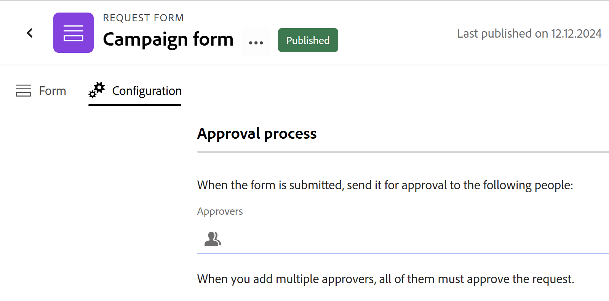

# Agregar una aprobación a un formulario de solicitud en Planificación de Workfront de Adobe

<!--update the metadata with real information when making this available in TOC and in the left nav-->

La información resaltada en esta página hace referencia a una funcionalidad que aún no está disponible de forma general. Solo está disponible en el entorno de vista previa para todos los clientes. Después del lanzamiento en Vista previa, las mismas funciones también están disponibles mensualmente en el entorno de producción para los clientes que habilitaron lanzamientos rápidos. 

Para obtener información sobre las versiones rápidas, consulte [Habilitar o deshabilitar las versiones rápidas para su organización](/help/quicksilver/administration-and-setup/set-up-workfront/configure-system-defaults/enable-fast-release-process.md). 

{{planning-important-intro}}

Puede agregar un proceso de aprobación a un formulario de solicitud de Adobe Workfront Planning para iniciar una aprobación para cada solicitud enviada antes de crear un registro.

<!--Multiple stages are supported in the approval process. When all required decisions in a stage are made, the next stage begins and the new stage's approvers receive an email notification.-->

Este artículo describe cómo un administrador del espacio de trabajo puede agregar una aprobación a un formulario de solicitud asociado a un tipo de registro.

Para obtener información acerca de cómo crear un formulario de solicitud en Workfront Planning, vea [Crear y administrar un formulario de solicitud en Adobe Workfront Planning](/help/quicksilver/planning/requests/create-request-form.md).

Para obtener información sobre cómo enviar una solicitud a un tipo de registro para crear un registro, consulte [Enviar solicitudes de Adobe Workfront Planning para crear registros](/help/quicksilver/planning/requests/submit-requests.md).

## Requisitos de acceso

+++ Expanda para ver los requisitos de acceso para la funcionalidad en este artículo. 

<table style="table-layout:auto"> 
<col> 
</col> 
<col> 
</col> 
<tbody> 
<tr> 
   <td role="rowheader">
Paquete de Adobe Workfront
</td> 
   <td> 
<ul> 
<li>
Cualquier Workfront o flujo de trabajo con un paquete de Planning
</li>
O
<li>
Cualquier paquete de Planning cuando se adquiere como producto independiente
</li></ul>
   </td> </tr>
  <tr> 
   <td role="rowheader">
Licencia de Adobe Workfront
</td> 
   <td>
Workflow Standard

   </td> 
  </tr> 
<tr> 
   <td role="rowheader">
Licencia de planificación de Adobe
</td> 
   <td>
Estándar de planificación

   </td> 
  </tr> 
<tr> 
   <td role="rowheader">
Configuración de nivel de acceso
</td> 
   <td> 
Debe agregar un tipo de licencia de flujo de trabajo y de Planning al nivel de acceso cuando tenga un flujo de trabajo y un paquete de Planning a la vez
   
</td> 
  </tr>  
  <tr> 
   <td role="rowheader">
Permisos de objeto
</td> 
   <td>   
Administrar permisos a un espacio de trabajo y tipo de registro</a> 
  
   
Los administradores del sistema tienen permisos para todos los espacios de trabajo, incluidos los que no crearon
  </td> 
  </tr>  
</tbody> 
</table>

Para obtener más información acerca de los requisitos de acceso de Workfront, consulte [Requisitos de acceso en la documentación de Workfront](/help/quicksilver/administration-and-setup/add-users/access-levels-and-object-permissions/access-level-requirements-in-documentation.md).

+++

## Consideraciones sobre la adición de aprobaciones a un formulario de solicitud

* Puede agregar uno o varios aprobadores (usuarios o equipos) a un formulario de solicitud o a una regla de aprobación.
* Las reglas de aprobación dirigen las solicitudes en función de los valores de los campos de la solicitud enviada (por ejemplo, distintos aprobadores para valores diferentes de un campo &quot;Tipo de campaña&quot;).
* Puede mostrar la información de aprobación en el registro creado mediante los campos Approved by y Approved date. Consulte Creación de campos.
* Si todos los aprobadores lo aprueban, se crea un registro para el tipo de registro asociado al formulario de solicitud.
* Si al menos un aprobador lo rechaza, no se crea ningún registro para el tipo de registro; la solicitud permanece o aterriza en el área de Solicitudes de Workfront. (Este punto aparecía en ambas secciones con una redacción ligeramente diferente, fusionada aquí como una sola declaración).
* Cuando se requieren varios aprobadores, todos deben tomar una decisión antes de aprobar o rechazar la solicitud, a menos que la opción Only one decision is required esté habilitada.
* Si un equipo se establece como aprobador, solo se necesita una decisión de un miembro de ese equipo.
* Las aprobaciones son opcionales: si un formulario de solicitud no tiene aprobación adjunta, Workfront Planning crea el registro inmediatamente después del envío.
* Puede agregar una o más etapas a las aprobaciones.

## Adición de reglas de aprobación a un formulario de solicitud

Las reglas de aprobación definen el proceso de aprobación en función de los valores de los campos de las solicitudes enviadas.

Por ejemplo, si un formulario de solicitud tiene el campo &quot;Tipo de campaña&quot;, se puede crear una regla que envíe la solicitud a una persona cuando el campo tenga el valor &quot;Digital&quot; y a una persona diferente cuando tenga el valor &quot;Imprimir&quot;.

Para definir reglas de aprobación para un formulario de solicitud:

1. Comience a crear un formulario de solicitud para un tipo de registro, tal como se describe en el artículo [Crear y administrar un formulario de solicitud en Adobe Workfront Planning](/help/quicksilver/planning/requests/create-request-form.md).
1. Cuando se abra el formulario de solicitud, haga clic en **Configuración**.

   Se abre la ficha **Configuración**.

1. Para comenzar a configurar las reglas de aprobación, haga clic en **Aprobaciones**  en el panel izquierdo.

1. (Opcional) Si desea establecer un proceso de aprobación predeterminado, agregue al menos un usuario o equipo al campo **Aprobadores** del área **Regla de aprobación predeterminada** y, a continuación, haga clic en la casilla de verificación **Solo se requiere una decisión** si desea que el registro se cree después de que cualquiera de los aprobadores predeterminados lo haya aprobado.

   

1. (Opcional) Empiece a añadir reglas de aprobación. Para cada regla de aprobación personalizada, haga lo siguiente:

   1. Haga clic en **Agregar regla de aprobación**.
   1. Haga clic en el título del marcador de posición **Regla de aprobación sin título** e introduzca un nombre para la regla de aprobación.
   1. Haga clic en **Seleccionar un campo** y seleccione el campo que activa la regla.
   1. Seleccione el operador de la regla. Los operadores varían según el tipo de campo.
   1. Si el operador seleccionado requiere un valor, haga clic en el icono de signo más y añada uno o más valores.
   1. (Opcional) Haga clic en **Agregar condición** para agregar más condiciones y conectarlas mediante instrucciones **And** o **Or** configurando las condiciones adicionales como en los pasos C-E.
   1. En el área **Acciones** de la regla de aprobación, en el campo **Aprobadores**, agregue al menos un usuario o equipo para que se establezca como aprobador cuando se cumpla la condición.
   1. (Condicional y opcional) Si desea que el registro se cree después de que cualquiera de los aprobadores lo haya aprobado, marque la casilla **Solo se requiere una decisión**. De lo contrario, todos los aprobadores deben decidir la aprobación antes de aceptar o rechazar la solicitud.

   >[!NOTE]
   >
   >   Tenga en cuenta lo siguiente al añadir reglas de aprobación:
   >
   >   * Si solo se configura una regla predeterminada, se aplica a todas las solicitudes enviadas.
   >   * Si se cumple una regla personalizada, el valor predeterminado no se aplica al flujo de trabajo de solicitud y aprobación. Solo se aplican las reglas personalizadas coincidentes para las aprobaciones y se ignora la regla predeterminada.
   >   * Si se cumplen varias reglas personalizadas, se aplica la primera del orden. En este caso, la aprobación predeterminada no se aplica, si es que la hay.

1. (Opcional) Haga clic en **Agregar fase** para agregar otra fase a la aprobación.

1. Haga clic en **Guardar** para guardar las reglas de aprobación.

1. (Opcional) Para agregar más etapas a la aprobación, haga lo siguiente:

   1. Haga clic en **Agregar fase**.

      Aparece el cuadro **Aprobación de varias etapas**. Si ya ha creado una acción de aprobación predeterminada, esos aprobadores se agregan automáticamente a la fase 1.

   1. En el campo **Agregar personas o equipos**, agregue al menos un usuario o equipo que se establecerá como aprobador de la fase.
   1. (Condicional y opcional) Si desea que el registro avance a la siguiente fase después de que cualquiera de los aprobadores lo haya aprobado, marque la casilla de verificación **Solo se requiere una decisión**. De lo contrario, todos los aprobadores deben decidir la aprobación antes de que la solicitud pase a la siguiente fase.
   1. Haga clic en **Agregar fase** y repita desde el paso B para agregar más fases a la aprobación.

      Cuando existen dos o más fases, puede hacer clic en el icono **Arrastrar**  para arrastrarlas y soltarlas en orden.

      Haga clic en **Eliminar esta etapa** para eliminar una etapa de la aprobación, o haga clic en el icono **Eliminar**  que está junto a un aprobador para eliminar al usuario o equipo de la lista de aprobadores de una etapa.

      

   1. Cuando termine de crear el flujo de trabajo de aprobación, haga clic en **Guardar**.

      Puede editar o eliminar la aprobación de varias etapas desde la página Aprobaciones.

1. (Opcional) Haga clic en **Publicar** si nunca antes había compartido el formulario de solicitud.

<!--

## Add an approval to a request form in the Production environment

1. Start creating a request form for a record type, as described in [Create and manage a request form in Adobe Workfront Planning](/help/quicksilver/planning/requests/create-request-form.md).
1. Click **Configuration**.

    The **Configuration** area displays.

    
1. In the **Approvers** field, start typing the name of a user or team that you want to set as an approver, then select it when it displays in the list. 
1. (Optional and conditional) If you have set more than one approver, and only need one approver to make a decision, enable the **Only one decision is required** option.

    (****most of the Note below is duplicated in the Create a request form article***)

      >[!NOTE]
      >
      >
      >* You can add one or several approvers to a request form.
      >
      >* If you add more than one approver, and the Only one decision is required option is not enabled, all approvers must approve the request before Workfront Planning creates a record.
      >
      >* If at least one approver rejects the request, the request is rejected and the record is not created. The request remains in the Requests area of Workfront.
      >
      >* If you add more than one approver, and the Only one decision is required option is not enabled, all approvers must make a decision before a request is either approved or rejected.
      >
      >* If a team is set as an approver, only one decision is required from the team.

1. (Optional) Click **Publish** if you have never shared the request form before.

    Or

    Click **Share** to share the form, then **Copy link**. 
1. (Optional) After a user uses the link you share and submits a request, Workfront Planning sends an approval in-app notification and an email to the approvers.

   For information about approving requests, see [Approve a request](/help/quicksilver/planning/requests/approve-request.md).

-->