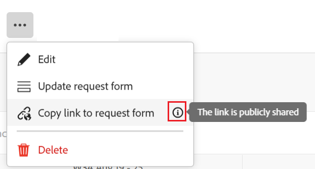

# Creación y administración de un formulario de solicitud en Adobe Workfront Planning

<!--update the metadata with real information when making this available in TOC and in the left nav-->

{{planning-important-intro}}

Puede crear un formulario de solicitud y asociarlo a un tipo de registro en Adobe Workfront Planning. A continuación, puede compartir un vínculo con otros usuarios internos o externos.

Los usuarios con un vínculo al formulario pueden actualizar los valores de campo que contiene y agregar nuevos registros enviándolo.

Este artículo describe cómo un administrador del espacio de trabajo puede crear un formulario de solicitud asociado a un tipo de registro.

Para obtener información sobre cómo enviar una solicitud a un tipo de registro para crear un registro, consulte [Enviar solicitudes de Adobe Workfront Planning para crear registros](/help/quicksilver/planning/requests/submit-requests.md).

## Requisitos de acceso

+++ Expanda para ver los requisitos de acceso para la funcionalidad en este artículo.

Debe tener lo siguiente para poder acceder a Workfront Planning:

<table style="table-layout:auto">
 <col>
 </col>
 <col>
 </col>
 <tbody>
    <tr>
<tr>
<td>
   
 Productos
 </td>
   <td>
   <ul><li>
 Adobe Workfront
</li>
   <li>
 Planificación de Adobe Workfront
</li></ul></td>
  </tr>  
 <tr>
   <td role="rowheader">
plan Adobe Workfront*
</td>
   <td>

Cualquiera de los siguientes planes de Workfront:

<ul><li>Seleccionar</li>
<li>Prime</li>
<li>Ultimate</li></ul>

Workfront Planning no está disponible para planes Workfront heredados

   </td>

<tr>
   <td role="rowheader">
Plan de planificación de Adobe Workfront*
</td>
   <td>

Cualquiera 
  

Para obtener más información sobre qué se incluye en cada plan de Workfront Planning, póngase en contacto con su administrador de cuentas de Workfront. </td>

<tr>
   <td role="rowheader">
plataforma de Adobe Workfront
</td>
   <td>

La instancia de Workfront de su organización debe incorporarse a la experiencia Adobe unificado para poder acceder a todas las funcionalidades de Workfront Planning.

Para obtener más información, consulte <a href="/help/quicksilver/workfront-basics/navigate-workfront/workfront-navigation/adobe-unified-experience.md">Experiencia unificada de Adobe para Workfront</a>. 

   </td>

</tr>
  </tr>
  <tr>
   <td role="rowheader">
Licencia de Adobe Workfront*
</td>
   <td>
   
Estándar

   
Workfront Planning no está disponible para licencias de Workfront heredadas

  </td>
  </tr>
  <tr>
   <td role="rowheader">
Configuración del nivel de acceso
</td>
   <td> 
No hay controles de nivel de acceso para Adobe Workfront Planning
  
</td>
  </tr>
<tr>
   <td role="rowheader">
Permisos de objeto
</td>
   <td>
   <ul>
   <li>
Administración de permisos en un espacio de trabajo
</li>
    <li>
Los administradores del sistema pueden administrar los espacios de trabajo que no hayan creado. 
</li>
    </ul>
   
Para obtener información acerca de los permisos de uso compartido para objetos de Workfront Planning, consulte  
   <a href="/help/quicksilver/planning/access/sharing-permissions-overview.md">Información general sobre los permisos de uso compartido en Adobe Workfront Planning</a> 
  </td>
  </tr>
<tr>
   <td role="rowheader">
Plantilla de diseño
</td>
   <td> 
A todos los usuarios, incluidos los administradores de Workfront, se les debe asignar una plantilla de diseño que incluya el área de Planning en el menú principal. 
  
</td>
  </tr>
 </tbody>
</table>

*Para obtener más información sobre los requisitos de acceso de Workfront, consulte [Requisitos de acceso en la documentación de Workfront](/help/quicksilver/administration-and-setup/add-users/access-levels-and-object-permissions/access-level-requirements-in-documentation.md).

+++

## Creación de un formulario de solicitud para un tipo de registro

{{step1-to-planning}}

1. Haga clic en el área de trabajo donde desee agregar registros.

   El espacio de trabajo se abre y los tipos de registro se muestran como tarjetas.

1. Haga clic en una tarjeta de tipo de registro. Para obtener información acerca de cómo crear un tipo de registro, vea [Crear tipos de registros](/help/quicksilver/planning/architecture/create-record-types.md).

   La página de tipo de registro se abre en la vista a la que se accedió por última vez. De forma predeterminada, se abre una página de tipo de registro en la vista de tabla.

1. Haga clic en el menú **Más**  a la derecha del nombre del tipo de registro en el encabezado de la página y, a continuación, haga clic en **Crear formulario de solicitud**.
1. Actualice el nombre del formulario de solicitud. De manera predeterminada, el nombre del formulario es **Formulario de solicitud sin título**. <!--check this; you logged a bug to rename it to this but was it fixed?-->
1. (Opcional) Agregue una **Descripción** para el formulario de solicitud.

   <!--Not possible yet: The Description is visible when you access the request form from the Requests area of Workfront.-->

1. Haga clic en **Crear**. Se abrirá el formulario de solicitud del tipo de registro seleccionado.

   

   El formulario de solicitud contiene la siguiente información de forma predeterminada:

   * Campos de registro disponibles en la vista de tabla del tipo de registro seleccionado. <!--they are working on removing the limitation below-->

     >[!IMPORTANT]
     >
     >   Los campos de los siguientes tipos no se muestran en el formulario de solicitud:
     >
     >    * Personas
     >    * Campos conectados (incluye conexiones con recursos de Experience Manager)
     >    * Campos de búsqueda conectados
     >    * Fórmula

   * **Sección predeterminada**: Este es el salto de sección predeterminado que Workfront aplica al formulario de solicitud. No se puede cambiar el nombre de la sección predeterminada ni eliminarla.
   * Campo **Asunto**: Campo que identificará la solicitud en Workfront. Esta capacidad aún no está disponible.
   * Todos los campos asociados al tipo de registro.

     Los campos contenidos en el formulario de solicitud serán visibles para todos los que envíen una solicitud a este tipo de registro.

1. (Opcional) Pase el ratón sobre cualquier campo del formulario que quiera quitar y luego haga clic en el icono **x** para quitarlo. Se agregarán a la ficha **Campos** situada a la izquierda del formulario.

   Por ejemplo, quite el campo **Asunto**, ya que esto no es visible en Workfront Planning. <!--remove this step when we connect intake with the Requests area in Workfront-->
1. Haga clic en cualquier campo y, a continuación, utilice los controles del panel derecho del formulario para definir su tamaño o cualquiera de las siguientes informaciones:

   * **Etiqueta**: este es el nombre del campo tal como aparecerá en el formulario de solicitud. Esto no cambia el nombre del campo de registro.
   * **Instrucciones**: Agregue más información sobre el campo.
   * **Crear un campo obligatorio**: cuando se selecciona, el campo debe tener un valor. De lo contrario, el formulario no se podrá enviar.
   * **Agregar lógica**: defina qué condiciones deben cumplirse para que el campo se muestre o se oculte.

   El tipo de campo de cada campo se muestra en la parte superior del panel derecho, después de seleccionar el campo en el formulario. Los nombres de los tipos de campo en el formulario de solicitud difieren de sus nombres en la vista de tabla. En la tabla siguiente se describen las diferencias entre los nombres de los tipos de campo de la vista de tabla y los nombres de los mismos campos del formulario de solicitud del tipo de registro:

   | Tipo de campo de Workfront Planning | Tipo de campo de formulario de solicitud |
   |-------------------------------|-------------------------|
   | Texto de línea única | Texto de línea única |
   | Párrafo | Texto con formato |
   | Moneda, Número, Porcentaje | Texto de línea única |
   | Selección única | Lista desplegable de selección única |
   | Selección múltiple | Lista desplegable de selección múltiple |
   | Casilla de verificación | Grupo de casillas de verificación |

   >[!NOTE]
   >
   >   Se conservan los formatos de los campos. Por ejemplo, aunque Moneda y Porcentaje se muestran como campos de Texto de una sola línea, la información de los campos se muestra como moneda y como valor de porcentaje.

1. (Opcional) Haga clic en la pestaña **Elementos de contenido** de la parte izquierda del formulario y agregue cualquiera de los siguientes elementos:

   * **Texto descriptivo**
   * **Salto de sección**

   Para obtener más información acerca de cómo crear un formulario personalizado, vea [Diseñar un formulario con el diseñador de formularios](/help/quicksilver/administration-and-setup/customize-workfront/create-manage-custom-forms/form-designer/design-a-form/design-a-form.md).

1. (Opcional) Haga clic en **Vista previa** para ver cómo se mostrará el formulario para otros usuarios cuando lo usen para enviar un nuevo registro.
1. Haga clic en **Publish** para publicar el formulario y obtener un vínculo único para él.

   Ocurren lo siguiente:

   * Se elimina el botón Publish.
   * Se agrega el botón **Cancelar publicación** al formulario. Si hace clic en él, se impedirá el acceso al formulario.
   * Se agrega un botón **Compartir** al formulario.

1. Haga clic en **Compartir** para compartir el formulario con otros usuarios.

   

1. Seleccione entre las siguientes opciones para indicar qué tipos de usuarios pueden acceder a este formulario:

   * Cualquiera con acceso de visualización o más alto al espacio de trabajo
   * Cualquiera con acceso de aportación o más alto al espacio de trabajo
   * Cualquiera con el vínculo

   >[!IMPORTANT]
   >
   >Si selecciona **Cualquier persona que tenga el vínculo**, cualquier persona podrá obtener acceso al formulario y enviar un nuevo registro, incluso las personas que no pertenezcan a su organización y que no tengan una cuenta de Workfront.

1. (Condicional) Si seleccionó **Cualquier persona con el vínculo** en el paso anterior, seleccione **Fecha de caducidad del vínculo** del calendario disponible. Las personas recibirán un error una vez que caduque el vínculo y deberá actualizar la fecha del vínculo para que puedan acceder al formulario de nuevo.

   Puede seleccionar fechas futuras en un plazo de 180 días a partir de la fecha actual.

1. Haga clic en **Guardar y copiar vínculo** para guardar los detalles de uso compartido del formulario.

   Las opciones de uso compartido de formularios se guardan y el vínculo se copia en el portapapeles. Ahora puede compartirlo con otros usuarios.

   Para obtener información sobre cómo crear registros mediante un vínculo a un formulario de solicitud, consulte [Enviar solicitudes de Adobe Workfront Planning](/help/quicksilver/planning/requests/submit-requests.md).

1. Haga clic en **Guardar** en la esquina inferior derecha de la pantalla para guardar el formulario.
1. Haga clic en la flecha que señala a la izquierda del nombre del formulario en el encabezado para cerrar el formulario.

   Se abre la página de tipo de registro.
1. (Opcional) Haga clic en el menú **Más**  que se encuentra a la derecha del nombre del tipo de registro en el encabezado y, a continuación, siga uno de estos procedimientos:
   * Haga clic en **Actualizar formulario de solicitud** para realizar cualquier cambio en el formulario de solicitud.
   * Haga clic en **Copiar vínculo al formulario de solicitud** para compartir el vínculo al formulario con otros usuarios.

   >[!TIP]
   >
   >Hay indicios de que el vínculo se comparte públicamente cuando este es el caso.
   >
