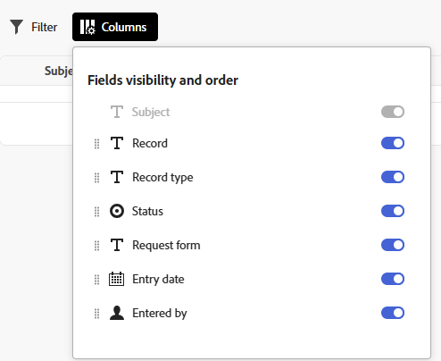
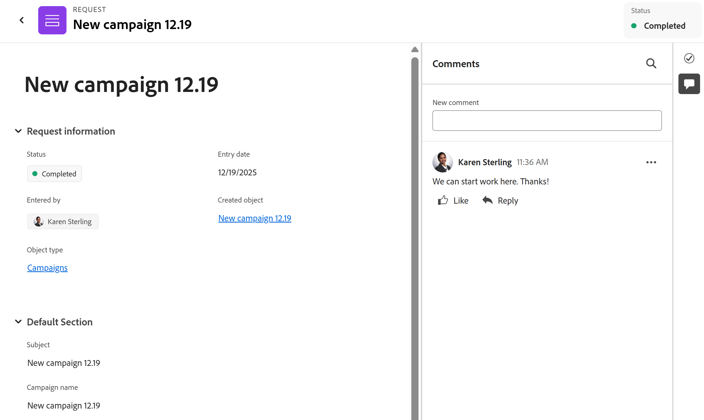

# Enviar solicitudes de Adobe Workfront Planning para crear registros

<!--update title when there will be more functionality added to the Planning requests, besides creating records-->

La información resaltada en esta página hace referencia a una funcionalidad que aún no está disponible de forma general. Solo está disponible en el entorno de vista previa para todos los clientes. Después del lanzamiento en Vista previa, las mismas funciones también están disponibles mensualmente en el entorno de producción para los clientes que habilitaron lanzamientos rápidos. 

Para obtener información sobre las versiones rápidas, consulte [Habilitar o deshabilitar las versiones rápidas para su organización](/help/quicksilver/administration-and-setup/set-up-workfront/configure-system-defaults/enable-fast-release-process.md). 

{{planning-important-intro}}

Después de que un administrador de espacio de trabajo cree un formulario de solicitud para un tipo de registro en Adobe Workfront Planning, puede utilizar el formulario para enviar solicitudes que crearán registros para el tipo de registro asociado al formulario.

Puede enviar una solicitud de Workfront Planning desde las siguientes áreas:

* Desde el área Solicitudes de Workfront o desde el widget Mis solicitudes en Inicio.
* Desde un vínculo directo al formulario de solicitud compartido.
* Desde la página de tipo de registro, cuando se añade un nuevo registro enviando una solicitud. Para obtener más información, consulte [Crear registros](/help/quicksilver/planning/records/create-records.md).

En este artículo se describe cómo puede enviar una solicitud para agregar nuevos registros a un tipo de registro desde el área Solicitudes de Workfront o desde un vínculo compartido.

Los administradores de Workspace pueden crear formularios de solicitud que puede utilizar, como usuario o como persona externa, para enviar solicitudes a los tipos de registro de Planning. Las solicitudes crean registros para el tipo de registro asociado al formulario de solicitud.

Para obtener información sobre cómo un administrador del área de trabajo puede crear un formulario de solicitud y asociarlo a un tipo de registro, vea [Crear y administrar un formulario de solicitud en Adobe Workfront Planning](/help/quicksilver/planning/requests/create-request-form.md).

## Requisitos de acceso

+++ Expanda para ver los requisitos de acceso para la funcionalidad en este artículo. 

<table style="table-layout:auto"> 
<col> 
</col> 
<col> 
</col> 
<tbody> 
<tr> 
   <td role="rowheader">
Paquetes de Adobe Workfront
</td> 
   <td> 

Cualquier paquete de flujo de trabajo o Workfront

Cualquier paquete de Workfront Planning

Para obtener más información sobre lo que se incluye en cada paquete de Workfront Planning, póngase en contacto con su representante de cuentas de Workfront.

   </td> </tr>
  </tr> 
  <tr> 
   <td role="rowheader">
Licencia de Adobe Workfront
</td> 
   <td>
Cualquiera
 
  </td> 
  </tr> 
  <tr> 
   <td role="rowheader">
Permisos de objeto
</td> 
   <td>   
Permisos de visualización o superiores para un espacio de trabajo y tipo de registro, si es un usuario de Workfront
  </td> 
  </tr>  
</tbody> 
</table>

Para obtener más información acerca de los requisitos de acceso de Workfront, consulte [Requisitos de acceso en la documentación de Workfront](/help/quicksilver/administration-and-setup/add-users/access-levels-and-object-permissions/access-level-requirements-in-documentation.md).

+++

## Requisitos previos

Para poder enviar una solicitud a un formulario de solicitud de Workfront Planning, debe disponer de los siguientes elementos:

* Debe existir lo siguiente en Workfront Planning:

   * Un espacio de trabajo
   * Un tipo de registro
   * Un formulario de solicitud asociado a un tipo de registro.

     Para obtener más información, consulte [Crear un formulario de solicitud en Adobe Workfront Planning](/help/quicksilver/planning/requests/create-request-form.md).

* El formulario de solicitud debe compartirse para que pueda acceder a él. Se dan los siguientes escenarios:

   * Internamente, el formulario debe compartirse con los usuarios que tengan permisos de Vista o superiores del espacio de trabajo.

     Los usuarios de Workfront pueden acceder al formulario desde un vínculo o encontrarlo en el área de solicitudes de Workfront.

   * Externamente, compartiendo un vínculo al formulario de registro con personas externas que no tienen cuenta de Workfront.

     Los usuarios de Workfront también pueden acceder al vínculo compartido con personas externas.

* Si se comparte con un vínculo, el vínculo al formulario no debe caducar.

## Consideraciones sobre el envío de solicitudes a Workfront Planning

* En el entorno de producción, no se puede editar una solicitud en Workfront después de enviarla.

  En el entorno de vista previa, solamente puede editar una solicitud enviada antes de que se cree un registro a partir de ella. Una vez creado el registro, ya no puede editar la solicitud enviada. 
* Cada solicitud enviada crea un registro para el tipo de registro asociado al formulario que utiliza, si el formulario no está asociado a una aprobación o si la aprobación ha sido concedida por todos los aprobadores.
* Los registros creados al enviar formularios de solicitud son idénticos a los registros agregados mediante cualquier otro método en Workfront Planning.

  Para obtener más información, consulte [Crear registros](/help/quicksilver/planning/records/create-records.md).
* Los registros creados al enviar formularios de solicitud están conectados a la solicitud original. No se puede quitar esta conexión.
* Puede ver los registros creados y las solicitudes utilizadas para crearlos en las siguientes áreas:
   * Área de solicitudes en Workfront.
   * En un campo conectado de una página de tipo registro en Workfront Planning cuando se agrega la solicitud como registro conectado.
   * En un campo conectado del área de Detalles de un registro en Workfront Planning cuando se agrega la solicitud como registro conectado.

  >[!TIP]
  >
  >Puede ver el nombre de la solicitud en el campo Asunto del área Solicitudes de Workfront o en el campo Conexión de solicitud original de Workfront Planning.

* Las solicitudes de Planning enviadas solo son visibles en la nueva experiencia de solicitud. No puede ver solicitudes de Planning en la experiencia de solicitudes heredadas.

  Para obtener más información, consulte [Crear y enviar solicitudes](/help/quicksilver/manage-work/requests/create-requests/create-submit-requests.md).
* Existen limitaciones en la forma en que se muestran ciertos tipos de campo en un formulario de solicitud o en la página de detalles de la solicitud después de enviar un formulario.

  Para obtener más información, consulte [Crear y administrar un formulario de solicitud en Adobe Workfront Planning](/help/quicksilver/planning/requests/create-request-form.md).

<!--
Not sure how to change the request status, but dev also said: Changing the names of the statuses might lead to some inconsistency between unified-approvals-service and intake-approvals-flow.
-->

## Envíe una solicitud a Workfront Planning en el área de solicitudes de Workfront

{{step1-to-requests}}

1. Activar la configuración **Usar nueva experiencia**, en la esquina superior derecha de la pantalla.
Si activa esta configuración, los formularios de solicitud de Workfront Planning estarán disponibles en el área de **Solicitudes** de Workfront.

   >[!TIP]
   >
   >
   >Para poder ejecutar solicitudes de Workfront Planning en esta área, debe cumplir las siguientes condiciones:
   >
   >* Su compañía ha adquirido una licencia de Workfront Planning.
   >
   >* Tiene acceso para ver al menos un espacio de trabajo.

1. Haga clic en **¿Qué solicitud desea enviar?** para abrir una lista de formularios de solicitud.
1. Seleccione un formulario de solicitud de la lista o empiece a escribir su nombre y, a continuación, selecciónelo cuando aparezca en la lista.

   Se abrirá una ventana con el nombre del formulario de solicitud en la parte superior.

   >[!TIP]
   >
   >Las colas de solicitudes de Workfront contienen el nombre de la cola y el nombre del formulario en la lista de solicitudes. Los formularios de solicitudes de Planning solo muestran el nombre del formulario en la lista de solicitudes.

1. Actualice el campo **Asunto**. Nombre de la solicitud. Este campo es obligatorio.
1. Actualice el campo **Nombre**. Este es el nombre del registro futuro.

   >[!TIP]
   >
   >El campo **Nombre** es único para su organización y podría mostrar una etiqueta diferente en su instancia de Workfront. El campo es el campo principal del registro.

1. Actualice los campos restantes del formulario de solicitud. Los campos con un asterisco rojo son obligatorios.
1. (Condicional) Si su organización permite **Rellenar formulario** con tecnología de IA, puede cargar documentos cuando se le solicite. AI utiliza estos documentos para rellenar el formulario, y puede aceptar o rechazar las sugerencias de AI antes de enviar la solicitud.

   Para obtener instrucciones, consulte [Usar el relleno de formulario con tecnología de IA para rellenar una solicitud mediante avisos o documentos](/help/quicksilver/manage-work/requests/create-requests/autofill-from-prompt-document.md).
1. Haga clic en **Enviar**.

   El formulario de solicitud se cerrará y volverá al área **Solicitudes**.

   El formulario se enviará y se producirán los siguientes eventos:

   * Si el formulario de solicitud no estaba asociado a una aprobación, esta se agrega a la lista Solicitudes del área Solicitudes de Workfront y al widget Mis solicitudes de Inicio, y se agrega un nuevo registro al tipo de registro asociado al formulario.

     Los siguientes campos muestran la información de solicitud y registro en el área Solicitudes y en el widget Mis solicitudes de Inicio:

      * **Asunto**: El nombre de la solicitud original tal como se agregó en el área de solicitudes. No puede ocultar ni quitar el campo **Asunto** de la lista de solicitudes. El nombre tiene un vínculo que abre la página de solicitud en Planning.
      * **Objeto creado**: El nombre del registro que se creó a partir de la solicitud tal como se muestra en Planning. El nombre del objeto Creado tiene un vínculo que abre el registro creado a partir de la solicitud.
      * **Tipo de objeto**: Nombre del área de trabajo y tipo de registro donde se crearon registros a partir de la solicitud en Planning.
      * **Estado**: El estado del objeto de solicitud. Para obtener más información sobre los estados de solicitudes, consulte [Ver solicitudes enviadas](/help/quicksilver/manage-work/requests/create-requests/locate-submitted-requests.md).
      * **Formulario de solicitud**: Nombre del formulario de solicitud asociado al tipo de registro en Planning.
      * **Estado del objeto creado**: El estado del registro creado.

   * Si el formulario de solicitud estaba asociado a una aprobación, esta se agregará a la lista de solicitudes en el área de solicitudes de Workfront y al widget Mis solicitudes con un estado de **Revisión pendiente**. Un nuevo registro se agrega a la página de tipo de registro sólo después de que los aprobadores lo hayan aprobado.

     Para obtener más información, vea [Agregar una aprobación a un formulario de solicitud](/help/quicksilver/planning/requests/add-approval-to-request-form.md).

   * Puede agregar el campo de conexión **Solicitud original** a un tipo de registro en Planning para mostrar el nombre de la solicitud original que creó un registro. Para obtener más información, consulte [Conectar tipos de registros](/help/quicksilver/planning/architecture/connect-record-types.md).
   * La solicitud solo es visible para el propietario, el aprobador y las personas que tienen al menos permisos de visualización en el espacio de trabajo. Los administradores de Workfront pueden ver todas las solicitudes enviadas a cualquier espacio de trabajo del sistema.
   * Recibirá una notificación en la aplicación y por correo electrónico que le avisa de que la solicitud se ha enviado correctamente o que se ha enviado para su revisión.
   * Si el formulario de solicitud estaba asociado a una aprobación, los aprobadores reciben una notificación en la aplicación y por correo electrónico para revisar y aprobar la solicitud.

     Hay un vínculo a la solicitud en la confirmación de correo electrónico o la notificación de aprobación.

1. (Opcional) Haga clic en **Ver su solicitud** en el mensaje de confirmación o en el nombre de la solicitud en la lista para abrir la solicitud, o haga clic en el icono **X** para cerrar la confirmación.
1. (Opcional) Para administrar la forma en que se muestra la información en la lista de solicitudes, actualice los siguientes elementos de vista para la lista:

   * Ver
   * Filtro
   * Columnas
   * Agrupación
   * Formatear celdas
   * Altura de la fila

   Para obtener más información, consulte [Usar listas mejoradas](/help/quicksilver/workfront-basics/navigate-workfront/use-lists/enhanced-lists.md).

<!-- 
Removing this as this is covered at a higher level in the Use enhanced lists article: 
1. (Optional) From the requests list, do any of the following:
   * Click **Filters** and start adding conditions for what requests you want to view in the Requests list. 
      
      You can filter by the following fields:  
      * **Workspace**: The workspace the request form is associated with.
      * **Object type**: The record type the request form is associated with.
      * **Entry date**: The date when the request was submitted.
      * **Request form**: The name of the request form used to submit the request.
      * **Status**: The status of the request.
      * **Entered by**: The name of the user who added the request. If the request was added by someone outside of Workfront, the **Entered by** field shows `N/A`.
      You can have multiple filters joined by either **And** or **Or**.
      The request list is filtered automatically, as you add the filter conditions.  
   * Click **Columns** to open the **Fields visibility and order** box, then hide, show, or rearrange the columns in the request list. 
      >[!TIP]
      >
      >You cannot add any more columns. 
      
   * Click the **+** icon in the upper-right corner of the request list to open the **Column manager** and add or remove columns in the requests list. 
-->

1. Haga clic en el nombre de una solicitud en la lista.

   Se abre la página de detalles de la solicitud.

   

1. (Opcional) Escriba un comentario en el área **Comentarios**.
1. (Opcional y condicional) Si la solicitud está esperando aprobación y la ha abierto, haga clic en el icono **Más**  a la derecha del nombre de la solicitud y, a continuación, haga clic en **Editar** o haga doble clic en los campos de la solicitud para editarlos. 

   >[!NOTE]
   >
   >  

   >
   >* La edición de una solicitud solo es posible cuando aún no se ha creado un registro y la solicitud está pendiente de aprobación.
   >* Algunos campos son de solo lectura y no se pueden editar.
   >* Ya no puede editar una solicitud después de crear un registro a partir de ella.
   >
   >  

1. (Opcional) Después de editar la solicitud, haga clic en **Enviar cambios**.
1. (Condicional) Si el formulario de solicitud no está asociado a una aprobación, o si la solicitud se ha aprobado, haga clic en el nombre de la solicitud y, a continuación, haga clic en el nombre del registro en el campo **Objeto creado**.

   La página del registro se abre en Workfront Planning.

   >[!TIP]
   >
   >* Si el campo principal del registro no se actualizó en el formulario de solicitud, el nombre del registro en el campo Registro de la solicitud se mostrará como **Sin título**.
   >
   >* Si el formulario de solicitud está asociado a una aprobación, esta debe concederse antes de que pueda acceder al registro desde la página de solicitud. El registro no se crea hasta que se concede la aprobación.
   >  Para obtener información acerca de cómo aprobar solicitudes, vea [Aprobar una solicitud en Adobe Workfront Planning](/help/quicksilver/planning/requests/approve-request.md).

1. (Opcional) Haga clic en el nombre de **Tipo de registro**.

   La página de tipo de registro se abre en Workfront Planning.

## Envíe una solicitud a Workfront Planning desde un vínculo compartido a un formulario de solicitud

La información de esta sección se aplica solo a las personas que envían una solicitud desde un vínculo compartido y que pueden no tener una cuenta de Workfront.

Las personas externas no pueden acceder a las áreas internas de Workfront, como **Solicitudes** o **Hogar**.

1. Vaya al vínculo compartido con usted desde un tipo de registro de Workfront Planning.

1. Actualice los campos disponibles en el formulario. Los campos con asterisco son obligatorios.

   >[!TIP]
   >
   >   Si el campo **Asunto** está disponible, no será visible en Workfront Planning una vez enviada la solicitud.
   >
   >Se recomienda actualizar tantos campos de la solicitud como sea posible para que el nuevo registro sea identificable cuando se añada al tipo de registro en Workfront Planning.

1. Haga clic en **Enviar**.

   El formulario se enviará y recibirá una confirmación.

   Si el formulario está asociado a una aprobación, debe aprobarse antes de crear un registro.

1. (Opcional) Haga clic en **Enviar otra solicitud** para agregar otra solicitud utilizando el mismo vínculo compartido.

   * Si el formulario de solicitud no estaba asociado a una aprobación, esta se agrega a la lista Solicitudes del área Solicitudes de Workfront y al widget Mis solicitudes de Inicio, y se agrega un nuevo registro al tipo de registro asociado al formulario. Esto solo está disponible cuando inicia sesión en Workfront.

   * Si el formulario de solicitud estaba asociado a una aprobación, la solicitud se agrega a la lista Solicitudes en el área Solicitudes de Workfront y al widget Mis solicitudes con el estado Pendiente de revisión. Un nuevo registro se agrega a la página de tipo de registro sólo después de que todos los aprobadores lo hayan aprobado. Esto solo está disponible cuando inicia sesión en Workfront.

     Para obtener más información, vea [Agregar una aprobación a un formulario de solicitud](/help/quicksilver/planning/requests/add-approval-to-request-form.md).

     >[!IMPORTANT]
     >
     >Solo puede ver las solicitudes enviadas por usted o por cualquier otra persona a los espacios de trabajo para los que tiene al menos permisos de Vista. Los administradores de Workfront pueden ver todas las solicitudes enviadas a cualquier espacio de trabajo del sistema.

   * Recibirá una notificación en la aplicación y por correo electrónico que le avisa de que la solicitud se ha enviado correctamente o que se ha enviado para su revisión.
   * Si el formulario de solicitud estaba asociado a una aprobación, los aprobadores reciben una notificación en la aplicación y por correo electrónico para revisar y aprobar la solicitud.

     Una vez aprobada la solicitud y creado el registro, los campos de fecha Aprobado por y Aprobado muestran información sobre la aprobación en el registro.

1. (Opcional) Haga clic en **Ver su solicitud** para abrir la solicitud en Workfront.

O

Haga clic en [Enviar otra solicitud](https://pulsar.devtest.workfront-dev.com/intake/6740a1ff44bf3a5600cf4481/request) para abrir el formulario de solicitud y agregar uno nuevo.

Se abre la página de detalles de la solicitud.

1. (Opcional) Escriba un comentario en el área **Comentarios**.
1. (Condicional) Si el formulario de solicitud no está asociado a una aprobación, o si la solicitud se ha aprobado, haga clic en el nombre de la solicitud y, a continuación, haga clic en el nombre del registro en el campo **Objeto creado**.

   La página del registro se abre en Workfront Planning.

   >[!TIP]
   >
   >* Si no se agregó el nombre del registro al formulario de solicitud, el nombre del registro en el campo Registro de la solicitud se mostrará como **Sin título**.
   >
   >* Si el formulario de solicitud está asociado a una aprobación, esta debe concederse antes de que pueda acceder al registro desde la página de solicitud.

1. (Opcional) Haga clic en el nombre de **Tipo de objeto**.

   La página de tipo de registro se abre en Workfront Planning.

## Crear una solicitud copiando una solicitud existente

Puede copiar una solicitud en la lista de solicitudes de Workfront, luego editar los detalles y enviarla como una solicitud nueva.

Esto solo está disponible en la nueva experiencia de solicitud.

Copiar una solicitud de Planning existente y enviarla como una nueva es similar a copiar una solicitud de Workfront existente.

Para obtener más información, consulte [Copiar y enviar solicitudes](/help/quicksilver/manage-work/requests/create-requests/copy-and-submit-requests.md).

## Crear borradores y solicitudes a partir de borradores existentes

Puede crear un borrador de una solicitud, luego volver al borrador y enviarlo como solicitud más adelante.

Esto solo está disponible en la nueva experiencia de solicitud. Crear borradores y solicitudes a partir de borradores existentes en Workfront Planning es idéntico a crearlos a partir de Adobe Workfront.

Para obtener más información, consulte [Crear solicitudes a partir de borradores](/help/quicksilver/manage-work/requests/create-requests/create-requests-from-drafts.md).

## Eliminar borradores o solicitudes enviadas

Puede eliminar las solicitudes enviadas o sus borradores al utilizar la experiencia de nuevas solicitudes.

Al eliminar una solicitud de Planning, se producen los siguientes problemas:

* La solicitud no se puede recuperar.
* El registro creado a partir de la solicitud no se elimina.
* Los borradores eliminados no se pueden recuperar. No hay registros asociados a borradores.

Eliminar solicitudes de Planning de una lista es similar a eliminar solicitudes de Workfront.

Para obtener más información, consulte [Eliminar una solicitud enviada o un borrador de solicitud](/help/quicksilver/manage-work/requests/create-requests/delete-request-draft.md).

Para suprimir una solicitud de Planning después de abrirla:

1. Abra una solicitud de Planning haciendo clic en su nombre en la lista Solicitudes.
1. Haga clic en el icono **Más**  a la derecha del nombre de la solicitud y, a continuación, haga clic en **Eliminar**.
1. Haga clic en D **e** escríbalo en el cuadro **Eliminar permanentemente** para confirmar.

   La solicitud se elimina y no se puede recuperar.

