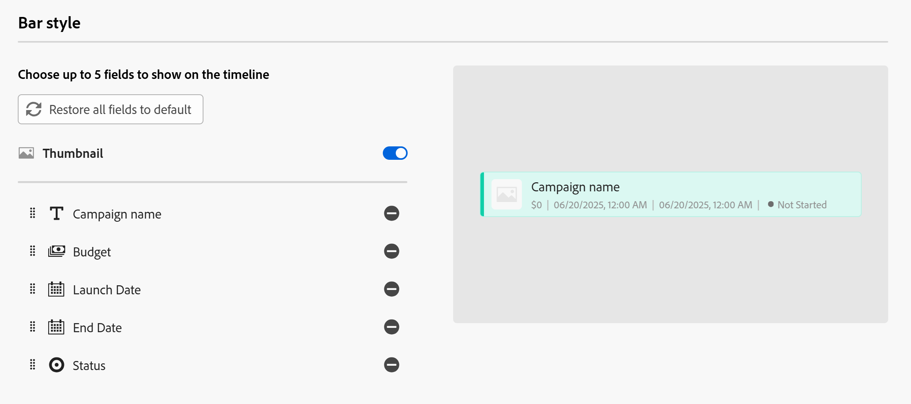

# Administrar la vista de calendario

La información resaltada en esta página hace referencia a una funcionalidad que aún no está disponible de forma general. Solo está disponible en el entorno de vista previa para todos los clientes. Después de las versiones mensuales en Production, las mismas funciones también están disponibles en el entorno Production para los clientes que habilitaron versiones rápidas. 

Para obtener información sobre las versiones rápidas, consulte [Habilitar o deshabilitar las versiones rápidas para su organización](/help/quicksilver/administration-and-setup/set-up-workfront/configure-system-defaults/enable-fast-release-process.md). 

{{planning-important-intro}}

Puede mostrar los registros y sus campos en una vista de calendario, desde la página de tipo de registro.

Para obtener información sobre las vistas de Adobe Workfront Planning y cómo administrarlas, consulte [Administrar vistas de registros](/help/quicksilver/planning/views/manage-record-views.md).

## Requisitos de acceso

+++ Amplíe para ver los requisitos de acceso. 

<table style="table-layout:auto"> 
<col> 
</col> 
<col> 
</col> 
<tbody> 
    <tr> 
<tr> 
<td> 
   
 Productos
 </td> 
   <td> 
   <ul><li>
 Adobe Workfront
</li> 
   <li>
 Planificación de Adobe Workfront
</li></ul></td> 
  </tr>   
<tr> 
   <td role="rowheader">
Plan de Adobe Workfront*
</td> 
   <td> 

Cualquiera de los siguientes planes de Workfront:
 
<ul><li>Seleccionar</li> 
<li>Prime</li> 
<li>Ultimate</li></ul> 

Workfront Planning no está disponible para planes Workfront heredados
 
   </td> 
<tr> 
   <td role="rowheader">
Paquete de planificación de Adobe Workfront*
</td> 
   <td> 

Cualquiera 
 

Para obtener más información sobre qué se incluye en cada plan de Workfront Planning, póngase en contacto con su administrador de cuentas de Workfront. 
 
   </td> 
 <tr> 
   <td role="rowheader">
plataforma de Adobe Workfront
</td> 
   <td> 

La instancia de Workfront de su organización debe incorporarse a Adobe Unified Experience para poder acceder a Workfront Planning.
 

Para obtener más información, consulte <a href="/help/quicksilver/workfront-basics/navigate-workfront/workfront-navigation/adobe-unified-experience.md">Adobe Unified Experience para Workfront</a>. 
 
   </td> 
   </tr> 
  </tr> 
    <td role="rowheader">
Licencia de Adobe Workfront*
</td> 
   <td>
 Estándar para crear y eliminar vistas

   
Colaborador o superior para actualizar los elementos de vista

   
Workfront Planning no está disponible para licencias de Workfront heredadas
 
  </td> 
  </tr> 
  <tr> 
   <td role="rowheader">
Configuración de nivel de acceso
</td> 
   <td> 
No hay controles de nivel de acceso para Adobe Workfront Planning
   
</td> 
  </tr> 
<tr> 
   <td role="rowheader">
Permisos de objeto
</td> 
   <td>   
Permisos de administración de una vista
  
   
Ver permisos en una vista para cambiar temporalmente la configuración de la vista o para duplicarla
 </td> 
  </tr> 
<tr>
   <td role="rowheader">
Plantilla de diseño
</td>
   <td> A los usuarios con una licencia Light o Contributor se les debe asignar una plantilla de diseño que incluya Planning.
   
Los usuarios estándar y los administradores del sistema tienen las áreas de Planning habilitadas de forma predeterminada.

</li></ul>
</td>
  </tr>

</tbody> 
</table>

*Para obtener más información sobre los requisitos de acceso de Workfront, consulte [Requisitos de acceso en la documentación de Workfront](/help/quicksilver/administration-and-setup/add-users/access-levels-and-object-permissions/access-level-requirements-in-documentation.md).

+++   

## Administrar una vista de calendario {#manage-a-calendar-view}

<!--insert screen shot of calendar view-->

Tenga en cuenta lo siguiente:

* Puede crear una vista de calendario únicamente si tiene al menos dos campos de fecha asociados a un tipo de registro. Cuando hay uno o ningún campo de fecha asociado a un tipo de registro, la opción de vista de calendario aparece atenuada.

  Puede seleccionar entre los campos de fecha de registro o los campos de fecha de búsqueda de los tipos de objeto o registro conectados.
* Se dan los siguientes escenarios:

   * Cuando las fechas de inicio y finalización no tienen valores, los registros no se muestran en el calendario.
   * Cuando las fechas de inicio o finalización no tienen valor, el registro se muestra como un evento de un día.
   * Cuando la fecha de inicio es posterior a la fecha de finalización, el registro no se muestra en el calendario.

Para administrar una vista de calendario:

1. Vaya a la página del tipo de registro cuyo calendario desea ver.
1. Cree una vista de calendario, tal como se describe en el artículo [Administrar vistas de registros](/help/quicksilver/planning/views/manage-record-views.md).

   

   Los registros asociados al tipo de registro seleccionado se muestran como barras en un calendario. El color de las barras coincide con el color del icono de registro de forma predeterminada.

1. Realice una de las siguientes acciones para navegar por el calendario:

   * Haga clic en los iconos izquierdo y derecho en la esquina superior izquierda del calendario o utilice el desplazamiento horizontal para moverse hacia atrás y hacia adelante en el calendario.
   * Haga clic en **Hoy** en la esquina superior derecha para centrar el calendario en la fecha de hoy.
   * Seleccione una de las siguientes opciones del menú desplegable de lapso de tiempo para actualizar los incrementos de tiempo:

      * **Mes**: los registros se muestran en un calendario mensual.

      * **Semana**: los registros se muestran en las áreas siguientes:

         * Los registros que se extienden durante varios días se muestran en la parte superior del calendario.
         * Registros que duran un día o menos y que se muestran en la mitad inferior de la vista de calendario. Si ha seleccionado mostrar la hora de las fechas de inicio y finalización, el registro se muestra a la hora adecuada dentro del día en que se produce.

1. (Opcional) Haga clic en el icono **Pantalla completa**  para abrir la vista en pantalla completa y, a continuación, en el icono **Salir de pantalla completa**  o Escape del teclado para salir de la pantalla completa.  

1. Para crear registros en la vista de calendario o editar sus fechas, siga uno de estos procedimientos:

   * Haga doble clic en cualquier lugar del calendario para crear un registro. 

     Para obtener más información, consulte [Crear registros](/help/quicksilver/planning/records/create-records.md).

   * Haga clic en el margen izquierdo o derecho de una barra de registros y, a continuación, arrástrela y suéltela en una nueva posición. Al cambiar el tamaño de las barras de los registros, se actualizan inmediatamente las fechas de inicio y finalización. 

   * Arrastre y suelte las barras de registros para actualizar su posición y fechas. Al mover las barras de los registros, se actualizan las fechas de inicio y finalización inmediatamente.

     Para obtener más información, consulte [Editar registros](/help/quicksilver/planning/records/edit-records.md).

1. Actualice los siguientes elementos de vista como se describe en las subsecciones siguientes:
   * [Filtros](#add-filters)
   * [Altura de fila](#modify-row-height)
   * [Configuración](#edit-the-calendar-view-settings)

   <!--* [Grouping](#add-grouping)-->
   <!--* [Sort](#add-sort) not sure if this is present in calendar views?!; also check the anchor and make sure it's correct-->

### Añadir filtros

Puede reducir la cantidad de información que se muestra en la pantalla mediante filtros.

Tenga en cuenta lo siguiente al trabajar con filtros en la vista de calendario:

<!-- this list is almost identical to the one for the table view - update both-->

* Los filtros que cree para una vista de calendario funcionarán de forma independiente de los filtros de cualquier otra vista aplicada al mismo tipo de registro.

* Los filtros son exclusivos de la vista que seleccione. Dos vistas de calendario del mismo tipo de registro pueden tener diferentes filtros aplicados.

* Dos usuarios que ven la misma vista de calendario ven el mismo filtro que se está aplicando actualmente.

* No puede asignar un nombre a los filtros que usted genere para una vista de calendario.

* Al eliminar los filtros, se eliminan de todos los usuarios que tengan acceso al mismo tipo de registro que usted y que muestren la misma vista que usted.

* Puede filtrar por campos de registro conectados o por campos de búsqueda.

* Puede filtrar por campos de búsqueda que muestren varios valores.

Para agregar un filtro a una vista de calendario:

1. Cree una vista de calendario para una página de tipo de registro, tal como se describe en el artículo [Administrar vistas de registros](/help/quicksilver/planning/views/manage-record-views.md).
1. Seleccione una vista de calendario y luego haga clic en **Filtros** en la barra de herramientas del calendario.
1. Haga clic en **Añadir condición** y añada la siguiente información:

   * **Seleccione un campo** por el que desea filtrar <!-- the tip below might change-->

   * **Seleccione una opción** (o un modificador de filtro) para definir qué tipo de condición debe cumplir el campo

     En la tabla siguiente se muestran los modificadores disponibles para cada tipo de campo.

     <table>
        <thead>
        <tr>
            <th><b>Tipo de campo</b></th>
            <th><b>Modificadores</b></th>
        </tr>
        </thead>
        <tbody>
        <tr>
            <td>Una sola línea, párrafo, fórmula </td>
            <td>
Contiene

            
No contiene

            
Es

            
No es

            
Está vacío

            
No está vacío
</td>
        </tr>
        <tr><td>Selección única</td>
            <td>
Es

            
No es

            
Es cualquiera de

            
No es ninguno de

            
Está vacío

            
No está vacío
</td>
        </tr>
        <tr>
            <td>Selección múltiple, Personas</td>
            <td>
Tiene cualquiera de

            
Tiene todas de

            
Es exactamente

            
No tiene ninguno de

            
Está vacío

            
No está vacío
</td>
        </tr>
        <tr>
            <td>Número, Porcentaje, Moneda</td>
            <td>
=

            
≠

            
 &lt; 

            
&gt;

            
≤

            
≥

            
Está vacío

            
No está vacío
</td>
        </tr>
        <tr>
            <td>Fecha</td>
            <td>
Es

            
No es

            
Es después de

            
Es anterior a

            
Está entre

No está entre

            
Está vacío

No está vacío
</td>
        </tr>

     <tr>
            <td>Casilla de verificación</td>
            <td>
Es

        </tr>
        </tbody>
        </table>

   * Seleccione un valor para el campo seleccionado.

   

   No hay límite en cuanto a las condiciones de filtrado que se pueden añadir.

1. (Opcional) Haga clic en **Añadir condición** para añadir otra opción de filtrado y repita los pasos anteriores. El número de filtros aplicados se muestra a la izquierda del icono Filtros.
1. Haga clic en los siguientes operadores para indicar cómo se unen y deberían aplicarse las condiciones de filtro:

   * **AND**: se deben cumplir todas las condiciones especificadas.
   * **OR**: se debe cumplir cualquiera de las condiciones especificadas. Esta es la opción predeterminada.

   1. (Opcional) Agregue operadores **AND** o **OR** adicionales entre varias agrupaciones de condiciones.

      

   La lista de registros se filtra automáticamente.  <!--at this time, you can't name and save the filter - but will this change?!-->
   <!-- asked on the task for the simple filters whether there is a limitation for how many statements a filter can have?!-->

1. (Opcional) Haga clic en el icono **x** para quitar una condición de filtro.
1. (Opcional) Haga clic en **Filtros** para cerrar el cuadro de filtros. <!--right now you cannot "clear all" for filters, but this might come later-->

### Modificar alto de fila

Puede modificar el alto de fila de una celda de calendario para aumentar o disminuir el número de barras de registro que se muestran en cada celda.

El número de registros mostrados en el calendario varía en función de la cantidad de campos que se muestren en las barras de los registros.

>[!TIP]
>
>Esta configuración solo está disponible cuando se visualiza el calendario por mes.

1. Cree una vista de calendario para una página de tipo de registro, tal como se describe en el artículo [Administrar vistas de registros](/help/quicksilver/planning/views/manage-record-views.md).
1. (Condicional) Muestre la vista de calendario por mes y, a continuación, haga clic en **Alto de fila** en la barra de herramientas del calendario.
1. Elija entre las siguientes opciones:

   <table>
    <thead>
    <tr>
        <th><b>Opción de altura de fila</b></th>
        <th><b>Número máximo predeterminado de registros</b></th>
    </tr>
    </thead>
    <tbody>
    <tr>
        <td>Baja</td>
        <td>
Contiene:

   <ul><li>2 registros que muestran 1 campo</li>
    <li>1 registro muestra más de 1 campo</li></ul>
        </td>
    </tr>
    <tr><td>Estándar</td>
        <td>
Contiene:

   <ul><li>4 registros que muestran 1 campo</li>
    <li>2 registros que muestran más de 1 campo</li></ul>
        </td>
    </tr>
    <tr>
        <td>Media</td>
        <td>
Contiene:

   <ul><li>8 registros que muestran 1 campo</li>
    <li>4 registros que muestran más de 1 campo</li></ul>
        </td>
    </tr>
    <tr>
        <td>Alta</td>
        <td>
Contiene:

   <ul><li>12 registros que muestran 1 campo</li>
    <li>6 registros que muestran más de 1 campo</li></ul>
        </td>
    </tr>
    <tr>
        <td>Ajustar al contenido</td>
        <td>
Todos los registros son visibles, hasta 500 registros
</td>
    </tr>
    </tbody>
    </table>

1. (Opcional) Haga clic en **más** si hay registros que no son visibles en el calendario.

### Editar la configuración de vista de calendario

Actualice la configuración de vista de calendario para indicar qué información se muestra en la vista y cómo.

1. Cree una vista de calendario para un tipo de registro, tal como se describe en el artículo [Administrar vistas de registros](/help/quicksilver/planning/views/manage-record-views.md).
1. Haga clic en **Configuración**.
1. Haga clic en **Fecha y hora** en el panel izquierdo, luego seleccione una **fecha de inicio** y una **fecha de finalización** para mostrar en el calendario. Puede elegir las fechas de inicio y finalización predeterminadas, o bien puede elegir cualquier campo de fecha disponible.

   Las barras que representan los registros comienzan en la fecha que se indica para la Fecha de inicio y finalizan en la fecha correspondiente a la Fecha de finalización.

   >[!NOTE]
   >
   >* Los registros que no tienen valores para las fechas Start o End o que tienen una fecha Start posterior a End no se muestran en la vista de calendario.
   >
   >* Si muestra registros adicionales mediante la opción Desglose, las fechas de inicio y finalización son las del registro principal. No puede elegir fechas de inicio y finalización para los registros conectados en esta área.

1. Haga clic en **Estilo de barra** en el panel izquierdo para indicar qué información desea mostrar en las barras de registro.

   El campo principal (o título) del registro, tal como se define en la vista de tabla del registro, está seleccionado de forma predeterminada.
   <!--adjust this when the primary field is released??-->

1. (Opcional y condicional) Si agregó miniaturas a los registros, seleccione la opción **Miniatura** para mostrar la imagen asociada a los registros en su barra de registros.

   >[!NOTE]
   >
   >    Primero debe agregar miniaturas en la vista de tabla para poder mostrarlas en la vista de calendario. Para obtener más información, consulte [Añadir una miniatura a un registro](/help/quicksilver/planning/records/add-thumbnails-to-records.md).

1. Haga clic en **Agregar campo**, luego haga clic dentro del cuadro **Buscar campos** y luego haga clic en el campo que desee agregar.

   >[!TIP]
   >
   >   * Debe crear los campos antes de poder añadirlos a las barras de registro.
   > 
   >   * Debe tener al menos un campo seleccionado. **Nombre** está seleccionado de manera predeterminada.
   >
   >   * Se pueden añadir hasta cinco campos.

   A la derecha aparece una vista previa del aspecto que tendrán las barras en el calendario.

   

1. Haga clic en **Color** en el panel izquierdo para personalizar los colores de los registros del calendario.

   

1. En la sección **Establecer color de registro en**, seleccione entre las siguientes opciones para establecer un color para los registros:

   * **Tipo de registro**: El color de las barras de registro del calendario coincide con el color del tipo de registro seleccionado. Esta es la opción predeterminada.
   * **Valores de campo**: El color de los registros coincide con el color de un campo que especifique.
   * **Ninguno**: los registros se muestran en una barra blanca.

1. (Condicional) Si ha seleccionado **Valores de campo** para los colores de registro, seleccione un campo en el menú desplegable **Hacer coincidir el color del registro con**.

   

   En el menú desplegable solo se muestran los campos con opciones codificadas por colores.

   Por ejemplo, los campos de selección múltiple o de selección única pueden tener opciones codificadas por colores.

   Si no tiene ningún campo con opciones codificadas por colores para el tipo de registro seleccionado, esta opción aparece atenuada.

1. Haga clic en **Guardar**.

   Los registros se muestran en la vista de calendario con las especificaciones seleccionadas.