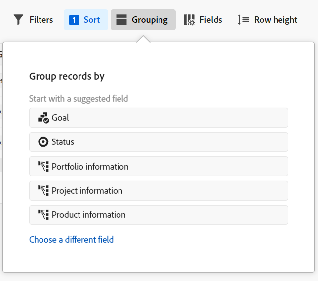
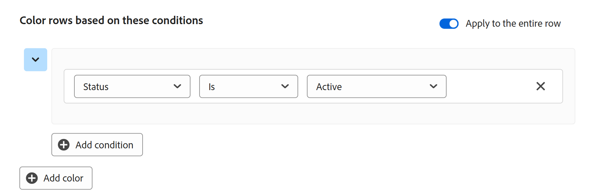

# Administrar la vista de tabla

La información resaltada en esta página hace referencia a funcionalidades que aún no están disponibles de forma general. Solo está disponible en el entorno de vista previa para todos los clientes. Después de las versiones mensuales en Production, las mismas funciones también están disponibles en el entorno Production para los clientes que habilitaron versiones rápidas. 

Para obtener información sobre las versiones rápidas, consulte [Habilitar o deshabilitar las versiones rápidas para su organización](/help/quicksilver/administration-and-setup/set-up-workfront/configure-system-defaults/enable-fast-release-process.md). 

{{planning-important-intro}}

Puede mostrar los registros y sus campos en una vista de tabla al acceder a la página de tipo de registro en Adobe Workfront Planning.

Para obtener información sobre las vistas de registros y su administración, consulte [Administrar vistas de registros](/help/quicksilver/planning/views/manage-record-views.md).

Este artículo describe la siguiente información:

* [Crear o editar columnas y filas en una vista de tabla](#manage-a-table-view)
* [Habilitar indicadores de presencia en tiempo real para la vista de tabla](#enable-the-real-time-presence-indicator)
* [Exportar una vista de tabla a un archivo CSV o de Excel](#export-the-table-view)

## Requisitos de acceso

+++ Amplíe para ver los requisitos de acceso.

<table style="table-layout:auto"> 
<col> 
</col> 
<col> 
</col> 
<tbody> 
    <tr> 
<tr> 
<td> 
   
 Productos
 </td> 
   <td> 
   <ul><li>
 Adobe Workfront
</li> 
   <li>
 Planificación de Adobe Workfront
</li></ul></td> 
  </tr>   
<tr> 
   <td role="rowheader">
Plan de Adobe Workfront*
</td> 
   <td> 

Cualquiera de los siguientes planes de Workfront:
 
<ul><li>Seleccionar</li> 
<li>Prime</li> 
<li>Ultimate</li></ul> 

Workfront Planning no está disponible para planes Workfront heredados
 
   </td> 
<tr> 
   <td role="rowheader">
Paquete de planificación de Adobe Workfront*
</td> 
   <td> 

Cualquiera 
 

Para obtener más información sobre qué se incluye en cada plan de Workfront Planning, póngase en contacto con su administrador de cuentas de Workfront. 
 
   </td> 
 <tr> 
   <td role="rowheader">
plataforma de Adobe Workfront
</td> 
   <td> 

La instancia de Workfront de su organización debe incorporarse a Adobe Unified Experience para poder acceder a Workfront Planning.
 

Para obtener más información, consulte <a href="/help/quicksilver/workfront-basics/navigate-workfront/workfront-navigation/adobe-unified-experience.md">Adobe Unified Experience para Workfront</a>. 
 
   </td> 
   </tr> 
  </tr> 
  <tr> 
   <td role="rowheader">
Licencia de Adobe Workfront*
</td> 
   <td>
 Estándar 

   
Workfront Planning no está disponible para licencias de Workfront heredadas
 
  </td> 
  </tr> 
  <tr> 
   <td role="rowheader">
Configuración de nivel de acceso
</td> 
   <td> 
No hay controles de nivel de acceso para Adobe Workfront Planning
   
</td> 
  </tr> 
<tr> 
   <td role="rowheader">
Permisos de objeto
</td> 
   <td>   
Permisos de administración de una vista
  
   
Ver permisos de una vista para cambiar temporalmente la configuración de la vista, duplicar, o exportarla
 </td> 
  </tr> 
<tr> 
   <td role="rowheader">
Plantilla de diseño
</td> 
   <td> 
En el entorno de producción, todos los usuarios, incluidos los administradores del sistema, deben estar asignados a una plantilla de diseño que incluya las áreas de planificación.

En el entorno de vista previa, los usuarios estándar y los administradores del sistema tienen activada de forma predeterminada el área de Planning.
</td> 
  </tr> 
</tbody> 
</table>

*Para obtener más información sobre los requisitos de acceso de Workfront, consulte [Requisitos de acceso en la documentación de Workfront](/help/quicksilver/administration-and-setup/add-users/access-levels-and-object-permissions/access-level-requirements-in-documentation.md).

+++

## Editar registros mediante la vista de tabla

La información de los registros solo se puede editar en la vista de tabla.

Para obtener más información sobre la edición de registros en la vista de tabla, consulte [Editar registros](/help/quicksilver/planning/records/edit-records.md).

## Administrar una vista de tabla {#manage-a-table-view}

Al crear una vista de tabla, todos los registros del tipo seleccionado se muestran en una tabla. Cada fila es un registro único y cada columna es un campo de registro. Todos los campos y todos los registros se muestran de forma predeterminada.

Para administrar una vista de tabla:

1. Cree una vista de tabla, tal como se describe en el artículo [Administrar vistas de registros](/help/quicksilver/planning/views/manage-record-views.md). 

   

   

1. (Opcional) Haga clic en **Altura de la fila** y, a continuación, seleccione una de las siguientes opciones para modificar la altura de las filas de la tabla:
   * Baja
   * Media
   * Alta

1. Actualice los siguientes elementos de vista como se describe en las subsecciones siguientes:
   * [Columnas (o campos)](#add-columns-or-fields)
   * [Filas (o registros)](#add-rows-or-records)
   * [Filtros](#add-filters)
   * [Ordenar](#add-a-sort)
   * [Agrupación](#add-groupings)
   * [Colores de fila](#add-row-colors)
   * [Indicador de presencia en tiempo real](#enable-the-real-time-presence-indicator)

### Añadir columnas (o campos) {#add-columns}

Los encabezados de columna de una vista de tabla muestran los campos asociados a los registros de la vista. Los campos mostrados en la vista de tabla también se muestran en la sección Detalles de un registro.

Para obtener más información, consulte [Editar registros](/help/quicksilver/planning/records/edit-records.md).

<!--this is not available yet:You can display record fields (or columns) in both a table and a timeline view. However, the number of columns displayed in the table of the timeline view is limited and you cannot add columns in addition to those selected by default.-->

Añadir columnas a una vista es idéntico a añadir campos a un tipo de registro.

Puede añadir hasta 500 campos (o columnas) en una vista de tabla.

1. Vaya a una página de tipo de registro y haga clic en una ficha de vista de tabla, o bien haga clic en **+ Vista** para añadir una nueva vista y, a continuación, elija **Tabla**.

1. Empiece a añadir campos (o columnas), tal como se describe en el artículo [Crear campos](/help/quicksilver/planning/fields/create-fields.md).

   Las columnas que añada serán visibles para todos los usuarios que tengan acceso al tipo de registro y se añadirán como campos nuevos en la página del registro.

1. Realice una de las siguientes acciones para reordenar las columnas de la tabla:

   * Arrastre el encabezado de la columna y suéltelo en la posición deseada. La columna que ha movido se mostrará brevemente con un fondo azul hasta que realice otros ajustes en la tabla.

   * Haga clic en **Campos** en la barra de herramientas de la tabla, arrastre y suelte los campos en el orden deseado y, a continuación, haga clic fuera del cuadro **Visibilidad y orden de los campos** para cerrarlo.

     

     >[!TIP]
     >
     >* El campo Nombre es siempre el primer campo de la vista de tabla, de forma predeterminada. Se considera un campo principal
     >
     >* No puede mover el campo Nombre a otra posición, a menos que designe otro como campo principal. Para obtener más información, continúe en el paso 4. <!--accurate?-->
     >
     >

   * Reemplace el campo de la primera columna por otro cambiando el campo principal. Para obtener más información, continúe en el paso 4. <!--accurate?-->

1. (Opcional) Pase el puntero por encima de un nombre de campo en el encabezado de columna de cualquier campo que no se muestre en la primera columna de la tabla, haga clic en la flecha hacia abajo situada a la derecha del nombre del campo y, a continuación, haga clic en **Establecer como campo principal**.

   

1. Haga clic en **Establecer campo** para confirmar.

   El campo se convertirá en un campo principal, lo que significa que se mostrará como la primera columna de la vista de tabla. El campo principal anterior se desplazará a la segunda columna.

   Los campos principales se convierten en el título del registro y se muestran en el área de encabezado de la página del registro y en cualquier lugar donde se muestren los registros. Por ejemplo, el título del registro se muestra en los campos conectados y en todas las vistas. Para obtener más información acerca de los campos principales, consulte [Información general sobre el campo principal](/help/quicksilver/planning/fields/primary-field-overview.md).

1. Haga clic en las líneas de separación de columnas, y arrástrelas y suéltelas en el lugar deseado para aumentar la anchura de las columnas.

   >[!TIP]
   >
   >Los cambios que realice en la anchura y el orden de las columnas serán permanentes y visibles para todos los usuarios que tengan acceso al tipo de registro.

1. Pase el puntero por encima del encabezado de la columna, haga clic en la flecha que apunta hacia abajo y, a continuación, en **Ocultar campo**

   O

   Haga clic en **Campos** en la barra de herramientas de la tabla y deshabilite el conmutador asociado a los campos (o columnas) que desee ocultar. Se mostrará el cuadro **Visibilidad y orden de los campos**.

   >[!TIP]
   >
   >El número de campos ocultos se muestra a la izquierda del icono Campos de la barra de herramientas.

1. Haga clic en el icono **Campos** y active la opción asociada a los campos que desea mostrar en las columnas de la tabla. Todos los campos se mostrarán de forma predeterminada.

1. Haga lo siguiente para buscar rápidamente registros que coincidan con una palabra clave:

   1. Haga clic en el icono **Buscar**  y empiece a escribir una palabra clave asociada a cualquier campo de un registro que se muestra en la pantalla. El número de coincidencias correctas se mostrará junto al elemento de búsqueda y el campo con la coincidencia correcta quedará resaltado.

      

      Puede utilizar cualquier palabra o carácter especial que esté visible en la pantalla.

      No se pueden utilizar palabras clave asociadas a campos que estén ocultos en la vista de tabla.

   1. Pulse **Intro** en el teclado para ir al siguiente campo encontrado.

   1. (Opcional) Si hay más de una coincidencia, haga clic en las flechas arriba y abajo situadas a la derecha de la palabra clave de búsqueda para encontrar todas las coincidencias de la tabla.

   1. Haga clic en el icono **x** en el cuadro de búsqueda para borrar la palabra clave de búsqueda.

### Añadir filas (o registros) {#add-rows}

Las filas de una vista de tabla muestran registros individuales del tipo de registro seleccionado.

Puede tener hasta 50 000 registros (o filas) para un tipo de registro.

1. Vaya a una página de tipo de registro y haga clic en una ficha de vista de tabla, o bien haga clic en **+ Vista** para añadir una nueva vista y, a continuación, elija **Tabla**.

1. Empiece a añadir registros (o filas), tal como se describe en el artículo [Crear registros](/help/quicksilver/planning/records/create-records.md).

   Los registros que añada a la vista de tabla se guardarán inmediatamente y serán visibles para todos los usuarios que tengan permisos de vista o superiores sobre el área de trabajo.

1. (Opcional) Añada una miniatura a cada registro, haga clic en **Campos** en la esquina superior derecha de la tabla y, a continuación, seleccione el conmutador del campo **Miniatura** para mostrarlo a la izquierda del campo principal. De forma predeterminada, no está seleccionado.

   Para obtener más información, consulte [Añadir una miniatura a un registro](/help/quicksilver/planning/records/add-thumbnails-to-records.md).

1. (Opcional) Seleccione uno o varios registros de una fila y, a continuación, arrastre y suelte el icono **controlador**  a la izquierda del registro para reordenar las filas.

   >[!NOTE]
   >
   >No se pueden reordenar filas si se aplica al menos una ordenación a la vista de tabla.
   >
   >Los cambios que realice en el orden de filas serán visibles para todos los usuarios que tengan acceso al tipo de registro

<!-- this section below links from the timeline view; consider splitting them if they become different-->

### Añadir filtros {#add-filters}

Los filtros le ayudan a reducir la cantidad de información que se muestra en la pantalla.

Tenga en cuenta lo siguiente cuando utilice filtros en la vista de tabla:

<!-- this list is almost identical to the one for the table view - update both-->

* Los filtros que cree para la vista de tabla funcionan de forma independiente de los filtros de la vista de línea de tiempo cuando se aplican al mismo tipo de registro.

* Los filtros son exclusivos de la vista que seleccione. En dos vistas de tabla con el mismo tipo de registro se pueden aplicar diferentes filtros. Dos usuarios que consulten la misma vista de tabla verán el mismo filtro aplicado en ese momento.

* No puede asignar un nombre a los filtros que genere y aplique a una vista de tabla.

* Al quitar los filtros, se quitarán para todas las personas que tengan acceso al mismo tipo de registro que usted y utilicen la misma vista que utiliza.

* Puede filtrar por campos de registro conectados o por campos de búsqueda.

* Puede filtrar por campos de búsqueda que muestren varios valores.

* Puede hacer referencia a un campo que esté situado a una distancia de hasta 4 niveles del tipo de registro actual. Por ejemplo, si va a crear un filtro para un tipo de registro de actividad y la actividad está conectada al tipo de registro de producto que está conectado al tipo de registro de campaña que está conectado a un proyecto de Workfront, puede hacer referencia al presupuesto del proyecto en el filtro que va a crear para el tipo de registro de actividad.

Para añadir un filtro a una vista de tabla:

1. Cree una vista de tabla para una página de tipo de registro, tal como se describe en el artículo [Administrar vistas de registros](/help/quicksilver/planning/views/manage-record-views.md).
1. Seleccione una vista de tabla y luego haga clic en **Filtros** en la esquina superior derecha de la tabla.
1. Haga clic en **Añadir condición** y añada la siguiente información:

   * **Seleccione un campo** por el que desea filtrar <!-- the tip below might change-->

   * **Seleccione una opción** (o un modificador de filtro) para definir qué tipo de condición debe cumplir el campo

     En la tabla siguiente se muestran los modificadores disponibles para cada tipo de campo.

     <table>
        <thead>
        <tr>
            <th><b>Tipo de campo</b></th>
            <th><b>Modificadores</b></th>
        </tr>
        </thead>
        <tbody>
        <tr>
            <td>Una sola línea, párrafo, fórmula </td>
            <td>
Contiene

            
No contiene

            
Es

            
No es

            
Está vacío

            
No está vacío
</td>
        </tr>
        <tr><td>Selección única</td>
            <td>
Es

            
No es

            
Es cualquiera de

            
No es ninguno de

            
Está vacío

            
No está vacío
</td>
        </tr>
        <tr>
            <td>Selección múltiple, Personas</td>
            <td>
Tiene cualquiera de

            
Tiene todas de

            
Es exactamente

            
No tiene ninguno de

            
Está vacío

            
No está vacío
</td>
        </tr>
        <tr>
            <td>Número, Porcentaje, Moneda</td>
            <td>
=

            
≠

            
 &lt; 

            
&gt;

            
≤

            
≥

            
Está vacío

            
No está vacío
</td>
        </tr>
        <tr>
            <td>Fecha</td>
            <td>
Es

            
No es

            
Es después de

            
Es anterior a

            
Está entre

No está entre

            
Está vacío

No está vacío
</td>
        </tr>

     <tr>
            <td>Casilla de verificación</td>
            <td>
Es

        </tr>
        </tbody>
        </table>

   * Seleccione un valor para el campo seleccionado.

   

   No hay límite en cuanto a las condiciones de filtrado que se pueden añadir.

1. (Opcional) Haga clic en **Añadir condición** para añadir otra opción de filtrado y repita los pasos anteriores. El número de filtros aplicados se muestra a la izquierda del icono Filtros.
1. Haga clic en los siguientes operadores para indicar cómo se unen y deberían aplicarse las condiciones de filtro:

   * **AND**: se deben cumplir todas las condiciones especificadas.
   * **OR**: se debe cumplir cualquiera de las condiciones especificadas. Esta es la opción predeterminada.

   1. (Opcional) Agregue operadores **AND** o **OR** adicionales entre varias agrupaciones de condiciones.

      

   La lista de registros se filtra automáticamente.  <!--at this time, you can't name and save the filter - but will this change?!-->
   <!-- asked on the task for the simple filters whether there is a limitation for how many statements a filter can have?!-->

1. (Opcional) Haga clic en el icono **x** para quitar una condición de filtro.
1. (Opcional) Haga clic en **Filtros** para cerrar el cuadro de filtros. <!--right now you cannot "clear all" for filters, but this might come later-->

### Añadir una ordenación {#sort-information}

Al aplicar una ordenación, puede organizar la información en un orden determinado.

Puede ordenar la siguiente información:

* Todos los registros de una vista de tabla. <!--or timeline view. ***********verify this is the case for the timeline view*********************-->
  <!--* All groupings. - this is not available yet-->

Tenga en cuenta lo siguiente al ordenar registros en la vista de tabla:

<!-- if this is available for the timeline view, update both when you update one-->

* La ordenación es única para la vista que seleccione. En dos vistas de tabla con el mismo tipo de registro se pueden aplicar diferentes criterios de ordenación. Dos usuarios que consulten la misma vista de tabla verán el mismo orden que se aplica en ese momento.

* No puede asignar un nombre a las ordenaciones que genere y aplique a una vista de tabla.

* El orden creado se conservará cuando deje de navegar.

* Puede ordenar por tantos campos como vea en la vista de tabla de un tipo de registro.

* No puede ordenar por los campos de registro conectados, pero puede ordenar por los campos de búsqueda de tipos de registro conectados.

* Al ordenar por los campos de búsqueda con varios valores (que no se hayan resumido con un agregador), se utiliza el primer valor para ordenar.

* Cuando se quitan los criterios de ordenación, se quitan para cualquier usuario que tenga acceso al mismo tipo de registro que el suyo y utilice la misma vista que utiliza.

* Puede hacer referencia a un campo que esté situado a una distancia de hasta 4 niveles del tipo de registro actual. Por ejemplo, si va a crear una ordenación para un tipo de registro de actividad y la actividad está conectada al tipo de registro de producto que está conectado al tipo de registro de campaña que está conectado a un proyecto de Workfront, puede hacer referencia al estado del proyecto en la ordenación que va a crear para el tipo de registro de actividad.

Para ordenar registros <!--ungrouped (add this when sorting for groupings will be available-->, haga lo siguiente:

1. Cree una vista de tabla, tal como se describe en el artículo [Administrar vistas de registros](/help/quicksilver/planning/views/manage-record-views.md).
1. Haga clic en el icono **Ordenar**  en la esquina superior derecha de la tabla

   O

   Pase el puntero por encima del nombre de una columna en la vista de tabla, haga clic en la flecha hacia abajo a la derecha del nombre del encabezado de la columna y, a continuación, haga clic en **Ordenar por este campo**. El campo se añade como una selección de ordenación en el icono de Ordenar de la esquina superior derecha de la vista de tabla.

1. (Condicional) En el cuadro **Ordenar registros por**, haga clic en uno de los campos sugeridos o haga clic en **Elegir un campo diferente** y busque un campo diferente; a continuación, haga clic en él cuando se muestre en la lista.

   El orden se aplicará automáticamente a la vista de tabla y los registros se mostrarán ordenados según los criterios seleccionados.

   <!-- add a step that you can rearrange the sorting fields here, when this will be possible-->

1. (Opcional) Haga clic en **Añadir condición** y repita los pasos anteriores para ordenar por campos adicionales.

   El número de campos por el que está ordenando se muestra a la izquierda del icono de Ordenar en la esquina superior derecha de la barra de herramientas. Solo puede elegir campos que se muestran en las columnas de la vista de tabla.

1. (Opcional) En el cuadro **Ordenar registros por**, haga clic en el icono **x** a la derecha de un campo de ordenación para quitar la ordenación

   O

   Haga clic en **Borrar todo** para quitar todos los campos de la ordenación.

1. Haga clic fuera del cuadro **Ordenar registros por** para cerrarlo.

   

   La información mostrada en la tabla se ordena según los criterios seleccionados.

   Los campos seleccionados para la ordenación muestran un icono de ordenación seguido de un número que indica el orden de aplicación de la ordenación.

### Añadir agrupaciones {#add-groupings}

<!--this section exists in the timeline view too, but the display is slightly different, so I kept both steps; consider updating both sections if any updates to groupings are introduced-->

Es posible agrupar registros por información similar al aplicar una agrupación a una vista.

Tenga en cuenta lo siguiente:

* Es posible aplicar agrupaciones tanto en las vistas de tabla como de línea de tiempo. Las agrupaciones de la vista de tabla son independientes de las de la vista de línea de tiempo del mismo tipo de registro.
* Se pueden aplicar 3 niveles de agrupación en una vista. Los registros se agrupan en el orden de agrupaciones que se seleccione.
&lt;!--* Es posible aplicar hasta 4 niveles de agrupación al utilizar la API. --comprobando este ahora-->
* Las agrupaciones son únicas para la vista que se seleccione. Dos vistas de tabla del mismo tipo de registro pueden tener diferentes agrupaciones aplicadas. Dos usuarios que vean la misma vista de tabla verán la misma agrupación que se aplique en ese momento.
* No se puede asignar un nombre a las agrupaciones que se generen para una vista de tabla.
* Al quitar las agrupaciones, se quitarán de cualquier usuario que tenga acceso al mismo tipo de registro y que muestre la misma vista que usted.
* Es posible editar los registros enumerados bajo una agrupación.
* Es posible agrupar por campos de registro conectados o campos de búsqueda.
* Cuando se agrupan por campos de búsqueda con varios valores (que no se hayan resumido por un agregador), los registros se agruparán según cada combinación única de valores de campo.
* Puede hacer referencia a un campo que esté situado a una distancia de hasta 4 niveles del tipo de registro actual. Por ejemplo, si se crea una agrupación para un tipo de registro de actividad y la actividad estuviera conectada al tipo de registro de producto, que está conectado al tipo de registro de campaña, y que está conectado a un proyecto de Workfront, se podrá hacer referencia al estado del proyecto en la agrupación que esté creando para el tipo de registro de actividad.
<!--checking into this: * You can apply up to 4 levels of grouping when using the API. -->
<!-- checking also into this: * You cannot group by a Paragraph-type field.-->

para añadir una agrupación:

1. Cree una vista de línea de tiempo para un tipo de registro, tal y como se describe en el artículo [Administración de vistas de registros](/help/quicksilver/planning/views/manage-record-views.md).
1. Haga clic en **Agrupación**, en la esquina superior derecha de la vista de tabla.

   

1. Haga clic en uno de los campos sugeridos o en **Elegir un campo diferente**, busque uno y luego hágale clic cuando se muestre en la lista.

   La agrupación se aplicará automáticamente a la tabla y los registros se mostrarán bajo la línea de separación de la agrupación.

1. (Opcional) Haga clic en **Añadir condición** y repita los pasos anteriores para añadir hasta 3 agrupaciones.

   El número de campos seleccionados para la agrupación se muestra junto al icono de Agrupación.

   

1. (Opcional) Dentro del cuadro **Agrupar registros por**, haga clic en el icono **x** a la derecha de un campo seleccionado para la agrupación para quitar la agrupación

   O

   Haga clic en **Borrar todo** para quitar todos los campos.

1. Haga clic fuera del cuadro **Agrupar registros por** para cerrarlo.
1. (Opcional) Haga clic en **+ Nuevo registro** al final de cualquier agrupación para añadir nuevos registros y, a continuación, actualice la página para añadir el nuevo registro a la agrupación adecuada. <!--this might need to be changed when they add the Refresh button on the toolbar of the table view-->

1. Para expandir o contraer agrupaciones, siga uno de estos procedimientos:

   

   1. Haga clic en el icono **Agrupación**, luego en **Expandir todo** o **Contraer todo**. Esto expande todas las agrupaciones y subagrupaciones de la vista de tabla.

      

   1. Haga clic con el botón secundario en cualquiera de los encabezados de agrupación de la vista de tabla y, a continuación, haga clic en una de las siguientes opciones:
      * **Expandir grupo**
      * **Contraer grupo**
      * **Expandir todo**
      * **Contraer todo**
      * **Expandir subgrupos**
      * **Contraer subgrupos**

      Según el número de agrupaciones que aplique a la vista, es posible que algunas opciones no estén disponibles.

<!-- this is not available yet: 

To sort grouped records: 

1. Create a view, as described in [Create or edit record views](#create-or-edit-record-views). 
1. ************************* add steps here for sorting grouped records****************

-->

### Agregar colores de fila

1. (Opcional) Haga clic en **Colores de fila** para definir las condiciones y elegir configurar diferentes colores para las filas de la tabla.

1. Haga clic en **Agregar color** y, a continuación, **Seleccione un campo** cuyo valor desee determinar el color de una fila.

   Por ejemplo, para mostrar campañas con el estado Activo en verde, seleccione **Estado** y, a continuación, elija un modificador y un valor para el campo.

   

1. Haga clic en el menú desplegable del selector de color en la esquina superior izquierda de la condición seleccionada, para elegir el color de la condición y, a continuación, haga clic fuera del cuadro selector de color para cerrarlo.

   

1. (Opcional) Haga clic en **Agregar condición** para agregar más campos y valores al primer conjunto de condiciones

   O

   Haga clic en **Agregar color** para agregar un nuevo conjunto de condiciones e identificar un nuevo color.

   Por ejemplo, puede mostrar las campañas en un estado de Planning en amarillo definiendo un nuevo conjunto de condiciones.

   

1. (Opcional) Active la opción **Aplicar a toda la fila** en la esquina superior derecha del cuadro Colores de fila. Toda la fila donde se cumple la condición se muestra automáticamente en el color seleccionado.

   >[!NOTE]
   >
   >* Si la configuración Aplicar a toda la fila está desactivada, solo el lado izquierdo del campo Principal muestra un indicador de color estrecho con el color seleccionado. La configuración está desactivada de forma predeterminada.
   >
   >* No se pueden aplicar colores de fila a toda una fila si se ha seleccionado al menos una agrupación en la vista de tabla.

1. Haga clic fuera del cuadro **Colores de fila** para cerrarlo. Los colores se aplican automáticamente.

### Habilitar el indicador de presencia en tiempo real

De forma predeterminada, los avatares de otros usuarios que están editando información de registro al mismo tiempo que se muestran en la esquina superior derecha de todas las vistas de registros.

Al mostrar la vista de tabla, también puede ver qué campo está editando otro usuario en el momento en que está viendo el registro.

1. Vaya a una página de tipo de registro y abra cualquier vista.
1. (Condicional) Si hay otros usuarios editando al mismo tiempo los registros del tipo seleccionado, sus avatares se mostrarán en la esquina superior derecha de la vista.
1. Haga clic en el menú desplegable situado junto a los avatares y seleccione la opción **Mostrar colaboradores**. La opción está seleccionada de forma predeterminada.

   

1. (Condicional) Abra una vista de tabla y el campo que otra persona está editando activamente se resaltará en el color correspondiente al contorno de su avatar en la vista de tabla.

   Si el color de resaltado del avatar es gris, el usuario dejó de editar activamente el registro hace más de 30 segundos.

   

   >[!TIP]
   >
   >Puede seleccionar la opción **Mostrar colaboradores** de cualquier vista. El campo editado actualmente por otros usuarios sólo se describe en la vista de tabla.

## Exportación de la vista de tabla

Puede exportar información de la vista de tabla a un archivo CSV o de Excel.

Tenga en cuenta lo siguiente al exportar la vista de tabla:

* La información exportada a un archivo de Excel conserva los filtros, agrupaciones y ordenaciones aplicados a la vista de tabla en Workfront Planning. Las agrupaciones no son visibles en el archivo CSV.

* Los archivos exportados no admiten miniaturas ni colores de fila personalizados.

* Solo se exportan los campos que se hacen visibles en la interfaz de Workfront. Los campos ocultos no se exportan.

Para exportar información desde la vista de tabla o un tipo de registro:

1. Vaya a una página de tipo de registro y haga clic en una ficha de vista de tabla.
1. Pase el ratón sobre el nombre de la pestaña de la vista de tabla y luego haga clic en el menú **Más** .

   
1. Haga clic en **Exportar** y, a continuación, seleccione uno de los siguientes formatos:

   * Excel
   * CSV

   >[!IMPORTANT]
   >
   >No se puede exportar información desde la vista de tabla cuando se muestra una vista diferente en la pantalla. Debe mostrar la vista de tabla que desea exportar para acceder a la opción Exportar en el menú Más.

   El archivo se descargará en el equipo.

1. (Opcional) Vaya a la carpeta de descargas del equipo y busque el archivo descargado.

   El nombre del archivo exportado sigue el siguiente formato:

   `Name of the view - name of the record type`

   Por ejemplo, una vista de tabla para el tipo de registro Campañas genera un archivo denominado `Table view - Campaigns`.

   El archivo muestra la siguiente información:

   * Los encabezados de columna se resaltan en negro en el archivo de Excel
   * Todos los campos visibles en la interfaz de Workfront, ordenados y filtrados según los mismos criterios
   * Las agrupaciones se conservan en el archivo de Excel

   Ahora puede compartir los archivos exportados con otros usuarios o adjuntarlos a cualquier comunicación.

