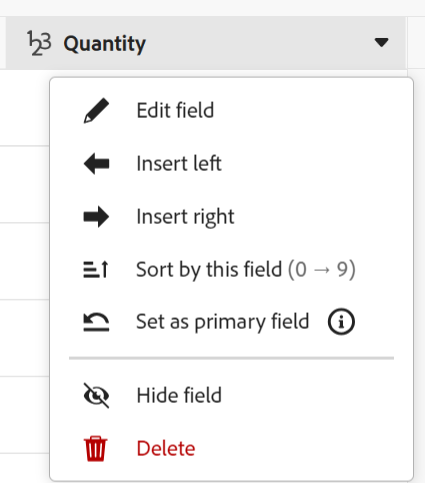

# Administrar la vista de tabla

{{planning-important-intro}}

Puede mostrar los registros y sus campos en una vista de tabla al acceder a la página de tipo de registro en Adobe Workfront Planning.

Para obtener información sobre las vistas de registros y cómo administrarlas, consulte [Administrar vistas de registros](/help/quicksilver/planning/views/manage-record-views.md).

## Requisitos de acceso

+++ Amplíe para ver los requisitos de acceso para Workfront Planning.

Debe tener lo siguiente para poder acceder a Workfront Planning:

<table style="table-layout:auto"> 
<col> 
</col> 
<col> 
</col> 
<tbody> 
    <tr> 
<tr> 
<td> 
   
 Productos
 </td> 
   <td> 
   <ul><li>
 Adobe Workfront
</li> 
   <li>
 Planificación de Adobe Workfront
</li></ul></td> 
  </tr>   
<tr> 
   <td role="rowheader">
plan Adobe Workfront*
</td> 
   <td> 

Cualquiera de los siguientes planes de Workfront:
 
<ul><li>Seleccionar</li> 
<li>Prime</li> 
<li>Ultimate</li></ul> 

Workfront Planning no está disponible para planes Workfront heredados
 
   </td> 
<tr> 
   <td role="rowheader">
Plan de planificación de Adobe Workfront*
</td> 
   <td> 

Cualquiera 
 

Para obtener más información sobre lo que se incluye en cada plan de Workfront Planning, consulte <a href="https://business.adobe.com/products/workfront/pricing.html">Precios y empaquetado de Adobe Workfront</a>. 
 
   </td> 
 <tr> 
   <td role="rowheader">
plataforma de Adobe Workfront
</td> 
   <td> 

La instancia de Workfront de su organización debe incorporarse a la experiencia Adobe unificado para poder acceder a todas las funcionalidades de Workfront Planning.
 

Para obtener más información, consulte <a href="/help/quicksilver/workfront-basics/navigate-workfront/workfront-navigation/adobe-unified-experience.md">Experiencia unificada de Adobe para Workfront</a>. 
 
   </td> 
   </tr> 
  </tr> 
  <tr> 
   <td role="rowheader">
Licencia de Adobe Workfront*
</td> 
   <td>
 Estándar 

   
Workfront Planning no está disponible para licencias de Workfront heredadas
 
  </td> 
  </tr> 
  <tr> 
   <td role="rowheader">
Configuración del nivel de acceso
</td> 
   <td> 
No hay controles de nivel de acceso para Adobe Workfront Planning
   
</td> 
  </tr> 
<tr> 
   <td role="rowheader">
Permisos de objeto
</td> 
   <td>   
Administración de permisos en una vista
  
   
Ver permisos de una vista para cambiar temporalmente su configuración
 </td> 
  </tr> 
<tr> 
   <td role="rowheader">
Plantilla de diseño
</td> 
   <td> 
A todos los usuarios, incluidos los administradores de Workfront, se les debe asignar una plantilla de diseño que incluya el área de Planning en el menú principal. 
 </td> 
  </tr> 
</tbody> 
</table>

*Para obtener más información sobre los requisitos de acceso de Workfront, consulte [Requisitos de acceso en la documentación de Workfront](/help/quicksilver/administration-and-setup/add-users/access-levels-and-object-permissions/access-level-requirements-in-documentation.md).

+++

<!--
OLD:

<table style="table-layout:auto">
 <col>
 </col>
 <col>
 </col>
 <tbody>
    <tr>
<tr>
<td>
   
 Product
 </td>
   <td>
   
 Adobe Workfront
 </td>
  </tr>  
 <td role="rowheader">
Adobe Workfront agreement
</td>
   <td>

Your organization must be enrolled in the early access stage for Workfront Planning 

   </td>
  </tr>
  <tr>
   <td role="rowheader">
Adobe Workfront plan
</td>
   <td>

Any

   </td>
  </tr>
  <tr>
   <td role="rowheader">
Adobe Workfront license*
</td>
   <td>
   
New: Standard

   Or
   
Current: Plan 
 
  </td>
  </tr>
  
  <tr>
   <td role="rowheader">
Access level configurations
</td>
   <td> There are no access controls for Adobe Workfront Planning
  
</td>
  </tr>

  <tr>
   <td role="rowheader">
Permissions
</td>
   <td> 
Manage permissions to a view
  
   
View permissions to a view to temporarily change the view settings

</td>
  </tr>

<tr>
   <td role="rowheader">
Layout template
</td>
   <td> 
All users, including Workfront administrators,  must be assigned a layout template that includes the Planning area in the Main Menu. 
 
For information, see <a href="/help/quicksilver/planning/access/access-overview.md">Access overview</a>. 
 
</td>
  </tr>
 </tbody>
</table>

*For information, see [Access requirements in Workfront documentation](/help/quicksilver/administration-and-setup/add-users/access-levels-and-object-permissions/access-level-requirements-in-documentation.md).-->

## Edición de registros mediante la vista de tabla

La información de los registros sólo se puede editar en la vista de tabla.

Para obtener más información acerca de cómo editar registros en la vista de tabla, vea [Editar registros](/help/quicksilver/planning/records/edit-records.md).

## Administración de una vista de tabla {#manage-a-table-view}

<!--insert screen shot of table view-->

Al crear una vista de tabla, todos los registros del tipo seleccionado se muestran en una tabla. Cada fila es un registro único y cada columna es un campo de registro. Todos los campos y todos los registros se muestran de forma predeterminada.

Para administrar una vista de tabla:

1. Cree una vista de tabla, tal como se describe en el artículo [Administrar vistas de registros](/help/quicksilver/planning/views/manage-record-views.md).

   

1. (Opcional) Haga clic en **Alto de fila** y, a continuación, seleccione una de las siguientes opciones para modificar el alto de las filas de la tabla:
   * Baja
   * Media
   * Alta

1. Actualice los siguientes elementos de vista como se describe en las subsecciones siguientes:
   * [Columnas (o campos)](#add-columns-or-fields)
   * [Filas (o registros)](#add-rows-or-records)
   * [Filtros](#add-filters)
   * [Agrupación](#add-groupings)
   * [Ordenar](#add-a-sort)
   * [Habilitar el indicador de presencia en tiempo real](#enable-the-real-time-presence-indicator)

### Agregar columnas (o campos) {#add-columns}

Los encabezados de columna de una vista de tabla muestran los campos asociados a los registros de la vista. Los mismos campos mostrados en la vista de tabla también se muestran en la sección Detalles de un registro. Para obtener más información, consulte [Editar registros](/help/quicksilver/planning/records/edit-records.md).

<!--this is not available yet:You can display record fields (or columns) in both a table and a timeline view. However, the number of columns displayed in the table of the timeline view is limited and you cannot add columns in addition to those selected by default.-->

Añadir columnas a una vista es idéntico a añadir campos a un tipo de registro.

Puede agregar hasta 500 campos (o columnas) en una vista de tabla.

1. Vaya a una página de tipo de registro y haga clic en una ficha de vista de tabla, o bien haga clic en **+ Ver** para agregar una nueva vista y, a continuación, elija **Tabla**.

1. Empiece a agregar campos (o columnas), tal como se describe en el artículo [Crear campos](/help/quicksilver/planning/fields/create-fields.md).

   Las columnas que agregue serán visibles para todos los usuarios que tengan acceso al tipo de registro y se agregarán como campos nuevos en la página del registro.

1. Realice una de las siguientes acciones para reordenar las columnas de la tabla:

   * Coja el encabezado de la columna y arrástrela y suéltela en la posición deseada. La columna que ha movido aparece brevemente con un fondo azul hasta que realice otros ajustes en la tabla.

   * Haga clic en **Campos** en la barra de herramientas de la tabla, arrastre y suelte los campos en el orden deseado y, a continuación, haga clic fuera del cuadro **Visibilidad de campos y orden** para cerrarlo.

     

     >[!TIP]
     >
     >* El campo Nombre es siempre el primer campo de la vista de tabla, de forma predeterminada. Se considera un campo principal.
     >
     >* No puede mover el campo Nombre a otra posición, a menos que designe otro campo como campo principal. Para obtener más información, continúe con el paso 4. <!--accurate?-->
     >
     >

   * Reemplace el campo de la primera columna por otro campo cambiando el campo principal. Para obtener más información, siga con el paso 4. <!--accurate?-->

1. (Opcional) Pase el ratón sobre un nombre de campo en el encabezado de columna de cualquier campo que no se muestre en la primera columna de la tabla, haga clic en la flecha hacia abajo a la derecha del nombre del campo y, a continuación, haga clic en **Establecer como campo principal**.

   

1. Haga clic en **Establecer campo** para confirmar.

   El campo se convierte en un campo principal, lo que significa que se muestra como la primera columna de la vista de tabla. El campo principal anterior se desplaza a la segunda columna.

   Los campos principales se convierten en el título del registro y se muestran en el área de encabezado de la página del registro y en cualquier lugar donde se muestren los registros. Por ejemplo, el título del registro se muestra en los campos conectados y en todas las vistas. Para obtener más información acerca de los campos principales, vea [Información general sobre el campo principal](/help/quicksilver/planning/fields/primary-field-overview.md).

1. Haga clic en las líneas de separación de columnas, arrástrelas y suéltelas en el lugar deseado para aumentar el ancho de las columnas.

   >[!TIP]
   >
   >Los cambios que realice en el ancho y el orden de las columnas son permanentes y visibles para todos los usuarios que tengan acceso al tipo de registro.

1. Pase el ratón sobre el encabezado de la columna, luego haga clic en la flecha que apunta hacia abajo y luego haga clic en **Ocultar campo**

   O

   Haga clic en **Campos** en la barra de herramientas de la tabla y deshabilite la opción asociada a los campos (o columnas) que desee ocultar. Se muestra el cuadro **Visibilidad de campos y orden**.

   >[!TIP]
   >
   >El número de campos ocultos se muestra a la izquierda del icono Campos de la barra de herramientas.

1. Haga clic en el icono **Campos** y active la opción asociada a los campos que desea mostrar en las columnas de la tabla. Todos los campos se muestran de forma predeterminada.

1. Haga lo siguiente para buscar rápidamente registros que coincidan con una palabra clave:

   1. Haga clic en el icono **Search**  y empiece a escribir una palabra clave asociada a cualquier campo de un registro que se muestra en la pantalla. El número de coincidencias correctas se muestra junto al elemento de búsqueda y el campo con la coincidencia correcta está resaltado.

      

      Puede utilizar cualquier palabra o carácter especial que esté visible en la pantalla.

      No se pueden utilizar palabras clave asociadas a campos que están ocultos en la vista de tabla.

   1. Presione **Enter** en el teclado para ir al siguiente campo encontrado.

   1. (Opcional) Si hay más de una coincidencia, haga clic en las flechas arriba y abajo a la derecha de la palabra clave de búsqueda para encontrar todas las coincidencias de la tabla.

   1. Haga clic en el icono **x** en el cuadro de búsqueda para borrar la palabra clave de búsqueda.

### Agregar filas (o registros) {#add-rows}

Las filas de una vista de tabla muestran registros individuales del tipo de registro seleccionado.

Puede tener hasta 50 000 registros (o filas) para un tipo de registro S.

1. Vaya a una página de tipo de registro y haga clic en una ficha de vista de tabla, o bien haga clic en **+ Ver** para agregar una nueva vista y, a continuación, elija **Tabla**.

1. Empiece a agregar registros (o filas), tal como se describe en el artículo [Crear registros](/help/quicksilver/planning/records/create-records.md).

   Los registros que agregue a la vista de tabla se guardan inmediatamente y son visibles para todos los usuarios que tengan permisos de Vista o superiores en el área de trabajo.

1. (Opcional) Agregue una miniatura a cada registro, haga clic en **Campos** en la esquina superior derecha de la tabla y, a continuación, seleccione el botón de alternancia del campo **Miniatura** para mostrarlo a la izquierda del campo principal. De forma predeterminada, no está seleccionada.

   Para obtener más información, vea [Agregar una miniatura a un registro](/help/quicksilver/planning/records/add-thumbnails-to-records.md).

1. (Opcional) Seleccione uno o varios registros de una fila y, a continuación, arrastre y suelte el icono **controlador**  a la izquierda del registro para reordenar las filas.

   >[!NOTE]
   >
   >No puede reordenar filas si aplica al menos una ordenación a la vista de tabla.
   >
   >Los cambios que realice en el orden de filas serán visibles para todos los usuarios que tengan acceso al tipo de registro

<!-- this section below links from the timeline view; consider splitting them if they become different-->

### Añadir filtros {#add-filters}

Los filtros le ayudan a reducir la cantidad de información que se muestra en la pantalla.

Tenga en cuenta lo siguiente al trabajar con filtros en la vista de tabla:

<!-- this list is almost identical to the one for the table view - update both-->

* Los filtros que cree para la vista de tabla funcionan de forma independiente de los filtros de la vista de cronología cuando se aplican al mismo tipo de registro.

* Los filtros son exclusivos de la vista seleccionada. Dos vistas de tabla del mismo tipo de registro pueden tener diferentes filtros aplicados. Dos usuarios que ven la misma vista de tabla ven el mismo filtro que se aplica actualmente.

* No puede asignar un nombre a los filtros que genere y aplique a una vista de tabla.

* Al eliminar los filtros, se eliminan de todos los que tengan acceso al mismo tipo de registro que usted y utilicen la misma vista que utiliza.

* Añadir filtros a la vista de tabla es idéntico a añadir filtros a la vista de cronología.

* Puede filtrar por campos de registro conectados o campos de búsqueda.

* Puede filtrar por campos de búsqueda que muestren varios valores.

* Puede hacer referencia a un campo que esté situado a una distancia de hasta 4 niveles del tipo de registro actual. Por ejemplo, si está creando un filtro para un tipo de registro de actividad y la actividad está conectada al tipo de registro de producto conectado al tipo de registro de campaña conectado a un proyecto de Workfront, puede hacer referencia al presupuesto del proyecto en el filtro que está creando para el tipo de registro de actividad.

Para agregar un filtro a una vista de tabla:

1. Cree una vista de tabla para una página de tipo de registro, tal como se describe en el artículo [Administrar vistas de registros](/help/quicksilver/planning/views/manage-record-views.md).
1. Seleccione una vista de tabla y luego haga clic en **Filtros** en la esquina superior derecha de la tabla.
1. Haga clic en **Agregar condición** y agregue la siguiente información:

   * **Seleccione un campo** por el que desee filtrar <!-- the tip below might change-->

   * **Seleccione una opción** (o un modificador de filtro) para definir qué tipo de condición debe cumplir el campo

     La tabla siguiente muestra los modificadores disponibles para cada tipo de campo.

     <table>
        <thead>
        <tr>
            <th><b>Tipo de campo</b></th>
            <th><b>Modificadores</b></th>
        </tr>
        </thead>
        <tbody>
        <tr>
            <td>Una línea, párrafo, fórmula </td>
            <td>
Contiene

            
No contiene

            
Es

            
No es

            
Está vacío

            
No está vacío
</td>
        </tr>
        <tr><td>Selección única</td>
            <td>
Es

            
No es

            
Es cualquiera de

            
No es ninguno de

            
Está vacío

            
No está vacío
</td>
        </tr>
        <tr>
            <td>Selección múltiple, Personas</td>
            <td>
Tiene cualquiera de

            
Tiene todas de

            
Es exactamente

            
No tiene ninguno de

            
Está vacío

            
No está vacío
</td>
        </tr>
        <tr>
            <td>Número, Porcentaje, Moneda</td>
            <td>
=

            
≠

            
 &lt; 

            
&gt;

            
≤

            
≥

            
Está vacío

            
No está vacío
</td>
        </tr>
        <tr>
            <td>Fecha</td>
            <td>
Es

            
No es

            
Es después de

            
Es anterior a

            
Está entre

No está entre

            
Está vacío

No está vacío
</td>
        </tr>

     <tr>
            <td>Casilla de verificación</td>
            <td>
Es

        </tr>
        </tbody>
        </table>

   * Seleccione un valor para el campo seleccionado.

   

   No hay límite en cuanto a las condiciones de filtrado que se pueden añadir.

1. (Opcional) Haga clic en **Agregar condición** para agregar otra opción de filtrado y repita los pasos anteriores. El número de filtros aplicados se muestra a la izquierda del icono Filtros.
1. Haga clic en los siguientes operadores para indicar cómo se unen y deben aplicarse las condiciones de filtro:

   * **And**: se deben cumplir todas las condiciones especificadas.
   * **O**: se debe cumplir cualquiera de las condiciones especificadas. Esta es la opción predeterminada.

   La lista de registros se filtra automáticamente.  <!--at this time, you can't name and save the filter - but will this change?!-->
   <!-- asked on the task for the simple filters whether there is a limitation for how many statements a filter can have?!-->

1. (Opcional) Haga clic en **Filtros** y, a continuación, haga clic en el icono **x** para quitar un filtro. <!--right now you cannot "clear all" for filters, but this might come later-->

### Agregar agrupaciones {#add-groupings}

<!--this section exists in the timeline view too, but the display is slightly different, so I kept both steps; consider updating both sections if any updates to groupings are introduced-->

Puede agrupar registros por información similar al aplicar una agrupación a una vista.

Agregar agrupaciones en la vista de tabla es similar a agregar agrupaciones a la vista de escala de tiempo.

Tenga en cuenta lo siguiente:

* Puede aplicar agrupaciones tanto en las vistas de tabla como de escala de tiempo. Las agrupaciones de la vista de tabla son independientes de las de la vista de escala de tiempo del mismo tipo de registro.
* Se pueden aplicar 3 niveles de agrupación en una vista. Los registros se agrupan en el orden de agrupaciones que seleccione.
&lt;!—* Puede aplicar hasta 4 niveles de agrupación al utilizar la API. —comprobando este por ahora—>
* Las agrupaciones son únicas para la vista que seleccione. Dos vistas de tabla del mismo tipo de registro pueden tener diferentes agrupaciones aplicadas. Dos usuarios que ven la misma vista de tabla ven la misma agrupación que se aplica actualmente.
* No puede asignar un nombre a las agrupaciones que genere para una vista de tabla.
* Al quitar las agrupaciones, se quitan de cualquier usuario que tenga acceso al mismo tipo de registro que usted y que muestre la misma vista que usted.
* Puede editar los registros enumerados bajo una agrupación.
* Puede agrupar por campos de registro conectados o campos de búsqueda.
* Cuando se agrupan por campos de búsqueda con varios valores (que no se han resumido con un agregador), los registros se agrupan por cada combinación única de valores de campo.
* Puede hacer referencia a un campo que esté situado a una distancia de hasta 4 niveles del tipo de registro actual. Por ejemplo, si está creando una agrupación para un tipo de registro de actividad y la actividad está conectada al tipo de registro de producto conectado al tipo de registro de campaña conectado a un proyecto de Workfront, puede hacer referencia al estado del proyecto en la agrupación que está creando para el tipo de registro de actividad.
<!--checking into this: * You can apply up to 4 levels of grouping when using the API. -->
<!-- checking also into this: * You cannot group by a Paragraph-type field.-->

Para agregar una agrupación:

1. Cree una vista de escala de tiempo para un tipo de registro, tal como se describe en el artículo [Administrar vistas de registros](/help/quicksilver/planning/views/manage-record-views.md).
1. Haga clic en **Agrupación** en la esquina superior derecha de la vista de tabla.

   

1. Haga clic en uno de los campos sugeridos o haga clic en **Elija un campo diferente**, busque un campo diferente y, a continuación, haga clic en él cuando se muestre en la lista.

   La agrupación se aplica automáticamente a la tabla y los registros se muestran bajo la línea de separación de agrupación.

1. (Opcional) Haga clic en **Agregar condición** y repita los pasos anteriores para agregar hasta 3 agrupaciones.

   El número de campos seleccionados para la agrupación se muestra junto al icono Grouping.

   

1. (Opcional) Dentro del cuadro **Agrupar registros por**, haga clic en el icono **x** a la derecha de un campo seleccionado para la agrupación para quitar la agrupación

   O

   Haga clic en **Borrar todo** para eliminar todos los campos.

1. Haga clic fuera del cuadro **Agrupar registros por** para cerrarlo.
1. (Opcional) Haga clic en **+ Nuevo registro** al final de cualquier agrupación para agregar nuevos registros y, a continuación, actualice la página para agregar el nuevo registro a la agrupación adecuada. <!--this might need to be changed when they add the Refresh button on the toolbar of the table view-->

### Agregar un orden {#sort-information}

Al aplicar una ordenación, puede organizar la información en un orden determinado.

Puede ordenar la siguiente información:

* Todos los registros de una vista de tabla. <!--or timeline view. ***********verify this is the case for the timeline view*********************-->
  <!--* All groupings. - this is not available yet-->

Tenga en cuenta lo siguiente al ordenar registros en la vista de tabla:

<!-- if this is available for the timeline view, update both when you update one-->

* La ordenación es única para la vista seleccionada. Dos vistas de tabla del mismo tipo de registro pueden tener diferentes criterios de ordenación aplicados. Dos usuarios que ven la misma vista de tabla ven el mismo orden que se aplica actualmente.

* No puede asignar un nombre a las ordenaciones que genere y aplique a una vista de tabla.

* El orden que cree se conservará cuando se aleje.

* Puede ordenar por tantos campos como vea mostrados en la vista de tabla de un tipo de registro.

* No puede ordenar por campos de registro conectados, pero puede ordenar por campos de búsqueda de tipos de registro conectados.

* Al ordenar por campos de búsqueda con varios valores (que no se hayan resumido con un agregador), se utiliza el primer valor para ordenar.

* Al quitar los criterios de ordenación, se quitan de cualquier usuario que tenga acceso al mismo tipo de registro que usted y utilice la misma vista que utiliza.

* Puede hacer referencia a un campo que esté situado a una distancia de hasta 4 niveles del tipo de registro actual. Por ejemplo, si está creando una ordenación para un tipo de registro de actividad y la actividad está conectada al tipo de registro de producto conectado al tipo de registro de campaña conectado a un proyecto de Workfront, puede hacer referencia al estado del proyecto en la ordenación que está creando para el tipo de registro de actividad.

Para ordenar <!--ungrouped (add this when sorting for groupings will be available--> registros, haga lo siguiente:

1. Cree una vista de tabla, tal como se describe en el artículo [Administrar vistas de registros](/help/quicksilver/planning/views/manage-record-views.md).
1. Haga clic en el icono **Sort**  en la esquina superior derecha de la tabla

   O

   Pase el ratón sobre el nombre de una columna en la vista de tabla, haga clic en la flecha hacia abajo a la derecha del nombre del encabezado de la columna y, a continuación, haga clic en **Ordenar por este campo**. El campo se agrega como una selección de ordenación en el icono Ordenar de la esquina superior derecha de la vista de tabla.

1. (Condicional) En el cuadro **Ordenar registros por**, haga clic en uno de los campos sugeridos o haga clic en **Elegir un campo diferente** y buscar un campo diferente; a continuación, haga clic en él cuando se muestre en la lista.

   El orden se aplica automáticamente a la vista de tabla y los registros se muestran ordenados según los criterios seleccionados.

   <!-- add a step that you can rearrange the sorting fields here, when this will be possible-->

1. (Opcional) Haga clic en **Agregar condición** y repita los pasos anteriores para ordenar por campos adicionales.

   El número de campos por el que está ordenando se muestra a la izquierda del icono Ordenar en la esquina superior derecha de la barra de herramientas. Sólo puede elegir campos que se muestran en las columnas de la vista de tabla.

1. (Opcional) En el cuadro **Ordenar registros por**, haga clic en el icono **x** a la derecha de un campo de ordenación para quitar la ordenación

   O

   Haga clic en **Borrar todo** para quitar todos los campos de la ordenación.

1. Haga clic fuera del cuadro **Ordenar registros por** para cerrarlo.

   

   La información mostrada en la tabla se ordena según los criterios seleccionados.

   Los campos seleccionados para la ordenación muestran un icono de ordenación seguido de un número que indica el orden en que se aplica la ordenación.

<!-- this is not available yet: 

To sort grouped records: 

1. Create a view, as described in [Create or edit record views](#create-or-edit-record-views). 
1. ************************* add steps here for sorting grouped records****************

-->

### Habilitar el indicador de presencia en tiempo real

De forma predeterminada, los avatares de otros usuarios que están editando información de registro al mismo tiempo que se muestran en la esquina superior derecha de todas las vistas de registros.

Al mostrar la vista de tabla, también puede ver qué campo está editando otro usuario en el momento en que está viendo el registro.

Para obtener más información, consulte la sección &quot;Habilitar el indicador de presencia en tiempo real&quot; en el artículo [Administrar vistas de registros](/help/quicksilver/planning/views/manage-record-views.md).