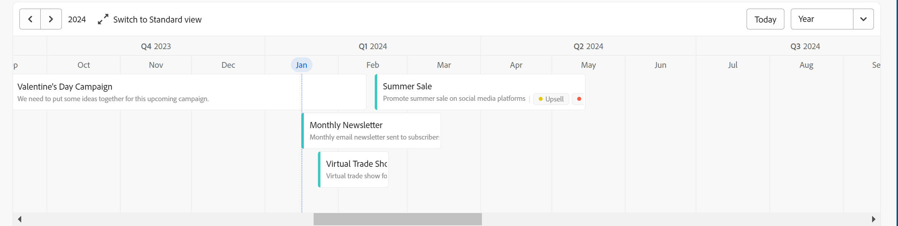

# Administrar la vista de cronología

<!--remove preview and production references at production-->

<!--
The highlighted information on this page refers to functionality not yet generally available. It is available only in the Preview environment for all customers. After the monthly releases to Production, the same features are also available in the Production environment for customers who enabled fast releases.    

For information about fast releases, see [Enable or disable fast releases for your organization](/help/quicksilver/administration-and-setup/set-up-workfront/configure-system-defaults/enable-fast-release-process.md). 

-->

{{planning-important-intro}}

Puede mostrar registros en una vista de línea de tiempo al acceder a la página de tipo de registro en Adobe Workfront Planning.

Para obtener información sobre las vistas de registros, consulte [Administrar vistas de registros](/help/quicksilver/planning/views/manage-record-views.md).

## Requisitos de acceso

+++ Expanda para ver los requisitos de acceso para la funcionalidad en este artículo. 

<table style="table-layout:auto"> 
<col> 
</col> 
<col> 
</col> 
<tbody> 
    <tr> 
<tr> 
</tr>   
<tr> 
   <td role="rowheader">
paquete de Adobe Workfront
</td> 
   <td> 
<ul> 
<li>
Cualquier Workfront y cualquier paquete de Planning
</li>
O
<li>
Cualquier flujo de trabajo y cualquier paquete de Planning
</li></ul>

Para obtener más información sobre lo que se incluye en cada paquete de Workfront Planning, póngase en contacto con su representante de cuentas de Workfront. 
 
   </td> 
  <tr> 
   <td role="rowheader">
Licencia de Adobe Workfront
</td> 
   <td>
 Estándar para crear y eliminar vistas

   
Colaborador o superior para actualizar los elementos de vista

  </td> 
  </tr> 
  <tr> 
   <td role="rowheader">
Permisos de objeto
</td> 
   <td>   
Permisos de administración de una vista
  
   
Ver permisos en una vista para cambiar temporalmente la configuración de la vista o para duplicarla
 </td> 
  </tr> 
<tr>
   <td role="rowheader">
Plantilla de diseño
</td>
   <td> A los usuarios con una licencia Light o Contributor se les debe asignar una plantilla de diseño que incluya Planning.
   
Los usuarios estándar y los administradores del sistema tienen las áreas de Planning habilitadas de forma predeterminada.

</li></ul>
</td>
  </tr> 
</tbody> 
</table>

Para obtener más información acerca de los requisitos de acceso de Workfront, consulte [Requisitos de acceso en la documentación de Workfront](/help/quicksilver/administration-and-setup/add-users/access-levels-and-object-permissions/access-level-requirements-in-documentation.md).

+++ 

<!--Old:
<table style="table-layout:auto"> 
<col> 
</col> 
<col> 
</col> 
<tbody> 
    <tr> 
<tr> 
<td> 
   
 Products
 </td> 
   <td> 
   <ul><li>
 Adobe Workfront
</li> 
   <li>
 Adobe Workfront Planning
</li></ul></td> 
  </tr>   
<tr> 
   <td role="rowheader">
Adobe Workfront plan*
</td> 
   <td> 

Any of the following Workfront plans:
 
<ul><li>Select</li> 
<li>Prime</li> 
<li>Ultimate</li></ul> 

Workfront Planning is not available for legacy Workfront plans
 
   </td> 
<tr> 
   <td role="rowheader">
Adobe Workfront Planning package*
</td> 
   <td> 

Any 
 

For more information about what is included in each Workfront Planning plan, contact your Workfront account manager. 
 
   </td> 
 <tr> 
   <td role="rowheader">
Adobe Workfront platform
</td> 
   <td> 

Your organization's instance of Workfront must be onboarded to the Adobe Unified Experience to be able to access Workfront Planning.
 

For more information, see <a href="/help/quicksilver/workfront-basics/navigate-workfront/workfront-navigation/adobe-unified-experience.md">Adobe Unified Experience for Workfront</a>. 
 
   </td> 
   </tr> 
  </tr> 
    <td role="rowheader">
Adobe Workfront license*
</td> 
   <td>
 Standard to create and delete views

   
Contributor or higher to update view elements

   
Workfront Planning is not available for legacy Workfront licenses
 
  </td> 
  </tr> 
  <tr> 
   <td role="rowheader">
Access level configuration
</td> 
   <td> 
There are no access level controls for Adobe Workfront Planning
   
</td> 
  </tr> 
<tr> 
   <td role="rowheader">
Object permissions
</td> 
   <td>   
Manage permissions to a view
  
   
View permissions to a view to temporarily change the view settings or to duplicate it
 </td> 
  </tr> 
<tr>
   <td role="rowheader">
Layout template
</td>
   <td> Users with a Light or Contributor license must be assigned a layout template that includes Planning.
   
Standard users and System Administrators have the Planning areas enabled by default.

</li></ul>
</td>
  </tr>
</tbody> 
</table> -->

## Administrar una vista de línea de tiempo {#manage-a-timeline-view}

Al crear una vista de línea de tiempo, todos los registros del tipo de registro seleccionado se muestran en una línea de tiempo cronológica.

Tenga en cuenta lo siguiente:

* Solo puede crear una vista de línea de tiempo si tiene al menos dos campos de fecha asociados a un tipo de registro. Cuando hay uno o ningún campo de fecha asociado a un tipo de registro, la opción de vista de línea de tiempo aparece atenuada.

  Puede seleccionar los siguientes campos de fecha al crear una vista de cronología:

   * Registrar fechas
   * Registrar campos generados por el sistema: fecha de creación, fecha de la última modificación
   * Buscar fechas de tipos de objeto o registro conectados (sólo cuando agregó un agregador para ellos cuando conectó los tipos de objeto o registro)
* Según las fechas asociadas a los registros, es posible que algunos no se muestren en la vista de línea de tiempo en los siguientes casos:

   * Cuando las fechas de inicio y finalización no tienen valores
   * Cuando las fechas de inicio y finalización no tienen valor
   * Cuando la fecha de inicio es posterior a la fecha de finalización

Para administrar una vista de línea de tiempo:

1. Vaya a la página del tipo de registro cuya línea de tiempo desea ver.
1. Cree una vista de línea de tiempo, tal como se describe en el artículo [Administrar vistas de registros](/help/quicksilver/planning/views/manage-record-views.md).

   

   Los registros asociados al tipo de registro seleccionado se muestran como barras en una línea de tiempo y se ordenan en orden cronológico según su fecha de inicio de forma predeterminada.

   >[!TIP]
   >
   >    La ordenación de los registros en la línea de tiempo no es visible en la vista compacta.

1. (Condicional) Si el administrador ha habilitado trimestres personalizados y Workfront detecta problemas con la configuración de estos, es posible que reciba una advertencia al abrir la vista de cronología.

   Se dan los siguientes escenarios:

   * Si se han detectado espacios o superposiciones entre las fechas de los trimestres, podría recibir una notificación que indique que ahora se pueden configurar trimestres personalizados y que es posible que sea necesario editarlos.

     

     >[!TIP]
     >
     >Este mensaje solo debe mostrarse inmediatamente después de que las compras de su organización en Planning y en trimestres personalizados ya estuvieran habilitadas antes de la compra. No se permiten superposiciones y espacios entre los trimestres después de habilitar Workfront Planning para su organización.

   * Si los trimestres se han configurado parcialmente y faltan algunos meses del mismo año, puede recibir una notificación cuando se desplace para mostrar los trimestres que faltan y que el resto del año debe configurarse con los trimestres que faltan.

   

   Los mensajes de advertencia sobre los trimestres personalizados se muestran una vez por cada usuario.

   >[!NOTE]
   >
   >Sin un trimestre personalizado guardado correctamente, la vista de la cronología muestra los trimestres clásicos.
   >Después de configurar trimestres personalizados en el área de Configuración, la vista de cronología muestra los trimestres personalizados en lugar de los trimestres clásicos.
   >Para obtener más información, consulte [Habilitar trimestres personalizados](/help/quicksilver/administration-and-setup/set-up-workfront/configure-system-defaults/enable-custom-quarters-projects.md).

1. (Condicional) Si es administrador de Workfront, haga clic en **Ir a la instalación** para configurar sus trimestres. Si no es así, haga clic en **Aceptar** y pídale al administrador de Workfront que configure los trimestres personalizados.

   >[!TIP]
   >
   >El botón Ir a la configuración solo aparece para el administrador de Workfront.

1. (Opcional y condicional) Cuando el nombre del registro esté truncado, pase el ratón sobre una barra de registros para mostrar el nombre completo del registro y la información adicional. Para obtener información acerca de cómo configurar el truncamiento de la barra de registro en la escala de tiempo, vea la sección [Editar la configuración de la vista de la escala de tiempo](#edit-the-timeline-view-settings) en este artículo.

1. Realice una de las siguientes acciones para navegar por la línea de tiempo:

   * Haga clic en los iconos izquierdo y derecho de la esquina superior izquierda o utilice el desplazamiento horizontal para moverse hacia atrás y hacia adelante en la cronología. Al actualizar la página, se conserva el lapso de tiempo seleccionado.
   * Haga clic en **Hoy** en la esquina superior derecha para centrar la cronología en la fecha de hoy.
   * Seleccione una de las siguientes opciones del menú desplegable lapso de tiempo para actualizar los incrementos de tiempo y actualizar la vista:

      * **Year**: muestra trimestres y meses con indicación de año.
      * **Trimestre**: muestra meses y semanas con indicación de trimestre.
      * **Mes**: muestra semanas y días.
1. (Opcional) Haga clic en **Cambiar a la vista Compacta** para mostrar los registros cuyas fechas no se cruzan en la misma línea. <!--check to see if they updated the name of the setting here-->
1. (Condicional) Si cambió el modo a **Compacto**, haga clic en **Cambiar a la vista Estándar** para mostrar los registros en líneas separadas. La opción **Standard** es la predeterminada.  <!--check to see if they updated the name of the setting here-->

1. Haga lo siguiente para buscar rápidamente registros que coincidan con una palabra clave:

   1. Haga clic en el icono **Buscar**  y empiece a escribir una palabra clave asociada a cualquier campo de un registro que se muestra en la pantalla. El número de coincidencias correctas se muestra junto al elemento de búsqueda y el registro con la coincidencia correcta se resalta.

      

      Puede utilizar cualquier palabra o carácter especial que esté visible en la pantalla.

      No se pueden utilizar palabras clave asociadas a campos que no se muestran en la vista de línea de tiempo.

   1. Pulse Intro en el teclado para ir al siguiente campo encontrado.
   1. (Opcional) Si hay más de una coincidencia, haga clic en las flechas arriba y abajo situadas a la derecha de la palabra clave de búsqueda para encontrar todas las coincidencias de la tabla.
   1. Haga clic en el icono **x** en el cuadro de búsqueda para borrar la palabra clave de búsqueda.

   1. (Opcional) Haga clic en el icono **Pantalla completa**  para abrir la vista en pantalla completa y, a continuación, en el icono **Salir de pantalla completa**  o Escape del teclado para salir de la pantalla completa.

1. (Opcional) Haga clic en **Desglose** para mostrar los registros conectados en la cronología.

   Para obtener más información, vea la sección [Use la característica Desglose para mostrar los registros conectados en la vista de escala de tiempo](#break-down-connected-records-in-the-timeline-view) en este artículo.
1. Para crear registros en la vista de escala de tiempo o editar sus fechas, realice una de las siguientes acciones:

   * Haga doble clic en cualquier lugar de la cronología para crear un registro.

     Para obtener más información, consulte [Crear registros](/help/quicksilver/planning/records/create-records.md).

   >[!TIP]
   >
   >No es posible hacer doble clic para crear registros en la cronología dentro de una agrupación.

   * Haga clic en el margen izquierdo o derecho de una barra de registros y, a continuación, arrástrela y suéltela en una nueva posición. Al cambiar el tamaño de las barras de los registros, se actualizan inmediatamente las fechas de inicio y finalización.

   * Arrastre y suelte los registros para actualizar su posición y fechas en la cronología. Al mover las barras de los registros, se actualizan las fechas de inicio y finalización inmediatamente.

     Para obtener más información, consulte [Editar registros](/help/quicksilver/planning/records/edit-records.md).

   >[!TIP]
   >
   >No es posible cambiar el tamaño de los registros ni arrastrarlos y soltarlos en la cronología para los tipos de objetos de Workfront y AEM Assets que se muestran en el desglose.

1. Actualice los siguientes elementos de vista como se describe en las subsecciones siguientes:
   * [Filtros](#add-filters)
   * [Agrupación](#add-grouping)
   * [Configuración](#edit-the-timeline-view-settings)
     <!--* [Sort](#add-sort) not yet in timeline; also check the anchor and make sure it's correct-->

### Añadir filtros

Puede reducir la cantidad de información que se muestra en la pantalla mediante filtros.

Tenga en cuenta lo siguiente al trabajar con filtros en la vista de línea de tiempo:

<!-- this list is almost identical to the one for the table view - update both-->

* Los filtros que cree para una vista de línea de tiempo funcionarán de forma independiente de los filtros de cualquier otra vista aplicada al mismo tipo de registro.

* Los filtros son exclusivos de la vista que seleccione. Dos vistas de línea de tiempo del mismo tipo de registro pueden tener diferentes filtros aplicados.

* Dos usuarios que ven la misma vista de línea de tiempo ven el mismo filtro que se aplica actualmente.

* No puede asignar un nombre a los filtros que genere para una vista de línea de tiempo.

* Al eliminar los filtros, se eliminan de todos los usuarios que tengan acceso al mismo tipo de registro que usted y que muestren la misma vista que usted.

* Puede filtrar por campos de registro conectados o por campos de búsqueda.
* Puede filtrar por campos de búsqueda que muestren varios valores.

Para agregar un filtro a una vista de cronología:

1. Cree una vista de escala de tiempo para una página de tipo de registro, tal como se describe en el artículo [Administrar vistas de registros](/help/quicksilver/planning/views/manage-record-views.md).
1. Seleccione una vista de escala de tiempo y haga clic en **Filtros** en la esquina superior derecha de la tabla.
1. Haga clic en **Añadir condición** y añada la siguiente información:

   * **Seleccione un campo** por el que desea filtrar <!-- the tip below might change-->

   * **Seleccione una opción** (o un modificador de filtro) para definir qué tipo de condición debe cumplir el campo

     En la tabla siguiente se muestran los modificadores disponibles para cada tipo de campo.

     <table>
        <thead>
        <tr>
            <th><b>Tipo de campo</b></th>
            <th><b>Modificadores</b></th>
        </tr>
        </thead>
        <tbody>
        <tr>
            <td>Una sola línea, párrafo, fórmula </td>
            <td>
Contiene

            
No contiene

            
Es

            
No es

            
Está vacío

            
No está vacío
</td>
        </tr>
        <tr><td>Selección única</td>
            <td>
Es

            
No es

            
Es cualquiera de

            
No es ninguno de

            
Está vacío

            
No está vacío
</td>
        </tr>
        <tr>
            <td>Selección múltiple, Personas</td>
            <td>
Tiene cualquiera de

            
Tiene todas de

            
Es exactamente

            
No tiene ninguno de

            
Está vacío

            
No está vacío
</td>
        </tr>
        <tr>
            <td>Número, Porcentaje, Moneda</td>
            <td>
=

            
≠

            
 &lt; 

            
&gt;

            
≤

            
≥

            
Está vacío

            
No está vacío
</td>
        </tr>
        <tr>
            <td>Fecha</td>
            <td>
Es

            
No es

            
Es después de

            
Es anterior a

            
Está entre

No está entre

            
Está vacío

No está vacío
</td>
        </tr>

     <tr>
            <td>Casilla de verificación</td>
            <td>
Es

        </tr>
        </tbody>
        </table>

   * Seleccione un valor para el campo seleccionado.

   

   No hay límite en cuanto a las condiciones de filtrado que se pueden añadir.

1. (Opcional) Haga clic en **Añadir condición** para añadir otra opción de filtrado y repita los pasos anteriores. El número de filtros aplicados se muestra a la izquierda del icono **Filters**.
1. Haga clic en los siguientes operadores a la izquierda para indicar cómo se unen y deben aplicarse las condiciones de filtro:

   * **AND**: se deben cumplir todas las condiciones especificadas.
   * **OR**: se debe cumplir cualquiera de las condiciones especificadas.
Esta es la opción predeterminada.

   1. (Opcional) Agregue agrupaciones de filtros adicionales y únase a ellas con los operadores **AND** o **OR**.

      

   La lista de registros se filtra automáticamente según los criterios de filtro.  <!--at this time, you can't name and save the filter - but will this change?!-->
   <!-- asked on the task for the simple filters whether there is a limitation for how many statements a filter can have?!-->

1. (Opcional) Haga clic en el icono **x** para quitar una condición de filtro.
1. (Opcional) Haga clic en **Filtros** o en cualquier otra parte de la página para cerrar el cuadro de filtros. <!--right now you cannot "clear all" for filters, but this might come later-->

### Agregar agrupación

<!-- groupings are almost identical between this view and table  but they display a little differently, so I kept the steps for both; update in both places if they make changes to groupings-->

Es posible agrupar registros por información similar al aplicar una agrupación a una vista.

Tenga en cuenta lo siguiente al trabajar con agrupaciones en la vista de línea de tiempo:

* Es posible aplicar agrupaciones tanto en las vistas de tabla como de línea de tiempo. Las agrupaciones de la vista de tabla son independientes de las de la vista de línea de tiempo del mismo tipo de registro.
* Se pueden aplicar 3 niveles de agrupación en una vista. Los registros se agrupan en el orden de agrupaciones que se seleccione.
&lt;!--* Es posible aplicar hasta 4 niveles de agrupación al utilizar la API. --comprobando este ahora-->
* Las agrupaciones son únicas para la vista que se seleccione. Dos vistas de tabla del mismo tipo de registro pueden tener diferentes agrupaciones aplicadas. Dos usuarios que vean la misma vista de tabla verán la misma agrupación que se aplique en ese momento.
* No se puede asignar un nombre a las agrupaciones que se generen para una vista de tabla.
* Al quitar las agrupaciones, se quitarán de cualquier usuario que tenga acceso al mismo tipo de registro y que muestre la misma vista que usted.
* Es posible editar los registros enumerados bajo una agrupación.
* Es posible agrupar por campos de registro conectados o campos de búsqueda.
* Cuando se agrupan por campos de búsqueda con varios valores (que no se hayan resumido por un agregador), los registros se agruparán según cada combinación única de valores de campo.
* Puede hacer referencia a un campo que esté situado a una distancia de hasta 4 niveles del tipo de registro actual. Por ejemplo, si se crea una agrupación para un tipo de registro de actividad y la actividad estuviera conectada al tipo de registro de producto, que está conectado al tipo de registro de campaña, y que está conectado a un proyecto de Workfront, se podrá hacer referencia al estado del proyecto en la agrupación que esté creando para el tipo de registro de actividad.
* Las agrupaciones se muestran en el orden alfabético de sus valores.
<!--checking into this: * You can apply up to 4 levels of grouping when using the API. -->
<!-- checking also into this: * You cannot group by a Paragraph-type field.-->

Para añadir una agrupación en la vista de línea de tiempo:

1. Cree una vista de línea de tiempo para un tipo de registro, tal y como se describe en el artículo [Administración de vistas de registros](/help/quicksilver/planning/views/manage-record-views.md).
1. Haga clic en **Agrupación** en la esquina superior derecha de la vista de línea de tiempo.

   

1. Haga clic en uno de los campos sugeridos o haga clic en **Elegir un campo diferente**, busque un campo diferente y, a continuación, haga clic en él cuando se muestre en la lista.

   La agrupación se aplica automáticamente a la línea de tiempo y los registros se muestran dentro del cuadro de agrupación.

1. (Opcional) Repita los pasos anteriores para añadir hasta 3 agrupaciones.

   El número de campos seleccionados para la agrupación se muestra junto al icono de Agrupación.

   

1. En el cuadro **Agrupar registros por**, arrastre y suelte las agrupaciones en el orden correcto.

1. (Opcional) Dentro del cuadro **Agrupar registros por**, haga clic en el icono **x** a la derecha de un campo seleccionado para la agrupación para quitar la agrupación

   O

   Haga clic en **Borrar todo** para quitar todos los campos.

1. Haga clic fuera del cuadro **Agrupar registros por** para cerrarlo.
1. (Opcional) Haga clic en **Configuración** y, a continuación, en **Color** para añadir agrupaciones con códigos de color. Para obtener más información, consulte la sección [Editar la configuración de la vista de línea de tiempo](#edit-the-timeline-view-settings) en este artículo.

<!-- 

### Add sort

this is not possible right now; if this is the same functionality as the table view, document it there and link from here. 

-->

### Editar la configuración de la vista de línea de tiempo {#edit-the-timeline-view-settings}

Actualice la configuración de la vista de línea de tiempo para indicar qué información se muestra en la sección de línea de tiempo de la vista y cómo se muestra.

1. Cree una vista de línea de tiempo para un tipo de registro, tal y como se describe en el artículo [Administración de vistas de registros](/help/quicksilver/planning/views/manage-record-views.md).
1. Haga clic en **Configuración**.
1. Haga clic en **Fecha y hora** en el panel izquierdo, luego seleccione una **Fecha de inicio** y una **Fecha de finalización** para mostrar en la línea de tiempo. Puede elegir las fechas de inicio y finalización predeterminadas, o bien puede elegir cualquier campo de fecha disponible.

   Las barras que representan los registros comienzan en la fecha que se indica para la Fecha de inicio y finalizan en la fecha correspondiente a la Fecha de finalización.

   >[!NOTE]
   >
   >* Los registros que no tienen valores para las fechas de inicio o finalización o que tienen una fecha de inicio posterior a la fecha de finalización no se muestran en la vista de línea de tiempo.
   >
   >* Si muestra registros adicionales mediante la opción Desglose, las fechas de inicio y finalización son las del registro principal. No puede elegir fechas de inicio y finalización para los registros conectados en esta área.

1. (Condicional y opcional) Si es administrador de Workfront, haga clic en **Ir a la instalación** en el cuadro **Usar trimestres personalizados** para ir al área de instalación y configurar trimestres personalizados. Después de configurar trimestres personalizados, puede mostrarlos en la vista de cronología en lugar de en los trimestres clásicos. Si no es administrador de Workfront, puede solicitar que un administrador habilite los trimestres personalizados para su organización.

   Para obtener más información, consulte [Habilitar trimestres personalizados](/help/quicksilver/administration-and-setup/set-up-workfront/configure-system-defaults/enable-custom-quarters-projects.md).

   

   >[!TIP]
   >
   >El botón Ir a la configuración solo aparece para el administrador de Workfront.

1. Haga clic en **Estilo de barra** en el panel izquierdo para indicar qué información desea mostrar en las barras de registro.

   Puede definir el estilo de barra del registro principal, así como para los registros conectados, al utilizar la opción Desglose en la vista Estándar.

   El campo principal (o título) del registro, tal como se define en la vista de tabla del registro, está seleccionado de forma predeterminada.
   <!--adjust this when the primary field is released??-->

1. (Opcional y condicional) Si agregó miniaturas a los registros, seleccione la opción **Miniatura** para mostrar la imagen asociada a los registros en su barra de registros.

   >[!NOTE]
   >
   >    Primero debe añadir miniaturas en la vista de tabla para poder mostrarlas en la vista de línea de tiempo. Para obtener más información, consulte [Añadir una miniatura a un registro](/help/quicksilver/planning/records/add-thumbnails-to-records.md).

1. Haga clic en **Agregar campo**, luego haga clic dentro del cuadro **Buscar campos** y luego haga clic en el campo que desee agregar.

   >[!TIP]
   >
   >   * Debe crear los campos antes de poder añadirlos a las barras de registro.
   > 
   >   * Debe tener al menos un campo seleccionado. **Nombre** está seleccionado de manera predeterminada.
   >
   >   * Se pueden añadir hasta cinco campos.

   A la derecha aparece una vista previa del aspecto que tendrán las barras en la línea de tiempo.

   

1. (Opcional y condicional) Si muestra la cronología en el modo Estándar, seleccione la configuración **Detalles de la barra de truncado**. Al seleccionarla, la información de las barras de registros se trunca y sólo se muestra completamente al pasar el ratón por encima de las barras. Esta configuración no está seleccionada de forma predeterminada y la información de registro se muestra completamente en las barras.

   

   >[!TIP]
   >
   >La configuración Truncar detalles de la barra no está disponible cuando se muestra la vista de línea de tiempo en el modo Compacto.
   >

1. Haga clic en **Color** en el panel izquierdo para personalizar los colores de los registros y agrupaciones en la línea de tiempo.

   

   Puede definir el color del registro principal y de los registros conectados al utilizar la opción Desglose en la vista Estándar.

1. (Condicional y opcional) Si ha añadido una agrupación a la vista de línea de tiempo, seleccione una de las siguientes opciones para establecer un color para la agrupación en la sección **Establecer color de agrupación**:

   * **Predeterminado (gris)**: el color de las agrupaciones está establecido en gris. Es la opción predeterminada.
   * **Valores de campo**: el color de las agrupaciones coincide con el color del campo por el que se agrupa.

     >[!NOTE]
     >
     >    * Puede hacer coincidir el color solo con los campos con opciones codificadas por colores. Por ejemplo, puede hacer coincidir el color con campos de Estado, o campos con opciones asociadas a colores.
     >    
     >    * No se puede hacer coincidir el color con los campos de búsqueda de tipos de objeto o registro vinculados.

   Por ejemplo, los campos de selección múltiple o de selección única pueden tener opciones codificadas por colores.

   Si agrupa por campos sin opciones codificadas por colores, el color de agrupación permanece gris.

   >[!TIP]
   >
   >Si no ha añadido agrupaciones a la vista de línea de tiempo, esta sección no aparece.

1. En la sección **Establecer color de registro**, seleccione entre las siguientes opciones para establecer un color para los registros:

   * **Tipo de registro**: el color de los registros coincide con el color del tipo de registro seleccionado. Esta es la opción predeterminada.
   * **Valores de campo**: el color de los registros coincide con el color de un campo que especifique. Continúe con el paso 10. <!--ensure this stays accurate-->
   * **Agrupación**: el color de los registros coincide con el color indicado para las agrupaciones. Esta opción aparece atenuada cuando no se han aplicado agrupaciones a la vista de línea de tiempo.
   * **Ninguno**: los registros se muestran en una barra blanca.

1. (Condicional) Si ha seleccionado **Valores de campo** para los colores de registro, seleccione un campo en el menú desplegable **Hacer coincidir el color del registro con**.

   

   En el menú desplegable solo se muestran los campos con opciones codificadas por colores.

   Por ejemplo, los campos de selección múltiple o de selección única pueden tener opciones codificadas por colores.

   Si no tiene ningún campo con opciones codificadas por colores para el tipo de registro seleccionado, esta opción aparece atenuada.

1. (Opcional) Si está usando la opción **Desglose**, repita los pasos que comienzan con el paso 4 para cada registro conectado que se muestre en la cronología.

1. Haga clic en **Guardar**.

   Los registros se muestran en la vista de línea de tiempo con las especificaciones seleccionadas.

### Desglose de registros conectados en la vista de cronología

Puede mostrar los registros conectados en la vista de escala de tiempo de un registro mediante la función Desglose. El desglose de registros por sus conexiones le permite ver las escalas de tiempo de otros registros conectados y comprender cómo pueden afectar al rendimiento y a los plazos de los registros.

#### Consideraciones al utilizar la función Desglose

* Puede mostrar registros u objetos conectados debajo de los registros del tipo de registro seleccionado en la vista de escala de tiempo.
* Puede mostrar los registros conectados en la vista de la cronología únicamente cuando vea los registros en modo Estándar. No se puede utilizar la opción Desglose en el modo Compacto de la vista de línea de tiempo.
* Puede mostrar lo siguiente en la vista de cronología mediante la función Desglose:
   * Registros de Workfront Planning conectados al tipo de registro seleccionado.
   * Tipos de objetos Workfront o recursos Experience Manager conectados al tipo de registro seleccionado.
   * Registros de Workfront Planning u objetos de otra aplicación conectados a registros conectados al tipo de registro seleccionado.

     Por ejemplo, puede conectar campañas a portafolios. Además, puede conectar otro tipo de registro, productos, con proyectos, así como con campañas. Cuando genere la vista de la cronología de la campaña, puede desglosar las campañas por portafolios, productos y proyectos.

* No se pueden mostrar tipos de objetos que sólo están conectados a objetos de Workfront en Workfront, pero que no están conectados a un tipo de registro de Workfront Planning. Sólo se pueden mostrar los tipos de objetos o registros conectados en Workfront Planning.

  Por ejemplo, las tareas están conectadas a proyectos en Workfront. Con la función Desglose, puede mostrar los proyectos que están conectados a campañas en Planning, pero no las tareas conectadas a proyectos en Workfront.

  Si desea mostrar tanto los portafolios como los proyectos en la vista de escala de tiempo de un tipo de registro de Workfront Planning, tanto los portafolios como los proyectos deben estar conectados al registro de Planning o a un registro conectado al registro de Planning cuya vista de escala de tiempo esté administrando.
* Solo puede mostrar tipos de registro asociados con al menos dos campos de fecha.
* Los campos de fecha para los tipos de registro que desea mostrar en la vista de escala de tiempo deben estar visibles en la vista de tabla del tipo de registro seleccionado, como campos de búsqueda.
* Las fechas de inicio y finalización de los tipos de registro que desea mostrar en la vista de escala de tiempo deben estar en orden cronológico. Por ejemplo, si un registro tiene una fecha de inicio del 31 de enero y una fecha de finalización del 1 de enero, no se muestra en la vista de escala de tiempo. Para obtener más información, consulte la sección [Administrar una vista de escala de tiempo](#manage-a-timeline-view) en este artículo.
* Hay un límite de 5 tipos de registros que puede incluir en el desglose de un registro.

#### Desglose de registros conectados

1. Cree una vista de línea de tiempo para un tipo de registro, tal y como se describe en el artículo [Administración de vistas de registros](/help/quicksilver/planning/views/manage-record-views.md).
1. En los modos **Estándar** o **Compacto**, haga clic en **Desglose** en la esquina superior derecha de la vista de la escala de tiempo.
1. Expanda el cuadro **Seleccionar un tipo de registro vinculado** y seleccione un tipo de registro conectado. <!--add a new screen shot - submitted a bug to remove the "the"-->

   

   >[!TIP]
   >
   >    Si no tiene ningún registro conectado o si los registros conectados no tienen al menos dos campos de fecha, la casilla **Seleccionar un tipo de registro vinculado** no está disponible.

1. Elija **fecha de inicio** y **campo de fecha de finalización**.

   >[!TIP]
   >
   >    Las fechas de inicio y finalización deben ser secuenciales. Si la fecha de finalización es anterior a la fecha de inicio, no se mostrará ningún registro en la cronología.

   Si están conectados con otros registros, aparecerá una flecha hacia la derecha en la barra del registro seleccionado de la escala de tiempo.
1. Haga clic en la flecha que señala a la derecha para expandir un tipo de registro y mostrar sus conexiones. <!--update screen shot at production-->

   

   >[!IMPORTANT]
   >
   >    Cuando se muestran varios registros conectados en el desglose, no están en orden jerárquico.
   >
   >Por ejemplo, si está viendo la cronología de las campañas y agrega Productos y, a continuación, Programas al desglose, los Programas no necesariamente están conectados primero a los Productos.
   >
   >Tanto los productos como los programas deben estar conectados a las campañas para que se muestren como opciones en la opción de desglose y puede agregarlos al desglose en cualquier orden.

1. (Condicional) Si está viendo la escala de tiempo en el modo Compacto, haga clic en **Cambiar vista**. El desglose no es visible en el modo **Compacto**.

   >[!TIP]
   >
   >Seleccione **No volver a mostrar esto** en el **Cambiar a la vista estándar?**, antes de cambiar de vista.
   >
   >Esta preferencia solo se recuerda en el navegador actual. Si cambia de explorador o de equipo, tendrá que volver a seleccionar esta preferencia.
   >
   >No puede volver al modo Compacto después de cambiar la vista a Estándar y mostrar los registros conectados en la vista.
1. (Opcional) Repita los pasos anteriores para agregar más registros conectados.

