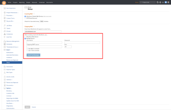

# Quitar servidor SMTP personalizado como opción de correo electrónico saliente

>[!NOTE]
>
>La funcionalidad descrita en este artículo ya no está disponible y se eliminará en un futuro próximo.

Con la versión 20.3 (prevista para agosto de 2020), Adobe Workfront pasa a un nuevo sistema de correo electrónico que mejorará en gran medida la fiabilidad del envío de correos electrónicos para las actualizaciones y notificaciones de Workfront. Como resultado, los clientes ya no podrán utilizar su propio servidor SMTP de correo electrónico para retransmitir su correo electrónico desde la plataforma de Workfront al destinatario deseado. Todo el correo electrónico se enviará directamente desde el servidor de correo de Workfront.

Para acceder a esta función, inicie sesión como administrador del sistema y vaya a Configuración > Correo electrónico > Configuración. A continuación se muestra una captura de pantalla con esta función resaltada:

La opción resaltada en esta captura de pantalla cambiará automáticamente para utilizar la opción Servidor de correo de Workfront con la versión 20.3.

Si tiene configurado un servidor SMTP de correo electrónico personalizado, **le recomendamos encarecidamente que se ponga en contacto con su equipo de TI** para asegurarse de que los correos electrónicos de notifications@my.workfront.com no son bloqueados al entrar en su sistema. También puede consultar Configurar el cortafuegos para obtener más información sobre las direcciones IP de las que proceden nuestro tráfico y correo electrónico.

Si tiene alguna pregunta o inquietud, contacte con el [Equipo de Soporte de Workfront](https://experienceleague.adobe.com/es?support-tab=home&lang=es#support).
