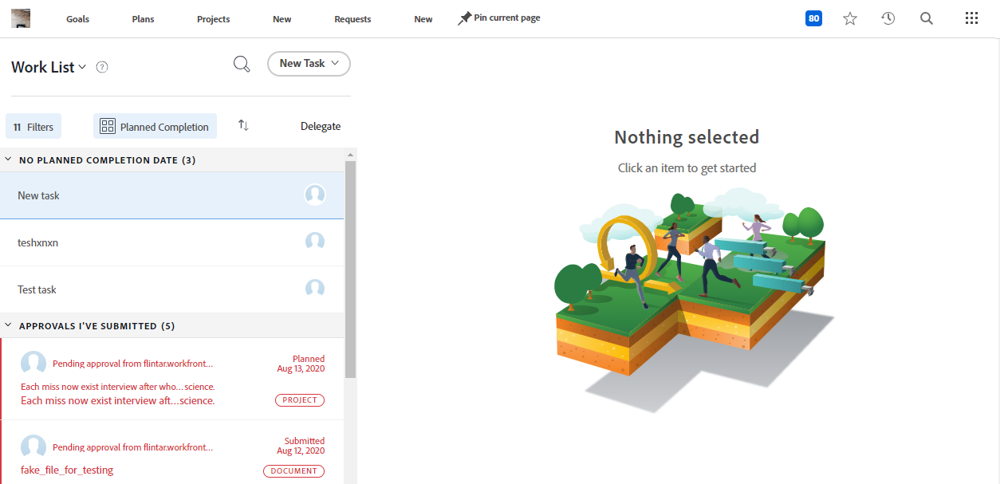

# Guía de desaprobación de página principal heredada

Comunidad de Adobe Workfront, tenemos noticias: pronto eliminaremos la página principal heredada. Por página de inicio heredada, nos referimos a la siguiente página de lista de trabajo:

Esta página quedará obsoleta durante la versión de 24.10 (programada para el 17 de octubre de 2024). En ese momento, se le solicitará que pase a la nueva experiencia de Inicio. Si ha estado utilizando la página principal heredada para administrar su trabajo, no se preocupe. Además de mejorar continuamente la nueva página de inicio, hemos estado ocupados creando una experiencia de administración de trabajo optimizada llamada Prioridades.
Sin embargo, sabemos que un cambio como este puede ser perturbador, y queremos ayudar con su transición de cualquier manera que podamos. Esta página contiene información sobre qué cambiará exactamente, consejos sobre cómo prepararse para la transición y algunas respuestas a las preguntas más frecuentes.

## Información de obsolescencia

**¿Qué cambiará?**

* La página de inicio heredada (página de lista de trabajo) se eliminará porque hemos creado una experiencia mejorada.

**¿Cuándo?**

* Como parte de la versión de 24.10 (planificada para el 17 de octubre de 2024)

**¿Qué puedo usar en su lugar?**

* La nueva página de inicio ya está disponible como reemplazo. Consulte [Introducción a la nueva página de inicio](/help/quicksilver/workfront-basics/using-home/using-the-home-area/get-started-with-home.md) para obtener más información sobre cómo usar la nueva página de inicio. Puede ser personalizado por los usuarios a través de opciones de personalización y por los administradores a través de plantillas de diseño.

* Las prioridades están en proceso de desarrollo y servirán como otro elemento de la experiencia racionalizada de gestión del trabajo en Adobe Workfront.

## Preparación para el desuso

Para minimizar las interrupciones tanto para usted como para su organización, a continuación se ofrecen algunas recomendaciones que facilitarán la transición.

### Inicie la transición a la nueva página Inicio

Nuestra recomendación principal es comenzar la transición a una nueva página de inicio lo antes posible. Desde el punto de vista organizativo, esto significa que el administrador debe personalizar las experiencias de los usuarios mediante plantillas de diseño (de forma similar a la página principal heredada) para asegurarse de que cada usuario tenga lo que necesita.

Recomendamos a los administradores:

1. Cree un nuevo diseño de página de inicio predeterminado con plantillas de diseño (o, opcionalmente, cree uno para cada usuario, equipo, grupo o función de trabajo que requiera un diseño único). Consulte [Personalizar la nueva página de inicio mediante una plantilla de diseño](/help/quicksilver/administration-and-setup/customize-workfront/use-layout-templates/customize-new-home-layout-template.md) para obtener más información.

1. Asigne las nuevas plantillas de diseño a un número reducido de usuarios de prueba, que pueden verificar que sus widgets y la configuración general satisfacen sus necesidades laborales.

1. Reasigne el resto de los usuarios al nuevo diseño de página de inicio.

Hacerlo lo antes posible dará a sus usuarios tiempo para adaptarse a la nueva experiencia y personalizar sus nuevas páginas de inicio para adaptarlas mejor a sus necesidades individuales. Consulte [Quitar, agregar y reorganizar widgets en la nueva página de inicio](/help/quicksilver/workfront-basics/using-home/using-the-home-area/add-edit-remove-widgets-in-new-home.md) para obtener información sobre cómo un usuario puede personalizar los widgets en su propia página de inicio nueva.

### Descubra lo que está disponible en la nueva página Inicio y prioridades

Los siguientes artículos proporcionan información sobre las funciones disponibles en la nueva página de inicio y prioridades:

<!--* [Move from Legacy Home to New Home](/help/quicksilver/workfront-basics/using-home/new-home/move-to-new-home.md)-->
* [Cambio de una página de inicio heredada a prioridades](/help/quicksilver/workfront-basics/priorities/move-from-legacy-home-to-priorities.md)

### Siga la experiencia de Inicio a medida que se desarrolla

También recomendamos mantenerse al día con las notas de la versión más recientes (consulte [Versiones de productos](/help/quicksilver/product-announcements/product-releases/product-releases.md)) para obtener más información acerca de cualquier cambio realizado en la experiencia de Inicio a medida que nos acercamos al final del soporte. Además, siga leyendo sobre Prioridades para comprender mejor nuestra visión del futuro de la administración del trabajo en Adobe Workfront (próximamente más información).

### Pedir ayuda

Si tiene problemas durante la transición, póngase en contacto con el equipo de soporte técnico o ejecutivo de cuentas para obtener ayuda.

## FAQ

+++ ¿Puedo seguir utilizando la página principal heredada después de la desuso?

No, se eliminará completamente de la aplicación.
+++

+++ ¿Todas las funciones de la página principal heredada están disponibles en la nueva página principal (o, finalmente, en Prioridades)?

Casi, con la excepción de:

* Calendario, que actualmente está en nuestra hoja de ruta para las prioridades.

* Actualmente no está disponible la visualización de marcas de tiempo para las fechas de vencimiento del objeto.

* Actualmente no está disponible la visualización de la fecha de compromiso dentro de la fuente de actualización. Sin embargo, hay una solución disponible: mostrar la fecha de compromiso en el encabezado a través de la personalización de la plantilla de diseño.
* En este momento no se admiten las aprobaciones enviadas en la nueva página de inicio. Si necesita esta funcionalidad, vote o publique un comentario aquí en las siguientes publicaciones de la comunidad:
   * [Agregar el widget &quot;Aprobaciones enviadas&quot; a la nueva página de inicio](https://experienceleaguecommunities.adobe.com/t5/workfront-ideas/add-quot-approvals-i-submitted-quot-widget-to-new-home/idc-p/704664#M25269)
   * [Agregar &quot;Aprobaciones enviadas&quot; a la nueva página de inicio](https://experienceleaguecommunities.adobe.com/t5/workfront-ideas/add-quot-approvals-i-submitted-quot-widget-to-new-home/idc-p/704664#M25269)

+++

+++¿Cómo regulo a qué widgets tienen acceso los usuarios en la nueva página de inicio?

Los administradores pueden establecer widgets predeterminados específicos para usuarios, equipos, grupos o funciones de trabajo, establecer estados predeterminados y elegir qué opciones están disponibles para la personalización de usuarios individuales, todo ello mediante plantillas de diseño. Consulte [Personalizar la nueva página de inicio mediante una plantilla de diseño](/help/quicksilver/administration-and-setup/customize-workfront/use-layout-templates/customize-new-home-layout-template.md) para obtener más información.
+++

+++¿Cómo puedo comprobar cuál es la configuración actual de la página principal heredada para poder replicarla en la nueva página principal?

Consulte [Personalizar inicio y resumen con una plantilla de diseño](/help/quicksilver/administration-and-setup/customize-workfront/use-layout-templates/customize-home-summary-layout-template.md) para obtener instrucciones sobre cómo encontrar la configuración de inicio heredada actual.
+++

+++¿La nueva página de inicio admite campos personalizados?

Los campos personalizados se pueden ver en la nueva página de inicio mediante:

* Si un administrador utiliza plantillas de diseño para personalizar el panel de resumen lateral, lo que se reflejará en el panel de resumen del widget Mi trabajo. Consulte [Personalizar inicio y resumen con una plantilla de diseño](/help/quicksilver/administration-and-setup/customize-workfront/use-layout-templates/customize-home-summary-layout-template.md) para obtener más información.

* Que un administrador utilice plantillas de diseño para agregar columnas de campo personalizado a los widgets Mis tareas o Mis problemas. Consulte [Personalizar la nueva página de inicio mediante una plantilla de diseño](/help/quicksilver/administration-and-setup/customize-workfront/use-layout-templates/customize-new-home-layout-template.md) para obtener más información.
+++

+++¿Puedo enviar comentarios?

¡Sí! Para ello, haga clic en el botón **Enviar comentarios** de la aplicación en su nueva página de inicio, a través de la próxima página de prioridades o a través del [Foro de ideas de Workfront](https://experienceleaguecommunities.adobe.com/t5/workfront-ideas/idb-p/workfront-ideas).
+++
