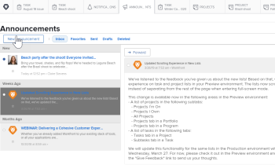
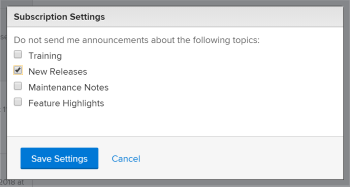

# Cancelar la suscripción a los mensajes del centro de anuncios

Los mensajes del Centro de anuncios son mensajes que Adobe Workfront envía a la base de clientes de Workfront. Puede cancelar la suscripción a los siguientes tipos de mensajes del Centro de anuncios:

* Anuncios sobre funcionalidades que se publican función por función fuera de estas versiones principales.

  La mayoría de las nuevas funcionalidades introducidas en la plataforma Workfront se lanzan junto con una de las cuatro versiones principales cada año. Sin embargo, algunas funcionalidades se publican función por función fuera de estas versiones principales. Cada vez que se lanza una función fuera de una versión principal, recibe un mensaje a través del Centro de anuncios. (Para obtener más información acerca del Centro de anuncios, vea [Enviar anuncios](../../administration-and-setup/get-started-wf-administration/view-send-announcements.md).)

* Anuncios sobre próximas ofertas y eventos de formación.

Para cancelar la suscripción a la recepción de mensajes del Centro de anuncios:

1. Haga clic en el icono numerado  en la esquina superior derecha de Workfront para abrir la lista de notificaciones.
1. Haga clic en **Todos los anuncios** en la parte inferior de la lista.

   Aparecerá la página **Anuncios** con todos sus anuncios.

   

1. Haga clic en **Configuración** en la esquina superior derecha de la página Anuncios y, a continuación, seleccione **Nuevas versiones** o **Formación**, según el tipo de anuncios que ya no desee recibir.

   

1. Haga clic en **Guardar configuración**.

   Ya no recibirá mensajes del Centro de anuncios para este tipo de anuncio.
