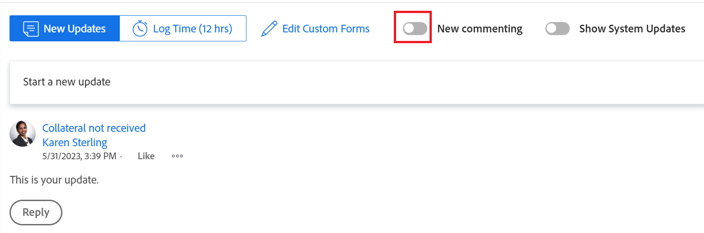

# Nueva experiencia de comentarios

La información resaltada en esta página hace referencia a funcionalidades que aún no están disponibles de forma general. Solo está disponible en el entorno de vista previa para todos los clientes.  

Para obtener más información sobre la programación actual de versiones, consulte [Información general sobre la versión del primer trimestre de 2024](../../product-releases/24-q1-release-activity/24-q1-release-overview.md).

<!--

After the monthly releases to Production, the same features are also available in the Production environment for customers who enabled fast releases.

For information about fast releases, see [Enable or disable fast releases for your organization](../../../administration-and-setup/set-up-workfront/configure-system-defaults/enable-fast-release-process.md)  -->

>[!IMPORTANT]
>
>La información de este artículo hace referencia a las funciones que se han publicado en la nueva experiencia de comentarios.
>
>El programa beta para la nueva experiencia de comentarios comenzó en abril de 2023 y finalizó en octubre de 2023. El programa beta de la nueva experiencia de comentarios se cerró con la versión de octubre de 2023.
>
>A partir de octubre de 2023, todas las nuevas funciones de la nueva experiencia de comentarios se lanzarán a todos los clientes. Para obtener más información, consulte la página de información general de la versión actual de cada versión.

<!--An update to the commenting experience in Adobe Workfront is currently in development. This update includes a new interface, new features, and improved performance in the Updates section of select objects. 

The new commenting experience will slowly become available for all the objects with an Updates section in Workfront, and later it will expand to other Adobe Experience Cloud applications.-->

<!--For additional resources for the new commenting experience, also see the following articles:

* [New commenting experience release activity](../new-commenting-experience-beta/new-commenting-beta-experience-release-activity.md)
* [New commenting experience FAQs](../../betas/new-commenting-experience-beta/new-commenting-faq.md)
-->

## Funciones

La nueva experiencia de comentarios incluye mejoras y cambios en la sección Actualizaciones de los objetos de Adobe Workfront.

Entre las mejoras incluidas en la nueva experiencia de comentarios están las siguientes:

* Rendimiento y experiencia de usuario mejorados
* Separación de los comentarios del usuario de las actualizaciones de actividad del sistema
* Indicador de tiempo real cuando se añaden nuevos comentarios a un objeto
* Edición de comentarios después de enviarlos

Se han eliminado las siguientes funciones de la nueva experiencia:

* Comentario sobre una actualización del sistema
* Capacidad para editar el estado, la condición y la fecha de confirmación al comentar
* Editar formulario personalizado
* La información &quot;en nombre de &lt; nombre de usuario >&quot; cuando un administrador de Workfront o de grupo inicia sesión como otro usuario y agrega un comentario en su nombre se eliminó originalmente. Se ha restablecido el 19 de octubre de 2023.
* La opción &quot;Pedir aprobación&quot; al etiquetar personas al agregar un comentario a un documento.

<!--removed this note on November 28, 2023, when this limitation was removed: 

>[!NOTE]
>
>The objects listed below have only the comments and system updates starting with January 1, 2019 available in the new commenting experience.  
>
>You can view comments and system updates on these objects prior to January 1, 2019 when viewing the Updates section in the current experience:
>
>* Issues
>* Projects
>* Tasks
>* Documents

For more information, see the [New commenting experience FAQs](../../betas/new-commenting-experience-beta/new-commenting-faq.md). 
-->

La siguiente tabla ilustra las funciones disponibles en la nueva experiencia de comentarios, así como su disponibilidad en áreas en las que son compatibles:

<table>
  <tr>
   <td><strong>Función </strong>
   </td>
   <td><strong>Existe en la experiencia de comentarios antigua </strong>
   </td>
   <td><strong>Existe en la nueva experiencia de comentarios </strong>
   </td>
   <td><strong>Se introducirá en la nueva experiencia de comentarios </strong>
   </td>
   <td><strong>Cuándo se introducirá en la nueva experiencia de comentarios </strong>
   </td>
   <td><strong>En investigación </strong>
   </td>
  </tr>
  <tr>
   <td>Crear/leer/responder/eliminar comentarios 
   </td>
   <td>✓ 
  </td>
   <td>✓ 
   </td>
   <td> 
   </td>
   <td> 
   </td>
   <td> 
   </td>
  </tr>
  <tr>
   <td>Texto enriquecido (excluye comillas y emojis)
   </td>
   <td>✓ 
   </td>
   <td>✓
   </td>
   <td> 
   </td>
   <td> 
   </td>
   <td> 
   </td>
  </tr>

<tr>
   <td>Texto enriquecido (emojis)
   </td>
   <td>✓ 
   </td>
   <td>✓
   </td>
   <td> 
   </td>
   <td> 
   </td>
   <td> 
   </td>
  </tr>

<tr>
   <td>Texto enriquecido (citas de bloque)
   </td>
   <td>✓ 
   </td>
   <td> ✓
   </td>
   <td> 
   </td>
   <td> SEGUNDO TRIMESTRE DE 2023
   </td>
   <td> 
   </td>
  </tr>
  <tr>
<tr>
   <td> Citar comentarios
   </td>
   <td>✓ 
   </td>
   <td> ✓
   </td>
   <td> 
   </td>
   <td> SEGUNDO TRIMESTRE DE 2023
   </td>
   <td> 
   </td>
  </tr>
  <tr>
   <td>Reaccionar a los comentarios (Me gusta) 
   </td>
   <td>✓ 
   </td>
   <td>✓ 
   </td>
   <td> 
   </td>
   <td> 
   </td>
   <td> 
   </td>
  </tr>
  <tr>
   <td>Adjuntar imágenes a los comentarios 
   </td>
   <td>✓ 
   </td>
   <td>✓ 
   </td>
   <td> 
   </td>
   <td> 
   </td>
   <td> 
   </td>
  </tr>
  <tr>
   <td>Etiquetar personas en comentarios 
   </td>
   <td>✓ 
   </td>
   <td>✓ 
   </td>
   <td> 
   </td>
   <td> 
   </td>
   <td> 
   </td>
  </tr>
  <tr>
   <td>Quitar participantes del hilo
   </td>
   <td> 
   </td>
   <td>✓
   </td>
   <td> 
   </td>
   <td> 
   </td>
   <td> 
   </td>
  </tr>

<tr>
   <td>Etiquetar automáticamente todos los participantes del hilo
   </td>
   <td> 
   </td>
   <td>✓
   </td>
   <td> 
   </td>
   <td> 
   </td>
   <td> 
   </td>
  </tr>

<tr>
   <td>Comentarios que son privados para una compañía 
   </td>
   <td>✓ 
   </td>
   <td>✓ 
   </td>
   <td> 
   </td>
   <td> 
   </td>
   <td> 
   </td>
  </tr>
  <tr>
   <td>Deshacer la publicación de un comentario 
   </td>
   <td>✓ 
   </td>
   <td>Reemplazado por el comentario de edición 
   </td>
   <td> 
   </td>
   <td> 
   </td>
   <td> 
   </td>
  </tr>
  <tr>
   <td>Desactivar actualizaciones del sistema 
   </td>
   <td>✓ 
   </td>
   <td>Se ha reemplazado por la pestaña Actividad 
   </td>
   <td> 
   </td>
   <td> 
   </td>
   <td> 
   </td>
  </tr>
  <tr>
   <td>Editar comentarios 
   </td>
   <td> 
   </td>
   <td> ✓
   </td>
   <td> 
   </td>
   <td> 
   </td>
   <td> 
   </td>
  </tr>
  <tr>
   <td>Guardar borradores de comentarios al salir de la página 
   </td>
   <td>✓ 
   </td>
   <td>✓ 
   </td>
   <td> 
   </td>
   <td> 
   </td>
   <td> 
   </td>
  </tr>
  <tr>
   <td>Ver nuevos comentarios en tiempo real (incluye ver cuándo se elimina un comentario)
   </td>
   <td> 
   </td>
   <td>✓
   </td>
   <td> 
   </td>
   <td> 
   </td>
   <td> 
   </td>
  </tr>
  <tr>
   <td>Hora de registro 
   </td>
   <td>✓ 
   </td>
   <td>✓
   </td>
   <td> 
   </td>
   <td> 
   </td>
   <td> 
   </td>
  </tr>
    <tr>
   <td>Copiar el enlace del hilo 
   </td>
   <td>✓ 
   </td>
   <td> Reemplazado por el vínculo Copiar
   </td>
   <td> 
   </td>
   <td>SEGUNDO TRIMESTRE DE 2023 
   </td>
   <td> 
   </td>
  </tr>
  <tr>
   <td>Copiar vínculo del comentario 
   </td>
   <td>✓ 
   </td>
   <td> Reemplazado por el vínculo Copiar
   </td>
   <td> 
   </td>
   <td> 
   </td>
   <td> 
   </td>
  </tr>
  <tr>
   <td>Texto de comentario de cita 
   </td>
   <td>✓ 
   </td>
   <td>✓
   </td>
   <td> 
   </td>
   <td>SEGUNDO TRIMESTRE DE 2023 
   </td>
   <td> 
   </td>
  </tr>
  <tr>
   <td>Copiar el texto del cuerpo 
   </td>
   <td>✓ 
   </td>
   <td> ✓
   </td>
   <td> 
   </td>
   <td>
   </td>
   <td> 
   </td>
  </tr>
    <tr>
   <td>Buscar en comentarios 
   </td>
   <td> 
   </td>
   <td> ✓
   </td>
   <td> 
   </td>
   <td>1º trimestre de 2024 
   </td>
   <td> 
   </td>
  </tr>

<tr>
   <td>Copiar y pegar imágenes en un comentario
   </td>
   <td> 
   </td>
   <td> ✓
   </td>
   <td> 
   </td>
   <td>1º trimestre de 2024 
   </td>
   <td> 
   </td>
  </tr>

<tr>
   <td>Arrastrar y soltar imágenes en un comentario
   </td>
   <td> 
   </td>
   <td> 
   </td>
   <td> 
   </td>
   <td>1º trimestre de 2024 
   </td>
   <td>✓ 
   </td>
  </tr>

<tr>
   <td>Editar formulario personalizado 
   </td>
   <td>✓ 
   </td>
   <td> 
   </td>
   <td> 
   </td>
   <td> 
   </td>
   <td> 
   </td>
  </tr>
  <tr>
   <td>Capacidad para editar el estado, la condición y la fecha de confirmación al comentar 
   </td>
   <td>✓ 
   </td>
   <td> 
   </td>
   <td> 
   </td>
   <td> 
   </td>
   <td>
   </td>
  </tr>
<tr>
   <td>Responder a las actualizaciones del sistema 
   </td>
   <td> ✓
   </td>
   <td> 
   </td>
   <td> 
   </td>
   <td>
   </td>
   <td> 
   </td>
  </tr>
<tr>
   <td>Mostrar "en nombre de" al agregar comentarios con la sesión de otro usuario
   </td>
   <td> ✓
   </td>
   <td> ✓
   </td>
   <td> 
   </td>
   <td>
   </td>
   <td> 
   </td>
  </tr>
</table>

## Cronología de versiones

Para obtener información sobre las funciones incluidas en la nueva experiencia de comentarios durante el periodo de tiempo de la versión beta, consulte [Nueva actividad de comentario en la versión de la experiencia beta](../../betas/new-commenting-experience-beta/new-commenting-beta-experience-release-activity.md).

Para obtener más información sobre la administración de actualizaciones para objetos de Workfront, consulte [Actualizar trabajo](../../../workfront-basics/updating-work-items-and-viewing-updates/update-work.md).

A continuación se muestra una cronología planificada con hitos clave para el lanzamiento de la nueva experiencia de comentarios en el entorno de producción. Además de los hitos que se indican a continuación, seguiremos mejorando la experiencia de los comentarios con mejoras menores.

Para obtener información sobre las funciones lanzadas para la nueva experiencia de comentarios después de que se cerrara el período beta, consulte la página de información general de la versión actual.

A continuación se muestra una cronología planificada para el lanzamiento de la nueva experiencia de comentarios:

* Con la versión 23.2 de (6 de abril de 2023):
   * Inicie la versión beta de comentarios para ver los problemas
   * Lanzamiento de la nueva experiencia de comentarios para objetivos (como única experiencia)
* Con la versión 23.3 de (20 de julio de 2023):
   * Inicie la versión beta de comentarios para proyectos, tareas y documentos.
   * Lanzamiento de la nueva experiencia de comentarios para tarjetas en el área de Tableros (como única experiencia)
* Durante la versión del cuarto trimestre de 2023 (versión limitada, solo disponible para los clientes que elijan la versión rápida):
   * Lanzamiento de la nueva experiencia de comentarios para plantillas, tareas de plantilla, programas, portafolios, equipos, usuarios y hojas de horas (como única experiencia)
   * Actualice la versión beta de la experiencia de comentarios para proyectos, tareas, problemas y documentos para que se convierta en la opción predeterminada. Se elimina la etiqueta &quot;Beta&quot;.
* Con la versión del cuarto trimestre de 2023 (23.10) (26 de octubre de 2023)
   * Lanzamiento de la nueva experiencia de comentarios para plantillas, tareas de plantilla, programas, portafolios, equipos, usuarios y hojas de horas (como la única experiencia) a todos los clientes.
   * Hacer que la nueva experiencia de comentarios para proyectos, tareas, problemas y documentos sea la opción predeterminada.

  >[!IMPORTANT]
  >
  >    Esto concluirá la etapa beta de la nueva experiencia de comentarios.

   * Incluya todas las funciones lanzadas para la nueva experiencia de comentarios a partir de esta fecha en las versiones mensuales y trimestrales regulares actuales.
* Finales de 2023:
   * Mantenga la experiencia de comentarios heredada como una opción secundaria para los siguientes objetos: proyectos, tareas, problemas y documentos. La nueva experiencia de comentarios es la opción predeterminada para todos los usuarios de estos objetos.
   * Convierta la nueva experiencia de comentarios en la única experiencia para todos los demás objetos.

  >[!NOTE]
  >
  >    Las iteraciones seguirán teniendo la experiencia de comentarios heredada. La nueva experiencia de comentarios no estará disponible para iteraciones.

* Segundo trimestre de 2024 (abril de 2024):

   * Elimine la opción para volver al flujo de comentarios heredado y hacer que el nuevo flujo de comentarios sea la única experiencia para todos los objetos, con la excepción de las iteraciones.

## Busque la nueva experiencia de comentarios

&lt;!—IMPORTANTE: cuando nos deshagamos de la experiencia heredada, mueva una versión de esto al artículo de trabajo de actualización o a la descripción general de la sección de actualización — para decir que la experiencia es diferente para todos excepto para las iteraciones—>

La nueva experiencia de comentarios está disponible actualmente para todos los clientes y para todos los entornos.

Según los objetos para los que acceda a la experiencia de comentarios, es posible que vea la siguiente funcionalidad para la sección Actualizaciones:

* Experiencia de comentarios nueva y heredada para los siguientes objetos:

   * Proyecto
   * Tarea (incluye Historias)
   * Problema
   * Documento

  >[!TIP]
  >
  >Utilice la opción Comentarios nuevos para mostrar la nueva experiencia de comentarios (cuando la habilite) o la experiencia de comentarios heredada (cuando la deshabilite), como se describe en esta sección. La nueva experiencia de comentarios es la predeterminada.

   * Solo la nueva experiencia de comentarios para los objetos enumerados a continuación. No hay opción para habilitar la experiencia de comentarios heredada para estos objetos:

      * Meta

     >[!NOTE]
     >
     >Debe tener una licencia adicional de Adobe Workfront Goals para poder acceder a esta área de Workfront. Para obtener más información, consulte [Requisitos para utilizar Workfront Goals](../../../workfront-goals/goal-management/access-needed-for-wf-goals.md).
      * Tarjeta en un tablero
      * Equipo
      * Plantilla
      * Tarea de plantilla
      * Hoja de horas
      * Programar
      * Portafolio
      * Usuario

* Solo la experiencia de comentarios heredada para los siguientes objetos:

   * Iteraciones

     No hay opción de habilitar la nueva experiencia de comentarios para iteraciones. Solo la experiencia de comentarios heredada está disponible para iteraciones.

<!--before August 17: 

The new commenting experience is currently supported for the following objects:

* When enabling the Beta experience in the Updates section for 

    * Issues, projects, tasks, and documents

    For more information about managing updates for Workfront objects, see [Update work](../../../workfront-basics/updating-work-items-and-viewing-updates/update-work.md). 

* By default, as the only commenting experience for

    * Goals, cards on a board

    >[!NOTE]
    >
    >You must have an additional license to Adobe Workfront Goals to be able to access this area of Workfront. For more information, see [Requirements to use Workfront Goals](../../../workfront-goals/goal-management/access-needed-for-wf-goals.md).

-->

<!--Depending on the environment you access the commenting experience you can do one of the following: 

* Enable the commenting experience Beta in the Production environment
* Enable the legacy commenting experience in the Preview  environment 
-->

Para habilitar la opción de experiencia de comentarios en proyectos, tareas, problemas y documentos:

1. Vaya a un objeto para el que desee activar la nueva experiencia de comentarios y haga clic en **Actualizaciones** en el panel izquierdo.
1. (Condicional) Si está desactivada, habilite la variable **Nuevos comentarios** en la esquina superior derecha del área de Actualizaciones para habilitarla. Esta opción debería estar habilitada de forma predeterminada.

   

1. Empiece a escribir una actualización en **Comentarios** pestaña. La pestaña Comentarios es la pestaña predeterminada cuando se abre la nueva experiencia

   O

   Haga clic en  **Actividad del sistema** para ver las actualizaciones de actividad generadas por Workfront.

1. (Opcional) Para deshabilitar la nueva experiencia de comentarios y volver a los comentarios heredados, anule la selección del **Nuevos comentarios** opción.

