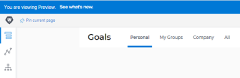

# Actividad de la versión 21.1 de Adobe Workfront Goals: semana del 16 de noviembre de 2020

Esta página describe todas las mejoras realizadas con la versión 21.1 para Adobe Workfront Goals en el entorno de vista previa para la semana del 30 de noviembre de 2020. Estas mejoras estarán disponibles en el entorno de producción en el primer trimestre de 21.1.

Para obtener una lista de todos los cambios disponibles para Workfront Goals en este punto del ciclo de la versión 21.1, consulte [Adobe Workfront Goals con la versión 21.1](../../../../product-announcements/product-releases/goals-release-activity/goals-release-21-1.md).

Para obtener una lista de todos los cambios disponibles en todas las áreas de Workfront en este punto del ciclo de la versión 21.1, consulte [Información general sobre la versión 21.1](../../../../product-announcements/product-releases/21.1-release-activity/21-1-release-overview.md).

## Visualice el recuento de licencias de Workfront Goals en el área de configuración

Como administrador de Workfront, ahora puede ver el número de licencias de Workfront Goals en el área Sistema de la configuración. Puede ver la siguiente información:

Cantidad total de licencias de Workfront Goals que su compañía ha adquirido

Número de licencias de Workfront Goals asociadas con los usuarios. Es el número de usuarios a los que se debe otorgar al menos acceso de visualización a Goals en su nivel de acceso.

Para obtener más información sobre cómo administrar el recuento de licencias, consulte [Administrar licencias disponibles en el sistema](../../../../administration-and-setup/get-started-wf-administration/manage-available-licenses-in-your-system.md).

## Elimine la pestaña “Mis equipos” para los usuarios sin equipos

Para eliminar la confusión de mostrar una pestaña vacía, hemos quitado la pestaña “Mis equipos” de los usuarios que no están asignados a ningún equipo. Antes de este cambio, si un usuario no pertenecía a ningún equipo, la pestaña Mis equipos estaba vacía.

Para obtener más información sobre lo que se muestra en Workfront Goals, consulte [Filtrar información en Adobe Workfront Goals](../../../../workfront-goals/goal-management/filter-information-wf-goals.md).

