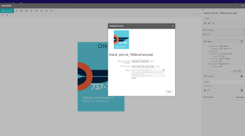

# Versión de Workfront R1

## LOGRAR EL COMPROMISO Y LA EFICIENCIA DE TODOS

Workfront lanza nuevas funciones de producto a todas las líneas de productos tres veces al año (versión 1, versión 2 y versión 3). En la primera versión del año 2017 (R1,), varias mejoras en la funcionalidad principal de Workfront, ProofHQ y Workfront DAM permiten que los trabajadores del conocimiento sean más productivos, comprometidos y dediquen menos tiempo a administrar el trabajo y más a hacer las cosas.

## ¿QUÉ NOVEDADES HAY EN LA ÚLTIMA VERSIÓN?

* [MEJORAS DE WORKFRONT](#workfront-enhancements)
* [MEJORAS DE PROOFHQ](#proofhq-enhancements)
* [MEJORAS DE WORKFRONT DAM](#workfront-dam-enhancements)

## MEJORAS DE WORKFRONT {#workfront-enhancements}

\
**Administre el trabajo directamente desde su correo electrónico**
La integración directa en Outlook 365 le permitirá acabar con el trabajo duplicado al actualizar Workfront directamente desde Outlook 365. Convierta correos electrónicos en tareas, envíe conversaciones por correo electrónico y archivos adjuntos como actualizaciones y responda a comentarios sin salir de Outlook.

Para obtener más información, consulte:  [Funcionalidad disponible en la versión preliminar en 2016](../../../../product-announcements/product-releases/quarterly-release-archive/r1-release-activity/available-in-preview-in-2016.md)

\
**Haga seguimiento de proyectos y presupuestos**
Administre sus recursos y su utilización, haciendo seguimiento de proyectos y de presupuestos, mediante el nuevo Informe de utilización. Vea las horas planificadas en comparación con las reales por proyecto y función, y compare los recursos y departamentos de forma regular.

Para obtener más información, consulte: [Vista previa 3 de R1](../../../../product-announcements/product-releases/quarterly-release-archive/r1-release-activity/r1-preview-3.md)

\
**Personalización de terminología y notificaciones**
Haga que Workfront tenga más importancia para su equipo al aprovechar la función de terminología personalizada para cambiar términos como &quot;portafolio&quot; o &quot;proyecto&quot; para adaptarlos a su jerga preferida, independientemente del sector. Además, cada usuario puede ahora personalizar los tipos de notificaciones que recibe regulando su frecuencia de resumen.

Para obtener más información, consulte: [Vista previa 3 de R1](../../../../product-announcements/product-releases/quarterly-release-archive/r1-release-activity/r1-preview-3.md)

**Vista de hito**
Los nuevos iconos de estado de progreso le permiten aprovechar al máximo sus informes de hito. Además, ahora puede editar el porcentaje completado directamente desde la vista de hito.

Para obtener más información, consulte: [Vista previa 5 de R1](../../../../product-announcements/product-releases/quarterly-release-archive/r1-release-activity/r1-preview-5.md)

**Papelera de reciclaje de Workfront**
La nueva papelera de reciclaje de Workfront le ayuda a restaurar proyectos, tareas, problemas y todos los documentos, formularios y actualizaciones relacionados en un plazo de 30 días después de la eliminación.

Para obtener más información, consulte: [Vista previa 1 y 2 de R1](../../../../product-announcements/product-releases/quarterly-release-archive/r1-release-activity/r1-peview-1-and-2.md)

### MEJORAS DE PROOFHQ {#proofhq-enhancements}

\
**Buscar y encontrar durante la revisión**
La nueva funcionalidad de búsqueda en ProofHQ le permite buscar y encontrar rápida y fácilmente todas las instancias de una palabra o frase directamente en las pruebas mientras revisa. Esto se aplica a todos los documentos basados en texto, incluidos los PDF y los archivos de Microsoft Word.

Para obtener más información, consulte: [R1 Final](../../../../product-announcements/product-releases/quarterly-release-archive/r1-release-activity/r1-final.md)

\
**Informes visuales y vistas personalizadas mejoradas**
Las nuevas métricas de creación de informes en ProofHQ le permiten hacer un seguimiento del tiempo de respuesta, los porcentajes de retraso, el número de comentarios y el tiempo hasta la primera actividad. Las nuevas vistas personalizadas crean una lógica de filtro avanzada para que obtenga los datos exactos, justo cuando los necesita.

Para obtener más información, consulte: [R1 Final](../../../../product-announcements/product-releases/quarterly-release-archive/r1-release-activity/r1-final.md)

**Vista previa de ProofHQ**
ProofHQ ahora le permite probar nuevas funciones en un entorno de vista previa antes de lanzarlas a todos los usuarios.

## MEJORAS DE WORKFRONT DAM {#workfront-dam-enhancements}

\
**Vínculos incrustados DAM**
Para los equipos de marketing que necesitan una forma mejor de administrar, publicar y rastrear el uso de recursos digitales en plataformas externas, la función de vínculos incrustados proporciona el control que necesita para administrar el proceso de compartir el contenido correcto en el momento adecuado.

**Campos de metadatos requeridos por DAM**
Mejore la categorización de recursos digitales con los campos de metadatos requeridos, lo que permite un mayor control del uso compartido de recursos.

**Logre el compromiso y la eficiencia de todos con Workfront.**
Workfront es una solución de administración de trabajo empresarial que permite a los trabajadores y ejecutivos del conocimiento moderno:

* Adaptar el trabajo para adaptarse a las preferencias individuales y organizativas y aumentar la adopción
* Trabajar de forma más eficiente desde cualquier lugar
* Tener una visibilidad mejor y más significativa de los recursos, tanto de los presupuestos como de las personas
* Conseguir el trabajo adecuado más rápido que antes

**MÁS INFORMACIÓN**

* Para obtener una lista completa de las mejoras disponibles en R1: [Información general de la actividad de la versión R1](../../../../product-announcements/product-releases/quarterly-release-archive/r1-release-activity/r1-release-activity-overview.md)

Workfront. Porque el trabajo importa.
