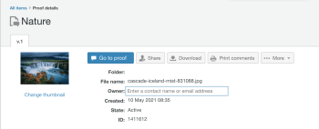

# Actividad de la versión de Workfront Proof: Semana del 17 de mayo de 2021

En esta página se describen los cambios realizados en Workfront Proof (aplicación de revisión independiente). Los cambios que se describen aquí no son aplicables a la funcionalidad de revisión de la aplicación de Adobe Workfront.

## Los menús de perfil de usuario de Workfront Proof ahora utilizan campos de escritura anticipada para buscar usuarios

>[!NOTE]
>
>Esta función se publicó en el entorno de vista previa el 20 de mayo de 2021. Se lanzará al entorno de producción el 16 de septiembre de 2021.

Para administrar los menús desplegables de gran tamaño que enumeran todos los usuarios del sistema, hemos reemplazado todos los menús de búsqueda de perfiles de usuario con una búsqueda de escritura anticipada en Adobe Workfront Proof independiente. Algunos ejemplos de menús de búsqueda de perfiles de usuario son

* Propietarios de prueba
* Contactos fuera de la oficina
* Propietarios de plantilla

Anteriormente, todos los desplegables de búsqueda de perfiles enumeraban todos los usuarios del sistema, lo que producía un menú grande.

