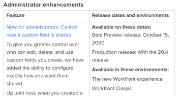

# Programación y proceso de la versión de Adobe Workfront

## Actualizar programación para Vista previa

El entorno de Vista previa se actualiza una vez a la semana con nuevas características. Dichas características se comunican en las notas de la versión de la próxima versión trimestral.

Las versiones suelen publicarse alrededor de las 20:00-22:00, hora de la montaña de los EE. UU.

## Actualizar programación para producción

### Características del producto

Adobe Workfront tiene dos modelos para lanzar nuevas funciones y actualizaciones. Su organización puede elegir si desea recibir nuevas funcionalidades de manera trimestral o en un calendario de publicación más rápido.

Está previsto que las versiones mensuales y trimestrales estén disponibles el jueves de la segunda semana completa del mes, salvo que se especifique lo contrario. Para las próximas fechas, consulte la [Información general sobre la versión](/help/quicksilver/product-announcements/product-releases/product-releases.md) más reciente.

Las versiones suelen tener lugar entre las 20:00 y las 22:00, hora de la montaña de los EE. UU., la noche anterior a la fecha de la versión.

Normalmente, las funciones de la vista previa estarán disponibles en el entorno de Producción en la próxima versión. Sin embargo, en algunos casos, las funciones están disponibles en el entorno de Producción fuera de una versión programada. Estos cambios suelen permanecer en Previsualización durante un mínimo de 2 semanas para proporcionarle el tiempo adecuado para familiarizarse con los cambios.

Para obtener más información sobre los procesos trimestrales y de publicación rápida, consulte [Habilitar o deshabilitar las publicaciones rápidas para su organización](/help/quicksilver/administration-and-setup/set-up-workfront/configure-system-defaults/enable-fast-release-process.md).

### Actualizaciones de mantenimiento

Las correcciones de problemas del producto Adobe Workfront están disponibles en el entorno de Producción cada semana. Consulte la página [Actualizaciones de mantenimiento de Workfront](https://experienceleague.adobe.com/es/docs/workfront-known-issues/releases/current-updates) para ver qué se ha corregido recientemente.

## Funciones eliminadas de una versión programada

Todas las funciones asociadas con una versión determinada (mensual o trimestral) están disponibles para probarse en Previsualización durante un mínimo de 2-4 semanas antes de la versión final en Producción. Si las funciones se eliminan de la versión programada antes de este momento, se realizan las siguientes acciones para informar a los clientes:

* Las notas de la versión programada (que se encuentran en la página [Versiones de productos](../../product-announcements/product-releases/product-releases.md)) se actualizaron para indicar que se ha eliminado la característica.

Si las funciones se eliminan de la versión programada después de que todas las funciones estén disponibles para probarse en Previsualización, se realizan las siguientes acciones para informar a los clientes:

* Las notas de la versión (que se encuentran en la página [Versiones de productos](../../product-announcements/product-releases/product-releases.md)) se actualizaron para indicar que se ha eliminado la característica.
* Se añade una publicación a la comunidad de Workfront que indica que se ha eliminado la función.
* Se envía un mensaje a todos los clientes a través del Centro de anuncios en el que se indica que la función se ha eliminado. (El Centro de anuncios es el centro de notificaciones en la aplicación de Workfront. Para obtener más información, consulte [Enviar anuncios](../../administration-and-setup/get-started-wf-administration/view-send-announcements.md)).

## Versiones beta

A veces, Workfront lanza nuevas funciones como parte de un programa beta.
La información específica sobre cada versión beta, incluido cómo participar, se publica cuando se inicia cada programa beta y todos los programas beta son diferentes.

Los siguientes programas beta están disponibles en Workfront:

* **Versión beta cerrada o privada**: las siguientes son características de una versión beta cerrada o privada:

   * Las funciones están disponibles para un pequeño grupo de clientes, cuidadosamente seleccionados por Workfront.
   * Los participantes suelen trabajar con un gestor de producto y proporcionar comentarios de forma regular.
   * Las nuevas funciones que forman parte de la versión beta se pueden publicar en Previsualización, en Producción o en un entorno independiente disponible para el programa beta. Las funciones beta cerradas se lanzan a intervalos aleatorios y sin advertencia previa.
   * No hay información de la versión para las betas cerradas en las páginas de la versión del producto.

* **Versión beta pública o abierta**: las siguientes son características de una versión beta pública o abierta:

   * Las funciones están disponibles para todos los clientes de Workfront, pero se encuentran en estado beta. Es posible que no siempre sean completamente funcionales y los comentarios siempre son bienvenidos.
   * La participación en una versión beta pública es opcional y los clientes pueden decidir si activar las funciones beta ellos mismos.
   * Las nuevas funciones que forman parte de la versión beta se pueden publicar en Previsualización o Producción.
   * Es posible que las funciones se publiquen con más frecuencia que los patrones de versión habituales de Workfront.
   * En las páginas de la versión del producto se incluye información sobre cuándo se lanzan las funciones a una versión beta pública.

Para obtener información acerca de las notas de la versión del producto, consulte [Versiones del producto](../../product-announcements/product-releases/product-releases.md).

## Otras versiones

A veces, Workfront puede lanzar funciones que podrían no estar documentadas en las notas de la versión, en las actualizaciones de mantenimiento o en cualquiera de los artículos de documentación. Esto se hace con el fin de probar las nuevas funciones antes de hacerlas permanentes. Normalmente, estas pruebas se lanzan a un número limitado de clientes, pero puede haber ocasiones en las que se lancen a todo el mundo. Se pueden publicar en los entornos de Previsualización o Producción.

Si encuentra algo en el sistema que no coincide con la documentación y sobre lo que tiene alguna pregunta, le rogamos que se ponga en contacto con nuestro equipo de atención al cliente. Para obtener más información, consulte [Contacto con el servicio de asistencia al cliente](../../workfront-basics/tips-tricks-and-troubleshooting/contact-customer-support.md).

## Notas de la versión

Utilice las notas de la versión de la próxima versión programada para ver qué nuevas funciones están disponibles en Previsualización y cuándo se lanzarán al entorno de Producción.

Para encontrar las notas de la próxima versión programada, consulte [Versiones de productos](../../product-announcements/product-releases/product-releases.md) y, a continuación, haga clic en el vínculo para acceder a la página de información general de la próxima versión.

Las notas de la versión proporcionan una tabla con una lista de funciones en la columna izquierda, con una breve descripción de cada función. Puede hacer clic en un vínculo de la función para ver un vídeo de demostración de la nueva función y acceder a la documentación sobre esta. En la columna derecha, verá la siguiente información para cada función:

* Fecha de lanzamiento de Previsualización
* Fecha de lanzamiento de Producción

Por ejemplo:

