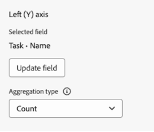

# Creación de un informe de gráfico en un panel de control de lienzo

La información resaltada en esta página hace referencia a una funcionalidad que aún no está disponible de forma general. Solo está disponible en el entorno de vista previa para todos los clientes.

>[!IMPORTANT]
>
>Actualmente, la función Paneles de lienzo solo está disponible para los usuarios que participan en la fase beta. Es posible que algunas partes de la función no estén completas o que no funcionen según lo previsto durante esta fase. Envíe cualquier comentario sobre su experiencia siguiendo las instrucciones de la sección [Proporcionar comentarios](/help/quicksilver/product-announcements/betas/canvas-dashboards-beta/canvas-dashboards-beta-information.md#provide-feedback) del artículo Información general sobre la versión beta de los paneles de lienzo. 
>Si tiene comentarios acerca de un posible error o problema técnico, envíe un ticket al equipo de asistencia de Workfront. Para obtener más información, consulte [Póngase en contacto con Atención al cliente](/help/quicksilver/workfront-basics/tips-tricks-and-troubleshooting/contact-customer-support.md). 
>Tenga en cuenta que esta versión beta no está disponible en los siguientes proveedores de la nube:
>
>* Traer su propia clave para Amazon Web Service
>* Azure
>* Google Cloud Platform

Puede crear y agregar un informe de gráfico a un panel de lienzo para visualizar los datos como un gráfico de barras, columnas, líneas o circulares.

## Requisitos de acceso

+++ Expanda para ver los requisitos de acceso para la funcionalidad en este artículo. 

<table style="table-layout:auto"> 
<col> 
</col> 
<col> 
</col> 
<tbody> 
<tr> 
   <td role="rowheader">
Paquete de Adobe Workfront
</td> 
   <td> 

Cualquiera 
 
   </td> 
<tr> 
 <tr> 
   <td role="rowheader">
Licencia de Adobe Workfront
</td> 
   <td> 

Estándar
 

Plan
 
   </td> 
   </tr> 
  </tr> 
  <tr> 
   <td role="rowheader">
Configuraciones de nivel de acceso
</td> 
   <td>
Editar el acceso a Informes, Paneles de control y Calendarios

  </td> 
  </tr>  
</tbody> 
</table>

Para obtener más información sobre esta tabla, consulte [Requisitos de acceso en la documentación de Workfront](/help/quicksilver/administration-and-setup/add-users/access-levels-and-object-permissions/access-level-requirements-in-documentation.md).
+++

## Requisitos previos

Debe crear un tablero para poder crear un informe de gráfico.

## Creación de un informe de gráfico en un panel de control de lienzo

Hay muchas opciones de configuración disponibles para crear un informe de gráfico. En esta sección, le guiaremos a través del proceso general de creación de uno.

{{step1-to-dashboards}}

1. En el panel izquierdo, haga clic en **Paneles de control de lienzo**.

1. Haga clic en **Nuevo panel** en la esquina superior derecha.

1. En el cuadro **Crear tablero**, escriba el **Nombre** y la **Descripción** del tablero.

1. Haga clic en **Crear**.

1. En el cuadro **Agregar informe**, seleccione **Crear informe**.

1. En el lado izquierdo, seleccione **Gráfico**.

1. En la esquina superior derecha, haga clic en **Crear informe**.

1. (Opcional) Siga los pasos a continuación para configurar la sección **Detalles**:

   1. Escriba un informe **Nombre**.

   1. Escriba un informe **Descripción**.

   1. Si lo desea, desmarque la casilla **Mostrar series adicionales como &quot;Otro&quot;**.

      >[!NOTE]
      >
      >Hay un número máximo de 60 series que se pueden mostrar en un gráfico. Cuando se marca esta casilla, cualquier serie por encima del límite se consolida en una agrupación **Other** del gráfico.
1. Elija el tipo de gráfico que desea crear:
   * [Gráfico de barras, columnas o líneas](#bar-column-or-line-chart)
   * [Gráfico circular](#pie-chart)

### Gráfico de barras, columnas o líneas

>[!NOTE]
>
>Puede haber campos adicionales según el tipo de campo que seleccione. Las opciones que se describen a continuación son estándar para todos los tipos de campo.

1. En el panel izquierdo, haga clic en el icono **Crear gráfico** .

1. En la lista desplegable **Tipo de gráfico**, seleccione **Barra**, **Columna** o **Línea**.
1. En el segundo menú desplegable, seleccione el tipo de barra, columna o línea:
   * **Simple**
   * **Varias series**
   * **Apiladas**

1. En la sección **Eje inferior (X)**, seleccione el **campo Actualizar**, luego busque y seleccione el campo que contiene los datos que se resumirán en el gráfico.
1. En la lista desplegable **Tipo de agregación**, seleccione cómo se acumulan los datos para generar el resultado del gráfico.
1. (Opcional) Agregue una etiqueta de eje en el espacio proporcionado.
1.  (Opcional) Active **Ocultar eje**. 
1. (Opcional) Escriba un **Valor de línea de referencia** para establecer un objetivo o umbral en el gráfico.
1. Elija **Tipo de línea** en el menú desplegable.
1. Seleccione el botón **Actualizar campo** de la segunda sección y, a continuación, busque y seleccione el segundo campo que desee mostrar en el gráfico.

### Gráfico circular

>[!NOTE]
>
>Puede haber campos adicionales según el tipo de campo que seleccione. Las opciones que se describen a continuación son estándar para todos los tipos de campo.

1. En el panel izquierdo, haga clic en el icono **Crear gráfico** .

1. En la lista desplegable **Tipo de gráfico**, seleccione **Barra**.
1. En la sección **Métrica**, seleccione el **campo de actualización**, luego busque y seleccione el campo que contiene los datos que se resumirán en el gráfico.
1. En la lista desplegable **Tipo de agregación**, seleccione cómo se acumulan los datos para generar el resultado del gráfico.
1. En la sección **Segmento**, seleccione **Actualizar campo**, luego busque y seleccione el campo que contiene los segmentos que desea mostrar en el gráfico circular.
1.  (Opcional) En la sección **Circular**, active **Mostrar etiquetas de segmento** para mostrar las etiquetas de segmento.
1.  (Opcional) Active **Mostrar total** para mostrar el total en medio del gráfico. Cuando está habilitada, hay opciones adicionales para mostrar una etiqueta central y elegir el formato de valor.

>[!NOTE]
>
>Los tipos de agregación se muestran de la siguiente manera:
>
>* Contar tipos de agregación: el valor central mostrado es un recuento de todos los segmentos del gráfico.
>* Suma de tipos de agregación: el valor central mostrado es el total agregado del valor numérico o de divisa.
>* Tipos de agregación Average, max y min: el valor central muestra el valor promedio, máximo o mínimo en consecuencia.

1. (Opcional) En la sección Leyenda, active **Mostrar leyenda** para mostrar la leyenda del gráfico.

1.  (Opcional) Elija una **posición de leyenda** en el menú desplegable.

## Configurar opciones adicionales del informe de gráfico

### Filtros

Siga los pasos a continuación para configurar la sección **Filter**:

1. En el panel izquierdo, haga clic en el icono **Filtro**.
1. Seleccione **Editar filtro**.
1. Haga clic en **Agregar condición** y, a continuación, especifique el campo por el que desea filtrar y el modificador que define qué tipo de condición debe cumplir el campo.
1. (Opcional) Haga clic en **Agregar grupo de filtros** para agregar otro conjunto de criterios de filtrado. El operador predeterminado entre los conjuntos es Y. Haga clic en el operador para cambiarlo a OR.

### Configuración de desglose

Siga los pasos a continuación para configurar la sección **Configuración de columna detallada**:

1. En el panel izquierdo, haga clic en el icono **Columnas de desglose** . Los campos del gráfico aparecen automáticamente como columnas en la sección de vista previa a la derecha.

1. (Opcional) Para actualizar cualquiera de las configuraciones de columna existentes, seleccione la columna que desee actualizar en la sección **Columnas actuales** y, a continuación, actualice la información deseada (por ejemplo: etiqueta, estado vinculado y condiciones).

1. Haga clic en **Agregar columna** y, a continuación, seleccione el campo que desee mostrar como columna en la tabla. Repita este proceso para cada columna que desee agregar.

### Configuración del grupo de desglose

Siga los pasos a continuación para configurar la sección **Configuración del grupo de desglose**:

1. En el panel izquierdo, haga clic en el icono **Configuración de grupo** .

1. Haga clic en el botón **Agregar agrupación** y, a continuación, seleccione el campo que desee crear como agrupación.

1. Haga clic en **Guardar** para crear el informe y agregarlo al tablero.

## Crear un ejemplo de informe de gráfico

En esta sección, veremos los pasos para crear un gráfico de columnas que muestre las tareas vencidas por el propietario del proyecto.

{{step1-to-dashboards}}

1. En el panel izquierdo, haga clic en **Paneles de control de lienzo**.

1. Haga clic en **Nuevo panel** en la esquina superior derecha.

1. En el cuadro **Crear tablero**, escriba el **Nombre** y la **Descripción** del tablero.

1. Haga clic en **Crear**.

1. En el cuadro **Agregar informe**, seleccione **Crear informe**.

1. En el lado izquierdo, seleccione **Gráfico**.

1. En la esquina superior derecha, haga clic en **Crear informe**.

1. Siga los pasos a continuación para configurar la sección **Detalles**:

   1. Escriba un informe **Nombre** (p. ej. *Tareas vencidas por el propietario del proyecto*).

   1. Escriba un informe **Descripción**.

1. Siga los pasos a continuación para configurar la sección **Gráfico de generación**:

   1. En el panel izquierdo, haga clic en el icono **Generar gráfico**.

   1. En la lista desplegable **Tipo de gráfico**, seleccione **Columna**.

   1. En la lista desplegable **Tipo de columna**, seleccione **Simple**.

   1. Seleccione el botón **Actualizar campo** en la sección **Eje inferior (X)**, luego busque y seleccione el campo **Tarea** > **Proyecto** > **Propietario** > **Nombre**.

      

   1. Haga clic en el botón **Seleccionar campo** de la sección **Eje izquierdo (Y)**, a continuación, busque y seleccione el campo **Tarea** > **Nombre**.

   1. En el menú desplegable **Tipo de agregación**, seleccione **Recuento**.

      

1. Siga los pasos a continuación para configurar la sección **Filter**:

   1. En el panel izquierdo, haga clic en el icono **Filtro**.

   1. Seleccione **Editar filtro**.

   1. Haga clic en **Agregar condición**.

   1. Haga clic en el área de condición vacía y luego seleccione **Seleccionar campo**.

   1. Seleccione el campo **Porcentaje completado**.

   1. En el menú desplegable **Operadores**, seleccione **Menor que** y, a continuación, escriba *100* en el campo de evaluador.

   1. Haga clic en **Agregar condición** y luego en **Seleccionar campo**.

   1. Seleccione el campo **Fecha planificada de finalización**.

   1. En el menú desplegable **Operadores**, seleccione **Menos que**.

   1. Cambie **Establecer fecha relativa** a **ON**.

   1. Escriba *$$TODAY* en el campo del evaluador.

      Para obtener más información sobre los caracteres comodín, consulte la sección Variables de filtro basadas en fecha en el artículo [Editar filtros de informe en un panel de lienzo](/help/quicksilver/reports-and-dashboards/canvas-dashboards/manage-reports/edit-report-filters.md).

      

1. Siga los pasos a continuación para configurar la sección **Configuración de columna detallada**:

   1. En el panel izquierdo, haga clic en el icono **Columnas de desglose** . Los campos del gráfico aparecen automáticamente como columnas en la sección de vista previa a la derecha.

   1. Haga clic en **Agregar columna** y luego seleccione el campo **Asignado a** > **Nombre**.

   1. Haga clic en **Agregar columna** y, a continuación, seleccione el campo **Fecha planificada de inicio**.

   1. Haga clic en **Agregar columna** y, a continuación, seleccione el campo **Fecha planificada de finalización**.

   1. Haga clic en **Agregar columna** y, a continuación, seleccione el campo **Fecha de última actualización**.

   1. (Opcional) Para mostrar la hora de actualización, seleccione la opción **Última fecha de actualización** en el campo **Columnas actuales** y, a continuación, seleccione una opción de valor de hora en la lista desplegable **Formato de fecha**.

1. Siga los pasos a continuación para configurar la sección **Configuración del grupo de desglose**:

   1. En el panel izquierdo, haga clic en el icono **Configuración de grupo** .

   1. Haga clic en el botón **Agregar agrupación** y, a continuación, seleccione el campo **Proyecto** > **Nombre**.

1. Haga clic en **Guardar** para crear el informe y agregarlo al tablero.

## Consideraciones al crear un informe de gráfico

### Informes con datos financieros

Los usuarios con acceso de Vista o Edición en los datos financieros en su nivel de acceso seguirán viendo los datos financieros en las visualizaciones del Panel de lienzo, incluso si el permiso de Ver finanzas se elimina en el nivel de tarea o proyecto.

* Los usuarios sin derechos de datos financieros en el nivel de acceso no verán los datos financieros en los informes.
* Los usuarios que sí ven datos financieros se limitan a registros para los que ya tienen permiso de visualización (proyectos, tareas, problemas, etc.). No verán los valores financieros de los registros a los que no pueden acceder.
* Los creadores de informes deben tener cuidado al incluir datos financieros en los paneles y tener en cuenta con quién comparten los paneles para evitar el acceso no deseado.

Se trata de un límite conocido y tenemos previsto abordarlo lo antes posible.

### Uso del selector de campos

La lista desplegable **Secciones** de la sección **Crear gráfico** está diseñada para reducir las opciones de un selector de campo y facilitar la búsqueda de un objeto al crear un informe de tabla. Para empezar, debe seleccionar un objeto de entidad base.

* **Todas las secciones**: Todos los tipos de objetos en Workfront Workflow y Workfront Planning.
* **Objetos Workfront**: objetos nativos de flujo de trabajo de Workfront.
* **Tipos de registros de planificación**: tipos de registros personalizados definidos en Workfront Planning.

Una vez seleccionado el objeto de entidad base, la lista desplegable **Secciones** se actualiza con las opciones de tipo de campo aplicables para elegir.

* **Todas las secciones**: campos nativos, campos personalizados y objetos relacionados.
* **Todos los campos**: campos nativos y personalizados (excluye relaciones).
* **Campos personalizados**: campos definidos por el cliente en un formulario personalizado o en un registro de Planning.
* **Campos de Workfront**: Solo campos nativos.
* **Relaciones**: Registros conectados.

### Referencia a objetos secundarios

Las relaciones disponibles para columnas adicionales, opciones de filtro y atributos de agrupación generalmente se limitan a objetos superiores en la jerarquía de objetos de Workfront o tienen una sola selección en el objeto de entidad base del informe. Hay algunas excepciones a este respecto, que incluyen las siguientes:

* Proyecto > Tareas
* Aprobación de documento > Fases de aprobación de documento
* Fases de aprobación de documento > Participantes en la fase de aprobación de documento

Al utilizar cualquiera de las relaciones principal-secundario enumeradas anteriormente, verá una fila en la tabla para cada registro secundario conectado al objeto principal.