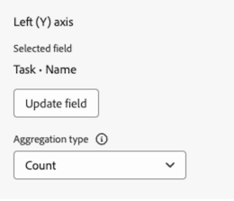

# Creación de un informe de gráfico en un panel de control de lienzo

>[!IMPORTANT]
>
>Actualmente, la función Paneles de lienzo solo está disponible para los usuarios que participan en la fase beta. Es posible que algunas partes de la función no estén completas o que no funcionen según lo previsto durante esta fase. Envíe cualquier comentario sobre su experiencia siguiendo las instrucciones de la sección [Proporcionar comentarios](/help/quicksilver/product-announcements/betas/canvas-dashboards-beta/canvas-dashboards-beta-information.md#provide-feedback) del artículo Información general sobre la versión beta de los paneles de lienzo. 
>Si tiene comentarios sobre un posible fallo o problema técnico, envíe un billete al soporte técnico de Workfront. Para obtener más información, vea [Contactar con el servicio de asistencia al cliente](/help/quicksilver/workfront-basics/tips-tricks-and-troubleshooting/contact-customer-support.md). 
>Tenga en cuenta que esta beta no está disponible en los siguientes proveedores de servicios cloud:
>
>* Traer su propia clave para los servicios web de Amazon
>* Azure
>* Google Cloud Platform

Puede generar y agregar un informe de gráfico a un panel de lienzo para visualizar los datos como una barra, columna, línea o gráfico circular.

## Requisitos de acceso

+++ Expanda para ver los requisitos de acceso para la funcionalidad en este artículo. 

<table style="table-layout:auto"> 
<col> 
</col> 
<col> 
</col> 
<tbody> 
<tr> 
   <td role="rowheader">
Paquete de Adobe Workfront
</td> 
   <td> 

Cualquiera 
 
   </td> 
<tr> 
 <tr> 
   <td role="rowheader">
Licencia de Adobe Workfront
</td> 
   <td> 

Estándar
 

Plan
 
   </td> 
   </tr> 
  </tr> 
  <tr> 
   <td role="rowheader">
Configuraciones de nivel de acceso
</td> 
   <td>
Editar el acceso a Informes, Paneles de control y Calendarios

  </td> 
  </tr>  
</tbody> 
</table>

Para obtener más información sobre esta tabla, consulte [Requisitos de acceso en la documentación de Workfront](/help/quicksilver/administration-and-setup/add-users/access-levels-and-object-permissions/access-level-requirements-in-documentation.md).
+++

## Requisitos previos

Debe crear un tablero para poder crear un informe de gráfico.

## Creación de un informe de gráfico en un panel de control de lienzo

Hay muchas opciones de configuración disponibles para generar un informe de gráfico. En esta sección, le guiaremos por el proceso general de creación de uno.

{{step1-to-dashboards}}

1. En el panel izquierdo, haga clic en **Paneles de control de lienzo**.

1. Haga clic en **Nuevo panel** en la esquina superior derecha.

1. En el cuadro **Crear tablero**, escriba el **Nombre** y la **Descripción** del tablero.

1. Haga clic en **Crear**.

1. En el cuadro **Agregar informe**, seleccione **Crear informe**.

1. En el lado izquierdo, seleccione **Gráfico**.

1. En la esquina superior derecha, haga clic en **Crear informe**.

1. (Opcional) Siga los pasos siguientes para configurar la sección **Detalles**:

   1. Escriba un informe **Name**.

   1. Escriba un informe **Description**.

   1. Si lo desea, desactive la casilla **Mostrar serie adicional como &quot;Otro&quot;**.

      >[!NOTE]
      >
      >Hay un número máximo de 60 series que se pueden mostrar en un gráfico. Cuando esta casilla está marcada, cualquier serie que supere el límite se consolida en un **Otro** del gráfico.
1. Elija el tipo de gráfico que desea crear:
   * [gráfico de barras, columnas o líneas](#bar-column-or-line-chart)
   * [Gráfico circular](#pie-chart)

### gráfico de barras, columnas o líneas

>[!NOTE]
>
>Puede haber campos adicionales dependiendo del tipo de campo que seleccione. Las opciones que se describen a continuación son estándar para todos los tipos de campo.

1. En el panel izquierdo, haga clic en el icono **Crear gráfico** .

1. En la lista desplegable **Tipo de gráfico**, seleccione **Barra**, **Columna** o **Línea**.
1. En el segundo menú desplegable, seleccione el tipo de barra, columna o línea:
   * **Simple**
   * **Serie múltiple**
   * **apilado**

1. En la sección **Eje inferior (X)**, seleccione el campo **Actualizar**, a continuación busque y seleccione el campo que contiene los datos que se resumirán en el gráfico.
1. En la lista desplegable **Tipo de agregación**, seleccione cómo se acumulan los datos para producir el resultado del gráfico.
1. (Opcional) Agregue una etiqueta de eje en el espacio proporcionado.
1. (Opcional) Conmute **Ocultar el eje** en.
1. (Opcional) Escriba un **valor de línea de referencia** para establecer un destino o umbral en el gráfico.
1. Elija un **tipo de línea** en el menú desplegable.
1. Seleccione el botón **Actualizar campo** bajo la segunda sección, y busque y seleccione el segundo campo que desee mostrar en el gráfico.

### Gráfico circular

>[!NOTE]
>
>Puede haber campos adicionales dependiendo del tipo de campo que seleccione. Las opciones que se describen a continuación son estándar para todos los tipos de campo.

1. En el panel izquierdo, haga clic en el icono **Generar gráfico** .

1. En la lista desplegable **Tipo de gráfico**, seleccione **Barra**.
1. En la sección **Métrica**, seleccione el **campo de actualización**, luego busque y seleccione el campo que contiene los datos que se resumirán en el gráfico.
1. En la lista desplegable **Tipo de agregación**, seleccione cómo se acumulan los datos para generar el resultado del gráfico.
1. En la sección **Segmento**, seleccione **Actualizar campo**, luego busque y seleccione el campo que contiene los segmentos que desea mostrar en el gráfico circular.
1. (Opcional) En la sección **Pie**, alterne **Mostrar etiquetas de segmentos** para mostrar etiquetas de segmentos.
1. (Opcional) Conmute **Mostrar total** para mostrar el total en el medio del gráfico. Cuando está activado, hay opciones adicionales para mostrar una etiqueta central y elegir el formato de valor.

>[!NOTE]
>
>Los tipos de agregación se muestran de la siguiente manera:
>
>* Tipos de agregación de recuento: El valor central mostrado es un recuento de todos los segmentos del gráfico.
>* Tipos de agregación de suma: El valor central mostrado es el total agregado del valor numérico o de divisa.
>* Tipos de agregación promedio, máximo y mínimo: El valor central muestra el valor promedio, máximo o mínimo en consecuencia.

1. (Opcional) En la sección Leyenda, active la opción **Mostrar leyenda** para mostrar la leyenda del gráfico.

1. (Opcional) Elija una **posición de leyenda** en el menú desplegable.

## Configurar opciones adicionales de informes de gráficos

### Filtros

Siga los pasos a continuación para configurar la sección **Filter**:

1. En el panel izquierdo, haga clic en el icono **Filtro**.
1. Seleccione **Editar filtro**.
1. Haga clic en **Agregar condición** y, a continuación, especifique el campo por el que desea filtrar y el modificador que define el tipo de condición que debe cumplir el campo.
1. (Opcional) Haga clic en **Agregar grupo de filtros** para agregar otro conjunto de criterios de filtrado. El operador predeterminado entre los conjuntos es AND. Haga clic en el operador para cambiarlo a OR.

### Configuración de desglose

Siga los pasos a continuación para configurar la sección **Configuración de columna detallada**:

1. En el panel izquierdo, haga clic en el icono **Columnas de desglose** . Los campos del gráfico aparecen automáticamente como columnas en la sección de vista previa de la derecha.

1. (Opcional) Para actualizar cualquiera de las configuraciones de columna existentes, seleccione la columna que desea actualizar en la sección **Columnas actuales** y, a continuación, actualice la información deseada (por ejemplo, etiqueta, estado vinculado y condiciones).

1. Haga clic en **Agregar columna** y, a continuación, seleccione el campo que desee mostrar como columna en la tabla. Repita este proceso para cada columna que desee agregar.

### Configuración del grupo de desglose

Siga los pasos a continuación para configurar la sección **Configuración del grupo de desglose**:

1. En el panel izquierdo, haga clic en el icono **Configuración de grupo** .

1. Haga clic en el botón **Agregar agrupación** y, a continuación, seleccione el campo que desee crear como agrupación.

1. Haga clic en **Guardar** para crear el informe y agregarlo al tablero.

## Generar un ejemplo de informe de gráfico

En esta sección, recorremos los pasos para crear un gráfico de columnas que muestre las tareas pendientes por el propietario del proyecto.

{{step1-to-dashboards}}

1. En el panel izquierdo, haga clic en **Paneles de control de lienzo**.

1. Haga clic en **Nuevo panel** en la esquina superior derecha.

1. En el cuadro **Crear panel**, escriba el **Nombre** y **Descripción** del panel.

1. Haga clic en **Crear**.

1. En el cuadro **Agregar informe**, seleccione **Crear informe**.

1. En el lado izquierdo, seleccione **Gráfico**.

1. En la esquina superior derecha, haga clic en **Crear informe**.

1. Siga los pasos siguientes para configurar la sección **Detalles**:

   1. Introduzca un informe **Name** (por ejemplo, *Overdue Tasks by Project Owner*).

   1. Escriba un informe **Descripción**.

1. Siga los pasos a continuación para configurar la sección **Gráfico de generación**:

   1. En el panel izquierdo, haga clic en el icono **Generar gráfico**.

   1. En la lista desplegable **Tipo de gráfico**, seleccione **Columna**.

   1. En la lista desplegable **Tipo de columna**, seleccione **Simple**.

   1. Seleccione el botón **Actualizar campo** en la sección **Abajo (X) del eje**, y luego localice y seleccione el campo **Tarea** > **Proyecto** > **Propietario** > **Nombre**.

      

   1. Haga clic en el botón **Seleccionar campo** bajo la sección **Eje izquierdo**, y luego busque y seleccione el campo **Tarea** > **Nombre**.

   1. En la lista desplegable **Tipo de agregación**, seleccione **Recuento**.

      

1. Siga los pasos siguientes para configurar la sección **Filtro**:

   1. En el panel izquierdo, haga clic en el icono **Filtro**.

   1. Seleccione **Editar filtro**.

   1. Haga clic en **Agregar condición**.

   1. Haga clic en el área de condición vacía y, a continuación, seleccione **Campo de selección**.

   1. Seleccione el campo **Porcentaje completado**.

   1. En la lista desplegable **Operadores**, seleccione **Menos de** y, a continuación, escriba *100* en el campo de evaluador.

   1. Haga clic en **Agregar condición** y, a continuación, en **Elegir campo**.

   1. Seleccione el campo **Fecha planificada de finalización**.

   1. En el menú desplegable **Operadores**, seleccione **Menos que**.

   1. Cambie **Establecer fecha relativa** a **ON**.

   1. Escriba *$$TODAY* en el campo del evaluador.

      Para obtener más información sobre los comodines, vea la sección Variables de filtro de comodines basadas en fecha en el artículo [Editar filtros de informe en un panel de lienzo](/help/quicksilver/reports-and-dashboards/canvas-dashboards/manage-reports/edit-report-filters.md).

      

1. Siga los pasos siguientes para configurar la sección **Configuración de columnas de desglose**:

   1. En el panel izquierdo, haga clic en el icono **Columnas de desglose** . Los campos del gráfico aparecen automáticamente como columnas en la sección de vista previa de la derecha.

   1. Haga clic en **Agregar columna** y, a continuación, seleccione el campo **Asignado a** > **Nombre**.

   1. Haga clic en **Agregar columna** y, a continuación, seleccione el campo **Fecha de inicio planificada**.

   1. Haga clic en **Agregar columna** y, a continuación, seleccione el campo **Fecha de finalización planificada**.

   1. Haga clic en **Agregar columna** y, a continuación, seleccione el campo **Última fecha de actualización**.

   1. (Opcional) Para mostrar la hora de actualización, seleccione la opción **Última fecha de actualización** en el campo **Columnas actuales**, a continuación, seleccione una opción de valor de hora en la lista desplegable **Formato de fecha**.

1. Siga los pasos siguientes para configurar la sección **Configuración del grupo de desglose**:

   1. En el panel izquierdo, haga clic en el icono **Configuración de grupo** .

   1. Haga clic en el botón **Agregar agrupación** y, a continuación, seleccione el campo **Proyecto** > **Nombre**.

1. Haga clic en **Guardar** para crear el informe y agregarlo al tablero.

## Consideraciones al generar un informe de gráfico

### Informes con datos financieros

Los usuarios que tengan acceso a Ver o Editar a datos financieros en su nivel de acceso seguirán viendo datos financieros en visualizaciones de paneles de lienzo, incluso si se elimina el permiso de financiación Ver en el nivel de tarea o proyecto.

* Los usuarios sin derechos de datos financieros en el nivel de acceso no verán los datos financieros en los informes.
* Los usuarios que sí ven los datos financieros se limitan a registros para los que ya tienen permiso de visualización (proyectos, tareas, problemas, etc.). No verán los valores financieros de los registros a los que no pueden acceder.
* Los creadores de informes deben tener cuidado al incluir datos financieros en los paneles y tener en cuenta con quién los comparten para evitar el acceso no deseado.

Se trata de un límite conocido, y tenemos previsto abordarlo lo antes posible.

### Utilizar el selector de campo

La lista desplegable **Secciones** de la sección **Crear gráfico** está diseñada para reducir las opciones de un selector de campo y facilitar la búsqueda de un objeto al crear un informe de tabla. Para empezar, debe seleccionar un objeto de entidad base.

* **Todas las secciones**: Todos los tipos de objeto en Flujo de trabajo delantero y Planificación en el área de trabajo.
* **Objetos Workfront**: Objetos de flujo de trabajo nativos.
* **Planning Record Types**: Tipos de registro personalizados definidos en Workfront Planning.

Una vez seleccionado el objeto de entidad base, el desplegable **Secciones** se actualiza con las opciones de tipo de campo aplicables a elegir.

* **Todas las secciones**: campos nativos, campos personalizados y objetos relacionados.
* **Todos los campos**: campos nativos y personalizados (excluye relaciones).
* **Campos personalizados**: campos definidos por el cliente en un formulario personalizado o en un registro de Planning.
* **Campos de Workfront**: Solo campos nativos.
* **Relaciones**: Registros conectados.

### Hacer referencia a objetos secundarios

Las relaciones disponibles para columnas adicionales, opciones de filtrado y atributos de agrupación se limitan generalmente a objetos superiores en la jerarquía de objetos Workfront o tienen una única selección en el objeto de entidad base del informe. Hay algunas excepciones a esto, que incluyen lo siguiente:

* Proyecto > Tareas
* Aprobación de documento > Fases de aprobación de documento
* Fases de aprobación de documento > Participantes en la fase de aprobación de documento

Al utilizar cualquiera de las relaciones principal-secundario enumeradas anteriormente, verá una fila en la tabla para cada registro secundario conectado al objeto principal.