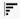

# Creación de un informe de gráfico en un panel de control de lienzo

>[!IMPORTANT]
>
>Actualmente, la función Paneles de lienzo solo está disponible para los usuarios que participan en la fase beta. Para obtener más información, consulte [Información beta de paneles de lienzo](/help/quicksilver/product-announcements/betas/canvas-dashboards-beta/canvas-dashboards-beta-information.md).

Puede crear y agregar un informe de gráfico a un panel de lienzo para visualizar los datos como un gráfico de barras, columnas, líneas o circulares.

+++ Amplíe para ver los requisitos de acceso.

<table style="table-layout:auto"> 
<col> 
</col> 
<col> 
</col> 
<tbody> 
<tr> 
   <td role="rowheader">
Plan de Adobe Workfront
</td> 
   <td> 

Cualquiera 
 
   </td> 
<tr> 
 <tr> 
   <td role="rowheader">
Licencia de Adobe Workfront
</td> 
   <td> 

Actual: plan 
 

Nuevo: estándar
 
   </td> 
   </tr> 
  </tr> 
  <tr> 
   <td role="rowheader">
Configuraciones de nivel de acceso
</td> 
   <td>
Editar el acceso a Informes, Paneles y Calendarios

  </td> 
  </tr>  
</tbody> 
</table>

Para obtener más información sobre esta tabla, consulte [Requisitos de acceso en la documentación de Workfront](/help/quicksilver/administration-and-setup/add-users/access-levels-and-object-permissions/access-level-requirements-in-documentation.md).
+++

## Requisitos previos

Debe crear un tablero para poder crear un informe de gráfico.

## Creación de un informe de gráfico en un panel de control de lienzo

Hay muchas opciones de configuración disponibles para crear un informe de gráfico. En esta sección, le guiaremos a través del proceso general de creación de uno.

{{step1-to-dashboards}}

1. En el panel izquierdo, haga clic en **Paneles de lienzo**.

1. Haga clic en **Nuevo panel** en la esquina superior derecha.

1. En el cuadro **Crear tablero**, escriba el **Nombre** y la **Descripción** del tablero.

1. Haga clic en **Crear**.

1. En el cuadro **Agregar informe**, seleccione **Crear informe**.

1. En el lado izquierdo, seleccione **Gráfico**.

1. En la esquina superior derecha, haga clic en **Crear informe**.

1. (Opcional) Siga los pasos a continuación para configurar la sección **Detalles**:

   1. Escriba un informe **Nombre**.

   1. Escriba un informe **Descripción**.

   1. Si lo desea, desmarque la casilla **Mostrar series adicionales como &quot;Otro&quot;**.

      >[!NOTE]
      >
      >Hay un número máximo de series que se pueden mostrar en un gráfico. Cuando se marca esta casilla, cualquier serie por encima del límite se consolida en una agrupación **Other** del gráfico.

1. Siga los pasos a continuación para configurar la sección **Gráfico de generación**:

   1. En el panel izquierdo, haga clic en el icono **Crear gráfico** .

   1. En la lista desplegable **Tipo de gráfico**, seleccione el tipo de gráfico que desea crear:

      * **Barra**
      * **Columna**
      * **Línea**
      * **Circular**

   1. En la lista desplegable **Tipo de columna**, seleccione el tipo de columna:
      * **Simple**
      * **Varias series**
      * **Apiladas**

   1. Seleccione el botón **Actualizar campo** en la primera sección, luego busque y seleccione el campo que contiene los datos que se resumirán en el gráfico.
   1. En la lista desplegable **Tipo de agregación**, seleccione cómo se acumulan los datos para generar el resultado del gráfico.

   1. Seleccione el botón **Actualizar campo** de la segunda sección y, a continuación, busque y seleccione el segundo campo que desee mostrar en el gráfico.

1. Siga los pasos a continuación para configurar la sección **Filter**:

   1. En el panel izquierdo, haga clic en el icono **Filtro**.
   1. Seleccione **Editar filtro**.
   1. Haga clic en **Agregar condición** y, a continuación, especifique el campo por el que desea filtrar y el modificador que define qué tipo de condición debe cumplir el campo.
   1. (Opcional) Haga clic en **Agregar grupo de filtros** para agregar otro conjunto de criterios de filtrado. El operador predeterminado entre los conjuntos es Y. Haga clic en el operador para cambiarlo a OR.

1. Siga los pasos a continuación para configurar la sección **Configuración de columna detallada**:

   1. En el panel izquierdo, haga clic en el icono **Columnas de desglose** . Los campos del gráfico aparecen automáticamente como columnas en la sección de vista previa a la derecha.

   1. (Opcional) Para actualizar cualquiera de las configuraciones de columna existentes, seleccione la columna que desee actualizar en la sección **Columnas actuales** y, a continuación, actualice la información deseada (por ejemplo: etiqueta, estado vinculado y condiciones).

   1. Haga clic en **Agregar columna** y, a continuación, seleccione el campo que desee mostrar como columna en la tabla. Repita este proceso para cada columna que desee agregar.

1. Siga los pasos a continuación para configurar la sección **Configuración del grupo de desglose**:

   1. En el panel izquierdo, haga clic en el icono **Configuración de grupo** .

   1. Haga clic en el botón **Agregar agrupación** y, a continuación, seleccione el campo que desee crear como agrupación.

1. Haga clic en **Guardar** para crear el informe y agregarlo al tablero.

## Crear un ejemplo de informe de gráfico

En esta sección, veremos los pasos para crear un gráfico de columnas que muestre las tareas vencidas por el propietario del proyecto.

{{step1-to-dashboards}}

1. En el panel izquierdo, haga clic en **Paneles de lienzo**.

1. Haga clic en **Nuevo panel** en la esquina superior derecha.

1. En el cuadro **Crear tablero**, escriba el **Nombre** y la **Descripción** del tablero.

1. Haga clic en **Crear**.

1. En el cuadro **Agregar informe**, seleccione **Crear informe**.

1. En el lado izquierdo, seleccione **Gráfico**.

1. En la esquina superior derecha, haga clic en **Crear informe**.

1. Siga los pasos a continuación para configurar la sección **Detalles**:

   1. Escriba un informe **Nombre** (p. ej. *Tareas vencidas por el propietario del proyecto*).

   1. Escriba un informe **Descripción**.

1. Siga los pasos a continuación para configurar la sección **Gráfico de generación**:

   1. En el panel izquierdo, haga clic en el icono **Generar gráfico**.

   1. En la lista desplegable **Tipo de gráfico**, seleccione **Columna**.

   1. En la lista desplegable **Tipo de columna**, seleccione **Simple**.

   1. Seleccione el botón **Actualizar campo** en la sección **Eje inferior (X)**, luego busque y seleccione el campo **Tarea** > **Proyecto** > **Propietario** > **Nombre**.

      

   1. Haga clic en el botón **Seleccionar campo** de la sección **Eje izquierdo (Y)**, a continuación, busque y seleccione el campo **Tarea** > **Nombre**.

   1. En el menú desplegable **Tipo de agregación**, seleccione **Recuento**.

      

1. Siga los pasos a continuación para configurar la sección **Filter**:

   1. En el panel izquierdo, haga clic en el icono **Filtro**.

   1. Seleccione **Editar filtro**.

   1. Haga clic en **Agregar condición**.

   1. Haga clic en el área de condición vacía y luego seleccione **Seleccionar campo**.

   1. Seleccione el campo **Porcentaje completado**.

   1. En el menú desplegable **Operadores**, seleccione **Menor que** y, a continuación, escriba *100* en el campo de evaluador.

   1. Haga clic en **Agregar condición** y luego en **Seleccionar campo**.

   1. Seleccione el campo **Fecha planificada de finalización**.

   1. En el menú desplegable **Operadores**, seleccione **Menos que**.

   1. Cambie **Establecer fecha relativa** a **ON**.

   1. Escriba *$$TODAY* en el campo del evaluador.

      

1. Siga los pasos a continuación para configurar la sección **Configuración de columna detallada**:

   1. En el panel izquierdo, haga clic en el icono **Columnas de desglose** . Los campos del gráfico aparecen automáticamente como columnas en la sección de vista previa a la derecha.

   1. Haga clic en **Agregar columna** y luego seleccione el campo **Asignado a** > **Nombre**.

   1. Haga clic en **Agregar columna** y, a continuación, seleccione el campo **Fecha planificada de inicio**.

   1. Haga clic en **Agregar columna** y, a continuación, seleccione el campo **Fecha planificada de finalización**.

   1. Haga clic en **Agregar columna** y, a continuación, seleccione el campo **Fecha de última actualización**.

   1. (Opcional) Para mostrar la hora de actualización, seleccione la opción **Última fecha de actualización** en el campo **Columnas actuales** y, a continuación, seleccione una opción de valor de hora en la lista desplegable **Formato de fecha**.

1. Siga los pasos a continuación para configurar la sección **Configuración del grupo de desglose**:

   1. En el panel izquierdo, haga clic en el icono **Configuración de grupo** .

   1. Haga clic en el botón **Agregar agrupación** y, a continuación, seleccione el campo **Proyecto** > **Nombre**.

1. Haga clic en **Guardar** para crear el informe y agregarlo al tablero.