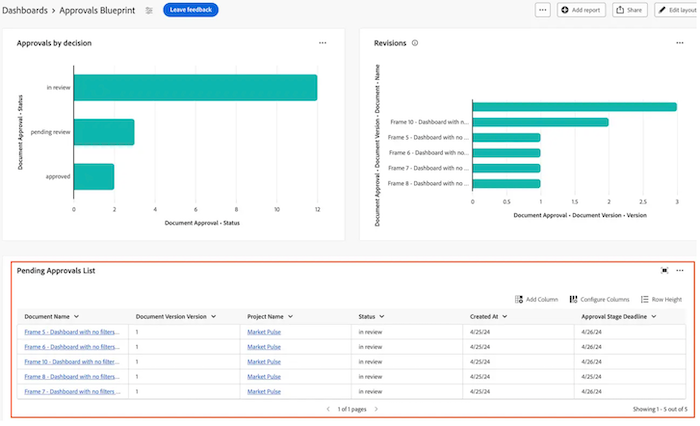

# Generar un informe de tabla en un panel de control del lienzo

>[!IMPORTANT]
>
>Actualmente, la función Paneles de lienzo solo está disponible para los usuarios que participan en la fase beta. Es posible que algunas partes de la función no estén completas o que no funcionen según lo previsto durante esta fase. Envíe cualquier comentario sobre su experiencia siguiendo las instrucciones de la sección [Proporcionar comentarios](/help/quicksilver/product-announcements/betas/canvas-dashboards-beta/canvas-dashboards-beta-information.md#provide-feedback) del artículo Información general sobre la versión beta de los paneles de lienzo. 
>>Si tiene comentarios acerca de un posible error o problema técnico, envíe un ticket al equipo de asistencia de Workfront. Para obtener más información, consulte [Póngase en contacto con Atención al cliente](/help/quicksilver/workfront-basics/tips-tricks-and-troubleshooting/contact-customer-support.md). 
>>Tenga en cuenta que esta versión beta no está disponible en los siguientes proveedores de la nube:
>
>* Traer su propia clave para Amazon Web Service
>* Azure
>* Google Cloud Platform

Puede agregar un informe de tabla a un panel de lienzo para visualizar los datos en formato de tabla.

## Requisitos de acceso

+++ Expanda para ver los requisitos de acceso para la funcionalidad en este artículo.

<table style="table-layout:auto"> 
<col> 
</col> 
<col> 
</col> 
<tbody> 
<tr> 
   <td role="rowheader">
paquete de Adobe Workfront
</td> 
   <td> 

Cualquiera 
 
   </td> 
<tr> 
 <tr> 
   <td role="rowheader">
Licencia de Adobe Workfront
</td> 
   <td> 

Estándar 
 

Plan
 
   </td> 
   </tr> 
  </tr> 
  <tr> 
   <td role="rowheader">
Configuraciones de nivel de acceso
</td> 
   <td>
Editar el acceso a Informes, Paneles de control y Calendarios

  </td> 
  </tr>  
</tbody> 
</table>

Para obtener más información sobre esta tabla, consulte [Requisitos de acceso en la documentación de Workfront](/help/quicksilver/administration-and-setup/add-users/access-levels-and-object-permissions/access-level-requirements-in-documentation.md).
+++

## Requisitos previos

Debe crear un tablero para poder crear un informe de tabla.

## Generar un informe de tabla en un panel de control del lienzo

Hay muchas opciones de configuración disponibles para crear un informe de tabla. En esta sección, le guiaremos a través del proceso general de creación de uno.

{{step1-to-dashboards}}

1. En el panel izquierdo, haga clic en **Paneles de control de lienzo**.

1. Haga clic en **Nuevo panel** en la esquina superior derecha.

1. En el cuadro **Crear tablero**, escriba el **Nombre** y la **Descripción** del tablero.

1. Haga clic en **Crear**.

1. En el cuadro **Agregar informe**, seleccione **Crear informe**.

1. En el lado izquierdo, seleccione **Tabla**.

1. En la esquina superior derecha, haga clic en **Crear informe**.

1. (Opcional) Siga los pasos a continuación para configurar la sección **Detalles**:

   1. Escriba un informe **Nombre**.

   1. Escriba un informe **Descripción**.

1. Siga los pasos a continuación para configurar la sección **Generar tabla**:

   1. En el panel izquierdo, haga clic en el icono **Columnas de tabla** .

   1. Haga clic en **Agregar columna** y, a continuación, seleccione el campo que desee mostrar como columna en la tabla. La columna aparece en la sección de vista previa de la derecha.

   1. Repita el paso anterior para cada columna que desee agregar.

1. Siga los pasos a continuación para configurar la sección **Filter**:

   1. En el panel izquierdo, haga clic en el icono **Filtro** .

   1. Seleccione **Editar filtro**.

   1. Haga clic en **Agregar condición** y, a continuación, especifique el campo por el que desea filtrar y el modificador que define qué tipo de condición debe cumplir el campo. La columna aparece en la sección de vista previa de la derecha.

1. (Opcional) Haga clic en **Agregar grupo de filtros** para agregar otro conjunto de criterios de filtrado. El operador predeterminado entre los conjuntos es Y. Haga clic en el operador para cambiarlo a OR.

1. Siga los pasos a continuación para configurar la sección **Configuración del grupo de desglose**:

   1. En el panel izquierdo, haga clic en el icono **Configuración de grupo** .

   1. Haga clic en el botón **Agregar agrupación** y, a continuación, seleccione el campo que desee crear como agrupación. La columna de agrupación aparece en la sección de vista previa de la derecha.

1. Haga clic en **Guardar** para crear el informe y agregarlo al tablero.

## Generar un ejemplo de informe de tabla

En esta sección, explicaremos los pasos para crear un informe de tabla que muestre las aprobaciones de documentos pendientes.

Para obtener más información sobre ejemplos de informes de tabla, consulte [Crear un tablero de informes para revisión y aprobaciones](/help/quicksilver/review-and-approve-work/document-reviews-and-approvals/create-review-and-approval-dashboard.md).

{{step1-to-dashboards}}

1. En el panel izquierdo, haga clic en **Paneles de control de lienzo**.

1. Haga clic en **Nuevo panel** en la esquina superior derecha.

1. En el cuadro **Crear tablero**, escriba el **Nombre** y la **Descripción** del tablero.

1. Haga clic en **Crear**.

1. En el cuadro **Agregar informe**, seleccione **Crear informe**.

1. En el lado izquierdo, seleccione **Tabla**.

1. En la esquina superior derecha, haga clic en **Crear informe**.

1. Siga los pasos a continuación para configurar la sección **Detalles**:

   1. Escriba _aprobaciones pendientes_ en el campo **Nombre**.
   1. Escriba una descripción en el campo **Descripción**. Este texto se muestra como información de objeto junto al nombre del gráfico.

1. Siga los pasos a continuación para configurar la sección **Generar tabla**:

   1. En el panel izquierdo, haga clic en el icono **Columnas de tabla** .
   1. Haga clic en **Agregar columna**.
   1. Desplácese hacia abajo y seleccione **Aprobaciones de documentos** > **Estado**.
   1. Añada las siguientes columnas:

   <table>
    <tr>
    <td><strong>Nombre del proyecto</strong></td>
    <td>Versión del documento &gt; Documento &gt; Proyecto &gt; Nombre</td>
    </tr>
    <tr>
    <td><strong>Nombre de documento</strong></td>
    <td>Versión del documento &gt; Documento &gt; escriba <em>Nombre</em> en el cuadro de búsqueda.</td>
    </tr>
    <tr>
    <td><strong>Versión del documento</strong></td>
    <td>Versión del documento &gt; Documento &gt; Versión</td>
    </tr>
    <tr>
    <td><strong>Fecha límite</strong></td>
    <td>Aprobación de documento &gt; Fase de aprobación &gt; Plazo</td>
    </tr>
    <tr>
    <td><strong>Solicitado por</strong></td>
    <td>Aprobación de documento &gt; Fase de aprobación &gt; Participantes en la fase de aprobación* &gt; Solicitante &gt; escriba <em>Nombre</em> en el cuadro de búsqueda.</td>
    </tr>
    <tr>
    <td><strong>Fecha de solicitud</strong></td>
    <td>Aprobación de documento &gt; Fase de aprobación &gt; Participantes de fase de aprobación* &gt; Creado en</td>
    </tr>
    <tr>
    <td><strong>Aprobador</strong></td>
    <td>Aprobación de documento &gt; Fase de aprobación &gt; Participantes en la fase de aprobación* &gt; Usuario participante &gt; escriba <em>Nombre</em> en el cuadro de búsqueda.</td>
    </tr>
    </table>

   *Los participantes de la fase de aprobación se truncan a _fase de aprobación Pa.._

1. Siga los pasos a continuación para configurar la sección **Filter**:
   1. En el panel izquierdo, haga clic en el icono **Filtrar** .
   1. Haga clic en **Editar filtro** y luego en **Agregar condición**.
   1. Haga clic en el filtro de condición vacío y luego haga clic en **Elegir un campo**.
   1. Seleccione **Estado**.
   1. Cambie el operador a **Equal** y, a continuación, escriba _pending approval_ en el cuadro de texto.
      
   1. (Opcional) Agregue filtros adicionales como se describe en la sección **Filtros opcionales** a continuación.
1. Haz clic en **Guardar** en la esquina superior derecha de la pantalla.

## Consideraciones al crear un informe de tabla

### Uso del selector de campos

La lista desplegable **Secciones** de la sección **Generar tabla** está diseñada para reducir las opciones de un selector de campo y facilitar la búsqueda de un objeto al crear un informe de tabla. Para empezar, debe seleccionar un objeto de entidad base.

* **Todas las secciones**: Todos los tipos de objetos en Workfront Workflow y Workfront Planning.
* **Objetos Workfront**: objetos nativos de flujo de trabajo de Workfront.
* **Tipos de registros de planificación**: tipos de registros personalizados definidos en Workfront Planning.

Una vez seleccionado el objeto de entidad base, la lista desplegable **Secciones** se actualiza con las opciones de tipo de campo aplicables para elegir.

* **Todas las secciones**: campos nativos, campos personalizados y objetos relacionados.
* **Todos los campos**: campos nativos y personalizados (excluye relaciones).
* **Campos personalizados**: campos definidos por el cliente en un formulario personalizado o en un registro de Planning.
* **Campos de Workfront**: Solo campos nativos.
* **Relaciones**: Registros conectados.

### Referencia a objetos secundarios

Las relaciones disponibles para columnas adicionales, opciones de filtro y atributos de agrupación generalmente se limitan a objetos superiores en la jerarquía de objetos de Workfront o tienen una sola selección en el objeto de entidad base del informe. Hay algunas excepciones a este respecto, que incluyen las siguientes:

* Proyecto > Tareas
* Aprobación de documento > Fases de aprobación de documento
* Fases de aprobación de documento > Participantes en la fase de aprobación de documento

Al utilizar cualquiera de las relaciones principal-secundario enumeradas anteriormente, verá una fila en la tabla para cada registro secundario conectado al objeto principal.
