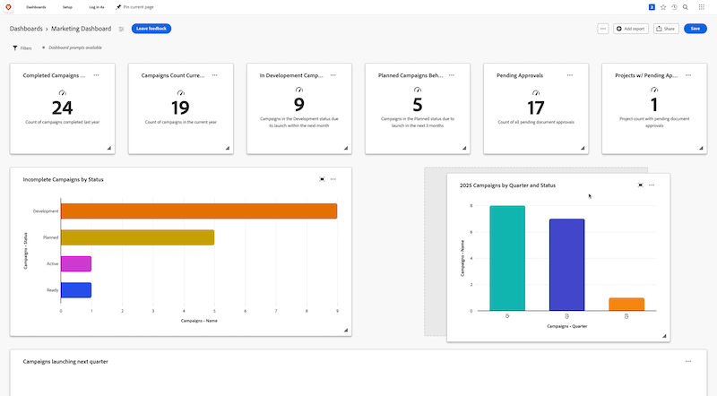

# Organizar informes en un panel de lienzo

>[!IMPORTANT]
>
>Actualmente, la función Paneles de lienzo solo está disponible para los usuarios que participan en la fase beta. Es posible que algunas partes de la función no estén completas o que no funcionen según lo previsto durante esta fase. Envíe cualquier comentario sobre su experiencia siguiendo las instrucciones de la sección [Proporcionar comentarios](/help/quicksilver/product-announcements/betas/canvas-dashboards-beta/canvas-dashboards-beta-information.md#provide-feedback) del artículo Información general sobre la versión beta de los paneles de lienzo. 
>Si tiene comentarios acerca de un posible error o problema técnico, envíe un ticket al equipo de asistencia de Workfront. Para obtener más información, consulte [Póngase en contacto con Atención al cliente](/help/quicksilver/workfront-basics/tips-tricks-and-troubleshooting/contact-customer-support.md). 
>Tenga en cuenta que esta versión beta no está disponible en los siguientes proveedores de la nube:
>
>* Traer su propia clave para Amazon Web Service
>* Azure
>* Google Cloud Platform

Una vez que se agrega un informe a un panel de lienzo, se muestra como un widget de informe en el panel para que pueda visualizar rápidamente sus datos de un vistazo. Una vez añadidos varios informes, puede definir el tamaño de cada widget para que se ajuste mejor al contenido del informe dentro del tablero y, a continuación, ajustar la posición de cada widget para mostrar los datos de forma más eficaz.

## Requisitos de acceso

+++ Expanda para ver los requisitos de acceso para la funcionalidad en este artículo. 

<table style="table-layout:auto"> 
<col> 
</col> 
<col> 
</col> 
<tbody> 
<tr> 
   <td role="rowheader">
Paquete de Adobe Workfront
</td> 
   <td> 

Cualquiera 
 
   </td> 
<tr> 
 <tr> 
   <td role="rowheader">
Licencia de Adobe Workfront
</td> 
   <td> 

Estándar 
 

Plan
 
   </td> 
   </tr> 
  </tr> 
  <tr> 
   <td role="rowheader">
Configuraciones de nivel de acceso
</td> 
   <td>
Editar el acceso a Informes, Paneles de control y Calendarios

  </td> 
  </tr>  
        <tr> 
   <td role="rowheader">
Permisos de objeto
</td> 
   <td>
Administración de permisos para el tablero

  </td> 
  </tr>
</tbody> 
</table>

Para obtener más información sobre esta tabla, consulte [Requisitos de acceso en la documentación de Workfront](/help/quicksilver/administration-and-setup/add-users/access-levels-and-object-permissions/access-level-requirements-in-documentation.md).
+++

## Requisitos previos

Debe agregar informes a un tablero para que se puedan reorganizar.

## Organizar informes en un tablero

{{step1-to-dashboards}}

1. En el panel izquierdo, haga clic en **Paneles de control de lienzo**.

1. En la página **Paneles de lienzo**, seleccione **Editar diseño** en la esquina superior derecha. Los widgets del informe se pueden editar.

1. Haga clic en un widget de informe y arrástrelo a una nueva posición en la página.

   

1. (Opcional) Para ajustar la longitud y anchura de un widget de informe, mantenga presionado el icono **Cambiar tamaño**  en la esquina inferior derecha del widget y, a continuación, ajuste el tamaño según sea necesario.

1. Repita los pasos del 4 al 5 con cada widget que desee reorganizar.

1. Haz clic en **Guardar** en la esquina superior derecha.
