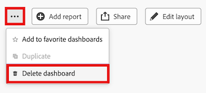

# Eliminación de un panel de control del lienzo

>[!IMPORTANT]
>
>Actualmente, la función Paneles de lienzo solo está disponible para los usuarios que participen en la fase beta. Es posible que algunas partes de la función no estén completas o no funcionen según lo previsto durante esta fase. Envíe cualquier comentario sobre su experiencia siguiendo las instrucciones de la sección [Proporcionar comentarios](/help/quicksilver/product-announcements/betas/canvas-dashboards-beta/canvas-dashboards-beta-information.md#provide-feedback) del artículo de introducción a la versión beta de Canvas Dashboards. 
>Si tiene comentarios sobre un posible error o problema técnico, envíe un ticket al servicio de asistencia de Workfront. Para obtener más información, consulte [Contactar con el servicio de atención al cliente](/help/quicksilver/workfront-basics/tips-tricks-and-troubleshooting/contact-customer-support.md). 
>Tenga en cuenta que esta versión beta no está disponible en los siguientes proveedores en la nube:
>
>* Trae tu propia clave para Amazon Web Service
>* Azure
>* Google Cloud Platform

Cuando ya no necesite un panel de Canvas, puede eliminarlo de Adobe Workfront.

## Requisitos de acceso

+++ Expanda para ver los requisitos de acceso para la funcionalidad en este artículo.

<table style="table-layout:auto"> 
<col> 
</col> 
<col> 
</col> 
<tbody> 
<tr> 
   <td role="rowheader">
Paquete de Adobe Workfront
</td> 
   <td> 

Cualquiera 
 
   </td> 
<tr> 
 <tr> 
   <td role="rowheader">
Licencia de Adobe Workfront
</td> 
   <td> 

Estándar 
 

Plan
 
   </td> 
   </tr> 
  </tr> 
  <tr> 
   <td role="rowheader">
Configuraciones de nivel de acceso
</td> 
   <td>
Editar el acceso a Informes, Paneles de control y Calendarios

  </td> 
  </tr>  
    </tr>  
        <tr> 
   <td role="rowheader">
Permisos de objeto
</td> 
   <td>
Administrar permisos para el panel

  </td> 
  </tr>
</tbody> 
</table>

Para obtener más información sobre esta tabla, consulte [Requisitos de acceso en la documentación de Workfront](/help/quicksilver/administration-and-setup/add-users/access-levels-and-object-permissions/access-level-requirements-in-documentation.md).
+++

## Requisitos previos

Debe crear un tablero para poder eliminarlo.

Para obtener más información, consulte [Crear un panel de Canvas](/help/quicksilver/reports-and-dashboards/canvas-dashboards/create-dashboards/create-dashboards.md).

## Eliminación de un panel de control

>[!WARNING]
>
> Una vez que se elimina un panel, el panel y todos sus informes personalizados y/o visualizaciones no se pueden recuperar. 
> Si elimina un tablero que contiene un informe clásico, el informe clásico no se eliminará.

{{step1-to-dashboards}}

1. En el panel izquierdo, haga clic en **Paneles de control de lienzo**.

1. En la página **Tableros de lienzo**, seleccione el tablero que desea eliminar.

1. En la esquina superior derecha, seleccione el icono **Más**  y luego seleccione **Eliminar panel**.
   

1. En el cuadro de diálogo **Eliminar panel**, seleccione la casilla de verificación **Confirmo que deseo eliminar este panel**.

1. Haga clic **eliminar**.
