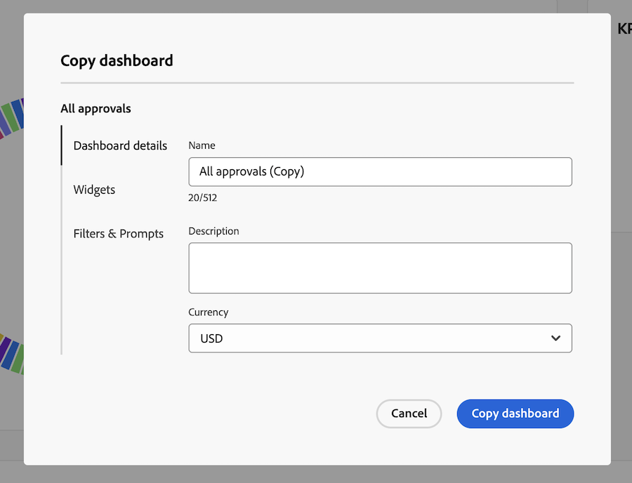
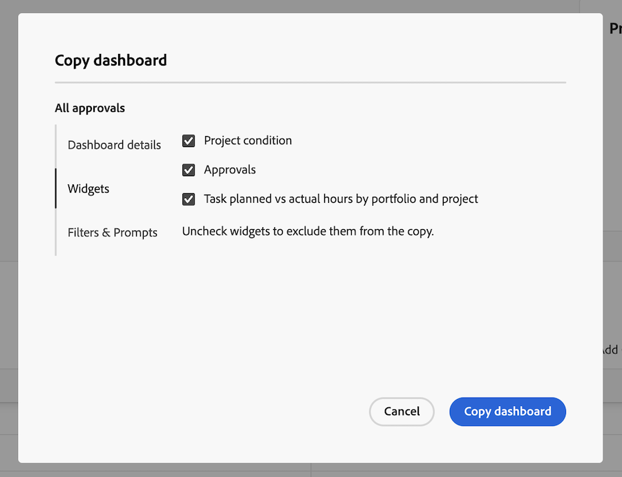
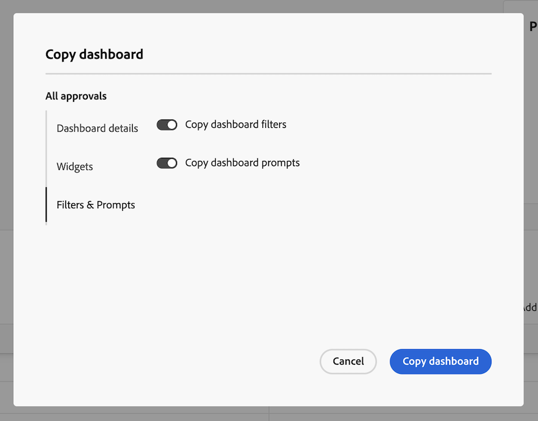

# Copiar un panel de lienzo

{{highlighted-preview-article-level}}

>[!IMPORTANT]
>
>Actualmente, la función Paneles de lienzo solo está disponible para los usuarios que participan en la fase beta. Es posible que algunas partes de la función no estén completas o que no funcionen según lo previsto durante esta fase. Envíe cualquier comentario sobre su experiencia siguiendo las instrucciones de la sección [Proporcionar comentarios](/help/quicksilver/product-announcements/betas/canvas-dashboards-beta/canvas-dashboards-beta-information.md#provide-feedback) del artículo Información general sobre la versión beta de los paneles de lienzo. 
>Si tiene comentarios acerca de un posible error o problema técnico, envíe un ticket al equipo de asistencia de Workfront. Para obtener más información, consulte [Contacto con el servicio de asistencia al cliente](/help/quicksilver/workfront-basics/tips-tricks-and-troubleshooting/contact-customer-support.md). 
>Tenga en cuenta que esta versión beta no está disponible en los siguientes proveedores de la nube:
>
>* Traer su propia clave para Amazon Web Service
>* Azure
>* Google Cloud Platform

Puede copiar un panel de lienzo para crear una variación de él para una audiencia diferente, como una copia a nivel de director de un panel ejecutivo, sin reconstruirlo desde cero.

## Requisitos de acceso

+++ Expanda para ver los requisitos de acceso para la funcionalidad en este artículo.

<table style="table-layout:auto"> 
<col> 
</col> 
<col> 
</col> 
<tbody> 
<tr> 
   <td role="rowheader">
Paquete de Adobe Workfront
</td> 
   <td> 

Cualquiera 
 
   </td> 
<tr> 
 <tr> 
   <td role="rowheader">
Licencia de Adobe Workfront
</td> 
   <td> 

Estándar 
 

Plan
 
   </td> 
   </tr> 
  </tr> 
  <tr> 
   <td role="rowheader">
Configuraciones de nivel de acceso
</td> 
   <td>
Editar o crear acceso a paneles

  </td> 
  </tr>  
    </tr>  
        <tr> 
   <td role="rowheader">
Permisos de objeto
</td> 
   <td>
Ver acceso al panel

  </td> 
  </tr>
</tbody> 
</table>

Para obtener más información sobre esta tabla, consulte [Requisitos de acceso en la documentación de Workfront](/help/quicksilver/administration-and-setup/add-users/access-levels-and-object-permissions/access-level-requirements-in-documentation.md).
+++

## Requisitos previos

Debe crear un tablero para poder duplicarlo.

Para obtener más información, consulte [Crear un panel de lienzo](/help/quicksilver/reports-and-dashboards/canvas-dashboards/create-dashboards/create-dashboards.md).

## Copiar un tablero

>[!NOTE]
>
>Las preferencias de uso compartido no se copian en el nuevo tablero. Si un widget tiene una configuración de **Ejecutar como usuario**, esa configuración solo se conservará en la copia si usted es el usuario designado o un administrador del sistema.

Para copiar un tablero:

{{step1-to-dashboards}}

1. En el panel izquierdo, haga clic en **Paneles de control de lienzo**.

1. En la página **Paneles de lienzo**, abra el panel que desee copiar.

1. En la esquina superior derecha, seleccione el icono **Más**  y, a continuación, seleccione **Copiar**.
   

1. En el cuadro de diálogo **Copiar panel**, escriba un **Nombre** para el nuevo panel, que toma como valor predeterminado el nombre del panel de origen seguido de &quot;(Copiar)&quot;.

1. (Opcional) En la ficha **Detalles del panel**, actualice la **Descripción** o la **Moneda** para el nuevo panel.
   

1. (Opcional) Haga clic en la ficha **Widgets** y, a continuación, anule la selección de los widgets que no desee incluir en el tablero duplicado.
   

1. (Opcional) Haga clic en la ficha **Filtros e indicadores** y, a continuación, desactive **Copiar filtros de tablero** o **Copiar indicadores de tablero** para excluirlos del tablero duplicado.
   

1. Haga clic en **Copiar tablero**.

Aparece un mensaje de confirmación con un vínculo al nuevo panel.
